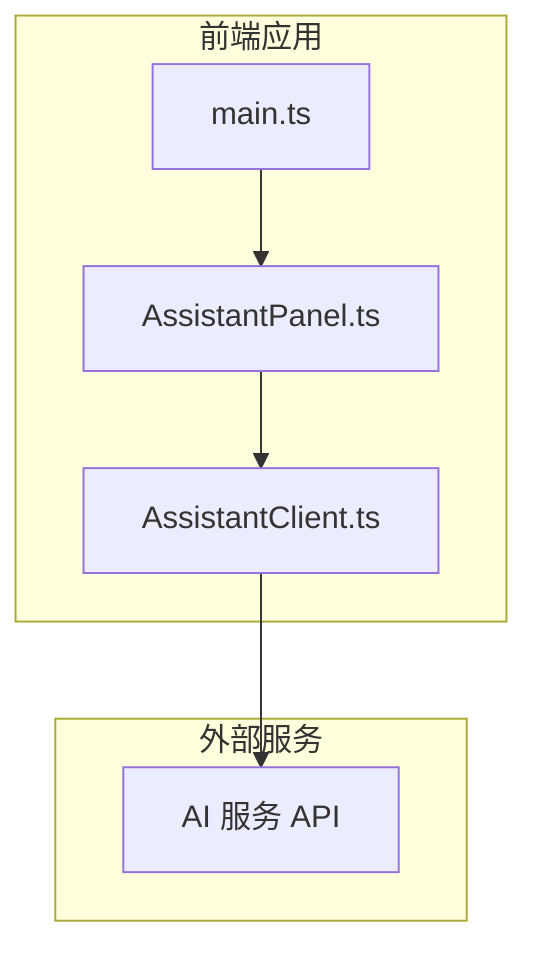
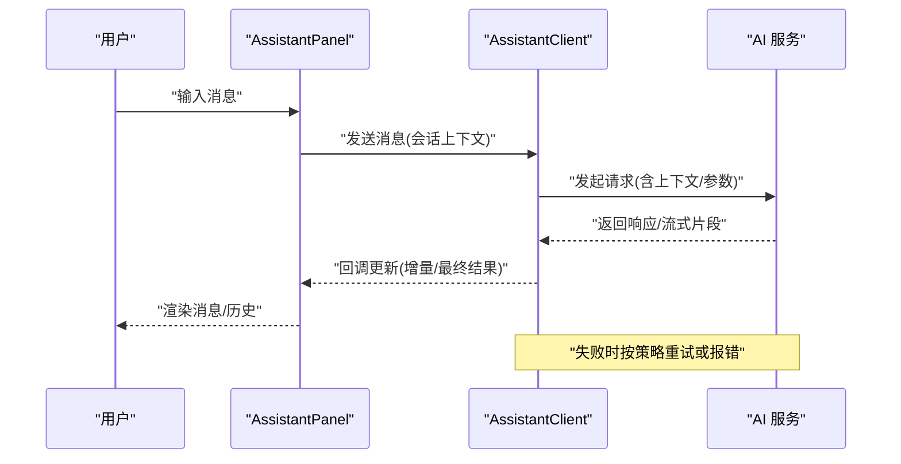
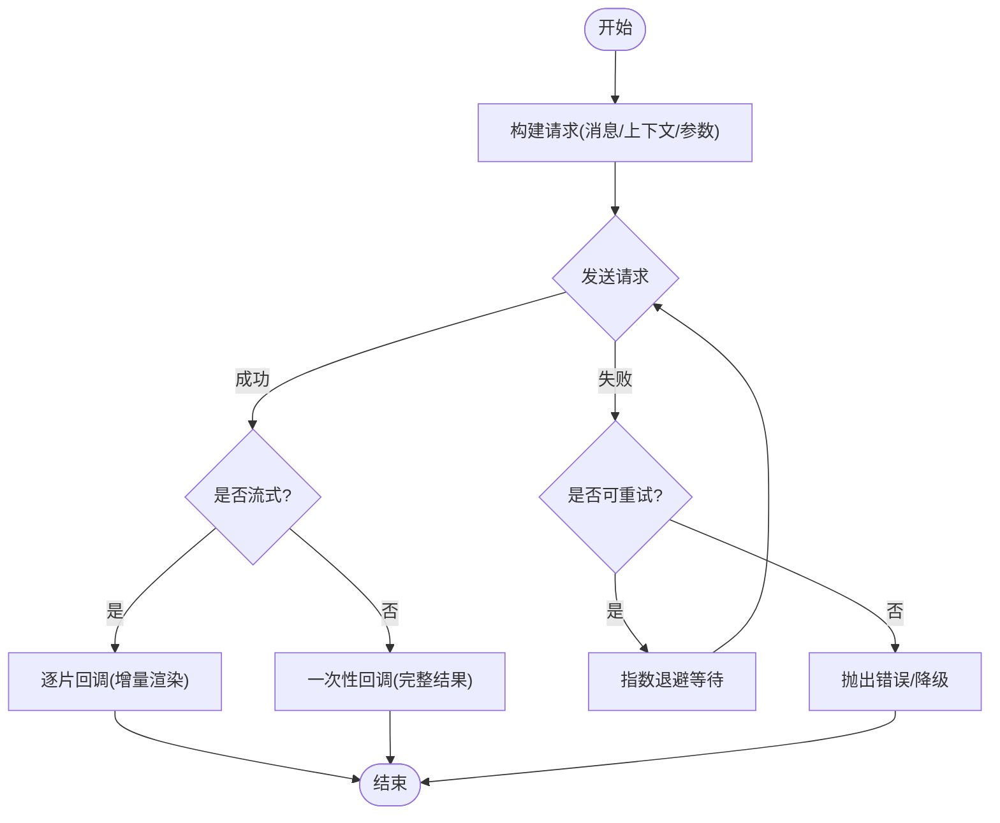
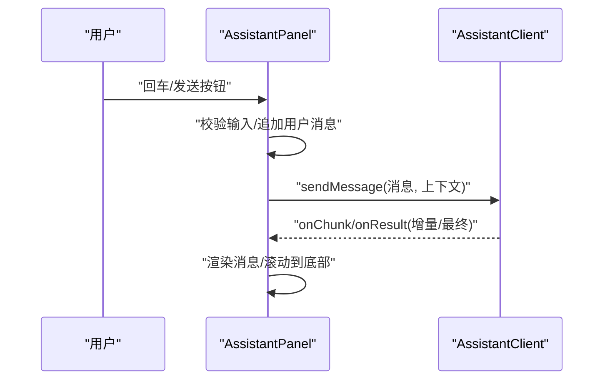
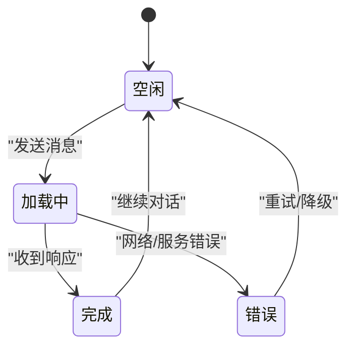
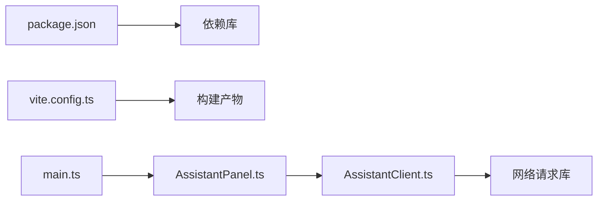

# AI助手模块

<cite>
**本文引用的文件**
- [AssistantClient.ts](file://src/assistant/AssistantClient.ts)
- [AssistantPanel.ts](file://src/assistant/AssistantPanel.ts)
- [main.ts](file://src/main.ts)
- [vite.config.ts](file://vite.config.ts)
- [package.json](file://package.json)
</cite>

## 目录
1. [简介](#简介)
2. [项目结构](#项目结构)
3. [核心组件](#核心组件)
4. [架构总览](#架构总览)
5. [详细组件分析](#详细组件分析)
6. [依赖分析](#依赖分析)
7. [性能考虑](#性能考虑)
8. [故障排查指南](#故障排查指南)
9. [结论](#结论)
10. [附录](#附录)

## 简介
本模块提供桌面应用中的AI助手能力，包含与AI服务的通信客户端、用户界面面板以及对话状态管理。通过AssistantClient封装网络请求、重试与错误处理；通过AssistantPanel实现对话历史显示、输入处理与消息格式化；结合会话持久化策略维护上下文与多轮对话体验。

## 项目结构
AI助手模块位于前端源码的assistant子目录中，主要包含两个核心文件：
- AssistantClient.ts：负责与AI服务通信（发送请求、解析响应、错误重试）。
- AssistantPanel.ts：负责UI交互（对话历史、输入框、消息渲染）。

入口与构建配置由main.ts与vite.config.ts提供，依赖声明在package.json中。

图表来源
- [main.ts:1-200](file://src/main.ts#L1-L200)
- [AssistantPanel.ts:1-200](file://src/assistant/AssistantPanel.ts#L1-L200)
- [AssistantClient.ts:1-200](file://src/assistant/AssistantClient.ts#L1-L200)

章节来源
- [main.ts:1-200](file://src/main.ts#L1-L200)
- [vite.config.ts:1-200](file://vite.config.ts#L1-L200)
- [package.json:1-200](file://package.json#L1-L200)

## 核心组件
- AssistantClient：封装HTTP/流式请求、重试策略、超时控制、错误分类与恢复。
- AssistantPanel：管理对话历史、输入事件、消息渲染与滚动行为，提供与客户端的集成接口。
- 会话与上下文：维护当前会话ID、消息列表、系统提示词与模型参数，支持本地持久化。

章节来源
- [AssistantClient.ts:1-200](file://src/assistant/AssistantClient.ts#L1-L200)
- [AssistantPanel.ts:1-200](file://src/assistant/AssistantPanel.ts#L1-L200)

## 架构总览
整体流程：用户在AssistantPanel中输入消息，面板将消息提交给AssistantClient；客户端构造请求并发送至AI服务，接收响应后回调面板进行渲染；异常时执行重试或降级策略。

图表来源
- [AssistantPanel.ts:1-200](file://src/assistant/AssistantPanel.ts#L1-L200)
- [AssistantClient.ts:1-200](file://src/assistant/AssistantClient.ts#L1-L200)

## 详细组件分析

### AssistantClient 组件分析
职责与能力
- 请求构造：组装消息体、会话上下文、模型参数与可选的系统提示词。
- 传输层：支持普通HTTP与流式响应（如Server-Sent Events或分块传输），统一回调接口。
- 重试机制：指数退避、最大重试次数、可配置的重试条件（网络错误/超时/特定状态码）。
- 错误处理：区分网络错误、服务端错误、超时与取消，提供统一错误对象与恢复建议。
- 超时与取消：支持请求超时与主动取消（例如切换会话或关闭面板）。

关键数据流
- 输入：用户消息、会话上下文、模型参数。
- 输出：流式片段回调、最终结果回调、错误回调。

图表来源
- [AssistantClient.ts:1-200](file://src/assistant/AssistantClient.ts#L1-L200)

章节来源
- [AssistantClient.ts:1-200](file://src/assistant/AssistantClient.ts#L1-L200)

### AssistantPanel 组件分析
职责与能力
- 对话历史：维护消息列表，支持追加、滚动定位、时间戳与角色标记。
- 输入处理：监听键盘事件、防抖/节流、空输入校验、Markdown/代码高亮（可选）。
- 消息格式化：对AI回复进行基础格式化（换行、链接、代码块等）。
- 与客户端集成：调用AssistantClient发送消息，订阅流式回调以增量渲染。

交互时序
- 用户输入 -> 面板校验 -> 调用客户端 -> 订阅回调 -> 渲染消息 -> 更新滚动位置。

图表来源
- [AssistantPanel.ts:1-200](file://src/assistant/AssistantPanel.ts#L1-L200)
- [AssistantClient.ts:1-200](file://src/assistant/AssistantClient.ts#L1-L200)

章节来源
- [AssistantPanel.ts:1-200](file://src/assistant/AssistantPanel.ts#L1-L200)

### 对话状态管理与上下文维护
- 会话标识：每个会话拥有唯一ID，用于隔离上下文与历史记录。
- 上下文内容：包含最近N条消息、系统提示词、模型参数（温度、最大长度等）。
- 持久化策略：
  - 本地存储：使用浏览器/桌面端提供的本地存储API保存会话列表与最近会话。
  - 自动保存：在消息变更、会话切换或应用退出时触发保存。
  - 加载策略：启动时加载最近会话，支持手动选择历史会话。
- 上下文裁剪：当消息过多时，保留最近N条或基于token估算进行裁剪，避免超出限制。

图表来源
- [AssistantPanel.ts:1-200](file://src/assistant/AssistantPanel.ts#L1-L200)
- [AssistantClient.ts:1-200](file://src/assistant/AssistantClient.ts#L1-L200)

章节来源
- [AssistantPanel.ts:1-200](file://src/assistant/AssistantPanel.ts#L1-L200)
- [AssistantClient.ts:1-200](file://src/assistant/AssistantClient.ts#L1-L200)

## 依赖分析
- 运行时依赖：
  - 网络请求库：用于HTTP/流式请求（具体库名见依赖清单）。
  - 本地存储：用于会话与上下文持久化。
- 构建与打包：
  - Vite作为构建工具，配置文件定义开发服务器与产物输出。
- 入口与挂载：
  - main.ts负责初始化应用与挂载AssistantPanel。

图表来源
- [package.json:1-200](file://package.json#L1-L200)
- [vite.config.ts:1-200](file://vite.config.ts#L1-L200)
- [main.ts:1-200](file://src/main.ts#L1-L200)

章节来源
- [package.json:1-200](file://package.json#L1-L200)
- [vite.config.ts:1-200](file://vite.config.ts#L1-L200)
- [main.ts:1-200](file://src/main.ts#L1-L200)

## 性能考虑
- 流式渲染：优先采用增量回调减少首屏延迟，提升用户体验。
- 防抖与节流：输入框与滚动事件做节流，避免频繁重绘。
- 上下文裁剪：限制上下文长度，降低请求大小与响应时间。
- 重试策略：指数退避与最大重试次数，避免雪崩与资源浪费。
- 内存管理：及时释放不再使用的会话与缓存，防止内存泄漏。

[本节为通用指导，不直接分析具体文件]

## 故障排查指南
常见问题与处理
- 网络错误：检查网络连接、代理设置与服务端可达性；启用重试与降级。
- 超时：调整请求超时阈值，必要时拆分长任务或使用流式接口。
- 服务端错误：根据状态码分类处理，记录日志并提示用户。
- 流式中断：检测连接断开，尝试重连并恢复增量渲染。
- 上下文溢出：实施上下文裁剪策略，确保请求不超过限制。

章节来源
- [AssistantClient.ts:1-200](file://src/assistant/AssistantClient.ts#L1-L200)
- [AssistantPanel.ts:1-200](file://src/assistant/AssistantPanel.ts#L1-L200)

## 结论
本模块通过AssistantClient与AssistantPanel解耦了AI服务通信与UI交互，提供了健壮的重试与错误处理、灵活的上下文管理与持久化策略。遵循本文档的API约定与最佳实践，可快速集成不同AI服务并实现高质量的多轮对话体验。

[本节为总结，不直接分析具体文件]

## 附录

### API 接口文档（消息格式、参数与返回值）
- 发送消息
  - 方法：sendMessage
  - 入参：
    - message: string（用户消息文本）
    - context: object（会话上下文，包含最近消息、系统提示词、模型参数）
    - options?: object（可选：超时、重试次数、是否流式）
  - 返回：
    - 流式模式：onChunk(chunk: string)、onResult(result: string)、onError(error: Error)
    - 非流式模式：onResult(result: string)、onError(error: Error)
- 停止生成
  - 方法：stop()
  - 作用：取消当前请求并清理状态
- 获取会话信息
  - 方法：getSession()
  - 返回：当前会话ID、消息列表、上下文快照

章节来源
- [AssistantClient.ts:1-200](file://src/assistant/AssistantClient.ts#L1-L200)
- [AssistantPanel.ts:1-200](file://src/assistant/AssistantPanel.ts#L1-L200)

### 实际使用示例（集成与多轮对话）
- 集成不同AI服务
  - 替换请求端点与认证方式（如API Key、OAuth）。
  - 适配响应格式（JSON字段映射、流式协议差异）。
- 自定义回复逻辑
  - 在onChunk/onResult中对内容进行后处理（过滤敏感词、格式化输出）。
- 多轮对话
  - 维护会话上下文，追加最新消息到context，保持历史连贯性。
  - 使用会话ID区分不同对话线程。

章节来源
- [AssistantClient.ts:1-200](file://src/assistant/AssistantClient.ts#L1-L200)
- [AssistantPanel.ts:1-200](file://src/assistant/AssistantPanel.ts#L1-L200)

### 安全与隐私保护
- 传输安全：强制HTTPS，校验证书，避免中间人攻击。
- 密钥管理：不在前端硬编码密钥，使用环境变量或后端代理转发。
- 数据最小化：仅发送必要上下文，定期清理历史与缓存。
- 合规与审计：记录必要日志（脱敏），支持用户导出/删除数据。
- 输入校验：对用户输入进行白名单校验，防止注入与XSS。

章节来源
- [AssistantClient.ts:1-200](file://src/assistant/AssistantClient.ts#L1-L200)
- [AssistantPanel.ts:1-200](file://src/assistant/AssistantPanel.ts#L1-L200)