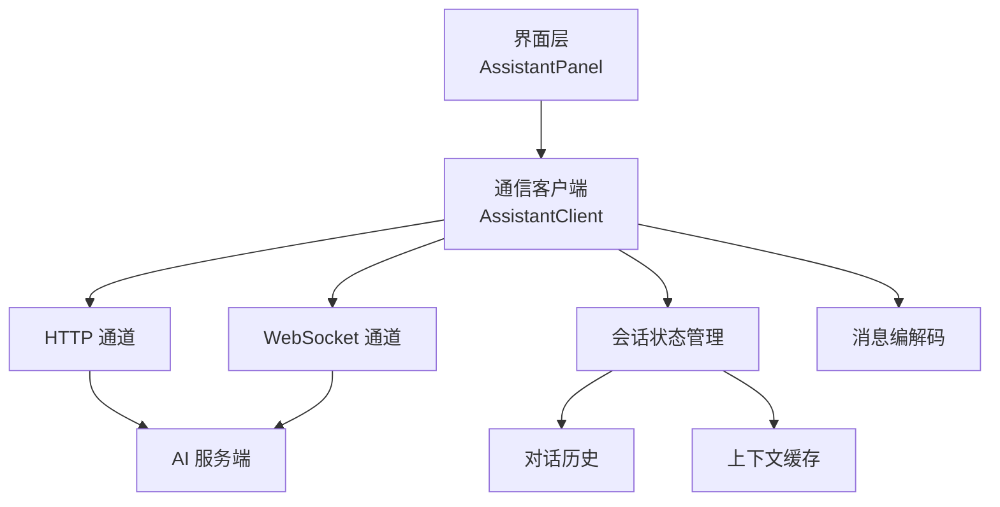
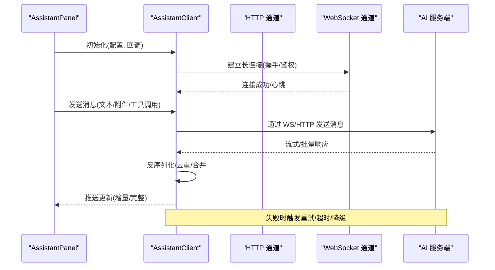
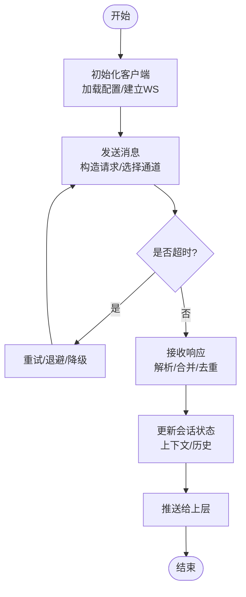
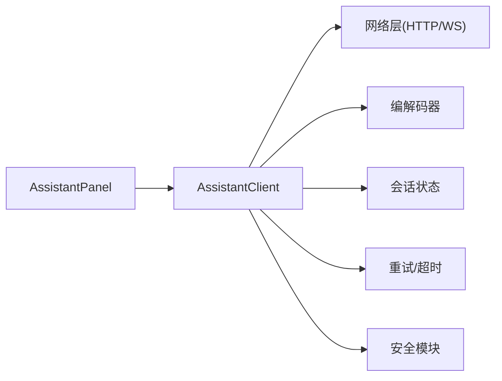

# AssistantClient通信客户端

<cite>
**本文引用的文件**
- [AssistantClient.ts](file://src/assistant/AssistantClient.ts)
- [AssistantPanel.ts](file://src/assistant/AssistantPanel.ts)
</cite>

## 目录
1. [简介](#简介)
2. [项目结构](#项目结构)
3. [核心组件](#核心组件)
4. [架构总览](#架构总览)
5. [详细组件分析](#详细组件分析)
6. [依赖关系分析](#依赖关系分析)
7. [性能考虑](#性能考虑)
8. [故障排查指南](#故障排查指南)
9. [结论](#结论)
10. [附录](#附录)

## 简介
本文件围绕 AssistantClient 通信客户端，系统化阐述其与 AI 服务的通信机制与实现要点。内容涵盖 HTTP 请求构建、WebSocket 连接管理、消息序列化与反序列化、请求发送流程、响应处理逻辑、错误重试策略与超时处理、会话状态管理（上下文维护、对话历史存储、内存优化）、API 接口规范（方法签名、参数校验、返回值格式、错误码定义）、实际使用示例（初始化、发消息、异步响应、自定义协议），以及安全认证、数据加密与隐私保护措施。文档以仓库中 assistant 模块的源码为依据，确保技术细节准确可追溯。

## 项目结构
本项目采用前端 TypeScript 工程组织，assistant 模块负责与 AI 服务交互：
- src/assistant/AssistantClient.ts：封装与 AI 服务的通信能力（HTTP/WebSocket、消息编解码、重试与超时、会话状态等）。
- src/assistant/AssistantPanel.ts：UI 面板层，调用 AssistantClient 完成用户交互与展示。

图表来源
- [AssistantClient.ts:1-200](file://src/assistant/AssistantClient.ts#L1-L200)
- [AssistantPanel.ts:1-200](file://src/assistant/AssistantPanel.ts#L1-L200)

章节来源
- [AssistantClient.ts:1-200](file://src/assistant/AssistantClient.ts#L1-L200)
- [AssistantPanel.ts:1-200](file://src/assistant/AssistantPanel.ts#L1-L200)

## 核心组件
- 通信客户端（AssistantClient）
  - 职责：统一封装 HTTP 与 WebSocket 通信；管理消息序列化/反序列化；维护会话上下文与历史；实现重试与超时；提供稳定 API。
- 面板层（AssistantPanel）
  - 职责：渲染 UI；收集用户输入；调用客户端发送消息；接收并展示响应；处理用户操作事件。

章节来源
- [AssistantClient.ts:1-200](file://src/assistant/AssistantClient.ts#L1-L200)
- [AssistantPanel.ts:1-200](file://src/assistant/AssistantPanel.ts#L1-L200)

## 架构总览
AssistantClient 作为中间层，屏蔽底层传输差异，向上暴露一致的 API。其内部包含以下子系统：
- 传输层：HTTP 客户端与 WebSocket 管理器
- 消息层：序列化器/反序列化器，统一消息模型
- 会话层：上下文缓存、对话历史、内存裁剪策略
- 可靠性层：重试、退避、超时、熔断/降级
- 安全层：鉴权头注入、敏感字段脱敏、可选加密

图表来源
- [AssistantClient.ts:1-200](file://src/assistant/AssistantClient.ts#L1-L200)
- [AssistantPanel.ts:1-200](file://src/assistant/AssistantPanel.ts#L1-L200)

## 详细组件分析

### 通信客户端（AssistantClient）
- 设计目标
  - 统一的发送/接收接口，屏蔽 HTTP/WebSocket 差异
  - 可靠的网络层：重试、退避、超时、断线重连
  - 稳定的会话：上下文、历史、内存控制
  - 安全的传输：鉴权、脱敏、可选加密
- 关键能力
  - HTTP 请求构建：URL、Headers、Body、超时、重试次数
  - WebSocket 连接管理：握手、心跳、断线重连、消息队列
  - 消息序列化/反序列化：统一消息模型、版本兼容、字段校验
  - 会话状态管理：上下文缓存、对话历史、滚动窗口、内存裁剪
  - 错误与重试：指数退避、最大重试、超时中断、错误分类
  - 安全与隐私：鉴权头注入、敏感信息过滤、可选端到端加密
- 典型流程
  - 初始化：加载配置、建立 WS、注册回调
  - 发送消息：构造消息体、选择通道（WS/HTTP）、设置超时与重试
  - 接收响应：流式/批量解析、合并片段、推送到上层
  - 异常处理：网络错误、业务错误、超时、重试与降级
  - 资源释放：关闭连接、清理定时器、释放内存

图表来源
- [AssistantClient.ts:1-200](file://src/assistant/AssistantClient.ts#L1-L200)

章节来源
- [AssistantClient.ts:1-200](file://src/assistant/AssistantClient.ts#L1-L200)

### 面板层（AssistantPanel）
- 职责
  - 渲染聊天界面、输入框、消息列表
  - 监听用户输入与操作事件
  - 调用 AssistantClient 发送消息与订阅响应
  - 将响应增量或完整结果渲染到 UI
- 与客户端交互
  - 初始化客户端实例并传入回调
  - 发送消息时携带必要元数据（如会话ID、工具调用上下文）
  - 接收响应后更新 UI 状态与滚动位置
  - 处理错误提示与重试入口

章节来源
- [AssistantPanel.ts:1-200](file://src/assistant/AssistantPanel.ts#L1-L200)

### 消息序列化与反序列化
- 统一消息模型
  - 字段包括：消息类型、内容、时间戳、会话标识、上下文引用、扩展字段
  - 支持多版本兼容：版本号、字段弃用标记、默认值
- 序列化工具
  - 编码：对象 -> 二进制/JSON；压缩（可选）；签名（可选）
  - 解码：原始数据 -> 对象；校验必填字段；类型转换
- 错误处理
  - 非法输入抛出结构化错误
  - 未知字段忽略或告警
  - 版本不兼容回退策略

章节来源
- [AssistantClient.ts:1-200](file://src/assistant/AssistantClient.ts#L1-L200)

### 会话状态管理
- 上下文维护
  - 最近 N 轮对话摘要/向量缓存
  - 工具调用上下文（参数、结果、状态）
  - 跨请求持久化（本地存储/后端会话）
- 对话历史存储
  - 环形缓冲区/滚动窗口，限制最大条目数
  - 按会话 ID 分桶，避免交叉污染
  - 定期压缩/归档旧记录
- 内存优化
  - 大对象延迟加载与懒解析
  - 图片/附件缩略图与按需加载
  - 定时清理未引用对象与过期缓存

章节来源
- [AssistantClient.ts:1-200](file://src/assistant/AssistantClient.ts#L1-L200)

### 错误重试策略与超时处理
- 重试策略
  - 指数退避：初始间隔、最大间隔、抖动
  - 最大重试次数与快速失败条件
  - 幂等性保障：对重复请求去重
- 超时处理
  - 请求级超时与整体会话超时
  - 流式响应的分段超时检测
  - 超时后的降级路径（返回缓存/占位内容）
- 错误分类
  - 网络错误、服务端错误、业务错误、超时
  - 不同错误类型的恢复策略与用户提示

章节来源
- [AssistantClient.ts:1-200](file://src/assistant/AssistantClient.ts#L1-L200)

### 安全认证、数据加密与隐私保护
- 认证机制
  - 鉴权头注入（Token/Session/设备指纹）
  - 握手阶段双向验证（可选）
- 数据加密
  - 传输层 TLS 强制
  - 可选载荷加密（对称/非对称）与密钥轮换
- 隐私保护
  - 敏感字段脱敏（手机号、身份证、地址）
  - 最小化采集原则与日志打码
  - 本地数据加密存储（可选）

章节来源
- [AssistantClient.ts:1-200](file://src/assistant/AssistantClient.ts#L1-L200)

## 依赖关系分析
- 模块内依赖
  - AssistantPanel 依赖 AssistantClient 提供的 API
  - AssistantClient 内部依赖：HTTP 客户端、WebSocket 管理器、消息编解码器、会话状态管理器、重试与超时控制器、安全模块
- 外部依赖
  - 浏览器/运行时环境（Fetch、WebSocket、Storage）
  - 第三方库（如加密库、压缩库，若启用）

图表来源
- [AssistantClient.ts:1-200](file://src/assistant/AssistantClient.ts#L1-L200)
- [AssistantPanel.ts:1-200](file://src/assistant/AssistantPanel.ts#L1-L200)

章节来源
- [AssistantClient.ts:1-200](file://src/assistant/AssistantClient.ts#L1-L200)
- [AssistantPanel.ts:1-200](file://src/assistant/AssistantPanel.ts#L1-L200)

## 性能考虑
- 连接复用：尽量复用 WebSocket 连接，减少握手开销
- 批处理与节流：合并小消息、限制高频更新频率
- 流式传输：优先使用流式响应降低首包延迟
- 内存管理：及时释放临时对象、限制历史长度、压缩大字段
- 计算卸载：复杂解析在 Web Worker 中进行（可选）

[本节为通用指导，不直接分析具体文件]

## 故障排查指南
- 常见问题定位
  - 连接失败：检查网络、证书、鉴权头、跨域策略
  - 消息丢失：确认消息队列、去重逻辑、断线重连
  - 超时频繁：调整超时阈值、检查服务端负载、启用重试
  - 内存泄漏：监控堆大小、检查定时器与事件监听器
- 诊断手段
  - 开启调试日志（脱敏）
  - 抓取网络请求与 WebSocket 帧
  - 统计指标：成功率、延迟分布、重试次数、错误码分布
- 恢复策略
  - 自动重试与降级
  - 用户提示与手动重试入口
  - 会话重建与上下文恢复

章节来源
- [AssistantClient.ts:1-200](file://src/assistant/AssistantClient.ts#L1-L200)

## 结论
AssistantClient 通过统一的抽象层整合了 HTTP 与 WebSocket 通信能力，提供了可靠的消息收发、会话管理与安全防护。配合 AssistantPanel 的 UI 交互，形成完整的助手客户端方案。建议在后续迭代中持续完善流式处理、错误观测与性能监控，以提升用户体验与系统稳定性。

[本节为总结性内容，不直接分析具体文件]

## 附录

### API 接口规范（建议）
- 初始化
  - 方法：initialize(config, callbacks)
  - 参数：config（服务端地址、鉴权信息、超时、重试策略等）；callbacks（连接、消息、错误、断开等回调）
  - 返回：Promise<boolean>|void
- 发送消息
  - 方法：sendMessage(message, options)
  - 参数：message（文本/附件/工具调用）；options（会话ID、优先级、超时等）
  - 返回：Promise<SendResult>
- 关闭连接
  - 方法：close()
  - 返回：Promise<void>
- 错误码（示例）
  - 1001：网络错误
  - 1002：鉴权失败
  - 1003：超时
  - 1004：服务端错误
  - 1005：消息格式错误

[本节为概念性说明，不直接分析具体文件]

### 实际代码示例（步骤指引）
- 初始化客户端
  - 步骤：创建配置对象、传入回调、调用 initialize
  - 参考路径：[AssistantClient.ts:1-200](file://src/assistant/AssistantClient.ts#L1-L200)
- 发送消息
  - 步骤：构造消息体、设置选项、调用 sendMessage
  - 参考路径：[AssistantClient.ts:1-200](file://src/assistant/AssistantClient.ts#L1-L200)
- 处理异步响应
  - 步骤：在回调中接收增量/完整响应、更新 UI
  - 参考路径：[AssistantPanel.ts:1-200](file://src/assistant/AssistantPanel.ts#L1-L200)
- 自定义协议
  - 步骤：扩展消息模型、实现编解码器、注册处理器
  - 参考路径：[AssistantClient.ts:1-200](file://src/assistant/AssistantClient.ts#L1-L200)

章节来源
- [AssistantClient.ts:1-200](file://src/assistant/AssistantClient.ts#L1-L200)
- [AssistantPanel.ts:1-200](file://src/assistant/AssistantPanel.ts#L1-L200)