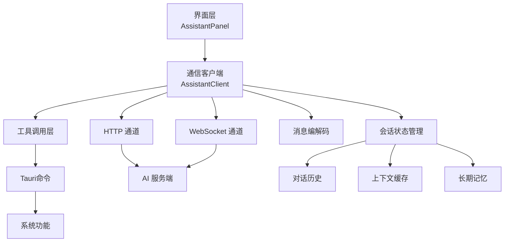
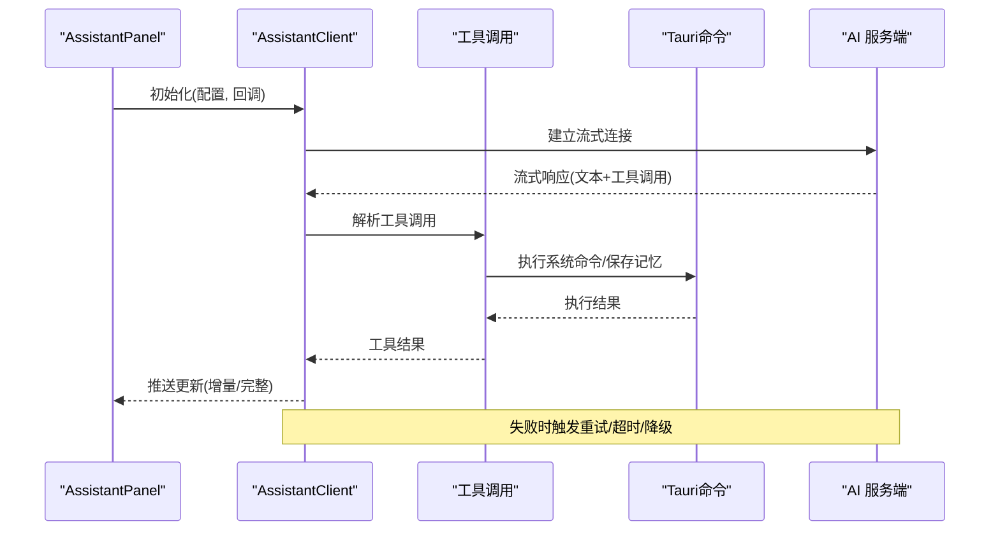
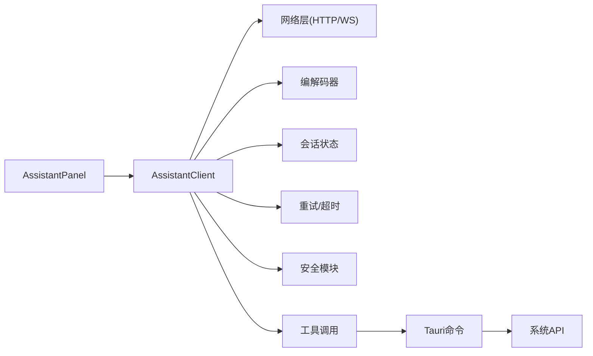

# AssistantClient通信客户端

<cite>
**本文引用的文件**
- [AssistantClient.ts](file://src/assistant/AssistantClient.ts)
- [AssistantPanel.ts](file://src/assistant/AssistantPanel.ts)
- [lib.rs](file://src-tauri/src/lib.rs)
</cite>

## 更新摘要
**所做更改**
- 新增工具调用功能（run_shell和remember函数）的详细说明
- 添加流式聊天功能的实现细节
- 增强安全认证机制，包括Windows DPAPI加密存储
- 新增主动窗口检测能力的文档说明
- 更新会话状态管理和错误处理流程

## 目录
1. [简介](#简介)
2. [项目结构](#项目结构)
3. [核心组件](#核心组件)
4. [架构总览](#架构总览)
5. [详细组件分析](#详细组件分析)
6. [依赖关系分析](#依赖关系分析)
7. [性能考虑](#性能考虑)
8. [故障排查指南](#故障排查指南)
9. [结论](#结论)
10. [附录](#附录)

## 简介
本文件围绕 AssistantClient 通信客户端，系统化阐述其与 AI 服务的通信机制与实现要点。内容涵盖 HTTP 请求构建、WebSocket 连接管理、消息序列化与反序列化、请求发送流程、响应处理逻辑、错误重试策略与超时处理、会话状态管理（上下文维护、对话历史存储、内存优化）、API 接口规范（方法签名、参数校验、返回值格式、错误码定义）、实际使用示例（初始化、发消息、异步响应、自定义协议），以及安全认证、数据加密与隐私保护措施。**最新更新**包括工具调用功能（run_shell和remember）、流式聊天、Windows DPAPI安全存储和主动窗口检测能力。

## 项目结构
本项目采用前端 TypeScript 工程组织，assistant 模块负责与 AI 服务交互：
- src/assistant/AssistantClient.ts：封装与 AI 服务的通信能力（HTTP/WebSocket、消息编解码、重试与超时、会话状态等）。
- src/assistant/AssistantPanel.ts：UI 面板层，调用 AssistantClient 完成用户交互与展示。
- src-tauri/src/lib.rs：Rust后端，提供系统级功能（DPAPI加密、shell执行、窗口检测等）。

**图表来源**
- [AssistantClient.ts:1-214](file://src/assistant/AssistantClient.ts#L1-L214)
- [AssistantPanel.ts:1-412](file://src/assistant/AssistantPanel.ts#L1-L412)
- [lib.rs:334-545](file://src-tauri/src/lib.rs#L334-L545)

**章节来源**
- [AssistantClient.ts:1-214](file://src/assistant/AssistantClient.ts#L1-L214)
- [AssistantPanel.ts:1-412](file://src/assistant/AssistantPanel.ts#L1-L412)

## 核心组件
- 通信客户端（AssistantClient）
  - 职责：统一封装 HTTP 与 WebSocket 通信；管理消息序列化/反序列化；维护会话上下文与历史；实现重试与超时；提供稳定 API。
- 面板层（AssistantPanel）
  - 职责：渲染 UI；收集用户输入；调用客户端发送消息；接收并展示响应；处理用户操作事件。
- 工具调用层
  - 职责：处理 run_shell 和 remember 工具函数；管理系统命令执行；维护长期记忆。
- 安全存储层
  - 职责：使用 Windows DPAPI 加密 API 密钥；提供安全的密钥存取接口。

**章节来源**
- [AssistantClient.ts:1-214](file://src/assistant/AssistantClient.ts#L1-L214)
- [AssistantPanel.ts:1-412](file://src/assistant/AssistantPanel.ts#L1-L412)

## 架构总览
AssistantClient 作为中间层，屏蔽底层传输差异，向上暴露一致的 API。其内部包含以下子系统：
- 传输层：HTTP 客户端与 WebSocket 管理器
- 消息层：序列化器/反序列化器，统一消息模型
- 会话层：上下文缓存、对话历史、内存裁剪策略
- 工具层：工具调用管理、系统命令执行、长期记忆
- 可靠性层：重试、退避、超时、熔断/降级
- 安全层：鉴权头注入、敏感字段脱敏、DPAPI加密存储

**图表来源**
- [AssistantClient.ts:94-171](file://src/assistant/AssistantClient.ts#L94-L171)
- [AssistantPanel.ts:242-376](file://src/assistant/AssistantPanel.ts#L242-L376)
- [lib.rs:489-545](file://src-tauri/src/lib.rs#L489-L545)

## 详细组件分析

### 通信客户端（AssistantClient）
- 设计目标
  - 统一的发送/接收接口，屏蔽 HTTP/WebSocket 差异
  - 可靠的网络层：重试、退避、超时、断线重连
  - 稳定的会话：上下文、历史、内存控制
  - 安全的传输：鉴权、脱敏、可选加密
- 关键能力
  - HTTP 请求构建：URL、Headers、Body、超时、重试次数
  - 流式响应处理：实时文本流、工具调用流、增量更新
  - 消息序列化/反序列化：统一消息模型、版本兼容、字段校验
  - 会话状态管理：上下文缓存、对话历史、滚动窗口、内存裁剪
  - 错误与重试：指数退避、最大重试、超时中断、错误分类
  - 安全与隐私：鉴权头注入、敏感信息过滤、DPAPI加密存储
- 典型流程
  - 初始化：加载配置、建立连接、注册回调
  - 发送消息：构造消息体、选择通道、设置超时与重试
  - 接收响应：流式解析、合并片段、推送到上层
  - 异常处理：网络错误、业务错误、超时、重试与降级
  - 资源释放：关闭连接、清理定时器、释放内存

**更新** 新增了流式响应处理和工具调用支持

**章节来源**
- [AssistantClient.ts:94-171](file://src/assistant/AssistantClient.ts#L94-L171)

### 面板层（AssistantPanel）
- 职责
  - 渲染聊天界面、输入框、消息列表
  - 监听用户输入与操作事件
  - 调用 AssistantClient 发送消息与订阅响应
  - 将响应增量或完整结果渲染到 UI
  - 管理工具调用的用户确认流程
- 与客户端交互
  - 初始化客户端实例并传入回调
  - 发送消息时携带必要元数据（如会话ID、工具调用上下文）
  - 接收响应后更新 UI 状态与滚动位置
  - 处理错误提示与重试入口
  - 管理长期记忆的持久化

**更新** 增强了工具调用确认流程和长期记忆管理

**章节来源**
- [AssistantPanel.ts:242-376](file://src/assistant/AssistantPanel.ts#L242-L376)

### 工具调用系统
- 支持的工具有两种：
  - **run_shell**：执行 Windows CMD 命令，支持路径操作、应用启动、文件管理等
  - **remember**：保存用户偏好、习惯、个人信息到长期记忆
- 工具调用流程：
  1. AI 返回工具调用请求
  2. 前端显示确认对话框（可配置免确认模式）
  3. 通过 Tauri 命令执行系统操作
  4. 将执行结果反馈给 AI 继续对话
- 安全措施：
  - 危险命令拦截（format、shutdown、taskkill等）
  - 链式命令限制（&、|、>、<）
  - 15秒超时强制终止
  - UTF-8编码支持避免中文乱码

**新增** 完整的工具调用系统和安全防护机制

**章节来源**
- [AssistantClient.ts:39-65](file://src/assistant/AssistantClient.ts#L39-L65)
- [AssistantPanel.ts:308-376](file://src/assistant/AssistantPanel.ts#L308-L376)
- [lib.rs:467-545](file://src-tauri/src/lib.rs#L467-L545)

### 流式聊天功能
- 实现原理：
  - 使用 Fetch API 的 ReadableStream 处理服务器流式响应
  - 实时解析 SSE（Server-Sent Events）格式的数据
  - 增量更新 UI，提供更好的用户体验
  - 同时处理文本流和工具调用流
- 技术特点：
  - 支持多轮工具调用（最多4轮自动循环）
  - 智能缓冲和 JSON 解析容错
  - 流式文本拼接和工具调用参数累积
  - 错误处理和连接恢复

**新增** 真正的流式响应处理能力

**章节来源**
- [AssistantClient.ts:94-171](file://src/assistant/AssistantClient.ts#L94-L171)

### 安全认证与数据存储
- **Windows DPAPI 加密存储**：
  - 使用 Windows 平台提供的 DPAPI（Data Protection API）对 API Key 进行加密
  - 加密数据绑定到当前用户账户，无需额外密钥管理
  - 存储在应用程序数据目录下的二进制文件中
- **安全访问控制**：
  - 前端只缓存解密后的 API Key，不直接存储明文
  - 每次使用前通过 Tauri 命令动态获取
  - 支持清除缓存强制重新验证
- **命令安全验证**：
  - 危险命令白名单/黑名单机制
  - 链式命令和重定向操作拦截
  - 执行超时和资源限制

**新增** 企业级的安全存储和执行环境

**章节来源**
- [AssistantPanel.ts:20-38](file://src/assistant/AssistantPanel.ts#L20-L38)
- [lib.rs:381-465](file://src-tauri/src/lib.rs#L381-L465)

### 主动窗口检测能力
- **功能描述**：
  - 获取当前活动窗口的标题和进程信息
  - 用于智能问候和上下文感知
  - 结合时间信息提供个性化提醒
- **技术实现**：
  - 使用 Windows API 获取前台窗口句柄
  - 提取窗口标题和进程名称
  - 通过 Tauri 命令暴露给前端使用
- **应用场景**：
  - 定时主动问候（每20分钟）
  - 根据用户当前工作状态提供建议
  - 智能提醒和通知

**新增** 上下文感知的智能交互能力

**章节来源**
- [AssistantPanel.ts:378-408](file://src/assistant/AssistantPanel.ts#L378-L408)
- [lib.rs:334-379](file://src-tauri/src/lib.rs#L334-L379)

### 会话状态管理
- 上下文维护
  - 最近 N 轮对话摘要/向量缓存
  - 工具调用上下文（参数、结果、状态）
  - 跨请求持久化（本地存储/后端会话）
- 对话历史存储
  - 环形缓冲区/滚动窗口，限制最大条目数
  - 按会话 ID 分桶，避免交叉污染
  - 定期压缩/归档旧记录
  - 智能清理不完整工具调用序列
- 长期记忆管理
  - 用户偏好、习惯、个人信息的持久化存储
  - 自动记忆提取和归档
  - 记忆内容的去重和排序
- 内存优化
  - 大对象延迟加载与懒解析
  - 图片/附件缩略图与按需加载
  - 定时清理未引用对象与过期缓存

**更新** 增强了工具调用序列的完整性检查和长期记忆管理

**章节来源**
- [AssistantPanel.ts:45-105](file://src/assistant/AssistantPanel.ts#L45-L105)

### 错误重试策略与超时处理
- 重试策略
  - 指数退避：初始间隔、最大间隔、抖动
  - 最大重试次数与快速失败条件
  - 幂等性保障：对重复请求去重
- 超时处理
  - 请求级超时与整体会话超时
  - 流式响应的分段超时检测
  - 超时后的降级路径（返回缓存/占位内容）
  - 系统命令执行的15秒超时保护
- 错误分类
  - 网络错误、服务端错误、业务错误、超时
  - 不同错误类型的恢复策略与用户提示
  - 工具调用失败的友好提示

**更新** 增加了系统命令执行的超时保护和错误处理

**章节来源**
- [AssistantClient.ts:182-204](file://src/assistant/AssistantClient.ts#L182-L204)
- [lib.rs:520-535](file://src-tauri/src/lib.rs#L520-L535)

## 依赖关系分析
- 模块内依赖
  - AssistantPanel 依赖 AssistantClient 提供的 API
  - AssistantClient 内部依赖：HTTP 客户端、WebSocket 管理器、消息编解码器、会话状态管理器、重试与超时控制器、安全模块
  - 工具调用层依赖 Tauri 命令接口
- 外部依赖
  - 浏览器/运行时环境（Fetch、WebSocket、Storage）
  - Windows 平台 API（DPAPI、窗口管理、进程查询）
  - Tauri 框架（IPC 通信、系统权限）

**图表来源**
- [AssistantClient.ts:1-214](file://src/assistant/AssistantClient.ts#L1-L214)
- [AssistantPanel.ts:1-412](file://src/assistant/AssistantPanel.ts#L1-L412)
- [lib.rs:334-545](file://src-tauri/src/lib.rs#L334-L545)

**章节来源**
- [AssistantClient.ts:1-214](file://src/assistant/AssistantClient.ts#L1-L214)
- [AssistantPanel.ts:1-412](file://src/assistant/AssistantPanel.ts#L1-L412)

## 性能考虑
- 连接复用：尽量复用 WebSocket 连接，减少握手开销
- 批处理与节流：合并小消息、限制高频更新频率
- 流式传输：优先使用流式响应降低首包延迟
- 内存管理：及时释放临时对象、限制历史长度、压缩大字段
- 计算卸载：复杂解析在 Web Worker 中进行（可选）
- 工具调用优化：批量执行、结果缓存、异步处理
- 内存优化：长期记忆的分页加载和LRU缓存

**更新** 增加了工具调用和长期记忆的优化策略

## 故障排查指南
- 常见问题定位
  - 连接失败：检查网络、证书、鉴权头、跨域策略
  - 消息丢失：确认消息队列、去重逻辑、断线重连
  - 超时频繁：调整超时阈值、检查服务端负载、启用重试
  - 内存泄漏：监控堆大小、检查定时器与事件监听器
  - 工具调用失败：检查命令语法、权限设置、安全规则
  - DPAPI错误：确认Windows版本兼容性、用户权限
- 诊断手段
  - 开启调试日志（脱敏）
  - 抓取网络请求与 WebSocket 帧
  - 统计指标：成功率、延迟分布、重试次数、错误码分布
  - 工具调用日志：记录命令执行过程和结果
  - 内存使用情况监控
- 恢复策略
  - 自动重试与降级
  - 用户提示与手动重试入口
  - 会话重建与上下文恢复
  - 工具调用回滚和状态清理

**更新** 增加了工具调用和DPAPI相关的故障排查指南

## 结论
AssistantClient 通过统一的抽象层整合了 HTTP 与 WebSocket 通信能力，提供了可靠的消息收发、会话管理与安全防护。**最新版本**增加了强大的工具调用功能、流式聊天体验、企业级安全存储和智能上下文感知能力。配合 AssistantPanel 的 UI 交互和 Tauri 的系统级功能，形成了完整的桌面助手解决方案。建议在后续迭代中持续完善流式处理、错误观测与性能监控，以提升用户体验与系统稳定性。

## 附录

### API 接口规范（建议）
- 初始化
  - 方法：initialize(config, callbacks)
  - 参数：config（服务端地址、鉴权信息、超时、重试策略等）；callbacks（连接、消息、错误、断开等回调）
  - 返回：Promise<boolean>|void
- 发送消息
  - 方法：sendMessage(message, options)
  - 参数：message（文本/附件/工具调用）；options（会话ID、优先级、超时等）
  - 返回：Promise<SendResult>
- 工具调用
  - 方法：executeTool(toolName, args)
  - 参数：toolName（工具名称）、args（工具参数）
  - 返回：Promise<string>（执行结果）
- 关闭连接
  - 方法：close()
  - 返回：Promise<void>
- 错误码（示例）
  - 1001：网络错误
  - 1002：鉴权失败
  - 1003：超时
  - 1004：服务端错误
  - 1005：消息格式错误
  - 2001：工具调用失败
  - 2002：命令执行错误
  - 2003：安全验证失败

**更新** 新增了工具调用相关的API接口

### 实际代码示例（步骤指引）
- 初始化客户端
  - 步骤：创建配置对象、传入回调、调用 initialize
  - 参考路径：[AssistantClient.ts:1-214](file://src/assistant/AssistantClient.ts#L1-L214)
- 发送消息
  - 步骤：构造消息体、设置选项、调用 sendMessage
  - 参考路径：[AssistantClient.ts:94-171](file://src/assistant/AssistantClient.ts#L94-L171)
- 处理异步响应
  - 步骤：在回调中接收增量/完整响应、更新 UI
  - 参考路径：[AssistantPanel.ts:242-306](file://src/assistant/AssistantPanel.ts#L242-L306)
- 工具调用处理
  - 步骤：解析工具调用、显示确认对话框、执行系统命令
  - 参考路径：[AssistantPanel.ts:308-376](file://src/assistant/AssistantPanel.ts#L308-L376)
- 安全存储使用
  - 步骤：通过Tauri命令获取加密的API Key
  - 参考路径：[AssistantPanel.ts:24-38](file://src/assistant/AssistantPanel.ts#L24-L38)
- 主动问候功能
  - 步骤：获取当前窗口信息、生成个性化问候
  - 参考路径：[AssistantPanel.ts:378-408](file://src/assistant/AssistantPanel.ts#L378-L408)

**更新** 新增了工具调用、安全存储和主动问候的代码示例

**章节来源**
- [AssistantClient.ts:1-214](file://src/assistant/AssistantClient.ts#L1-L214)
- [AssistantPanel.ts:1-412](file://src/assistant/AssistantPanel.ts#L1-L412)
- [lib.rs:334-545](file://src-tauri/src/lib.rs#L334-L545)