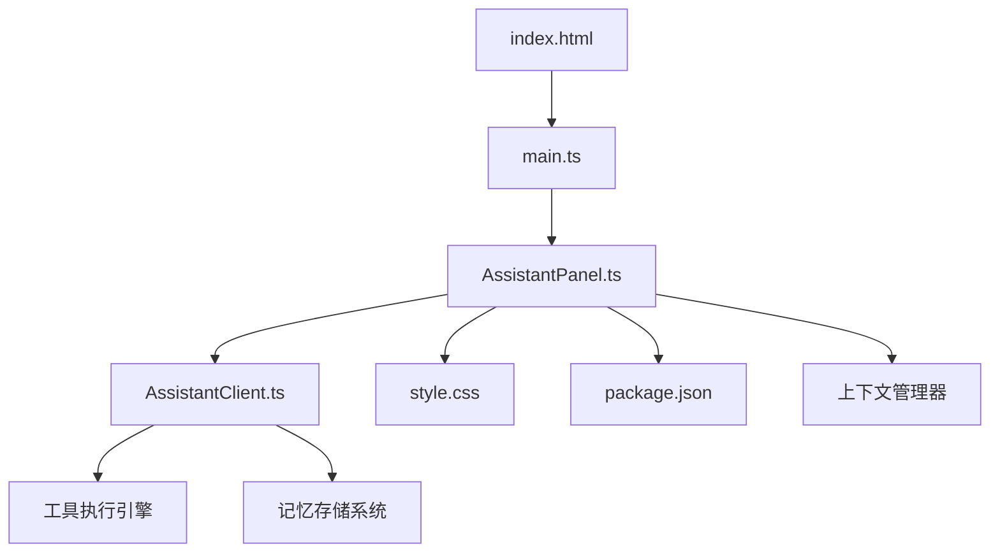
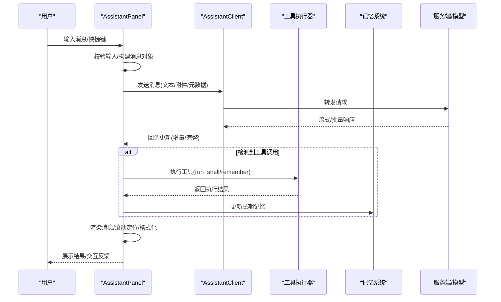
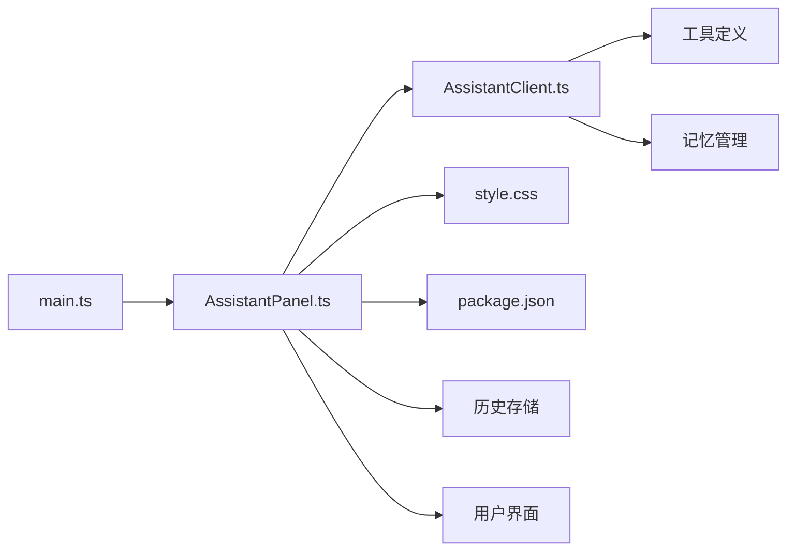

# AssistantPanel用户界面

<cite>
**本文引用的文件**
- [AssistantPanel.ts](file://src/assistant/AssistantPanel.ts)
- [AssistantClient.ts](file://src/assistant/AssistantClient.ts)
- [main.ts](file://src/main.ts)
- [style.css](file://src/style.css)
- [index.html](file://index.html)
- [package.json](file://package.json)
</cite>

## 更新摘要
**变更内容**
- 新增工具执行结果处理机制，支持系统命令执行和结果展示
- 实现长期记忆存储功能，自动归档用户偏好和习惯
- 增强上下文感知能力，支持主动问候和智能对话
- 改进消息流式处理和工具调用序列管理
- 优化历史数据清理和完整性验证

## 目录
1. [简介](#简介)
2. [项目结构](#项目结构)
3. [核心组件](#核心组件)
4. [架构总览](#架构总览)
5. [详细组件分析](#详细组件分析)
6. [依赖关系分析](#依赖关系分析)
7. [性能考虑](#性能考虑)
8. [故障排查指南](#故障排查指南)
9. [结论](#结论)
10. [附录](#附录)

## 简介
本文件面向AssistantPanel用户界面的开发与集成，聚焦对话界面的UI组件架构与交互流程。内容涵盖消息列表渲染、输入框组件、表情支持、富文本显示、消息格式化（Markdown、代码高亮、图片嵌入、链接处理）、历史记录管理（本地存储、滚动加载、性能优化）、样式定制（主题切换、字体设置、布局调整），以及实际使用示例（不同消息类型、自定义渲染器、扩展界面功能）。

**更新** 新增了AI助手的核心功能：工具执行结果处理、长期记忆存储、上下文感知能力和主动问候机制。

## 项目结构
AssistantPanel位于前端应用的核心区域，负责：
- 管理与AI助手的会话通信
- 渲染消息列表与输入区
- 处理键盘快捷键与鼠标操作
- 维护对话历史与本地持久化
- 提供样式与主题能力
- **新增** 工具执行和记忆管理功能

**图表来源**
- [index.html:1-200](file://index.html#L1-L200)
- [main.ts:1-200](file://src/main.ts#L1-L200)
- [AssistantPanel.ts:1-200](file://src/assistant/AssistantPanel.ts#L1-L200)
- [AssistantClient.ts:1-200](file://src/assistant/AssistantClient.ts#L1-L200)
- [style.css:1-200](file://src/style.css#L1-L200)
- [package.json:1-200](file://package.json#L1-L200)

章节来源
- [index.html:1-200](file://index.html#L1-L200)
- [main.ts:1-200](file://src/main.ts#L1-L200)
- [AssistantPanel.ts:1-200](file://src/assistant/AssistantPanel.ts#L1-L200)
- [AssistantClient.ts:1-200](file://src/assistant/AssistantClient.ts#L1-L200)
- [style.css:1-200](file://src/style.css#L1-L200)
- [package.json:1-200](file://package.json#L1-L200)

## 核心组件
- 面板容器与生命周期管理：负责挂载、卸载、事件绑定与状态同步。
- 消息列表渲染：虚拟滚动或分页加载，支持按角色区分、时间排序与自动滚动到底部。
- 输入框组件：支持多行输入、粘贴图片、表情选择器、快捷键发送。
- 富文本与格式化：Markdown解析、代码块高亮、图片预览、链接点击与打开策略。
- 历史与持久化：本地存储会话、增量写入、防抖合并、断线恢复。
- 样式与主题：CSS变量驱动的主题切换、字体与布局配置。
- **新增** 工具执行引擎：支持系统命令执行、结果处理和用户确认机制。
- **新增** 记忆存储系统：长期记忆管理、自动归档和用户偏好学习。
- **新增** 上下文管理器：主动问候、窗口状态感知和智能对话。

章节来源
- [AssistantPanel.ts:1-200](file://src/assistant/AssistantPanel.ts#L1-L200)
- [AssistantClient.ts:1-200](file://src/assistant/AssistantClient.ts#L1-L200)
- [style.css:1-200](file://src/style.css#L1-L200)

## 架构总览
AssistantPanel通过客户端模块与后端服务进行通信，将消息数据转换为可渲染的UI元素，并维护用户交互状态。

**图表来源**
- [AssistantPanel.ts:242-376](file://src/assistant/AssistantPanel.ts#L242-L376)
- [AssistantClient.ts:94-171](file://src/assistant/AssistantClient.ts#L94-L171)

## 详细组件分析

### 消息列表渲染
- 数据结构：消息项包含角色、内容、时间戳、附件、状态等字段；列表按时间顺序组织。
- 渲染策略：采用虚拟滚动或分页加载，仅渲染可视区域节点，减少DOM压力。
- 滚动行为：新消息到达时智能滚动（保持底部或跟随用户滚动位置）。
- 性能要点：键值稳定、避免重排、批量更新、去抖滚动监听。

**更新** 增强了消息类型支持，包括工具调用消息、工具执行结果消息和系统提示消息。

章节来源
- [AssistantPanel.ts:156-195](file://src/assistant/AssistantPanel.ts#L156-L195)

### 输入框组件
- 输入能力：多行编辑、粘贴图片、自动换行、占位符提示。
- 表情支持：内置表情面板与快捷插入，支持自定义表情源。
- 快捷键：Enter发送、Shift+Enter换行、Ctrl/Cmd+K快速聚焦、Esc取消。
- 防抖与节流：输入时禁用发送按钮直到内容有效，避免重复提交。
- **新增** 免确认Shell选项：允许用户配置是否自动执行系统命令。

章节来源
- [AssistantPanel.ts:107-154](file://src/assistant/AssistantPanel.ts#L107-L154)

### 富文本与格式化系统
- Markdown：标题、列表、引用、表格、任务列表等基础语法。
- 代码高亮：语言检测与着色，支持复制与折叠。
- 图片嵌入：内联预览、懒加载、尺寸自适应、点击放大。
- 链接处理：外链在新窗口打开，内部路由跳转，安全白名单校验。
- 安全策略：XSS过滤、协议白名单、资源大小限制。

章节来源
- [AssistantPanel.ts:171-188](file://src/assistant/AssistantPanel.ts#L171-L188)

### 对话历史与本地存储
- 存储策略：IndexedDB或LocalStorage，按会话ID分桶，增量写入。
- 滚动加载：首次加载最近N条，上拉加载更多，历史分页。
- 性能优化：压缩与去重、索引查询、断点续传、错误重试。
- 数据一致性：乐观更新与回滚、冲突解决、版本兼容。
- **新增** 历史数据清理：自动移除孤立的tool消息和不完整的tool_calls序列，防止API错误。
- **新增** 记忆存储：独立的localStorage存储长期记忆，限制最大50条记录。

**更新** 实现了智能的历史数据验证和清理机制，确保对话序列的完整性。

章节来源
- [AssistantPanel.ts:45-105](file://src/assistant/AssistantPanel.ts#L45-L105)

### 样式定制与主题
- 主题切换：通过CSS变量实现明暗主题与品牌色替换。
- 字体设置：全局字体族、字号、行高、字重可配置。
- 布局调整：侧边栏宽度、消息气泡圆角、间距与对齐方式。
- 扩展点：覆盖默认样式类名、注入自定义组件插槽。
- **新增** 工具确认对话框样式：支持用户确认执行的交互式界面。
- **新增** 气泡通知系统：左上角显示系统消息、AI回复和执行状态。

章节来源
- [style.css:153-318](file://src/style.css#L153-L318)
- [AssistantPanel.ts:171-195](file://src/assistant/AssistantPanel.ts#L171-L195)

### 用户交互流程
- 发送消息：校验输入→构建消息→调用客户端发送→等待响应→渲染。
- 实时输入反馈：打字指示器、已读回执、错误提示。
- 键盘与鼠标：快捷键映射、拖拽上传、右键菜单、双击编辑。
- 无障碍：焦点管理、ARIA标签、键盘可达性。
- **新增** 工具执行流程：检测工具调用→用户确认→执行命令→返回结果→更新记忆。
- **新增** 主动问候机制：定时检查用户活动状态，智能打招呼。

**更新** 实现了完整的工具执行工作流，包括用户确认、命令执行和结果反馈。

章节来源
- [AssistantPanel.ts:242-376](file://src/assistant/AssistantPanel.ts#L242-L376)
- [AssistantPanel.ts:378-408](file://src/assistant/AssistantPanel.ts#L378-L408)

### 工具执行结果处理
- **新增** 工具调用检测：从AI响应中解析工具调用指令。
- **新增** 命令执行引擎：安全的系统命令执行，支持Windows cmd语法。
- **新增** 用户确认机制：交互式确认对话框，支持一键允许所有命令。
- **新增** 结果处理：执行结果格式化、错误处理和状态反馈。
- **新增** 序列完整性：确保tool_calls序列完整，避免API错误。

章节来源
- [AssistantPanel.ts:308-376](file://src/assistant/AssistantPanel.ts#L308-L376)

### 记忆存储操作
- **新增** 长期记忆系统：独立存储用户偏好、习惯和个人信息。
- **新增** 自动归档：AI自动识别重要信息并保存到记忆库。
- **新增** 记忆检索：在对话上下文中注入相关记忆，提升个性化体验。
- **新增** 记忆管理：支持记忆查看、删除和容量控制。

章节来源
- [AssistantPanel.ts:45-58](file://src/assistant/AssistantPanel.ts#L45-L58)
- [AssistantClient.ts:67-71](file://src/assistant/AssistantClient.ts#L67-L71)

### 上下文感知能力
- **新增** 主动问候：定时触发，根据当前时间和用户活动状态智能打招呼。
- **新增** 窗口状态检测：获取前台窗口标题和进程信息，了解用户当前活动。
- **新增** 智能对话：结合记忆和上下文生成更自然的回复。
- **新增** 活动级别感知：根据用户忙碌程度调整问候频率和内容。

章节来源
- [AssistantPanel.ts:378-408](file://src/assistant/AssistantPanel.ts#L378-L408)
- [main.ts:184-187](file://src/main.ts#L184-L187)

### 实际使用示例
- 集成不同消息类型：文本、图片、代码块、卡片、投票等。
- 自定义消息渲染器：注册渲染器函数，按类型匹配渲染。
- 扩展界面功能：添加工具栏按钮、快捷命令、插件入口。
- **新增** 工具调用示例：演示run_shell和remember工具的使用方法。
- **新增** 记忆管理示例：展示如何添加和管理长期记忆。

章节来源
- [AssistantPanel.ts:308-376](file://src/assistant/AssistantPanel.ts#L308-L376)

## 依赖关系分析
AssistantPanel依赖客户端模块进行网络通信，依赖样式文件进行主题与布局控制，由主入口初始化并挂载到页面。

**图表来源**
- [main.ts:1-200](file://src/main.ts#L1-L200)
- [AssistantPanel.ts:1-200](file://src/assistant/AssistantPanel.ts#L1-L200)
- [AssistantClient.ts:1-200](file://src/assistant/AssistantClient.ts#L1-L200)
- [style.css:1-200](file://src/style.css#L1-L200)
- [package.json:1-200](file://package.json#L1-L200)

章节来源
- [main.ts:1-200](file://src/main.ts#L1-L200)
- [AssistantPanel.ts:1-200](file://src/assistant/AssistantPanel.ts#L1-L200)
- [AssistantClient.ts:1-200](file://src/assistant/AssistantClient.ts#L1-L200)
- [style.css:1-200](file://src/style.css#L1-L200)
- [package.json:1-200](file://package.json#L1-L200)

## 性能考虑
- 列表渲染：虚拟滚动、按需加载、稳定key、减少重绘。
- 网络请求：流式响应、增量更新、失败重试、超时控制。
- 本地存储：分片写入、压缩、定期清理、索引优化。
- 内存管理：及时释放监听器、销毁组件实例、避免闭包泄漏。
- 首屏体验：延迟加载非关键资源、骨架屏占位、预取常用数据。
- **新增** 工具执行优化：异步执行、超时控制、错误隔离。
- **新增** 记忆存储优化：增量更新、容量限制、定期清理。
- **新增** 上下文管理优化：缓存机制、智能截断、内存控制。

## 故障排查指南
- 常见问题
  - 消息未渲染：检查消息类型是否注册渲染器、内容是否为空、样式是否被覆盖。
  - 发送失败：确认网络状态、服务端返回码、重试策略与错误提示。
  - 历史加载卡顿：检查分页参数、索引是否存在、是否触发全量重排。
  - 主题异常：验证CSS变量是否正确注入、类名是否冲突。
  - **新增** 工具执行失败：检查命令语法、权限设置、执行环境配置。
  - **新增** 记忆存储异常：验证存储空间、数据格式、访问权限。
  - **新增** 上下文感知问题：检查API Key配置、网络连通性、权限设置。
- 调试建议
  - 启用日志与埋点，记录关键步骤与耗时。
  - 使用浏览器开发者工具观察网络、DOM与性能面板。
  - 复现最小用例，隔离第三方依赖影响。
  - **新增** 工具执行调试：记录命令输出、错误堆栈、执行时间。
  - **新增** 记忆系统调试：监控存储容量、数据完整性、访问频率。

章节来源
- [AssistantPanel.ts:242-376](file://src/assistant/AssistantPanel.ts#L242-L376)
- [AssistantClient.ts:94-171](file://src/assistant/AssistantClient.ts#L94-L171)

## 结论
AssistantPanel提供了完整的对话界面能力，涵盖消息渲染、输入交互、富文本格式化、历史管理与主题定制。**更新** 新增了强大的AI助手功能，包括工具执行、长期记忆、上下文感知和主动问候机制。通过清晰的组件边界与可扩展的接口，能够灵活集成多种消息类型与自定义渲染器，满足多样化业务场景。建议在集成时关注性能与安全策略，确保良好的用户体验与稳定性。

## 附录
- 快速开始
  - 在主入口初始化并挂载AssistantPanel。
  - 配置主题、字体与默认消息类型。
  - 接入AssistantClient以完成通信。
  - **新增** 配置工具执行权限和记忆存储选项。
- 扩展点
  - 注册自定义消息渲染器。
  - 注入表情源与工具栏按钮。
  - 覆盖样式变量实现品牌化。
  - **新增** 扩展工具类型和记忆管理逻辑。
  - **新增** 自定义上下文感知规则。

章节来源
- [main.ts:1-200](file://src/main.ts#L1-L200)
- [AssistantPanel.ts:1-200](file://src/assistant/AssistantPanel.ts#L1-L200)
- [style.css:1-200](file://src/style.css#L1-L200)