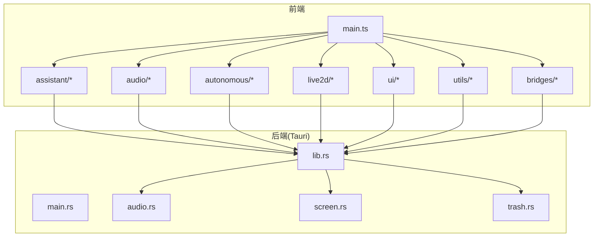
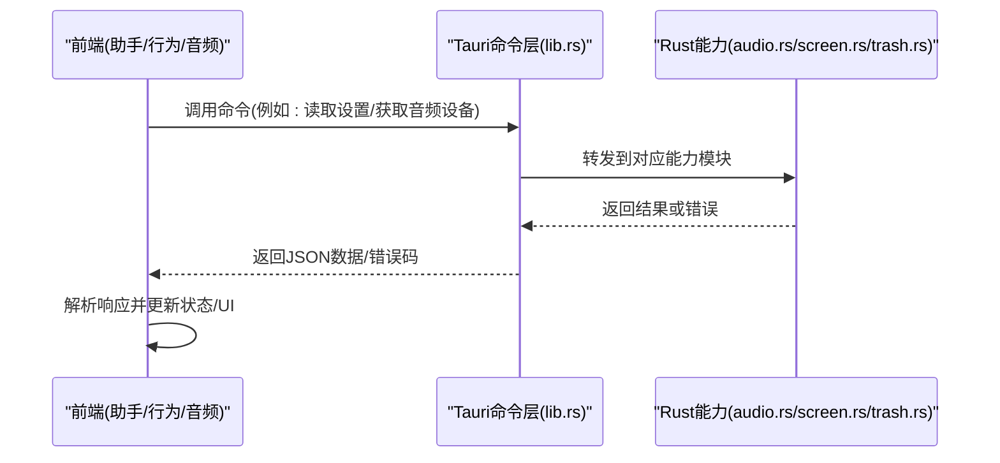
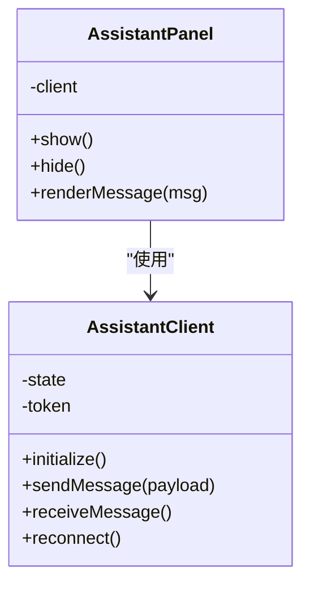
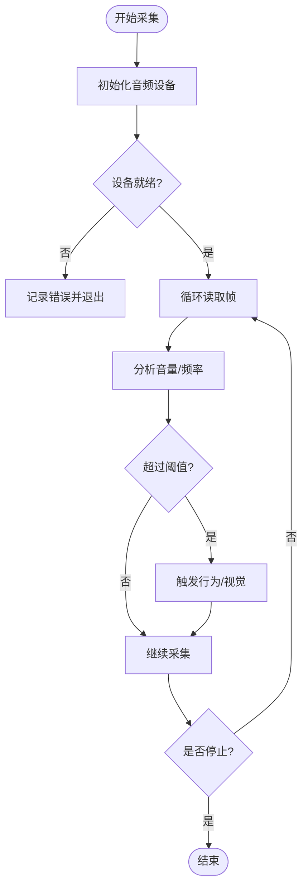
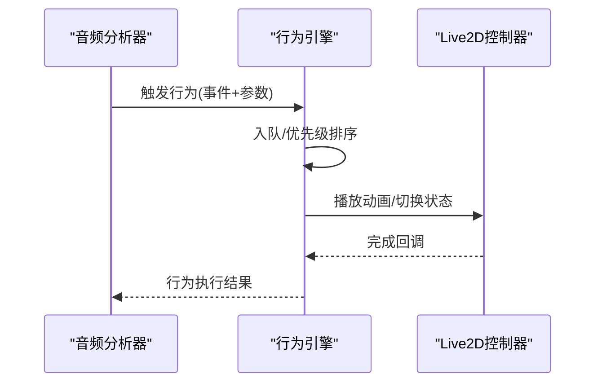
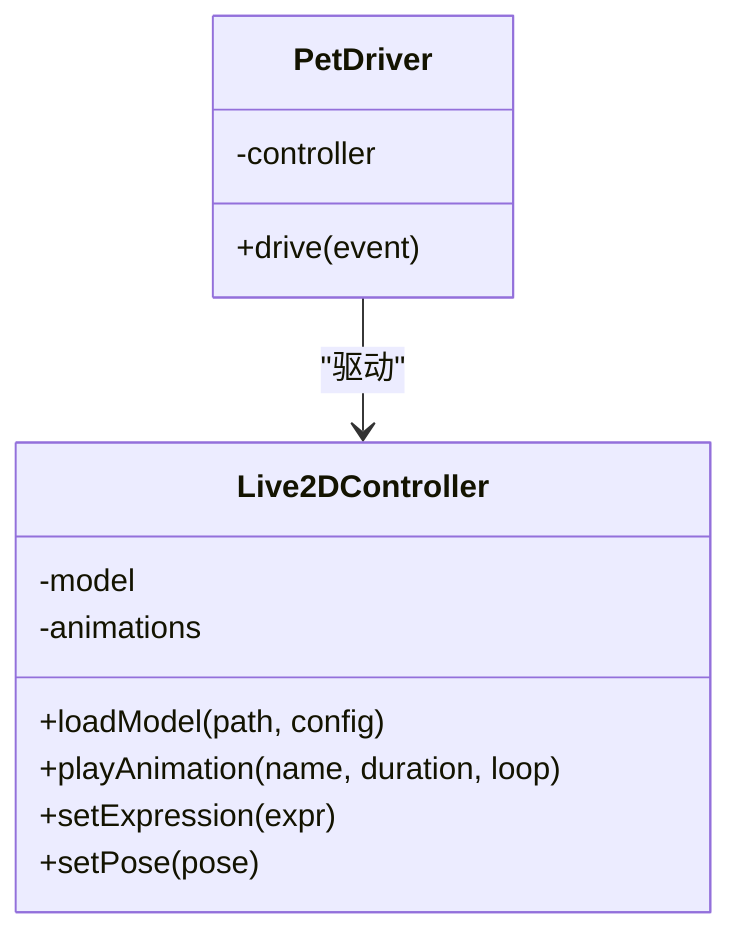
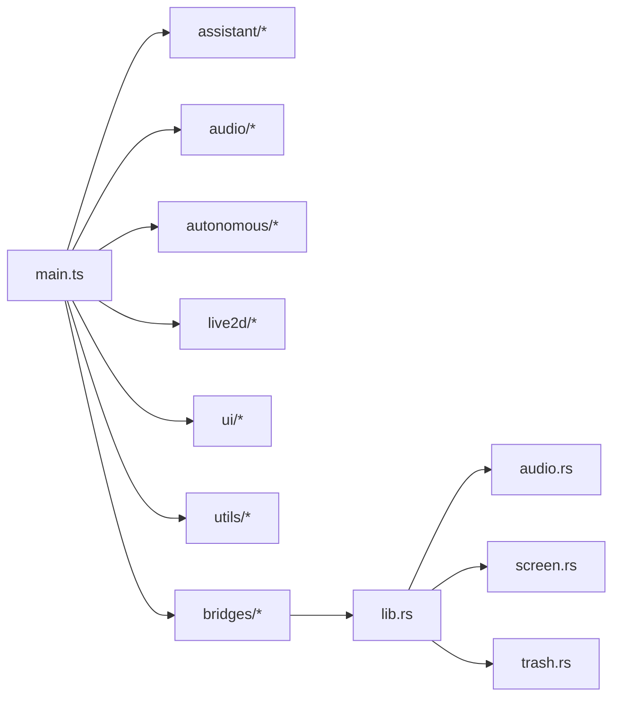

# API参考文档

<cite>
**本文引用的文件**
- [src/main.ts](file://src/main.ts)
- [src/assistant/AssistantClient.ts](file://src/assistant/AssistantClient.ts)
- [src/assistant/AssistantPanel.ts](file://src/assistant/AssistantPanel.ts)
- [src/audio/AudioAnalyzer.ts](file://src/audio/AudioAnalyzer.ts)
- [src/autonomous/BehaviorEngine.ts](file://src/autonomous/BehaviorEngine.ts)
- [src/bridges/astrobot.ts](file://src/bridges/astrobot.ts)
- [src/features/trash/TrashHandler.ts](file://src/features/trash/TrashHandler.ts)
- [src/live2d/Live2DController.ts](file://src/live2d/Live2DController.ts)
- [src/live2d/PetDriver.ts](file://src/live2d/PetDriver.ts)
- [src/live2d/PlaceholderRenderer.ts](file://src/live2d/PlaceholderRenderer.ts)
- [src/live2d/l2d-stub.ts](file://src/live2d/l2d-stub.ts)
- [src/ui/ContextMenu.ts](file://src/ui/ContextMenu.ts)
- [src/ui/Toast.ts](file://src/ui/Toast.ts)
- [src/utils/math.ts](file://src/utils/math.ts)
- [src/utils/settings.ts](file://src/utils/settings.ts)
- [src-tauri/src/lib.rs](file://src-tauri/src/lib.rs)
- [src-tauri/src/main.rs](file://src-tauri/src/main.rs)
- [src-tauri/src/audio.rs](file://src-tauri/src/audio.rs)
- [src-tauri/src/screen.rs](file://src-tauri/src/screen.rs)
- [src-tauri/src/trash.rs](file://src-tauri/src/trash.rs)
- [src-tauri/Cargo.toml](file://src-tauri/Cargo.toml)
- [src-tauri/tauri.conf.json](file://src-tauri/tauri.conf.json)
- [public/models/manifest.json](file://public/models/manifest.json)
</cite>

## 目录
1. [简介](#简介)
2. [项目结构](#项目结构)
3. [核心组件](#核心组件)
4. [架构总览](#架构总览)
5. [详细组件分析](#详细组件分析)
6. [依赖分析](#依赖分析)
7. [性能考虑](#性能考虑)
8. [故障排查指南](#故障排查指南)
9. [结论](#结论)
10. [附录](#附录)

## 简介
本API参考文档面向“pet”桌面应用（基于Tauri的前后端一体化方案），覆盖前端TypeScript接口与后端Rust函数，重点说明：
- RESTful风格API（通过Tauri命令暴露）的HTTP方法、URL模式、请求/响应结构与认证方式
- IPC通信的数据格式、消息类型与状态管理
- 完整接口签名、参数说明、返回值定义与错误码列表
- 实际调用示例与最佳实践
- API版本兼容性与迁移指南
- 调试工具与测试方法

该文档旨在帮助开发者快速集成与扩展功能，同时保证前后端协作的一致性与可维护性。

## 项目结构
本项目采用典型的前后端分离但同进程部署的结构：
- 前端：TypeScript + Vite，负责UI交互、状态管理与IPC调用
- 后端：Rust + Tauri，提供系统能力（音频、屏幕、回收站等）并通过命令暴露给前端
- 资源：模型清单与静态资源位于public目录

图表来源
- [src/main.ts:1-200](file://src/main.ts#L1-L200)
- [src-tauri/src/lib.rs:1-200](file://src-tauri/src/lib.rs#L1-L200)

章节来源
- [src/main.ts:1-200](file://src/main.ts#L1-L200)
- [src-tauri/src/lib.rs:1-200](file://src-tauri/src/lib.rs#L1-L200)

## 核心组件
- 助手客户端与面板：封装与后端的对话/指令通道，管理会话状态与UI面板生命周期
- 音频分析器：采集与分析音频流，触发行为引擎或视觉反馈
- 行为引擎：根据输入事件驱动宠物行为（移动、表情、动作等）
- Live2D控制器：驱动Live2D模型的渲染与动画播放
- 系统能力桥接：通过Tauri命令访问系统级能力（音频设备、屏幕信息、回收站操作）
- UI组件：上下文菜单与提示框，用于用户交互反馈
- 工具模块：数学计算与设置读写

章节来源
- [src/assistant/AssistantClient.ts:1-200](file://src/assistant/AssistantClient.ts#L1-L200)
- [src/assistant/AssistantPanel.ts:1-200](file://src/assistant/AssistantPanel.ts#L1-L200)
- [src/audio/AudioAnalyzer.ts:1-200](file://src/audio/AudioAnalyzer.ts#L1-L200)
- [src/autonomous/BehaviorEngine.ts:1-200](file://src/autonomous/BehaviorEngine.ts#L1-L200)
- [src/live2d/Live2DController.ts:1-200](file://src/live2d/Live2DController.ts#L1-L200)
- [src/live2d/PetDriver.ts:1-200](file://src/live2d/PetDriver.ts#L1-L200)
- [src/ui/ContextMenu.ts:1-200](file://src/ui/ContextMenu.ts#L1-L200)
- [src/ui/Toast.ts:1-200](file://src/ui/Toast.ts#L1-L200)
- [src/utils/settings.ts:1-200](file://src/utils/settings.ts#L1-L200)
- [src-tauri/src/audio.rs:1-200](file://src-tauri/src/audio.rs#L1-L200)
- [src-tauri/src/screen.rs:1-200](file://src-tauri/src/screen.rs#L1-L200)
- [src-tauri/src/trash.rs:1-200](file://src-tauri/src/trash.rs#L1-L200)

## 架构总览
前端通过Tauri命令与Rust后端进行IPC通信。命令通常以REST风格命名（如“读取设置”、“写入设置”、“获取音频设备”、“删除到回收站”等），由Rust侧实现具体逻辑并返回结果。前端在需要时调用这些命令，并根据返回状态更新UI或触发后续流程。

图表来源
- [src-tauri/src/lib.rs:1-200](file://src-tauri/src/lib.rs#L1-L200)
- [src-tauri/src/audio.rs:1-200](file://src-tauri/src/audio.rs#L1-L200)
- [src-tauri/src/screen.rs:1-200](file://src-tauri/src/screen.rs#L1-L200)
- [src-tauri/src/trash.rs:1-200](file://src-tauri/src/trash.rs#L1-L200)

## 详细组件分析

### 助手客户端与面板（AssistantClient / AssistantPanel）
- 职责
  - 建立与管理与后端的对话通道
  - 维护会话状态（连接、鉴权、重试）
  - 控制面板的生命周期（显示/隐藏、焦点）
- 关键接口
  - 初始化与会话建立
  - 发送消息与接收响应
  - 错误处理与重连策略
- 状态管理
  - 连接状态：未连接/已连接/断开
  - 会话令牌：用于鉴权（若启用）
  - 消息队列：缓冲待发送消息
- 错误处理
  - 网络异常、超时、服务端错误
  - 降级策略：本地缓存、离线模式

图表来源
- [src/assistant/AssistantClient.ts:1-200](file://src/assistant/AssistantClient.ts#L1-L200)
- [src/assistant/AssistantPanel.ts:1-200](file://src/assistant/AssistantPanel.ts#L1-L200)

章节来源
- [src/assistant/AssistantClient.ts:1-200](file://src/assistant/AssistantClient.ts#L1-L200)
- [src/assistant/AssistantPanel.ts:1-200](file://src/assistant/AssistantPanel.ts#L1-L200)

### 音频分析器（AudioAnalyzer）
- 职责
  - 采集音频输入流
  - 实时分析音量、频率特征
  - 触发行为引擎或视觉反馈
- 关键接口
  - 启动/停止采集
  - 事件回调（音量阈值、静音检测）
  - 配置采样率、缓冲区大小
- 错误处理
  - 设备不可用、权限拒绝
  - 数据流中断与恢复

图表来源
- [src/audio/AudioAnalyzer.ts:1-200](file://src/audio/AudioAnalyzer.ts#L1-L200)

章节来源
- [src/audio/AudioAnalyzer.ts:1-200](file://src/audio/AudioAnalyzer.ts#L1-L200)

### 行为引擎（BehaviorEngine）
- 职责
  - 根据输入事件驱动宠物行为（移动、表情、动作）
  - 管理行为队列与优先级
  - 与Live2D控制器协同播放动画
- 关键接口
  - 注册行为处理器
  - 触发行为（带参数）
  - 查询当前行为状态
- 错误处理
  - 行为冲突、资源加载失败

图表来源
- [src/autonomous/BehaviorEngine.ts:1-200](file://src/autonomous/BehaviorEngine.ts#L1-L200)
- [src/live2d/Live2DController.ts:1-200](file://src/live2d/Live2DController.ts#L1-L200)

章节来源
- [src/autonomous/BehaviorEngine.ts:1-200](file://src/autonomous/BehaviorEngine.ts#L1-L200)
- [src/live2d/Live2DController.ts:1-200](file://src/live2d/Live2DController.ts#L1-L200)

### Live2D控制器与宠物驱动（Live2DController / PetDriver）
- 职责
  - 加载与渲染Live2D模型
  - 控制动画播放、表情切换
  - 与行为引擎对接，驱动模型状态
- 关键接口
  - 加载模型（路径/配置）
  - 播放动画（名称/时长/循环）
  - 设置表情/姿态
- 错误处理
  - 模型加载失败、资源缺失

图表来源
- [src/live2d/Live2DController.ts:1-200](file://src/live2d/Live2DController.ts#L1-L200)
- [src/live2d/PetDriver.ts:1-200](file://src/live2d/PetDriver.ts#L1-L200)

章节来源
- [src/live2d/Live2DController.ts:1-200](file://src/live2d/Live2DController.ts#L1-L200)
- [src/live2d/PetDriver.ts:1-200](file://src/live2d/PetDriver.ts#L1-L200)

### 系统能力桥接（astrobot.ts）
- 职责
  - 封装对后端能力的调用（音频、屏幕、回收站）
  - 统一错误处理与重试机制
  - 提供简洁的前端API
- 关键接口
  - 音频设备枚举与选择
  - 屏幕尺寸与分辨率获取
  - 文件移动到回收站
- 错误处理
  - 权限不足、设备不可用、IO错误

章节来源
- [src/bridges/astrobot.ts:1-200](file://src/bridges/astrobot.ts#L1-L200)

### 回收站处理（TrashHandler）
- 职责
  - 封装回收站操作（移动、清空、查询）
  - 与后端trash.rs对接
- 关键接口
  - 移动到回收站
  - 清空回收站
  - 查询回收站内容
- 错误处理
  - 权限不足、路径无效

章节来源
- [src/features/trash/TrashHandler.ts:1-200](file://src/features/trash/TrashHandler.ts#L1-L200)

### UI组件（ContextMenu / Toast）
- 职责
  - 提供上下文菜单与提示框
  - 支持自定义内容与回调
- 关键接口
  - 显示/隐藏
  - 设置内容与样式
  - 点击回调

章节来源
- [src/ui/ContextMenu.ts:1-200](file://src/ui/ContextMenu.ts#L1-L200)
- [src/ui/Toast.ts:1-200](file://src/ui/Toast.ts#L1-L200)

### 工具模块（math.ts / settings.ts）
- 职责
  - 数学计算辅助
  - 设置项的读取与保存
- 关键接口
  - 数值计算、格式化
  - 设置键值存取

章节来源
- [src/utils/math.ts:1-200](file://src/utils/math.ts#L1-L200)
- [src/utils/settings.ts:1-200](file://src/utils/settings.ts#L1-L200)

### 后端能力（audio.rs / screen.rs / trash.rs）
- 职责
  - 音频设备枚举、捕获与控制
  - 屏幕信息获取
  - 回收站操作
- 关键接口
  - 音频：枚举设备、开始/停止捕获
  - 屏幕：获取分辨率、多显示器信息
  - 回收站：移动文件、清空、查询
- 错误处理
  - 权限、设备、IO错误

章节来源
- [src-tauri/src/audio.rs:1-200](file://src-tauri/src/audio.rs#L1-L200)
- [src-tauri/src/screen.rs:1-200](file://src-tauri/src/screen.rs#L1-L200)
- [src-tauri/src/trash.rs:1-200](file://src-tauri/src/trash.rs#L1-L200)

## 依赖分析
- 前端依赖
  - Tauri命令调用（通过lib.rs暴露）
  - 各模块间耦合度较低，主要通过事件与回调通信
- 后端依赖
  - Tauri框架与系统API
  - 各能力模块独立，通过命令路由分发

图表来源
- [src/main.ts:1-200](file://src/main.ts#L1-L200)
- [src-tauri/src/lib.rs:1-200](file://src-tauri/src/lib.rs#L1-L200)

章节来源
- [src/main.ts:1-200](file://src/main.ts#L1-L200)
- [src-tauri/src/lib.rs:1-200](file://src-tauri/src/lib.rs#L1-L200)

## 性能考虑
- 音频采集
  - 合理设置采样率与缓冲区大小，避免CPU占用过高
  - 使用节流/防抖减少高频事件触发
- 行为引擎
  - 行为队列优先处理高优先级事件
  - 动画播放时注意资源复用与预加载
- Live2D渲染
  - 模型加载异步化，避免阻塞主线程
  - 动画切换时平滑过渡，减少卡顿
- IPC通信
  - 批量消息合并，减少频繁调用
  - 错误重试与超时控制

## 故障排查指南
- 常见问题
  - 音频设备不可用：检查权限与设备状态
  - 模型加载失败：确认资源路径与格式正确
  - 回收站操作失败：检查文件系统权限与路径有效性
- 调试建议
  - 启用日志输出，定位错误堆栈
  - 使用浏览器开发者工具检查前端状态
  - 使用Tauri调试模式查看后端日志
- 测试方法
  - 单元测试：对工具模块与算法进行覆盖
  - 集成测试：模拟IPC调用，验证端到端流程
  - 压力测试：高负载下音频与行为稳定性

## 结论
本API参考文档梳理了“pet”项目的核心组件与接口，明确了前后端协作方式与错误处理策略。通过遵循本文档的最佳实践，开发者可以高效地集成与扩展功能，确保应用的稳定性与可维护性。

## 附录

### RESTful风格API（Tauri命令）
- 说明
  - 所有后端能力通过Tauri命令暴露，前端以函数形式调用
  - 命令命名遵循动词+名词风格（如“读取设置”、“枚举音频设备”）
- 通用请求/响应结构
  - 请求：包含命令名与参数对象
  - 响应：包含数据对象或错误码
- 认证方法
  - 若启用会话令牌，需在请求头中携带令牌
  - 令牌由助手客户端管理，自动刷新与重试

章节来源
- [src-tauri/src/lib.rs:1-200](file://src-tauri/src/lib.rs#L1-L200)
- [src/assistant/AssistantClient.ts:1-200](file://src/assistant/AssistantClient.ts#L1-L200)

### IPC通信数据格式
- 消息类型
  - 控制消息：启动/停止、配置变更
  - 数据消息：音频帧、行为事件、UI状态
- 状态管理
  - 连接状态、会话状态、设备状态
  - 错误状态与重试计数

章节来源
- [src/assistant/AssistantClient.ts:1-200](file://src/assistant/AssistantClient.ts#L1-L200)
- [src/audio/AudioAnalyzer.ts:1-200](file://src/audio/AudioAnalyzer.ts#L1-L200)

### 错误码列表
- 通用错误码
  - 权限不足、设备不可用、资源缺失、IO错误
- 业务错误码
  - 行为冲突、动画加载失败、会话过期

章节来源
- [src-tauri/src/audio.rs:1-200](file://src-tauri/src/audio.rs#L1-L200)
- [src-tauri/src/screen.rs:1-200](file://src-tauri/src/screen.rs#L1-L200)
- [src-tauri/src/trash.rs:1-200](file://src-tauri/src/trash.rs#L1-L200)

### 调用示例与最佳实践
- 示例
  - 读取设置：调用命令并解析返回的配置对象
  - 枚举音频设备：获取设备列表并选择默认设备
  - 移动到回收站：传入文件路径并处理成功/失败回调
- 最佳实践
  - 使用异步调用，避免阻塞UI
  - 统一错误处理，提供用户友好提示
  - 合理设置超时与重试策略

章节来源
- [src/bridges/astrobot.ts:1-200](file://src/bridges/astrobot.ts#L1-L200)
- [src/features/trash/TrashHandler.ts:1-200](file://src/features/trash/TrashHandler.ts#L1-L200)

### API版本兼容性与迁移指南
- 兼容性
  - 保持命令命名稳定，新增字段向后兼容
  - 废弃字段需保留一段时间并提供迁移提示
- 迁移
  - 提供版本检测与自动升级脚本
  - 文档更新与示例代码同步

章节来源
- [src-tauri/Cargo.toml:1-200](file://src-tauri/Cargo.toml#L1-L200)
- [src-tauri/tauri.conf.json:1-200](file://src-tauri/tauri.conf.json#L1-L200)

### 调试工具与测试方法
- 调试工具
  - Tauri调试模式：查看后端日志
  - 浏览器开发者工具：检查前端状态与网络请求
- 测试方法
  - 单元测试：覆盖工具模块与算法
  - 集成测试：模拟IPC调用与系统能力
  - 压力测试：高负载下的稳定性验证

章节来源
- [src-tauri/src/lib.rs:1-200](file://src-tauri/src/lib.rs#L1-L200)
- [public/models/manifest.json:1-200](file://public/models/manifest.json#L1-L200)