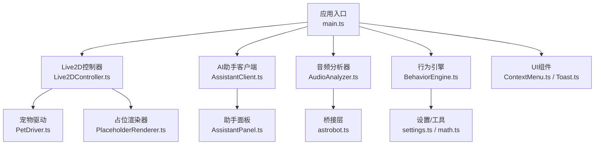
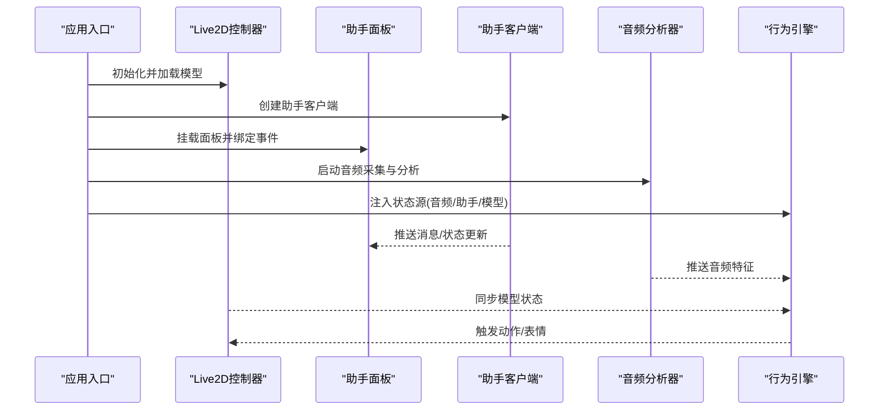
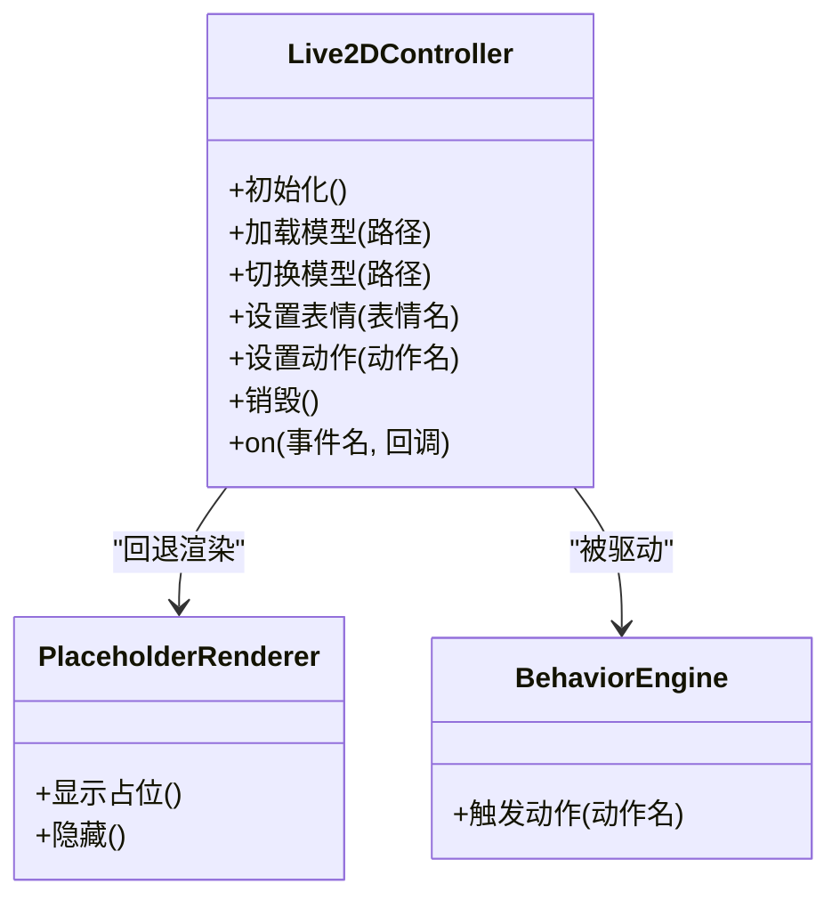
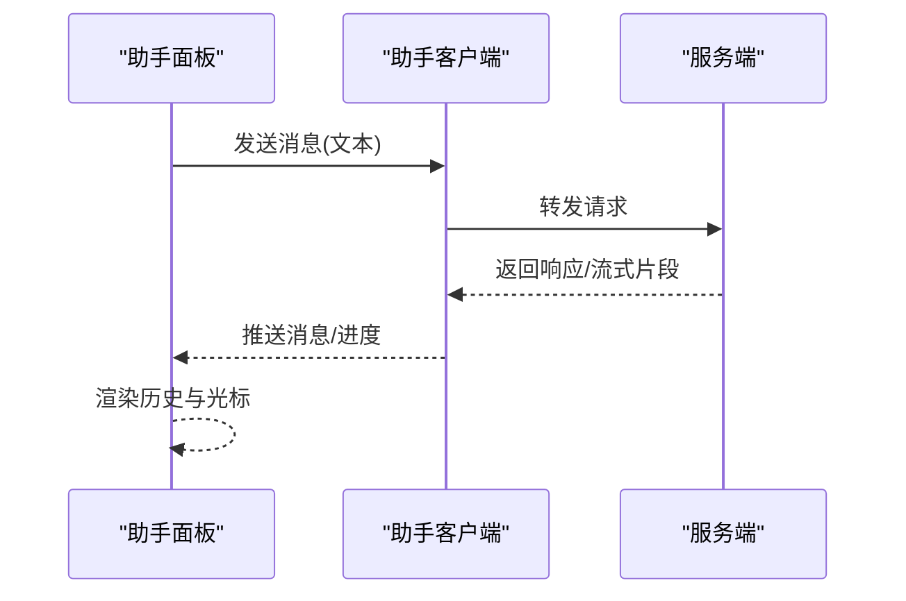
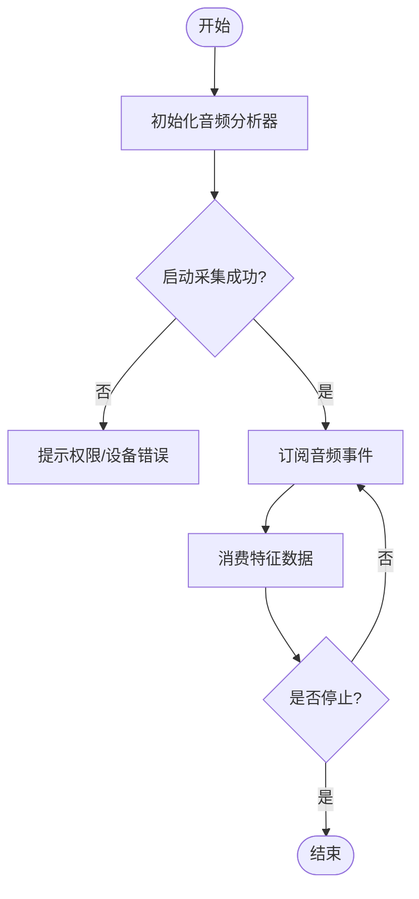
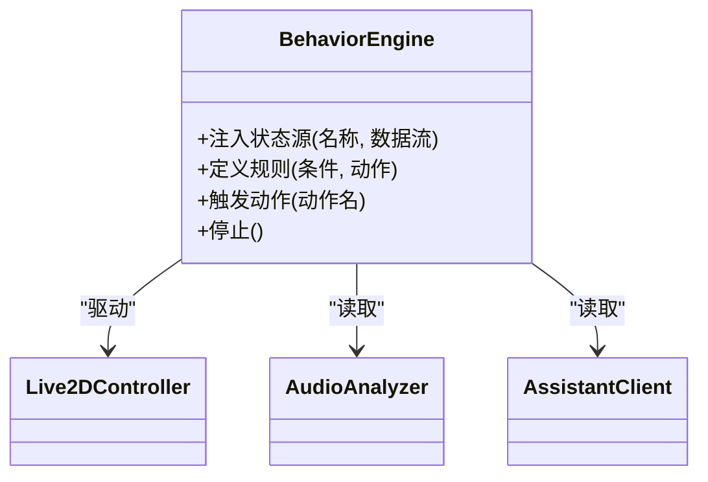
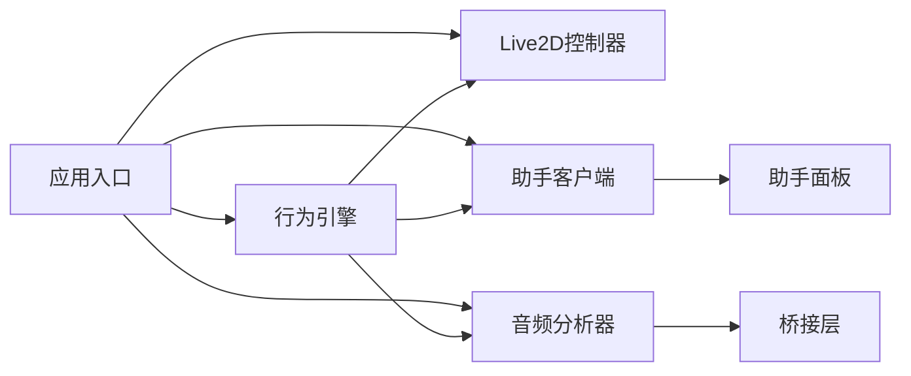

# 前端API接口

<cite>
**本文引用的文件**
- [src/main.ts](file://src/main.ts)
- [src/live2d/Live2DController.ts](file://src/live2d/Live2DController.ts)
- [src/live2d/PetDriver.ts](file://src/live2d/PetDriver.ts)
- [src/live2d/PlaceholderRenderer.ts](file://src/live2d/PlaceholderRenderer.ts)
- [src/live2d/l2d-stub.ts](file://src/live2d/l2d-stub.ts)
- [src/assistant/AssistantClient.ts](file://src/assistant/AssistantClient.ts)
- [src/assistant/AssistantPanel.ts](file://src/assistant/AssistantPanel.ts)
- [src/audio/AudioAnalyzer.ts](file://src/audio/AudioAnalyzer.ts)
- [src/autonomous/BehaviorEngine.ts](file://src/autonomous/BehaviorEngine.ts)
- [src/bridges/astrobot.ts](file://src/bridges/astrobot.ts)
- [src/ui/ContextMenu.ts](file://src/ui/ContextMenu.ts)
- [src/ui/Toast.ts](file://src/ui/Toast.ts)
- [src/utils/math.ts](file://src/utils/math.ts)
- [src/utils/settings.ts](file://src/utils/settings.ts)
- [package.json](file://package.json)
- [tsconfig.json](file://tsconfig.json)
</cite>

## 目录
1. [简介](#简介)
2. [项目结构](#项目结构)
3. [核心组件](#核心组件)
4. [架构总览](#架构总览)
5. [详细组件分析](#详细组件分析)
6. [依赖关系分析](#依赖关系分析)
7. [性能考虑](#性能考虑)
8. [故障排查指南](#故障排查指南)
9. [结论](#结论)
10. [附录：类型与配置](#附录类型与配置)

## 简介
本文件面向前端TypeScript开发者，系统化梳理本项目的前端API接口，覆盖Live2D控制器、AI助手通信、音频分析、行为引擎、UI交互等核心模块。文档以“公开类/方法/属性/事件”为主线，说明参数类型、返回值类型、错误处理机制与调用顺序，并提供最佳实践与常见使用模式。读者无需深入源码即可快速上手集成与扩展。

## 项目结构
前端代码按功能域组织，关键目录与职责如下：
- live2d：Live2D模型驱动、渲染与占位渲染器
- assistant：AI助手客户端与面板
- audio：音频分析与桥接
- autonomous：行为引擎（自主行为）
- bridges：与后端/系统能力的桥接封装
- ui：上下文菜单与提示通知
- utils：数学工具与设置管理
- main.ts：应用入口与初始化编排

图表来源
- [src/main.ts:1-200](file://src/main.ts#L1-L200)
- [src/live2d/Live2DController.ts:1-200](file://src/live2d/Live2DController.ts#L1-L200)
- [src/assistant/AssistantClient.ts:1-200](file://src/assistant/AssistantClient.ts#L1-L200)
- [src/audio/AudioAnalyzer.ts:1-200](file://src/audio/AudioAnalyzer.ts#L1-L200)
- [src/autonomous/BehaviorEngine.ts:1-200](file://src/autonomous/BehaviorEngine.ts#L1-L200)

章节来源
- [src/main.ts:1-200](file://src/main.ts#L1-L200)

## 核心组件
本节概述各模块对外暴露的API能力边界与职责划分，便于跨模块协作与集成。

- Live2D控制器（Live2DController）
  - 负责加载/切换模型、驱动表情与动作、同步状态到渲染层
  - 提供事件回调用于监听模型生命周期与交互反馈
- AI助手（AssistantClient + AssistantPanel）
  - 客户端负责消息收发、会话管理、错误重试与降级
  - 面板负责展示对话历史、输入框与操作按钮
- 音频分析（AudioAnalyzer）
  - 采集与分析音频流，输出音量/频谱特征，供行为或表现层使用
  - 通过桥接层访问底层音频能力
- 行为引擎（BehaviorEngine）
  - 基于当前状态与规则触发行为（如待机、互动、响应语音）
  - 与Live2D控制器联动驱动模型动作
- UI组件（ContextMenu, Toast）
  - 提供用户交互反馈与快捷操作入口
- 工具与设置（math.ts, settings.ts）
  - 通用数学计算与全局设置读写

章节来源
- [src/live2d/Live2DController.ts:1-200](file://src/live2d/Live2DController.ts#L1-L200)
- [src/assistant/AssistantClient.ts:1-200](file://src/assistant/AssistantClient.ts#L1-L200)
- [src/assistant/AssistantPanel.ts:1-200](file://src/assistant/AssistantPanel.ts#L1-L200)
- [src/audio/AudioAnalyzer.ts:1-200](file://src/audio/AudioAnalyzer.ts#L1-L200)
- [src/autonomous/BehaviorEngine.ts:1-200](file://src/autonomous/BehaviorEngine.ts#L1-L200)
- [src/ui/ContextMenu.ts:1-200](file://src/ui/ContextMenu.ts#L1-L200)
- [src/ui/Toast.ts:1-200](file://src/ui/Toast.ts#L1-L200)
- [src/utils/math.ts:1-200](file://src/utils/math.ts#L1-L200)
- [src/utils/settings.ts:1-200](file://src/utils/settings.ts#L1-L200)

## 架构总览
前端采用分层与模块化设计：
- 表现层：Live2D渲染与占位渲染器
- 业务层：AI助手、行为引擎、音频分析
- 基础设施：桥接层、工具库、设置管理
- 入口编排：应用启动时按需初始化并建立订阅关系

图表来源
- [src/main.ts:1-200](file://src/main.ts#L1-L200)
- [src/live2d/Live2DController.ts:1-200](file://src/live2d/Live2DController.ts#L1-L200)
- [src/assistant/AssistantClient.ts:1-200](file://src/assistant/AssistantClient.ts#L1-L200)
- [src/assistant/AssistantPanel.ts:1-200](file://src/assistant/AssistantPanel.ts#L1-L200)
- [src/audio/AudioAnalyzer.ts:1-200](file://src/audio/AudioAnalyzer.ts#L1-L200)
- [src/autonomous/BehaviorEngine.ts:1-200](file://src/autonomous/BehaviorEngine.ts#L1-L200)

## 详细组件分析

### Live2D控制器API
- 职责
  - 模型加载、切换、状态同步、事件派发
  - 与行为引擎和渲染器协作驱动动画
- 主要能力
  - 初始化与销毁
  - 加载/切换模型
  - 设置表情/动作
  - 监听模型事件（加载完成、交互反馈等）
- 典型调用顺序
  - 初始化 → 加载模型 → 绑定事件 → 根据行为/输入驱动动作 → 销毁释放资源
- 错误处理
  - 模型加载失败时回退至占位渲染器
  - 事件回调中捕获异常并上报
- 依赖
  - 渲染器（PlaceholderRenderer）
  - 行为引擎（接收指令驱动）
  - 设置（模型路径、默认表情等）

图表来源
- [src/live2d/Live2DController.ts:1-200](file://src/live2d/Live2DController.ts#L1-L200)
- [src/live2d/PlaceholderRenderer.ts:1-200](file://src/live2d/PlaceholderRenderer.ts#L1-L200)
- [src/autonomous/BehaviorEngine.ts:1-200](file://src/autonomous/BehaviorEngine.ts#L1-L200)

章节来源
- [src/live2d/Live2DController.ts:1-200](file://src/live2d/Live2DController.ts#L1-L200)
- [src/live2d/PlaceholderRenderer.ts:1-200](file://src/live2d/PlaceholderRenderer.ts#L1-L200)

### AI助手通信API（客户端与面板）
- 职责
  - 客户端：连接、消息发送/接收、重连、错误处理、会话状态
  - 面板：渲染对话、输入处理、操作按钮
- 主要能力
  - 建立连接、发送消息、订阅消息流
  - 显示/清空历史、插入新消息、错误提示
  - 支持离线/降级模式
- 典型调用顺序
  - 创建客户端 → 建立连接 → 监听消息 → 面板渲染 → 用户输入 → 发送消息 → 收到回复 → 更新面板
- 错误处理
  - 网络异常自动重试与降级
  - 解析失败时记录日志并提示
- 依赖
  - 设置（服务端地址、鉴权信息）
  - UI组件（Toast/ContextMenu）

图表来源
- [src/assistant/AssistantClient.ts:1-200](file://src/assistant/AssistantClient.ts#L1-L200)
- [src/assistant/AssistantPanel.ts:1-200](file://src/assistant/AssistantPanel.ts#L1-L200)

章节来源
- [src/assistant/AssistantClient.ts:1-200](file://src/assistant/AssistantClient.ts#L1-L200)
- [src/assistant/AssistantPanel.ts:1-200](file://src/assistant/AssistantPanel.ts#L1-L200)

### 音频分析API
- 职责
  - 采集音频流、计算音量/频谱特征、输出事件
- 主要能力
  - 启动/停止采集
  - 订阅音频特征事件
  - 错误与权限处理
- 典型调用顺序
  - 初始化 → 启动采集 → 订阅事件 → 消费特征数据 → 停止采集
- 错误处理
  - 无权限/设备不可用时的降级策略
  - 异常中断后尝试恢复
- 依赖
  - 桥接层（astrobot.ts）
  - 行为引擎（作为输入源）

图表来源
- [src/audio/AudioAnalyzer.ts:1-200](file://src/audio/AudioAnalyzer.ts#L1-L200)
- [src/bridges/astrobot.ts:1-200](file://src/bridges/astrobot.ts#L1-L200)

章节来源
- [src/audio/AudioAnalyzer.ts:1-200](file://src/audio/AudioAnalyzer.ts#L1-L200)
- [src/bridges/astrobot.ts:1-200](file://src/bridges/astrobot.ts#L1-L200)

### 行为引擎API
- 职责
  - 聚合多源输入（音频、助手、模型状态），决策并驱动Live2D动作
- 主要能力
  - 注册/注销状态源
  - 定义行为规则与优先级
  - 触发动作/表情
- 典型调用顺序
  - 注入状态源 → 运行循环 → 匹配规则 → 触发动作 → 同步到控制器
- 错误处理
  - 规则冲突时回退默认行为
  - 动作执行失败时重试或跳过
- 依赖
  - Live2D控制器
  - 音频分析器
  - 助手客户端
  - 设置与工具

图表来源
- [src/autonomous/BehaviorEngine.ts:1-200](file://src/autonomous/BehaviorEngine.ts#L1-L200)
- [src/live2d/Live2DController.ts:1-200](file://src/live2d/Live2DController.ts#L1-L200)
- [src/audio/AudioAnalyzer.ts:1-200](file://src/audio/AudioAnalyzer.ts#L1-L200)
- [src/assistant/AssistantClient.ts:1-200](file://src/assistant/AssistantClient.ts#L1-L200)

章节来源
- [src/autonomous/BehaviorEngine.ts:1-200](file://src/autonomous/BehaviorEngine.ts#L1-L200)

### UI组件API（上下文菜单与提示）
- 职责
  - 提供轻量级交互反馈与快捷操作
- 主要能力
  - 显示/隐藏上下文菜单
  - 显示/隐藏提示消息
- 典型调用顺序
  - 触发事件 → 显示菜单/提示 → 用户操作 → 回调处理 → 清理
- 错误处理
  - DOM不可用时静默忽略或降级
- 依赖
  - 设置（主题、位置偏好）

章节来源
- [src/ui/ContextMenu.ts:1-200](file://src/ui/ContextMenu.ts#L1-L200)
- [src/ui/Toast.ts:1-200](file://src/ui/Toast.ts#L1-L200)

### 工具与设置API
- 数学工具
  - 常用几何/插值/范围限制等函数
- 设置管理
  - 读取/写入全局配置（如模型路径、服务地址、开关项）
- 典型用法
  - 在初始化阶段加载设置；在运行时动态调整行为

章节来源
- [src/utils/math.ts:1-200](file://src/utils/math.ts#L1-L200)
- [src/utils/settings.ts:1-200](file://src/utils/settings.ts#L1-L200)

## 依赖关系分析
- 入口编排
  - 应用入口负责按序初始化各模块，建立订阅与事件总线
- 模块耦合
  - 行为引擎为中枢，聚合音频、助手、模型状态并驱动Live2D
  - 音频分析通过桥接层访问底层能力
  - 助手面板依赖客户端进行消息渲染
- 外部依赖
  - 构建与类型检查由包管理与TS配置决定

图表来源
- [src/main.ts:1-200](file://src/main.ts#L1-L200)
- [src/autonomous/BehaviorEngine.ts:1-200](file://src/autonomous/BehaviorEngine.ts#L1-L200)
- [src/audio/AudioAnalyzer.ts:1-200](file://src/audio/AudioAnalyzer.ts#L1-L200)
- [src/assistant/AssistantClient.ts:1-200](file://src/assistant/AssistantClient.ts#L1-L200)
- [src/assistant/AssistantPanel.ts:1-200](file://src/assistant/AssistantPanel.ts#L1-L200)
- [src/bridges/astrobot.ts:1-200](file://src/bridges/astrobot.ts#L1-L200)

章节来源
- [package.json:1-200](file://package.json#L1-L200)
- [tsconfig.json:1-200](file://tsconfig.json#L1-L200)

## 性能考虑
- 懒加载与按需初始化
  - 仅在需要时加载模型与启动音频采集，减少首屏开销
- 事件节流与合并
  - 对高频音频事件进行采样与合并，避免主线程阻塞
- 渲染降级
  - 模型加载失败时切换到占位渲染器，保证界面可用
- 内存管理
  - 及时销毁不用的实例与移除事件监听，防止泄漏
- 网络优化
  - 助手消息流式传输，分片渲染，降低卡顿

[本节为通用指导，不直接分析具体文件]

## 故障排查指南
- 模型加载失败
  - 检查模型路径与资源可用性
  - 确认已正确回退到占位渲染器
  - 查看控制台错误与日志
- 音频采集失败
  - 检查浏览器权限与设备选择
  - 确认桥接层实现可用
  - 捕获异常并提示用户
- 助手连接失败
  - 校验服务端地址与鉴权
  - 启用重试与降级策略
  - 观察消息流是否正常
- 行为未触发
  - 检查状态源是否注入成功
  - 验证规则优先级与条件
  - 确认控制器动作执行链路

章节来源
- [src/live2d/Live2DController.ts:1-200](file://src/live2d/Live2DController.ts#L1-L200)
- [src/audio/AudioAnalyzer.ts:1-200](file://src/audio/AudioAnalyzer.ts#L1-L200)
- [src/assistant/AssistantClient.ts:1-200](file://src/assistant/AssistantClient.ts#L1-L200)
- [src/autonomous/BehaviorEngine.ts:1-200](file://src/autonomous/BehaviorEngine.ts#L1-L200)

## 结论
本前端API以模块化与事件驱动为核心，围绕Live2D控制器、AI助手、音频分析与行为引擎构建完整的桌宠体验。通过清晰的职责划分与稳健的错误处理，可在不同环境下稳定运行。建议遵循本文的最佳实践与调用顺序，以获得一致且高性能的用户体验。

[本节为总结性内容，不直接分析具体文件]

## 附录：类型与配置
- TypeScript配置
  - 目标版本、模块系统与严格模式由tsconfig.json统一管控
- 包依赖
  - 构建、开发与类型检查相关依赖由package.json声明
- 类型建议
  - 为所有对外API补充JSDoc与类型注解
  - 将枚举与常量集中管理，避免魔法字符串

章节来源
- [tsconfig.json:1-200](file://tsconfig.json#L1-L200)
- [package.json:1-200](file://package.json#L1-L200)