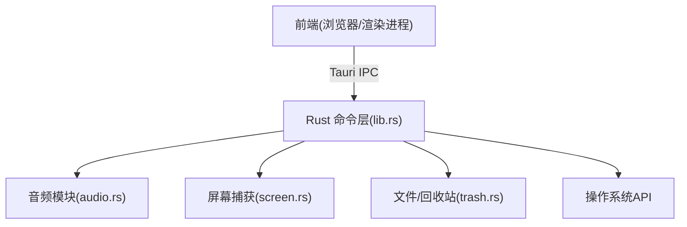
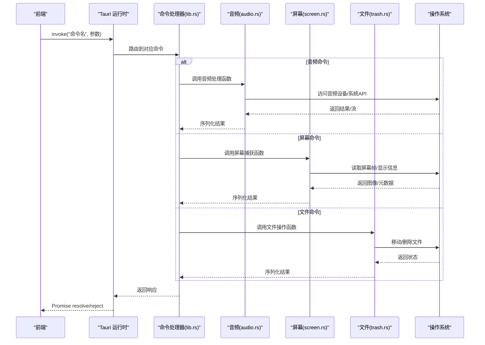
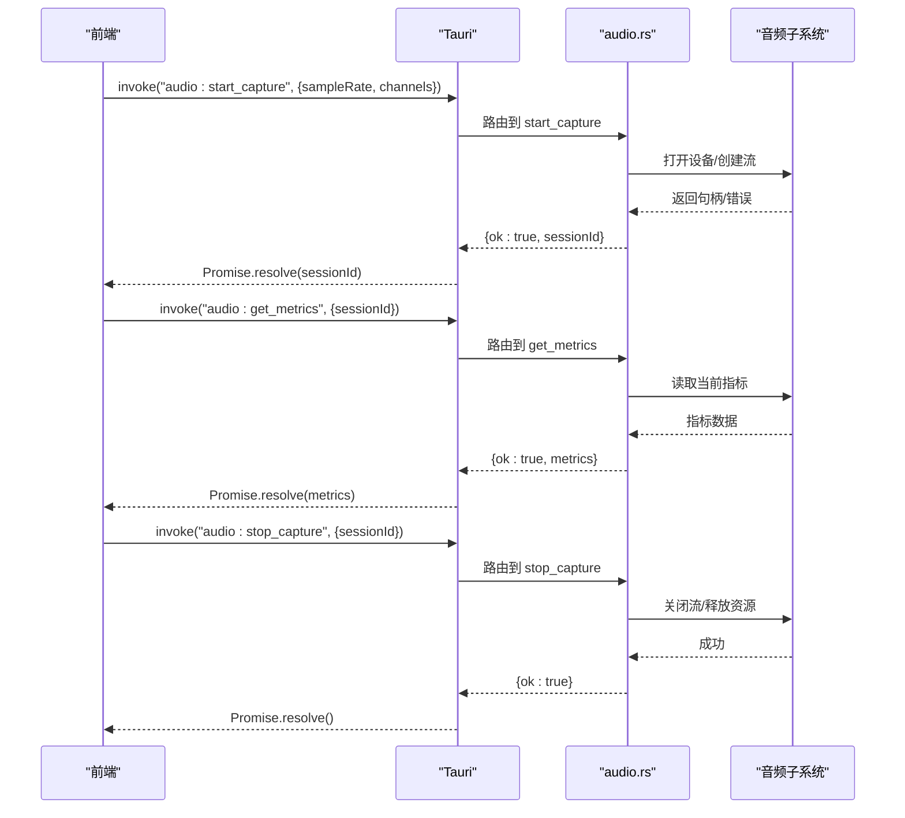
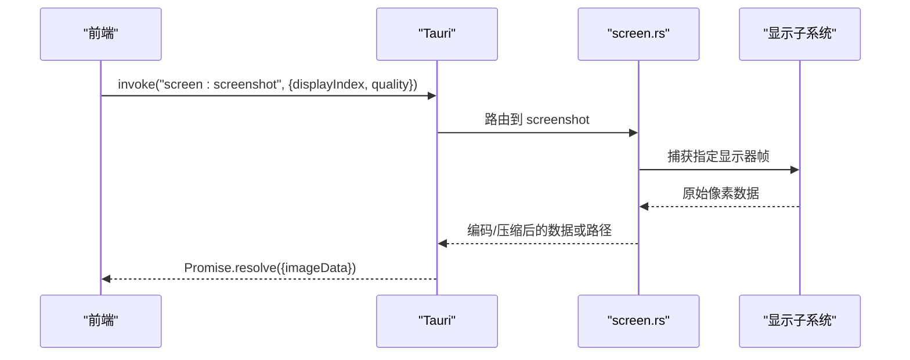
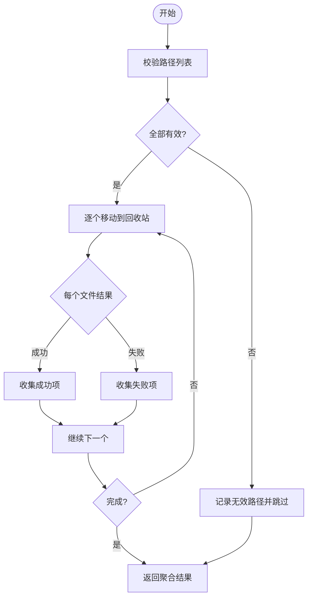
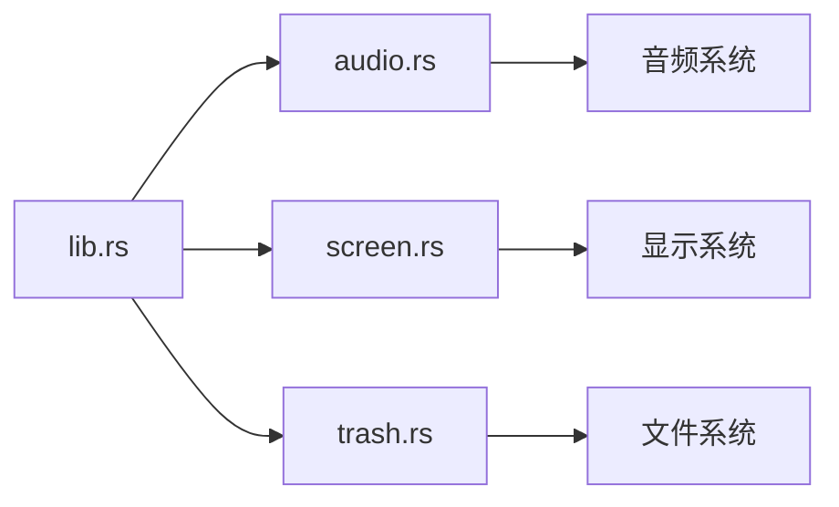

# 后端Rust API

<cite>
**本文引用的文件**
- [src-tauri/src/lib.rs](file://src-tauri/src/lib.rs)
- [src-tauri/src/main.rs](file://src-tauri/src/main.rs)
- [src-tauri/src/audio.rs](file://src-tauri/src/audio.rs)
- [src-tauri/src/screen.rs](file://src-tauri/src/screen.rs)
- [src-tauri/src/trash.rs](file://src-tauri/src/trash.rs)
- [src-tauri/Cargo.toml](file://src-tauri/Cargo.toml)
- [src-tauri/tauri.conf.json](file://src-tauri/tauri.conf.json)
- [src-tauri/capabilities/default.json](file://src-tauri/capabilities/default.json)
</cite>

## 目录
1. [简介](#简介)
2. [项目结构](#项目结构)
3. [核心组件](#核心组件)
4. [架构总览](#架构总览)
5. [详细组件分析](#详细组件分析)
6. [依赖分析](#依赖分析)
7. [性能考虑](#性能考虑)
8. [故障排查指南](#故障排查指南)
9. [结论](#结论)
10. [附录](#附录)

## 简介
本文件为项目的后端 Rust API 文档，聚焦于 Tauri 命令函数、系统级能力（音频处理、屏幕捕获、文件操作等）的接口说明、调用方式、错误处理模式、权限与安全配置，以及前后端通信的数据格式与协议规范。读者可据此在 TypeScript 前端中正确调用 Rust 侧能力，并理解其实现边界与注意事项。

## 项目结构
本项目采用 Tauri 框架组织前后端：
- 前端位于 src 目录，通过 Tauri 客户端调用 Rust 命令。
- 后端位于 src-tauri 目录，使用 Rust 暴露命令并提供系统能力。
- 关键后端文件包括：
  - lib.rs：Tauri 应用初始化与命令注册入口
  - main.rs：应用主入口
  - audio.rs：音频相关命令
  - screen.rs：屏幕捕获相关命令
  - trash.rs：回收站/文件删除相关命令
  - Cargo.toml：Rust 依赖声明
  - tauri.conf.json：Tauri 应用配置（窗口、插件、权限等）
  - capabilities/default.json：能力集定义（权限白名单）

图表来源
- [src-tauri/src/lib.rs:1-200](file://src-tauri/src/lib.rs#L1-L200)
- [src-tauri/src/audio.rs:1-200](file://src-tauri/src/audio.rs#L1-L200)
- [src-tauri/src/screen.rs:1-200](file://src-tauri/src/screen.rs#L1-L200)
- [src-tauri/src/trash.rs:1-200](file://src-tauri/src/trash.rs#L1-L200)

章节来源
- [src-tauri/src/lib.rs:1-200](file://src-tauri/src/lib.rs#L1-L200)
- [src-tauri/src/main.rs:1-200](file://src-tauri/src/main.rs#L1-L200)

## 核心组件
- Tauri 命令注册与路由：在 lib.rs 中集中注册所有命令，供前端通过 invoke 调用。
- 音频处理：audio.rs 提供音频采集/分析/播放等命令。
- 屏幕捕获：screen.rs 提供截屏、录制或获取显示信息命令。
- 文件操作：trash.rs 提供将文件移动到回收站或删除等命令。
- 配置与权限：tauri.conf.json 与 capabilities/default.json 控制能力与权限。

章节来源
- [src-tauri/src/lib.rs:1-200](file://src-tauri/src/lib.rs#L1-L200)
- [src-tauri/src/audio.rs:1-200](file://src-tauri/src/audio.rs#L1-L200)
- [src-tauri/src/screen.rs:1-200](file://src-tauri/src/screen.rs#L1-L200)
- [src-tauri/src/trash.rs:1-200](file://src-tauri/src/trash.rs#L1-L200)
- [src-tauri/tauri.conf.json:1-200](file://src-tauri/tauri.conf.json#L1-L200)
- [src-tauri/capabilities/default.json:1-200](file://src-tauri/capabilities/default.json#L1-L200)

## 架构总览
下图展示了从前端到 Rust 命令再到系统能力的调用链路与数据流向。

图表来源
- [src-tauri/src/lib.rs:1-200](file://src-tauri/src/lib.rs#L1-L200)
- [src-tauri/src/audio.rs:1-200](file://src-tauri/src/audio.rs#L1-L200)
- [src-tauri/src/screen.rs:1-200](file://src-tauri/src/screen.rs#L1-L200)
- [src-tauri/src/trash.rs:1-200](file://src-tauri/src/trash.rs#L1-L200)

## 详细组件分析

### 音频处理模块（audio.rs）
- 职责：封装音频采集、分析、播放等系统能力，并通过 Tauri 命令暴露给前端。
- 典型命令（示例命名，具体以代码为准）：
  - 开始采集/分析：接收采样率、通道数、时长等参数；返回会话ID或成功状态。
  - 停止采集/分析：接收会话ID；返回成功状态或错误码。
  - 获取音频指标：如音量、频谱等；返回结构化数据。
- 参数类型：通常包含数值型（采样率、阈值）、布尔型（是否实时）、字符串（设备标识）。
- 返回值：成功时返回 JSON 对象（如 { ok: true, data: ... }），失败时抛出错误。
- 错误处理：
  - 设备不可用：返回“设备未找到”类错误。
  - 权限不足：返回“权限拒绝”类错误。
  - 资源泄漏：确保停止后释放句柄/线程。
- 性能考虑：
  - 避免在前端高频轮询，建议事件驱动或批量上报。
  - 合理设置缓冲区大小与采样率，降低 CPU 占用。
- 安全与权限：
  - 需要麦克风/音频输入权限，需在 tauri.conf.json 或能力集中声明。
  - 仅最小化收集必要数据，避免持久化敏感音频内容。

章节来源
- [src-tauri/src/audio.rs:1-200](file://src-tauri/src/audio.rs#L1-L200)
- [src-tauri/tauri.conf.json:1-200](file://src-tauri/tauri.conf.json#L1-L200)
- [src-tauri/capabilities/default.json:1-200](file://src-tauri/capabilities/default.json#L1-L200)

#### 音频命令调用时序

图表来源
- [src-tauri/src/audio.rs:1-200](file://src-tauri/src/audio.rs#L1-L200)

### 屏幕捕获模块（screen.rs）
- 职责：提供截屏、获取显示器信息、可能的录制能力。
- 典型命令（示例命名，具体以代码为准）：
  - 截屏：可选指定显示器索引或全屏；返回图像数据（Base64/路径/内存缓冲）。
  - 获取显示列表：返回分辨率、DPI、名称等。
  - 开始/停止录制：返回会话ID与帧回调（若支持）。
- 参数类型：显示器索引、质量/压缩级别、输出格式等。
- 返回值：成功返回图像数据或元数据；失败返回错误。
- 错误处理：
  - 无可用显示器：返回“无显示器”错误。
  - 权限不足：返回“权限拒绝”。
  - 内存不足：返回“分配失败”或降级策略。
- 性能考虑：
  - 大图像传输建议使用路径或分块传输，避免阻塞前端。
  - 合理设置压缩与分辨率，平衡质量与带宽。
- 安全与权限：
  - 可能需要屏幕录制权限（取决于平台），需配置能力与权限。

章节来源
- [src-tauri/src/screen.rs:1-200](file://src-tauri/src/screen.rs#L1-L200)
- [src-tauri/tauri.conf.json:1-200](file://src-tauri/tauri.conf.json#L1-L200)
- [src-tauri/capabilities/default.json:1-200](file://src-tauri/capabilities/default.json#L1-L200)

#### 截屏流程时序

图表来源
- [src-tauri/src/screen.rs:1-200](file://src-tauri/src/screen.rs#L1-L200)

### 文件操作模块（trash.rs）
- 职责：将文件移动到系统回收站或执行删除等操作。
- 典型命令（示例命名，具体以代码为准）：
  - 移动到回收站：接收文件路径数组；返回成功/失败列表。
  - 清空回收站：可选按驱动器或全部；返回状态。
- 参数类型：路径、布尔标志（是否静默）、目标磁盘等。
- 返回值：批量操作的聚合结果（成功/失败明细）。
- 错误处理：
  - 路径不存在：返回“文件不存在”。
  - 权限不足：返回“权限拒绝”。
  - 跨盘移动限制：返回“不支持的操作”或回退策略。
- 安全与权限：
  - 谨慎处理用户路径，防止路径注入。
  - 对批量操作进行校验与限流。

章节来源
- [src-tauri/src/trash.rs:1-200](file://src-tauri/src/trash.rs#L1-L200)

#### 移动到回收站流程图

图表来源
- [src-tauri/src/trash.rs:1-200](file://src-tauri/src/trash.rs#L1-L200)

### 命令注册与路由（lib.rs）
- 职责：集中注册所有 Tauri 命令，建立前端命令名到 Rust 函数的映射。
- 关键点：
  - 命令命名规范：建议采用“模块:动作”形式，便于管理。
  - 参数解析：统一使用 Tauri 提供的参数绑定，保证类型安全。
  - 错误传播：将 Rust 错误转换为 Tauri 错误，前端可通过 Promise reject 捕获。
  - 并发与异步：对耗时操作使用异步任务，避免阻塞 UI。

章节来源
- [src-tauri/src/lib.rs:1-200](file://src-tauri/src/lib.rs#L1-L200)

### 应用入口（main.rs）
- 职责：启动 Tauri 应用，加载配置与插件。
- 关键点：
  - 窗口与菜单配置由 tauri.conf.json 管理。
  - 日志与调试开关可在构建期或运行期配置。

章节来源
- [src-tauri/src/main.rs:1-200](file://src-tauri/src/main.rs#L1-L200)

## 依赖分析
- 外部依赖：Cargo.toml 中声明的 crate 用于音频、屏幕、文件系统、Tauri 绑定等。
- 内部耦合：
  - lib.rs 作为命令注册中心，低耦合地组合各模块。
  - 各模块独立实现系统能力，通过命令接口暴露。
- 潜在风险：
  - 模块间共享状态需谨慎设计，避免竞态条件。
  - 外部库升级可能带来兼容性问题，需关注版本锁定。

图表来源
- [src-tauri/src/lib.rs:1-200](file://src-tauri/src/lib.rs#L1-L200)
- [src-tauri/src/audio.rs:1-200](file://src-tauri/src/audio.rs#L1-L200)
- [src-tauri/src/screen.rs:1-200](file://src-tauri/src/screen.rs#L1-L200)
- [src-tauri/src/trash.rs:1-200](file://src-tauri/src/trash.rs#L1-L200)

章节来源
- [src-tauri/Cargo.toml:1-200](file://src-tauri/Cargo.toml#L1-L200)
- [src-tauri/src/lib.rs:1-200](file://src-tauri/src/lib.rs#L1-L200)

## 性能考虑
- 音频：
  - 选择合适的采样率与缓冲区，减少延迟与抖动。
  - 使用事件驱动而非轮询，降低 CPU 占用。
- 屏幕：
  - 大图像传输优先使用路径或分块，避免内存峰值。
  - 按需裁剪与压缩，降低网络与存储压力。
- 文件：
  - 批量操作时加入重试与限流，避免系统负载过高。
  - 对异常路径快速失败，减少无效 IO。

## 故障排查指南
- 常见问题定位：
  - 权限不足：检查 tauri.conf.json 与 capabilities/default.json 中的权限声明。
  - 设备不可用：确认系统服务已启动且未被其他程序独占。
  - 路径错误：验证传入路径是否存在与可访问。
- 调试建议：
  - 启用 Tauri 日志，查看命令调用栈与错误信息。
  - 在前端捕获 Promise reject 的具体错误对象，定位问题模块。
- 恢复策略：
  - 对临时性错误（如设备忙）实施指数退避重试。
  - 对致命错误（如权限拒绝）提示用户重新授权。

章节来源
- [src-tauri/tauri.conf.json:1-200](file://src-tauri/tauri.conf.json#L1-L200)
- [src-tauri/capabilities/default.json:1-200](file://src-tauri/capabilities/default.json#L1-L200)

## 结论
本后端通过 Tauri 命令将音频、屏幕、文件等系统能力安全、稳定地暴露给前端。建议在开发中遵循统一的命令命名、错误处理与权限配置规范，结合事件驱动与异步模型优化性能，并在生产环境严格管控权限与数据流转。

## 附录

### 前后端通信协议与数据格式
- 协议：Tauri IPC（invoke 调用 + Promise 响应）
- 请求格式：
  - 命令名：字符串，如 “audio:start_capture”
  - 参数：JSON 对象，字段根据命令定义
- 响应格式：
  - 成功：{ ok: true, data: ... }
  - 失败：{ ok: false, error: "错误描述" }
- 错误传播：
  - Rust 侧抛出的错误会转为 Tauri 错误，前端通过 Promise reject 捕获。

### 权限配置与安全要点
- 权限声明：
  - 在 capabilities/default.json 中声明所需能力（如音频、屏幕、文件）。
  - 在 tauri.conf.json 中开启相应插件或能力。
- 安全建议：
  - 最小权限原则：仅申请必要的系统能力。
  - 输入校验：对所有用户输入进行合法性校验，防止路径注入与越权。
  - 数据保护：避免持久化敏感数据，必要时加密或匿名化。

### 调用示例（概念性）
- 音频：
  - 开始采集：invoke("audio:start_capture", { sampleRate: 44100, channels: 2 })
  - 获取指标：invoke("audio:get_metrics", { sessionId: "..." })
  - 停止采集：invoke("audio:stop_capture", { sessionId: "..." })
- 屏幕：
  - 截屏：invoke("screen:screenshot", { displayIndex: 0, quality: 0.8 })
  - 获取显示列表：invoke("screen:list_displays")
- 文件：
  - 移动到回收站：invoke("trash:move_to_trash", { paths: ["..."] })

注意：以上命令名为概念示例，实际命令名与参数请以 src-tauri/src 下各模块的实现为准。