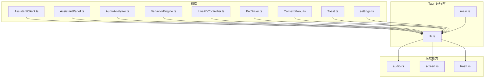
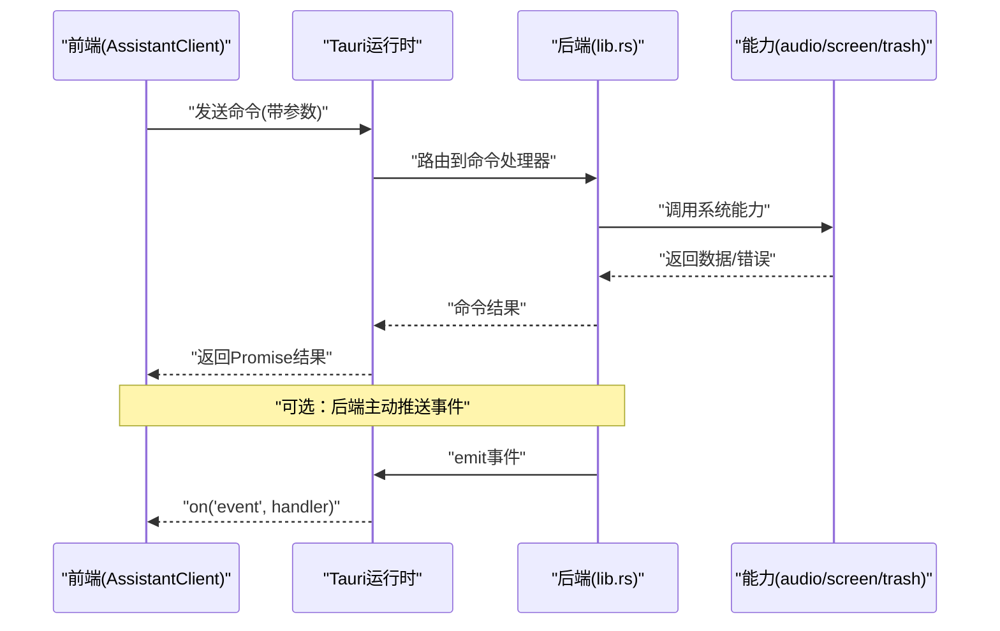
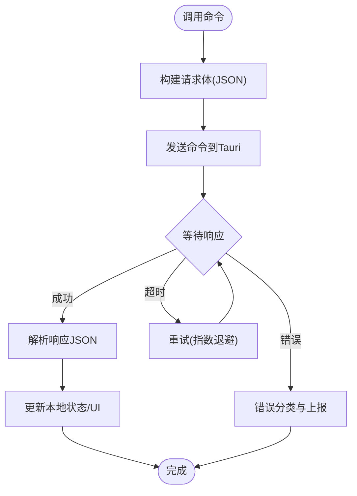
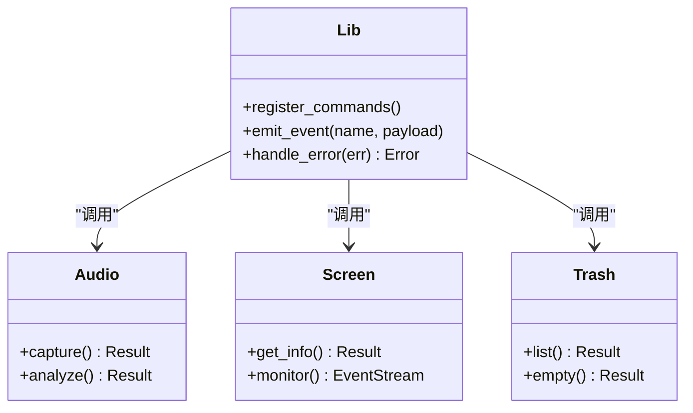
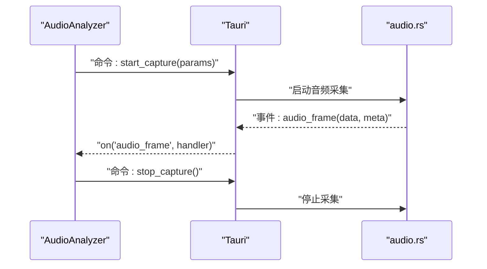
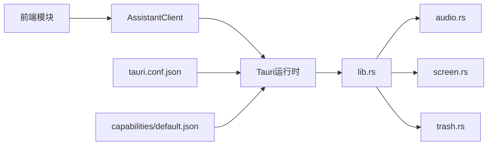

# 通信协议

<cite>
**本文引用的文件**
- [src/main.ts](file://src/main.ts)
- [src/assistant/AssistantClient.ts](file://src/assistant/AssistantClient.ts)
- [src/assistant/AssistantPanel.ts](file://src/assistant/AssistantPanel.ts)
- [src/audio/AudioAnalyzer.ts](file://src/audio/AudioAnalyzer.ts)
- [src/autonomous/BehaviorEngine.ts](file://src/autonomous/BehaviorEngine.ts)
- [src/live2d/Live2DController.ts](file://src/live2d/Live2DController.ts)
- [src/live2d/PetDriver.ts](file://src/live2d/PetDriver.ts)
- [src/ui/ContextMenu.ts](file://src/ui/ContextMenu.ts)
- [src/ui/Toast.ts](file://src/ui/Toast.ts)
- [src/utils/settings.ts](file://src/utils/settings.ts)
- [src-tauri/src/lib.rs](file://src-tauri/src/lib.rs)
- [src-tauri/src/main.rs](file://src-tauri/src/main.rs)
- [src-tauri/src/audio.rs](file://src-tauri/src/audio.rs)
- [src-tauri/src/screen.rs](file://src-tauri/src/screen.rs)
- [src-tauri/src/trash.rs](file://src-tauri/src/trash.rs)
- [src-tauri/tauri.conf.json](file://src-tauri/tauri.conf.json)
- [src-tauri/capabilities/default.json](file://src-tauri/capabilities/default.json)
</cite>

## 目录
1. [简介](#简介)
2. [项目结构](#项目结构)
3. [核心组件](#核心组件)
4. [架构总览](#架构总览)
5. [详细组件分析](#详细组件分析)
6. [依赖分析](#依赖分析)
7. [性能考虑](#性能考虑)
8. [故障排查指南](#故障排查指南)
9. [结论](#结论)
10. [附录](#附录)

## 简介
本文件面向前后端通信协议，聚焦于基于 Tauri 的桌面应用（前端 TypeScript + 后端 Rust）之间的 IPC 消息格式、序列化与反序列化规则、异步调用、事件监听与状态同步机制。文档还涵盖消息类型定义、请求-响应模式、错误传播、连接管理、超时与重试策略、安全认证与权限验证，并提供完整的通信流程图与实际消息示例路径，帮助开发者快速理解并正确使用该通信体系。

## 项目结构
本项目采用典型的前后端分离架构：
- 前端位于 src 目录，使用 TypeScript，负责 UI、交互逻辑、本地状态与 Tauri 命令/事件的调用。
- 后端位于 src-tauri 目录，使用 Rust，通过 Tauri 暴露系统能力（如音频、屏幕、回收站等），并处理业务逻辑。
- 配置集中在 tauri.conf.json 与 capabilities/default.json，用于声明窗口、权限与能力集。

图表来源
- [src/assistant/AssistantClient.ts:1-200](file://src/assistant/AssistantClient.ts#L1-L200)
- [src-tauri/src/lib.rs:1-200](file://src-tauri/src/lib.rs#L1-L200)
- [src-tauri/src/audio.rs:1-200](file://src-tauri/src/audio.rs#L1-L200)
- [src-tauri/src/screen.rs:1-200](file://src-tauri/src/screen.rs#L1-L200)
- [src-tauri/src/trash.rs:1-200](file://src-tauri/src/trash.rs#L1-L200)

章节来源
- [src/main.ts:1-200](file://src/main.ts#L1-L200)
- [src-tauri/src/main.rs:1-200](file://src-tauri/src/main.rs#L1-L200)
- [src-tauri/tauri.conf.json:1-200](file://src-tauri/tauri.conf.json#L1-L200)
- [src-tauri/capabilities/default.json:1-200](file://src-tauri/capabilities/default.json#L1-L200)

## 核心组件
- AssistantClient：封装与后端的 IPC 调用，提供统一的命令发送、事件订阅、重试与超时控制。
- AssistantPanel：UI 面板控制器，触发用户操作并展示结果。
- AudioAnalyzer：音频采集与分析，通过 Tauri 命令与后端音频模块交互。
- BehaviorEngine：行为引擎，驱动宠物行为，可能订阅后端事件或定时任务。
- Live2DController / PetDriver：Live2D 渲染与驱动，通过 IPC 获取状态或下发指令。
- ContextMenu / Toast：UI 辅助组件，触发轻量级 IPC 或本地状态更新。
- settings：设置读写，通常通过 Tauri 持久化 API 或后端存储。
- 后端 lib.rs：注册所有 Tauri 命令与事件，桥接系统能力。
- 后端 audio.rs / screen.rs / trash.rs：具体系统能力实现。

章节来源
- [src/assistant/AssistantClient.ts:1-200](file://src/assistant/AssistantClient.ts#L1-L200)
- [src/assistant/AssistantPanel.ts:1-200](file://src/assistant/AssistantPanel.ts#L1-L200)
- [src/audio/AudioAnalyzer.ts:1-200](file://src/audio/AudioAnalyzer.ts#L1-L200)
- [src/autonomous/BehaviorEngine.ts:1-200](file://src/autonomous/BehaviorEngine.ts#L1-L200)
- [src/live2d/Live2DController.ts:1-200](file://src/live2d/Live2DController.ts#L1-L200)
- [src/live2d/PetDriver.ts:1-200](file://src/live2d/PetDriver.ts#L1-L200)
- [src/ui/ContextMenu.ts:1-200](file://src/ui/ContextMenu.ts#L1-L200)
- [src/ui/Toast.ts:1-200](file://src/ui/Toast.ts#L1-L200)
- [src/utils/settings.ts:1-200](file://src/utils/settings.ts#L1-L200)
- [src-tauri/src/lib.rs:1-200](file://src-tauri/src/lib.rs#L1-L200)
- [src-tauri/src/audio.rs:1-200](file://src-tauri/src/audio.rs#L1-L200)
- [src-tauri/src/screen.rs:1-200](file://src-tauri/src/screen.rs#L1-L200)
- [src-tauri/src/trash.rs:1-200](file://src-tauri/src/trash.rs#L1-L200)

## 架构总览
Tauri 作为桥梁，将前端的命令调用映射到后端 Rust 函数，并通过事件通道进行双向通信。整体流程如下：
- 前端通过 AssistantClient 发起命令调用（如音频采集、屏幕信息、回收站操作）。
- Tauri 路由到后端对应命令处理器（在 lib.rs 中注册）。
- 后端执行系统能力（audio.rs、screen.rs、trash.rs），返回结果或推送事件。
- 前端接收事件并更新 UI 或驱动行为。

图表来源
- [src/assistant/AssistantClient.ts:1-200](file://src/assistant/AssistantClient.ts#L1-L200)
- [src-tauri/src/lib.rs:1-200](file://src-tauri/src/lib.rs#L1-L200)
- [src-tauri/src/audio.rs:1-200](file://src-tauri/src/audio.rs#L1-L200)
- [src-tauri/src/screen.rs:1-200](file://src-tauri/src/screen.rs#L1-L200)
- [src-tauri/src/trash.rs:1-200](file://src-tauri/src/trash.rs#L1-L200)

## 详细组件分析

### 前端 IPC 客户端（AssistantClient）
- 职责：封装 Tauri 命令调用、事件订阅、重试与超时控制；统一错误处理与日志。
- 关键能力：
  - 命令调用：以 JSON 序列化的方式传递参数，解析返回值。
  - 事件监听：订阅后端事件，按主题分发到相应处理器。
  - 重试策略：对网络或系统不稳定导致的失败进行指数退避重试。
  - 超时控制：为长耗时命令设置超时，避免阻塞 UI。
  - 状态同步：维护本地缓存的状态，减少重复请求。

图表来源
- [src/assistant/AssistantClient.ts:1-200](file://src/assistant/AssistantClient.ts#L1-L200)

章节来源
- [src/assistant/AssistantClient.ts:1-200](file://src/assistant/AssistantClient.ts#L1-L200)

### 后端命令与事件（lib.rs）
- 职责：注册所有 Tauri 命令与事件，协调各能力模块，统一错误码与日志。
- 关键能力：
  - 命令注册：将前端命令映射到 Rust 函数。
  - 事件发布：向特定窗口或全局发布事件。
  - 错误处理：将 Rust 错误转换为前端可识别的错误对象。
  - 权限校验：根据 capabilities 限制命令访问。

图表来源
- [src-tauri/src/lib.rs:1-200](file://src-tauri/src/lib.rs#L1-L200)
- [src-tauri/src/audio.rs:1-200](file://src-tauri/src/audio.rs#L1-L200)
- [src-tauri/src/screen.rs:1-200](file://src-tauri/src/screen.rs#L1-L200)
- [src-tauri/src/trash.rs:1-200](file://src-tauri/src/trash.rs#L1-L200)

章节来源
- [src-tauri/src/lib.rs:1-200](file://src-tauri/src/lib.rs#L1-L200)

### 音频模块（AudioAnalyzer + audio.rs）
- 前端 AudioAnalyzer：采集麦克风输入，计算音量/频谱，周期性上报。
- 后端 audio.rs：实现音频捕获与分析，返回结构化数据或流式事件。
- 通信要点：
  - 命令：开始/停止采集、单次分析。
  - 事件：音频帧、频谱数据、异常告警。
  - 序列化：二进制或 Base64 编码的音频片段，元数据包含采样率、时长等。

图表来源
- [src/audio/AudioAnalyzer.ts:1-200](file://src/audio/AudioAnalyzer.ts#L1-L200)
- [src-tauri/src/audio.rs:1-200](file://src-tauri/src/audio.rs#L1-L200)

章节来源
- [src/audio/AudioAnalyzer.ts:1-200](file://src/audio/AudioAnalyzer.ts#L1-L200)
- [src-tauri/src/audio.rs:1-200](file://src-tauri/src/audio.rs#L1-L200)

### 屏幕模块（screen.rs）
- 功能：获取屏幕分辨率、多显示器信息、实时变化事件。
- 通信要点：
  - 命令：查询当前屏幕信息。
  - 事件：屏幕尺寸变化、显示设备插拔。
  - 序列化：JSON 描述屏幕布局与属性。

章节来源
- [src-tauri/src/screen.rs:1-200](file://src-tauri/src/screen.rs#L1-L200)

### 回收站模块（trash.rs）
- 功能：列出回收站内容、清空回收站。
- 通信要点：
  - 命令：list、empty。
  - 错误：权限不足、系统不支持时的错误码。
  - 序列化：列表项包含名称、大小、删除时间等。

章节来源
- [src-tauri/src/trash.rs:1-200](file://src-tauri/src/trash.rs#L1-L200)

### 行为引擎与 Live2D（BehaviorEngine + Live2DController + PetDriver）
- 行为引擎：根据用户交互或定时器驱动宠物行为，可能订阅后端事件。
- Live2D 控制器：渲染与动画控制，通过 IPC 获取状态或下发动作。
- 通信要点：
  - 命令：播放动作、切换模型、读取状态。
  - 事件：动作完成、状态变更。
  - 序列化：动作参数、模型标识、时间戳。

章节来源
- [src/autonomous/BehaviorEngine.ts:1-200](file://src/autonomous/BehaviorEngine.ts#L1-L200)
- [src/live2d/Live2DController.ts:1-200](file://src/live2d/Live2DController.ts#L1-L200)
- [src/live2d/PetDriver.ts:1-200](file://src/live2d/PetDriver.ts#L1-L200)

### UI 组件（ContextMenu + Toast）
- 上下文菜单：触发轻量级命令（如打开设置、刷新状态）。
- Toast：提示消息，可能通过后端持久化或本地状态。
- 通信要点：
  - 命令：show、hide、update。
  - 事件：点击回调、自动消失。

章节来源
- [src/ui/ContextMenu.ts:1-200](file://src/ui/ContextMenu.ts#L1-L200)
- [src/ui/Toast.ts:1-200](file://src/ui/Toast.ts#L1-L200)

### 设置模块（settings.ts）
- 功能：读取/写入用户设置，可能通过 Tauri 持久化 API 或后端存储。
- 通信要点：
  - 命令：get、set、reset。
  - 事件：设置变更通知。

章节来源
- [src/utils/settings.ts:1-200](file://src/utils/settings.ts#L1-L200)

## 依赖分析
- 前端依赖：
  - AssistantClient 依赖 Tauri 运行时提供的命令与事件接口。
  - 各模块（Audio、Screen、Trash、Live2D）通过 AssistantClient 间接依赖后端能力。
- 后端依赖：
  - lib.rs 依赖 audio.rs、screen.rs、trash.rs 的具体实现。
  - main.rs 初始化 Tauri 应用并加载配置。
- 配置依赖：
  - tauri.conf.json 定义窗口、插件、权限等。
  - capabilities/default.json 定义能力集合与访问策略。

图表来源
- [src/assistant/AssistantClient.ts:1-200](file://src/assistant/AssistantClient.ts#L1-L200)
- [src-tauri/src/lib.rs:1-200](file://src-tauri/src/lib.rs#L1-L200)
- [src-tauri/tauri.conf.json:1-200](file://src-tauri/tauri.conf.json#L1-L200)
- [src-tauri/capabilities/default.json:1-200](file://src-tauri/capabilities/default.json#L1-L200)

章节来源
- [src/assistant/AssistantClient.ts:1-200](file://src/assistant/AssistantClient.ts#L1-L200)
- [src-tauri/src/lib.rs:1-200](file://src-tauri/src/lib.rs#L1-L200)
- [src-tauri/tauri.conf.json:1-200](file://src-tauri/tauri.conf.json#L1-L200)
- [src-tauri/capabilities/default.json:1-200](file://src-tauri/capabilities/default.json#L1-L200)

## 性能考虑
- 批量与节流：对高频事件（如音频帧）进行节流或批量发送，降低 IPC 开销。
- 超时与重试：为长耗时命令设置合理超时，结合指数退避重试提升稳定性。
- 状态缓存：前端缓存常用状态，减少重复请求。
- 资源释放：及时停止音频采集、关闭监听器，避免内存泄漏。
- 序列化优化：大对象使用分块传输或压缩，避免阻塞主线程。

[本节为通用指导，不直接分析具体文件]

## 故障排查指南
- 常见问题：
  - 命令未注册：检查 lib.rs 是否注册了对应命令。
  - 权限不足：确认 capabilities/default.json 是否允许相关能力。
  - 事件未触发：检查前端是否正确订阅事件，后端是否 emit。
  - 超时失败：调整超时时间与重试策略。
  - 序列化错误：确保前后端数据结构一致。
- 调试建议：
  - 启用详细日志，记录命令参数与返回结果。
  - 使用浏览器控制台或 Tauri 日志查看错误堆栈。
  - 逐步缩小问题范围，定位是前端还是后端问题。

章节来源
- [src-tauri/src/lib.rs:1-200](file://src-tauri/src/lib.rs#L1-L200)
- [src-tauri/capabilities/default.json:1-200](file://src-tauri/capabilities/default.json#L1-L200)
- [src/assistant/AssistantClient.ts:1-200](file://src/assistant/AssistantClient.ts#L1-L200)

## 结论
本通信协议基于 Tauri 的命令与事件机制，实现了前后端解耦与可扩展的系统能力集成。通过统一的 IPC 客户端、清晰的错误处理与重试策略、以及合理的序列化规范，确保了稳定高效的桌面应用通信。建议在生产环境中完善权限控制、日志审计与监控指标，进一步提升安全性与可维护性。

[本节为总结，不直接分析具体文件]

## 附录

### 消息类型定义
- 命令请求：
  - 字段：command（字符串）、params（对象）、id（唯一标识）
  - 示例路径：[src/assistant/AssistantClient.ts:1-200](file://src/assistant/AssistantClient.ts#L1-L200)
- 命令响应：
  - 字段：id、result（对象）、error（对象，可选）
  - 示例路径：[src/assistant/AssistantClient.ts:1-200](file://src/assistant/AssistantClient.ts#L1-L200)
- 事件：
  - 字段：name（字符串）、payload（对象）
  - 示例路径：[src-tauri/src/lib.rs:1-200](file://src-tauri/src/lib.rs#L1-L200)

### 请求-响应模式
- 同步命令：前端调用命令，等待 Promise 结果。
- 异步事件：后端主动推送事件，前端订阅处理。
- 流式数据：音频帧等高频数据通过事件流传输。

章节来源
- [src/assistant/AssistantClient.ts:1-200](file://src/assistant/AssistantClient.ts#L1-L200)
- [src-tauri/src/lib.rs:1-200](file://src-tauri/src/lib.rs#L1-L200)

### 错误传播机制
- 错误分类：网络错误、系统错误、权限错误、参数错误。
- 错误对象：包含 code、message、details。
- 重试策略：针对临时错误进行指数退避重试。

章节来源
- [src/assistant/AssistantClient.ts:1-200](file://src/assistant/AssistantClient.ts#L1-L200)
- [src-tauri/src/lib.rs:1-200](file://src-tauri/src/lib.rs#L1-L200)

### 连接管理、超时与重试
- 连接管理：单例客户端，复用连接，避免重复创建。
- 超时处理：为每个命令设置默认超时，支持覆盖。
- 重试策略：指数退避，最大重试次数，失败回退。

章节来源
- [src/assistant/AssistantClient.ts:1-200](file://src/assistant/AssistantClient.ts#L1-L200)

### 安全认证与权限验证
- 权限模型：基于 capabilities 的能力集合，限制命令访问。
- 认证机制：可在命令层增加 token 校验或会话管理。
- 最小权限原则：仅授予必要能力，降低安全风险。

章节来源
- [src-tauri/capabilities/default.json:1-200](file://src-tauri/capabilities/default.json#L1-L200)
- [src-tauri/tauri.conf.json:1-200](file://src-tauri/tauri.conf.json#L1-L200)

### 实际消息示例路径
- 音频采集命令与事件：
  - 前端调用示例路径：[src/audio/AudioAnalyzer.ts:1-200](file://src/audio/AudioAnalyzer.ts#L1-L200)
  - 后端实现路径：[src-tauri/src/audio.rs:1-200](file://src-tauri/src/audio.rs#L1-L200)
- 屏幕信息查询：
  - 后端实现路径：[src-tauri/src/screen.rs:1-200](file://src-tauri/src/screen.rs#L1-L200)
- 回收站操作：
  - 后端实现路径：[src-tauri/src/trash.rs:1-200](file://src-tauri/src/trash.rs#L1-L200)