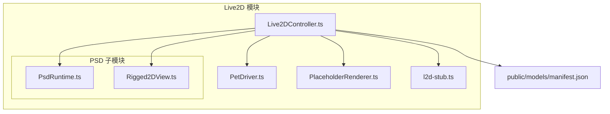
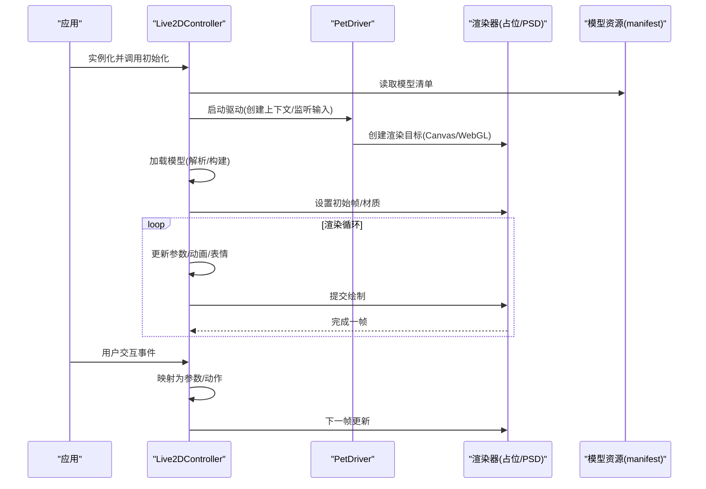
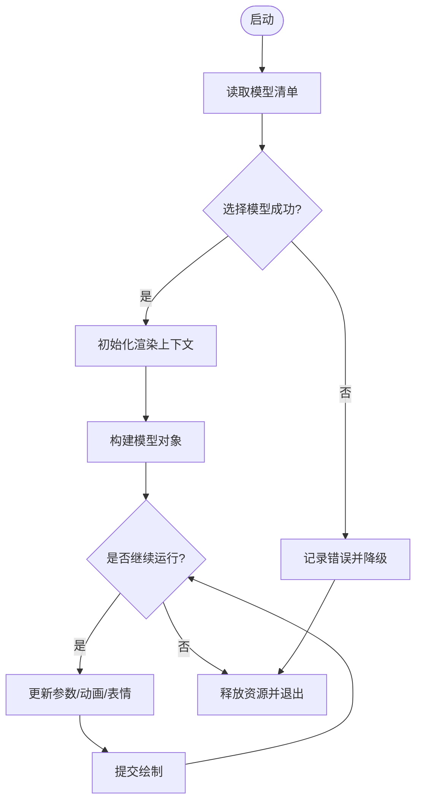
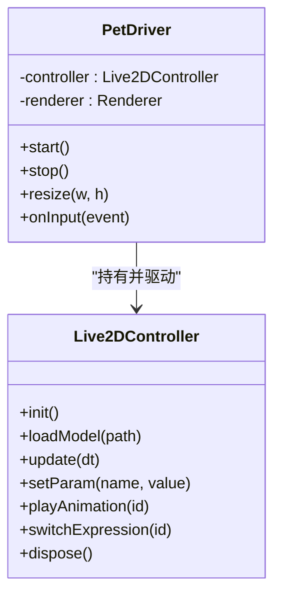
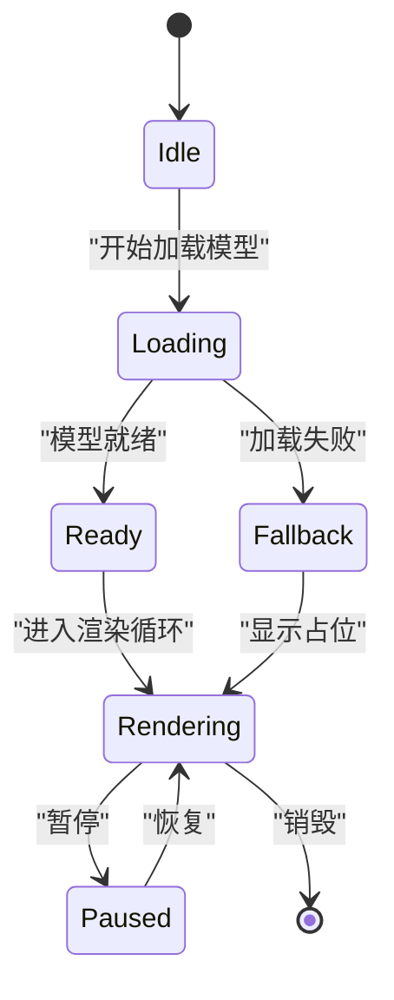
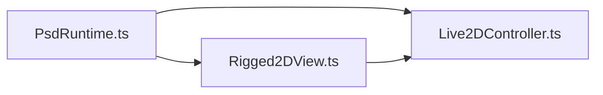
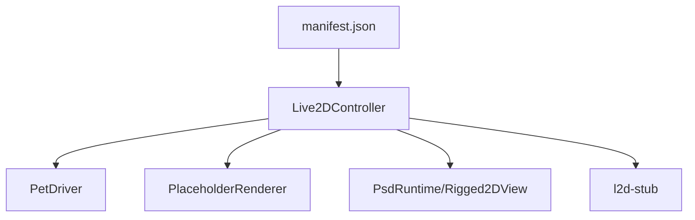

# Live2D控制器

<cite>
**本文引用的文件**
- [Live2DController.ts](file://src/live2d/Live2DController.ts)
- [PetDriver.ts](file://src/live2d/PetDriver.ts)
- [PlaceholderRenderer.ts](file://src/live2d/PlaceholderRenderer.ts)
- [l2d-stub.ts](file://src/live2d/l2d-stub.ts)
- [PsdRuntime.ts](file://src/live2d/psd/PsdRuntime.ts)
- [Rigged2DView.ts](file://src/live2d/psd/Rigged2DView.ts)
- [manifest.json](file://public/models/manifest.json)
</cite>

## 目录
1. [简介](#简介)
2. [项目结构](#项目结构)
3. [核心组件](#核心组件)
4. [架构总览](#架构总览)
5. [详细组件分析](#详细组件分析)
6. [依赖关系分析](#依赖关系分析)
7. [性能考虑](#性能考虑)
8. [故障排查指南](#故障排查指南)
9. [结论](#结论)
10. [附录](#附录)

## 简介
本文件围绕 Live2D 控制器的实现与使用，系统性说明模型加载、初始化、渲染循环管理、生命周期控制、参数调整、动画状态与表情切换、Canvas/WebGL 集成方式、性能优化与内存管理，并提供实例化、加载模型、触发动画和处理交互事件的实践指引。同时涵盖错误处理机制与调试技巧，帮助开发者快速上手并稳定集成到桌面端或 Web 场景中。

## 项目结构
本项目将 Live2D 相关能力集中在 src/live2d 目录下，包含控制器、驱动、占位渲染器、PSD 运行时与视图等模块；模型清单位于 public/models/manifest.json，供运行时发现可用模型。

图表来源
- [Live2DController.ts](file://src/live2d/Live2DController.ts)
- [PetDriver.ts](file://src/live2d/PetDriver.ts)
- [PlaceholderRenderer.ts](file://src/live2d/PlaceholderRenderer.ts)
- [l2d-stub.ts](file://src/live2d/l2d-stub.ts)
- [PsdRuntime.ts](file://src/live2d/psd/PsdRuntime.ts)
- [Rigged2DView.ts](file://src/live2d/psd/Rigged2DView.ts)
- [manifest.json](file://public/models/manifest.json)

章节来源
- [Live2DController.ts](file://src/live2d/Live2DController.ts)
- [PetDriver.ts](file://src/live2d/PetDriver.ts)
- [PlaceholderRenderer.ts](file://src/live2d/PlaceholderRenderer.ts)
- [l2d-stub.ts](file://src/live2d/l2d-stub.ts)
- [PsdRuntime.ts](file://src/live2d/psd/PsdRuntime.ts)
- [Rigged2DView.ts](file://src/live2d/psd/Rigged2DView.ts)
- [manifest.json](file://public/models/manifest.json)

## 核心组件
- Live2DController：对外暴露的控制器，负责模型加载、初始化、渲染循环、参数更新、动画与表情切换、事件绑定与生命周期管理。
- PetDriver：驱动层，协调控制器与底层渲染/输入/音频等子系统，提供统一的运行入口。
- PlaceholderRenderer：占位渲染器，在模型未就绪时提供可视化占位（如静态图或简单动画），保证 UI 连续性。
- l2d-stub：运行时桩模块，用于在不同环境（如缺少原生库）下提供兼容接口，避免崩溃。
- PsdRuntime / Rigged2DView：PSD 相关的运行时与视图封装，支持特定资源格式或骨骼驱动的渲染路径。
- manifest.json：模型清单，声明可用模型及其元数据，供控制器动态发现与加载。

章节来源
- [Live2DController.ts](file://src/live2d/Live2DController.ts)
- [PetDriver.ts](file://src/live2d/PetDriver.ts)
- [PlaceholderRenderer.ts](file://src/live2d/PlaceholderRenderer.ts)
- [l2d-stub.ts](file://src/live2d/l2d-stub.ts)
- [PsdRuntime.ts](file://src/live2d/psd/PsdRuntime.ts)
- [Rigged2DView.ts](file://src/live2d/psd/Rigged2DView.ts)
- [manifest.json](file://public/models/manifest.json)

## 架构总览
整体采用“控制器 + 驱动 + 渲染”的分层设计：
- 控制器负责业务编排（加载、参数、动画、事件）。
- 驱动负责与平台/渲染后端对接（Canvas/WebGL、输入、音频）。
- 渲染器负责绘制（含占位渲染与 PSD 渲染分支）。
- 模型清单作为配置中心，驱动按需加载。

图表来源
- [Live2DController.ts](file://src/live2d/Live2DController.ts)
- [PetDriver.ts](file://src/live2d/PetDriver.ts)
- [PlaceholderRenderer.ts](file://src/live2d/PlaceholderRenderer.ts)
- [PsdRuntime.ts](file://src/live2d/psd/PsdRuntime.ts)
- [Rigged2DView.ts](file://src/live2d/psd/Rigged2DView.ts)
- [manifest.json](file://public/models/manifest.json)

## 详细组件分析

### Live2DController 类
职责
- 模型加载：从清单中定位模型，解析并构建内部表示。
- 初始化：创建渲染上下文、绑定输入事件、准备默认参数与动画。
- 渲染循环：驱动每帧更新（参数插值、动画混合、表情切换）并提交绘制。
- 生命周期：启动、暂停、恢复、销毁，确保资源释放与状态一致。
- 参数与动画：提供 API 设置面部/肢体参数、切换表情、播放/停止动画。
- 事件处理：将鼠标/键盘/触摸等输入映射为模型行为。

关键流程
- 启动：读取清单 -> 选择模型 -> 初始化渲染 -> 进入渲染循环。
- 更新：计算时间增量 -> 更新动画状态机 -> 应用参数 -> 提交绘制。
- 交互：捕获事件 -> 转换为参数变化或动作触发 -> 下一帧生效。
- 销毁：停止循环 -> 释放纹理/缓冲 -> 解绑事件。

图表来源
- [Live2DController.ts](file://src/live2d/Live2DController.ts)
- [manifest.json](file://public/models/manifest.json)

章节来源
- [Live2DController.ts](file://src/live2d/Live2DController.ts)

### PetDriver 驱动
职责
- 统一入口：创建并持有控制器实例，管理其生命周期。
- 平台适配：封装 Canvas/WebGL 上下文创建、尺寸变化、焦点/失焦处理。
- 输入桥接：将输入事件转发给控制器进行参数/动作映射。
- 音频/其他子系统：可选集成（如口型同步、音效触发）。

图表来源
- [PetDriver.ts](file://src/live2d/PetDriver.ts)
- [Live2DController.ts](file://src/live2d/Live2DController.ts)

章节来源
- [PetDriver.ts](file://src/live2d/PetDriver.ts)
- [Live2DController.ts](file://src/live2d/Live2DController.ts)

### PlaceholderRenderer 占位渲染器
职责
- 在模型未就绪或加载失败时显示占位内容，保持界面连续。
- 支持简单动画（如呼吸/闪烁）以提升体验。
- 与主渲染器无缝切换，避免抖动。

图表来源
- [PlaceholderRenderer.ts](file://src/live2d/PlaceholderRenderer.ts)
- [Live2DController.ts](file://src/live2d/Live2DController.ts)

章节来源
- [PlaceholderRenderer.ts](file://src/live2d/PlaceholderRenderer.ts)
- [Live2DController.ts](file://src/live2d/Live2DController.ts)

### l2d-stub 桩模块
职责
- 在缺少原生依赖或受限环境中提供空实现，避免崩溃。
- 暴露与真实实现一致的接口，便于上层代码无感切换。

章节来源
- [l2d-stub.ts](file://src/live2d/l2d-stub.ts)

### PSD 运行时与视图
职责
- PsdRuntime：解析/加载 PSD 资源，构建可渲染的数据结构。
- Rigged2DView：基于 PSD 数据的 2D 视图渲染，可能包含骨骼/蒙皮信息。

图表来源
- [PsdRuntime.ts](file://src/live2d/psd/PsdRuntime.ts)
- [Rigged2DView.ts](file://src/live2d/psd/Rigged2DView.ts)
- [Live2DController.ts](file://src/live2d/Live2DController.ts)

章节来源
- [PsdRuntime.ts](file://src/live2d/psd/PsdRuntime.ts)
- [Rigged2DView.ts](file://src/live2d/psd/Rigged2DView.ts)
- [Live2DController.ts](file://src/live2d/Live2DController.ts)

## 依赖关系分析
- Live2DController 依赖：
  - 模型清单 manifest.json 以发现可用模型。
  - 渲染器（PlaceholderRenderer 或 PSD 渲染路径）。
  - 驱动 PetDriver 提供的上下文与输入。
  - 桩模块 l2d-stub 以保障兼容性。
- PetDriver 依赖：
  - 控制器实例，负责生命周期调度。
  - 渲染目标（Canvas/WebGL）抽象。
- 渲染器之间通过统一接口协作，可在运行时切换。

图表来源
- [manifest.json](file://public/models/manifest.json)
- [Live2DController.ts](file://src/live2d/Live2DController.ts)
- [PetDriver.ts](file://src/live2d/PetDriver.ts)
- [PlaceholderRenderer.ts](file://src/live2d/PlaceholderRenderer.ts)
- [PsdRuntime.ts](file://src/live2d/psd/PsdRuntime.ts)
- [Rigged2DView.ts](file://src/live2d/psd/Rigged2DView.ts)
- [l2d-stub.ts](file://src/live2d/l2d-stub.ts)

章节来源
- [Live2DController.ts](file://src/live2d/Live2DController.ts)
- [PetDriver.ts](file://src/live2d/PetDriver.ts)
- [PlaceholderRenderer.ts](file://src/live2d/PlaceholderRenderer.ts)
- [PsdRuntime.ts](file://src/live2d/psd/PsdRuntime.ts)
- [Rigged2DView.ts](file://src/live2d/psd/Rigged2DView.ts)
- [l2d-stub.ts](file://src/live2d/l2d-stub.ts)
- [manifest.json](file://public/models/manifest.json)

## 性能考虑
- 渲染循环
  - 使用固定步长或自适应步长减少抖动；合并多次参数更新再提交绘制。
  - 仅在必要时重绘（如参数变化或动画关键帧）。
- 资源管理
  - 模型与纹理按需加载，及时释放不再使用的资源。
  - 使用纹理图集减少批次绘制次数。
- 参数与动画
  - 批量更新参数，避免每帧多次设置。
  - 合理设置动画淡入淡出时长，降低频繁切换带来的开销。
- 占位渲染
  - 在模型加载期间使用轻量占位，避免阻塞主线程。
- 环境兼容
  - 通过桩模块降级，避免在无原生环境时产生额外开销。

[本节为通用性能建议，不直接分析具体文件]

## 故障排查指南
常见问题与对策
- 模型加载失败
  - 检查清单路径与模型文件完整性；确认网络/磁盘权限。
  - 查看控制器日志与错误回调，定位解析阶段异常。
- 渲染空白或黑屏
  - 确认渲染上下文已创建且尺寸正确；检查占位渲染是否启用。
  - 验证纹理/材质是否成功上传至 GPU。
- 动画不生效
  - 检查动画 ID 是否存在；确认当前状态机允许该动画。
  - 观察参数是否被后续逻辑覆盖。
- 交互无响应
  - 确认输入事件已绑定到正确的 DOM/窗口；检查坐标变换。
- 内存泄漏
  - 确保在销毁时释放纹理、缓冲与事件监听。
  - 避免闭包引用导致对象无法回收。

调试技巧
- 开启控制器调试开关，输出每帧参数与动画状态。
- 使用浏览器/桌面工具的性能面板监控帧率与内存占用。
- 对关键路径添加计时点，定位瓶颈。

章节来源
- [Live2DController.ts](file://src/live2d/Live2DController.ts)
- [PlaceholderRenderer.ts](file://src/live2d/PlaceholderRenderer.ts)
- [l2d-stub.ts](file://src/live2d/l2d-stub.ts)

## 结论
Live2DController 提供了完整的模型加载、初始化、渲染循环与生命周期管理能力，配合 PetDriver、占位渲染与 PSD 渲染路径，形成可扩展、可兼容的桌面/Web 端 Live2D 解决方案。通过合理的参数更新策略、动画管理与资源释放，可实现流畅稳定的表现。建议在项目中结合清单管理与桩模块，确保多环境下的健壮性。

[本节为总结性内容，不直接分析具体文件]

## 附录

### 使用示例（步骤指引）
- 实例化控制器
  - 创建控制器实例，传入必要的配置（如渲染容器、尺寸、调试开关）。
  - 参考路径：[Live2DController.ts](file://src/live2d/Live2DController.ts)
- 加载模型
  - 读取 manifest.json 获取模型列表，选择目标模型并加载。
  - 参考路径：[manifest.json](file://public/models/manifest.json)、[Live2DController.ts](file://src/live2d/Live2DController.ts)
- 触发动画与表情
  - 调用动画播放与表情切换接口，传入对应标识。
  - 参考路径：[Live2DController.ts](file://src/live2d/Live2DController.ts)
- 处理用户交互
  - 绑定输入事件，将坐标/手势映射为参数变化或动作触发。
  - 参考路径：[PetDriver.ts](file://src/live2d/PetDriver.ts)、[Live2DController.ts](file://src/live2d/Live2DController.ts)
- 生命周期管理
  - 在页面/窗口关闭时停止渲染循环并释放资源。
  - 参考路径：[Live2DController.ts](file://src/live2d/Live2DController.ts)、[PetDriver.ts](file://src/live2d/PetDriver.ts)

[本节为使用指引，不直接展示代码内容]