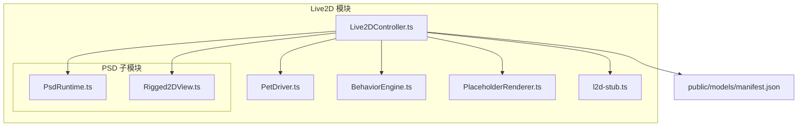
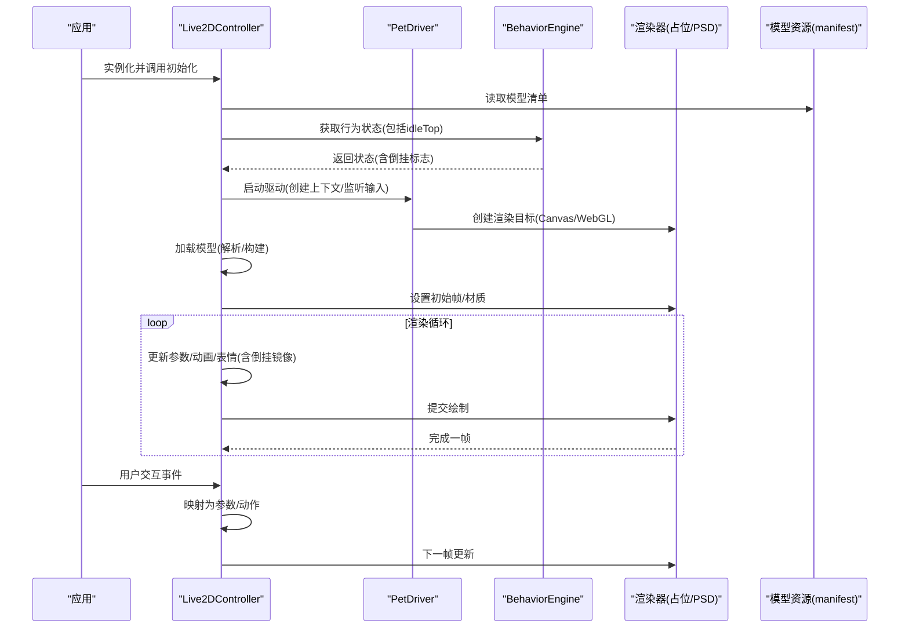
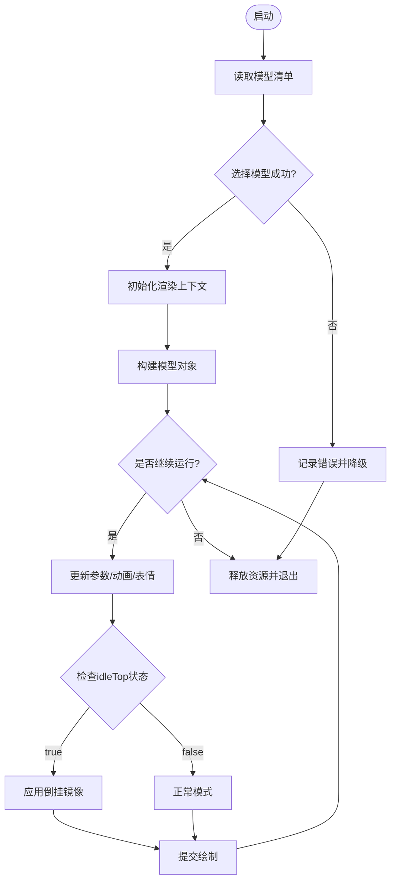
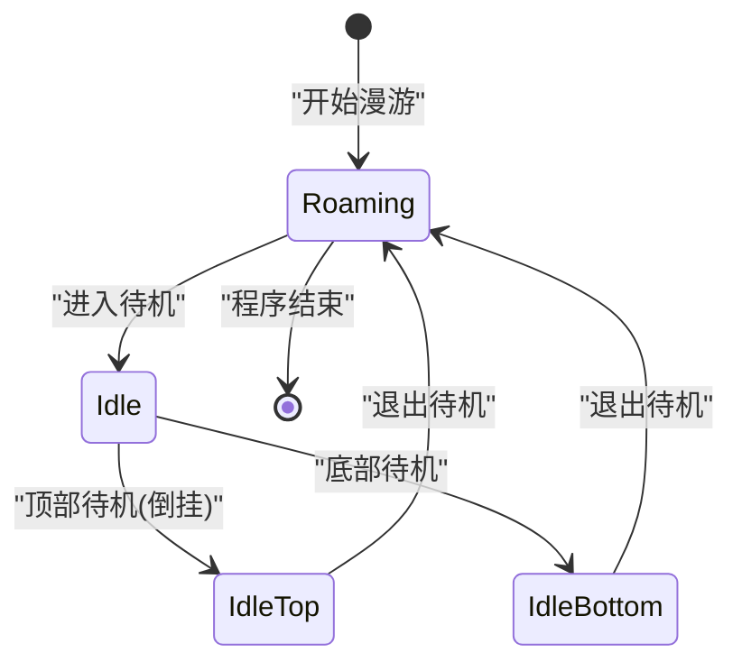
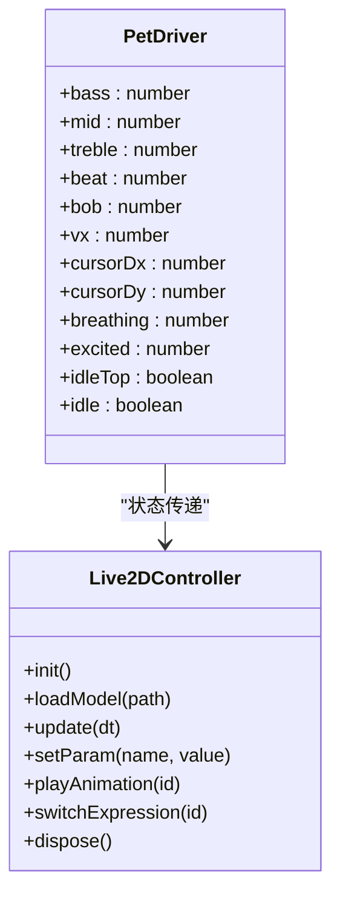
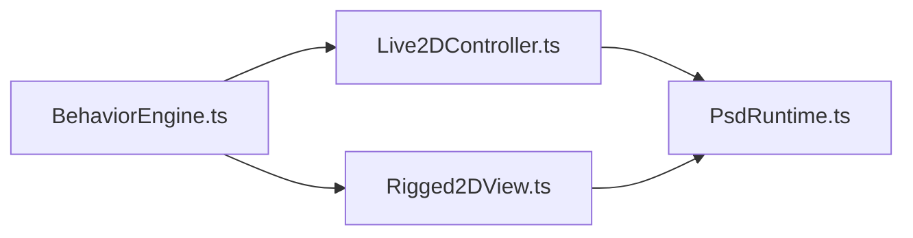
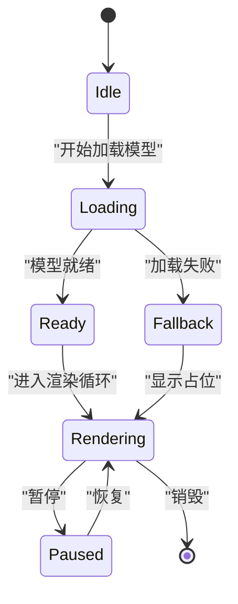
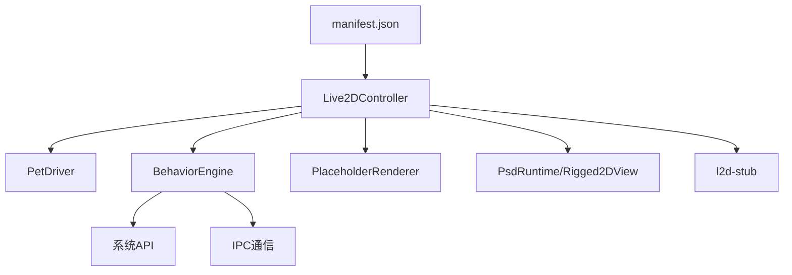

# Live2D控制器

<cite>
**本文引用的文件**
- [Live2DController.ts](file://src/live2d/Live2DController.ts)
- [PetDriver.ts](file://src/live2d/PetDriver.ts)
- [BehaviorEngine.ts](file://src/autonomous/BehaviorEngine.ts)
- [Rigged2DView.ts](file://src/live2d/psd/Rigged2DView.ts)
- [PsdRuntime.ts](file://src/live2d/psd/PsdRuntime.ts)
- [PlaceholderRenderer.ts](file://src/live2d/PlaceholderRenderer.ts)
- [l2d-stub.ts](file://src/live2d/l2d-stub.ts)
- [manifest.json](file://public/models/manifest.json)
</cite>

## 更新摘要
**所做更改**
- 新增顶部待机倒挂模式的眼动追踪和头部移动功能
- 改进了倒置方向支持，确保无论宠物方向如何都能实现自然的眼动效果
- 更新了渲染循环中的视线跟随逻辑以支持镜像翻转
- 增强了PSD渲染路径的倒挂支持

## 目录
1. [简介](#简介)
2. [项目结构](#项目结构)
3. [核心组件](#核心组件)
4. [架构总览](#架构总览)
5. [详细组件分析](#详细组件分析)
6. [依赖关系分析](#依赖关系分析)
7. [性能考虑](#性能考虑)
8. [故障排查指南](#故障排查指南)
9. [结论](#结论)
10. [附录](#附录)

## 简介
本文件围绕 Live2D 控制器的实现与使用，系统性说明模型加载、初始化、渲染循环管理、生命周期控制、参数调整、动画状态与表情切换、Canvas/WebGL 集成方式、性能优化与内存管理，并提供实例化、加载模型、触发动画和处理交互事件的实践指引。同时涵盖错误处理机制与调试技巧，帮助开发者快速上手并稳定集成到桌面端或 Web 场景中。

**最新更新**：新增了顶部待机倒挂模式的支持，通过改进眼动追踪和头部移动算法，确保无论宠物处于正常还是倒置方向，都能实现自然流畅的眼动效果。

## 项目结构
本项目将 Live2D 相关能力集中在 src/live2d 目录下，包含控制器、驱动、占位渲染器、PSD 运行时与视图等模块；模型清单位于 public/models/manifest.json，供运行时发现可用模型。

**图表来源**
- [Live2DController.ts](file://src/live2d/Live2DController.ts)
- [PetDriver.ts](file://src/live2d/PetDriver.ts)
- [BehaviorEngine.ts](file://src/autonomous/BehaviorEngine.ts)
- [PlaceholderRenderer.ts](file://src/live2d/PlaceholderRenderer.ts)
- [l2d-stub.ts](file://src/live2d/l2d-stub.ts)
- [PsdRuntime.ts](file://src/live2d/psd/PsdRuntime.ts)
- [Rigged2DView.ts](file://src/live2d/psd/Rigged2DView.ts)
- [manifest.json](file://public/models/manifest.json)

## 核心组件
- **Live2DController**：对外暴露的控制器，负责模型加载、初始化、渲染循环、参数更新、动画与表情切换、事件绑定与生命周期管理。
- **PetDriver**：驱动层接口，协调控制器与底层渲染/输入/音频等子系统，提供统一的运行入口。
- **BehaviorEngine**：自主行为引擎，管理宠物的漫游、待机模式和位置计算，包括顶部待机倒挂逻辑。
- **PlaceholderRenderer**：占位渲染器，在模型未就绪时提供可视化占位（如静态图或简单动画），保证 UI 连续性。
- **l2d-stub**：运行时桩模块，用于在不同环境（如缺少原生库）下提供兼容接口，避免崩溃。
- **PsdRuntime / Rigged2DView**：PSD 相关的运行时与视图封装，支持特定资源格式或骨骼驱动的渲染路径，同样支持倒挂模式。
- **manifest.json**：模型清单，声明可用模型及其元数据，供控制器动态发现与加载。

**章节来源**
- [Live2DController.ts](file://src/live2d/Live2DController.ts)
- [PetDriver.ts](file://src/live2d/PetDriver.ts)
- [BehaviorEngine.ts](file://src/autonomous/BehaviorEngine.ts)
- [PlaceholderRenderer.ts](file://src/live2d/PlaceholderRenderer.ts)
- [l2d-stub.ts](file://src/live2d/l2d-stub.ts)
- [PsdRuntime.ts](file://src/live2d/psd/PsdRuntime.ts)
- [Rigged2DView.ts](file://src/live2d/psd/Rigged2DView.ts)
- [manifest.json](file://public/models/manifest.json)

## 架构总览
整体采用"控制器 + 驱动 + 渲染"的分层设计：
- **控制器**负责业务编排（加载、参数、动画、事件）。
- **驱动**负责与平台/渲染后端对接（Canvas/WebGL、输入、音频）。
- **行为引擎**管理宠物的自主行为和待机模式。
- **渲染器**负责绘制（含占位渲染与 PSD 渲染分支）。
- **模型清单**作为配置中心，驱动按需加载。

**图表来源**
- [Live2DController.ts](file://src/live2d/Live2DController.ts)
- [PetDriver.ts](file://src/live2d/PetDriver.ts)
- [BehaviorEngine.ts](file://src/autonomous/BehaviorEngine.ts)
- [PlaceholderRenderer.ts](file://src/live2d/PlaceholderRenderer.ts)
- [PsdRuntime.ts](file://src/live2d/psd/PsdRuntime.ts)
- [Rigged2DView.ts](file://src/live2d/psd/Rigged2DView.ts)
- [manifest.json](file://public/models/manifest.json)

## 详细组件分析

### Live2DController 类
职责
- **模型加载**：从清单中定位模型，解析并构建内部表示。
- **初始化**：创建渲染上下文、绑定输入事件、准备默认参数与动画。
- **渲染循环**：驱动每帧更新（参数插值、动画混合、表情切换）并提交绘制。
- **生命周期**：启动、暂停、恢复、销毁，确保资源释放与状态一致。
- **参数与动画**：提供 API 设置面部/肢体参数、切换表情、播放/停止动画。
- **事件处理**：将鼠标/键盘/触摸等输入映射为模型行为。
- **倒挂支持**：根据 `idleTop` 状态自动调整视线跟随的镜像方向。

关键流程
- **启动**：读取清单 -> 选择模型 -> 初始化渲染 -> 进入渲染循环。
- **更新**：计算时间增量 -> 更新动画状态机 -> 应用参数 -> 提交绘制。
- **交互**：捕获事件 -> 转换为参数变化或动作触发 -> 下一帧生效。
- **倒挂处理**：检测 `idleTop` 状态 -> 计算镜像因子 -> 应用到视线参数。
- **销毁**：停止循环 -> 释放纹理/缓冲 -> 解绑事件。

**更新**：新增了倒挂模式下的视线跟随镜像逻辑，确保在顶部待机模式下眼睛和头部的移动方向正确。

**图表来源**
- [Live2DController.ts](file://src/live2d/Live2DController.ts)
- [BehaviorEngine.ts](file://src/autonomous/BehaviorEngine.ts)
- [manifest.json](file://public/models/manifest.json)

**章节来源**
- [Live2DController.ts:92-187](file://src/live2d/Live2DController.ts#L92-L187)

### BehaviorEngine 行为引擎
职责
- **自主漫游**：管理宠物的随机移动和目标点选择。
- **待机模式**：实现顶部和底部待机，支持倒挂显示。
- **位置计算**：计算窗口位置和边界碰撞。
- **状态管理**：维护 idleTop 状态，传递给渲染层。

**更新**：增强了待机模式的倒挂逻辑，当宠物位于屏幕上半部分时自动切换到顶部待机模式，并设置 `idleTop = true` 信号。

**图表来源**
- [BehaviorEngine.ts:83-115](file://src/autonomous/BehaviorEngine.ts#L83-L115)

**章节来源**
- [BehaviorEngine.ts:64-115](file://src/autonomous/BehaviorEngine.ts#L64-L115)

### PetDriver 驱动接口
职责
- **统一入口**：创建并持有控制器实例，管理其生命周期。
- **平台适配**：封装 Canvas/WebGL 上下文创建、尺寸变化、焦点/失焦处理。
- **输入桥接**：将输入事件转发给控制器进行参数/动作映射。
- **状态传递**：传递 `idleTop` 状态以支持倒挂模式。

**更新**：在接口定义中增加了 `idleTop` 字段，用于标识当前是否处于顶部待机倒挂模式。

**图表来源**
- [PetDriver.ts:1-44](file://src/live2d/PetDriver.ts#L1-L44)
- [Live2DController.ts](file://src/live2d/Live2DController.ts)

**章节来源**
- [PetDriver.ts:1-44](file://src/live2d/PetDriver.ts#L1-L44)

### PSD 渲染路径增强
职责
- **Rigged2DView**：基于 PSD 数据的 2D 视图渲染，支持倒挂模式下的视线跟随。
- **PsdRuntime**：解析/加载 PSD 资源，构建可渲染的数据结构。

**更新**：在 PSD 渲染路径中也实现了倒挂支持，通过相同的 `flip` 机制确保视线跟随的正确性。

**图表来源**
- [BehaviorEngine.ts](file://src/autonomous/BehaviorEngine.ts)
- [Live2DController.ts](file://src/live2d/Live2DController.ts)
- [Rigged2DView.ts](file://src/live2d/psd/Rigged2DView.ts)
- [PsdRuntime.ts](file://src/live2d/psd/PsdRuntime.ts)

**章节来源**
- [Rigged2DView.ts:121-163](file://src/live2d/psd/Rigged2DView.ts#L121-L163)
- [PsdRuntime.ts:322-383](file://src/live2d/psd/PsdRuntime.ts#L322-L383)

### PlaceholderRenderer 占位渲染器
职责
- 在模型未就绪或加载失败时显示占位内容，保持界面连续。
- 支持简单动画（如呼吸/闪烁）以提升体验。
- 与主渲染器无缝切换，避免抖动。

**图表来源**
- [PlaceholderRenderer.ts](file://src/live2d/PlaceholderRenderer.ts)
- [Live2DController.ts](file://src/live2d/Live2DController.ts)

**章节来源**
- [PlaceholderRenderer.ts](file://src/live2d/PlaceholderRenderer.ts)
- [Live2DController.ts](file://src/live2d/Live2DController.ts)

### l2d-stub 桩模块
职责
- 在缺少原生依赖或受限环境中提供空实现，避免崩溃。
- 暴露与真实实现一致的接口，便于上层代码无感切换。

**章节来源**
- [l2d-stub.ts](file://src/live2d/l2d-stub.ts)

## 依赖关系分析
- **Live2DController** 依赖：
  - 模型清单 manifest.json 以发现可用模型。
  - 渲染器（PlaceholderRenderer 或 PSD 渲染路径）。
  - 驱动 PetDriver 提供的上下文与输入。
  - 行为引擎 BehaviorEngine 的状态信息（包括 idleTop）。
  - 桩模块 l2d-stub 以保障兼容性。
- **PetDriver** 依赖：
  - 控制器实例，负责生命周期调度。
  - 渲染目标（Canvas/WebGL）抽象。
- **BehaviorEngine** 依赖：
  - 系统 API 用于获取工作区信息和光标位置。
  - IPC 通信与 Rust 后端交互。
- 渲染器之间通过统一接口协作，可在运行时切换。

**图表来源**
- [manifest.json](file://public/models/manifest.json)
- [Live2DController.ts](file://src/live2d/Live2DController.ts)
- [PetDriver.ts](file://src/live2d/PetDriver.ts)
- [BehaviorEngine.ts](file://src/autonomous/BehaviorEngine.ts)
- [PlaceholderRenderer.ts](file://src/live2d/PlaceholderRenderer.ts)
- [PsdRuntime.ts](file://src/live2d/psd/PsdRuntime.ts)
- [Rigged2DView.ts](file://src/live2d/psd/Rigged2DView.ts)
- [l2d-stub.ts](file://src/live2d/l2d-stub.ts)

**章节来源**
- [Live2DController.ts](file://src/live2d/Live2DController.ts)
- [PetDriver.ts](file://src/live2d/PetDriver.ts)
- [BehaviorEngine.ts](file://src/autonomous/BehaviorEngine.ts)
- [PlaceholderRenderer.ts](file://src/live2d/PlaceholderRenderer.ts)
- [PsdRuntime.ts](file://src/live2d/psd/PsdRuntime.ts)
- [Rigged2DView.ts](file://src/live2d/psd/Rigged2DView.ts)
- [l2d-stub.ts](file://src/live2d/l2d-stub.ts)
- [manifest.json](file://public/models/manifest.json)

## 性能考虑
- **渲染循环**
  - 使用固定步长或自适应步长减少抖动；合并多次参数更新再提交绘制。
  - 仅在必要时重绘（如参数变化或动画关键帧）。
  - 倒挂模式下的镜像计算开销极小，仅涉及简单的符号翻转。
- **资源管理**
  - 模型与纹理按需加载，及时释放不再使用的资源。
  - 使用纹理图集减少批次绘制次数。
- **参数与动画**
  - 批量更新参数，避免每帧多次设置。
  - 合理设置动画淡入淡出时长，降低频繁切换带来的开销。
  - idleTop 状态变更频率低，对性能影响可忽略。
- **占位渲染**
  - 在模型加载期间使用轻量占位，避免阻塞主线程。
- **环境兼容**
  - 通过桩模块降级，避免在无原生环境时产生额外开销。

## 故障排查指南
常见问题与对策
- **模型加载失败**
  - 检查清单路径与模型文件完整性；确认网络/磁盘权限。
  - 查看控制器日志与错误回调，定位解析阶段异常。
- **渲染空白或黑屏**
  - 确认渲染上下文已创建且尺寸正确；检查占位渲染是否启用。
  - 验证纹理/材质是否成功上传至 GPU。
- **动画不生效**
  - 检查动画 ID 是否存在；确认当前状态机允许该动画。
  - 观察参数是否被后续逻辑覆盖。
- **交互无响应**
  - 确认输入事件已绑定到正确的 DOM/窗口；检查坐标变换。
- **内存泄漏**
  - 确保在销毁时释放纹理、缓冲与事件监听。
  - 避免闭包引用导致对象无法回收。
- **倒挂模式问题**
  - 检查 `idleTop` 状态是否正确传递到渲染层。
  - 验证视线跟随的镜像计算是否正确应用。
  - 确认行为引擎的待机位置计算逻辑。

调试技巧
- 开启控制器调试开关，输出每帧参数与动画状态。
- 使用浏览器/桌面工具的性能面板监控帧率与内存占用。
- 对关键路径添加计时点，定位瓶颈。
- 在倒挂模式下特别关注视线参数的符号变化。

**章节来源**
- [Live2DController.ts](file://src/live2d/Live2DController.ts)
- [BehaviorEngine.ts](file://src/autonomous/BehaviorEngine.ts)
- [PlaceholderRenderer.ts](file://src/live2d/PlaceholderRenderer.ts)
- [l2d-stub.ts](file://src/live2d/l2d-stub.ts)

## 结论
Live2DController 提供了完整的模型加载、初始化、渲染循环与生命周期管理能力，配合 PetDriver、BehaviorEngine、占位渲染与 PSD 渲染路径，形成可扩展、可兼容的桌面/Web 端 Live2D 解决方案。**最新的倒挂模式支持**确保了无论宠物处于正常还是倒置方向，都能实现自然流畅的眼动效果和头部移动，大大提升了用户体验。通过合理的参数更新策略、动画管理与资源释放，可实现流畅稳定的表现。建议在项目中结合清单管理与桩模块，确保多环境下的健壮性。

## 附录

### 使用示例（步骤指引）
- **实例化控制器**
  - 创建控制器实例，传入必要的配置（如渲染容器、尺寸、调试开关）。
  - 参考路径：[Live2DController.ts](file://src/live2d/Live2DController.ts)
- **加载模型**
  - 读取 manifest.json 获取模型列表，选择目标模型并加载。
  - 参考路径：[manifest.json](file://public/models/manifest.json)、[Live2DController.ts](file://src/live2d/Live2DController.ts)
- **触发动画与表情**
  - 调用动画播放与表情切换接口，传入对应标识。
  - 参考路径：[Live2DController.ts](file://src/live2d/Live2DController.ts)
- **处理用户交互**
  - 绑定输入事件，将坐标/手势映射为参数变化或动作触发。
  - 参考路径：[PetDriver.ts](file://src/live2d/PetDriver.ts)、[Live2DController.ts](file://src/live2d/Live2DController.ts)
- **生命周期管理**
  - 在页面/窗口关闭时停止渲染循环并释放资源。
  - 参考路径：[Live2DController.ts](file://src/live2d/Live2DController.ts)、[PetDriver.ts](file://src/live2d/PetDriver.ts)
- **倒挂模式配置**
  - 确保 BehaviorEngine 正确设置 idleTop 状态。
  - 验证渲染层的镜像计算逻辑。
  - 参考路径：[BehaviorEngine.ts](file://src/autonomous/BehaviorEngine.ts)、[Live2DController.ts](file://src/live2d/Live2DController.ts)

### 倒挂模式技术细节
- **状态传递链**：BehaviorEngine → PetDriver → Live2DController/Rigged2DView
- **镜像计算**：`const flip = d.idleTop ? -1 : 1;`
- **应用范围**：ParamAngleX/Y、ParamEyeBallX/Y、头部旋转等
- **视觉效果**：顶部待机时宠物倒挂显示，但视线跟随保持自然

**章节来源**
- [Live2DController.ts:162-169](file://src/live2d/Live2DController.ts#L162-L169)
- [Rigged2DView.ts:121-130](file://src/live2d/psd/Rigged2DView.ts#L121-L130)
- [BehaviorEngine.ts:90-96](file://src/autonomous/BehaviorEngine.ts#L90-L96)