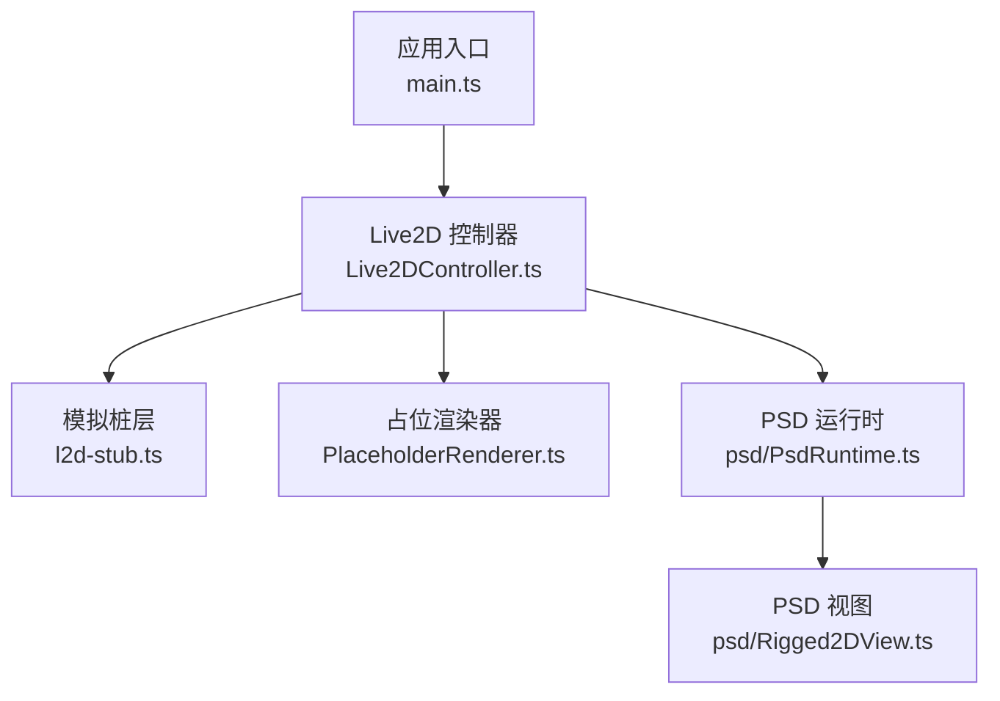
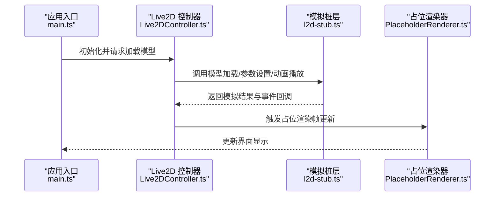
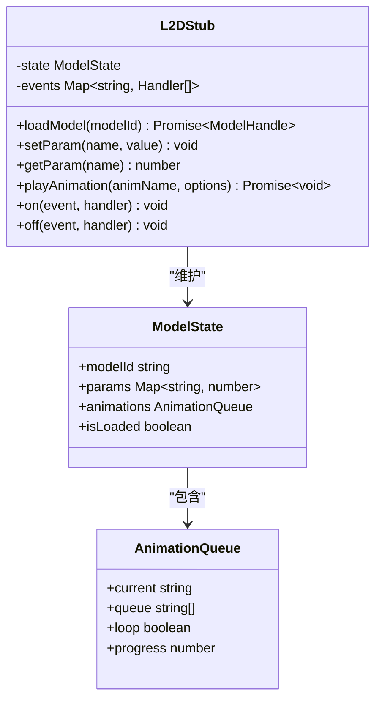
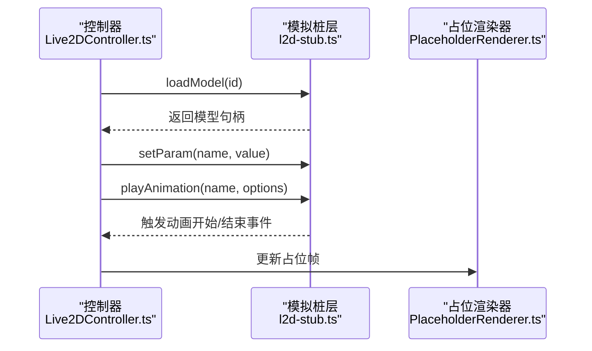
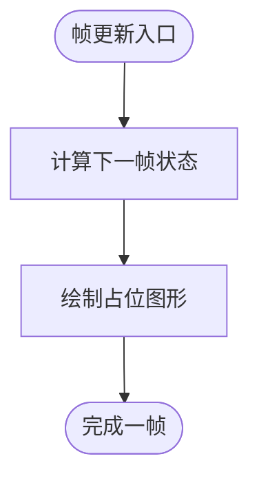
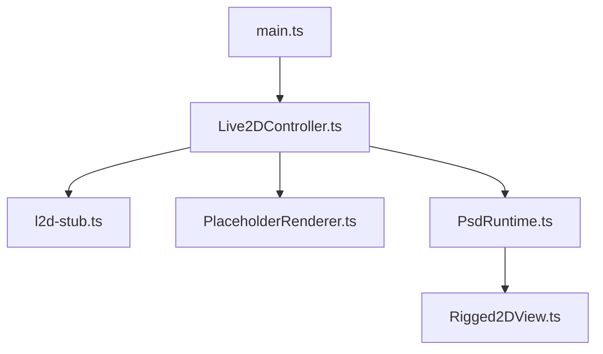
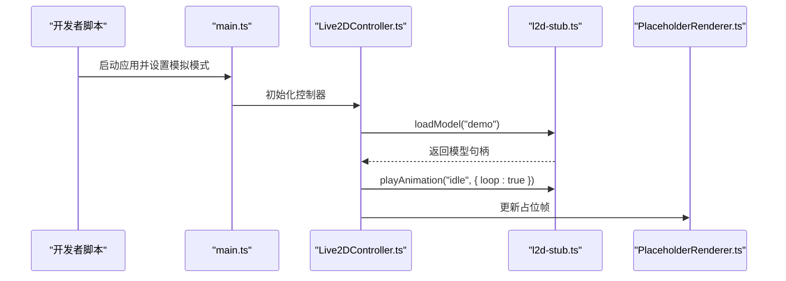
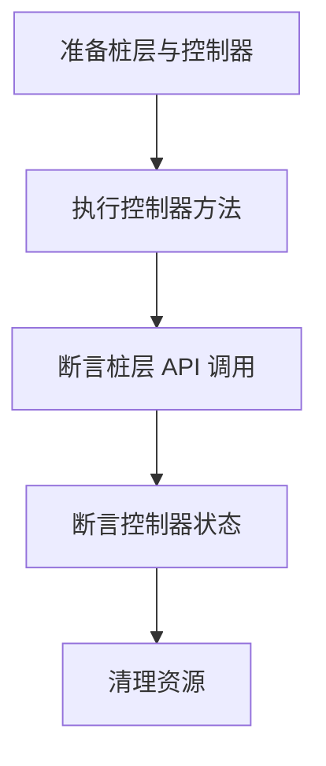
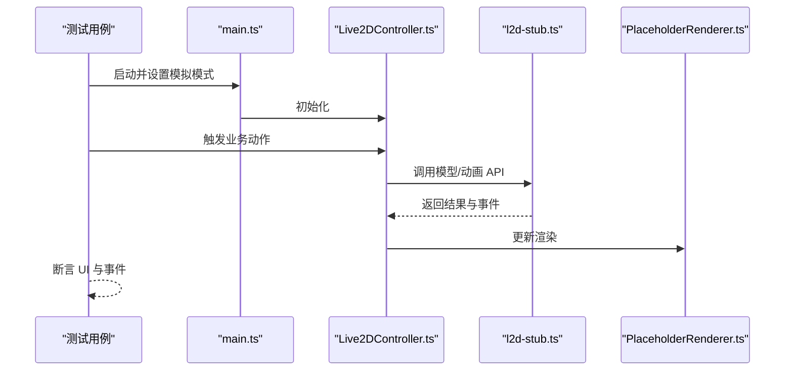

# Live2D模拟实现

<cite>
**本文引用的文件**
- [l2d-stub.ts](file://src/live2d/l2d-stub.ts)
- [Live2DController.ts](file://src/live2d/Live2DController.ts)
- [PlaceholderRenderer.ts](file://src/live2d/PlaceholderRenderer.ts)
- [PetDriver.ts](file://src/live2d/PetDriver.ts)
- [PsdRuntime.ts](file://src/live2d/psd/PsdRuntime.ts)
- [Rigged2DView.ts](file://src/live2d/psd/Rigged2DView.ts)
- [main.ts](file://src/main.ts)
- [vite.config.ts](file://vite.config.ts)
- [package.json](file://package.json)
</cite>

## 目录
1. [简介](#简介)
2. [项目结构](#项目结构)
3. [核心组件](#核心组件)
4. [架构总览](#架构总览)
5. [详细组件分析](#详细组件分析)
6. [依赖关系分析](#依赖关系分析)
7. [性能考虑](#性能考虑)
8. [故障排查指南](#故障排查指南)
9. [结论](#结论)
10. [附录：测试与配置示例](#附录测试与配置示例)

## 简介
本文件围绕 src/live2d/l2d-stub.ts 提供的 Live2D 模拟接口与桩函数，系统化说明如何在开发环境中模拟 Live2D 功能，包括模型加载、动画播放与 API 调用拦截；解释模拟数据结构与真实 Live2D 接口的对应关系；并给出在单元测试与集成测试中使用模拟环境的实践方法。文档同时覆盖相关控制器、渲染占位与 PSD 运行时等模块的协作方式，帮助读者在不依赖真实 Live2D 运行时的前提下完成开发与测试。

## 项目结构
Live2D 相关代码集中在 src/live2d 目录下，采用分层组织：
- l2d-stub.ts：提供模拟层（桩）接口，屏蔽真实 Live2D 运行时差异，便于测试与开发。
- Live2DController.ts：业务控制器，协调模型生命周期、动画与渲染。
- PlaceholderRenderer.ts：占位渲染器，用于在无真实渲染时提供可视化反馈。
- psd/PsdRuntime.ts 与 psd/Rigged2DView.ts：PSD 驱动的运行时与视图抽象，供上层使用统一接口。
- main.ts：应用入口，负责初始化各子系统。
- vite.config.ts / package.json：构建与脚本配置，影响模拟开关与依赖注入。

**图示来源**
- [main.ts:1-200](file://src/main.ts#L1-L200)
- [Live2DController.ts:1-200](file://src/live2d/Live2DController.ts#L1-L200)
- [l2d-stub.ts:1-200](file://src/live2d/l2d-stub.ts#L1-L200)
- [PlaceholderRenderer.ts:1-200](file://src/live2d/PlaceholderRenderer.ts#L1-L200)
- [PsdRuntime.ts:1-200](file://src/live2d/psd/PsdRuntime.ts#L1-L200)
- [Rigged2DView.ts:1-200](file://src/live2d/psd/Rigged2DView.ts#L1-L200)

**章节来源**
- [main.ts:1-200](file://src/main.ts#L1-L200)
- [vite.config.ts:1-200](file://vite.config.ts#L1-L200)
- [package.json:1-200](file://package.json#L1-L200)

## 核心组件
- 模拟桩层（l2d-stub.ts）
  - 目标：为上层提供与真实 Live2D 一致的接口契约，但内部以轻量数据与空操作实现，避免外部依赖。
  - 能力：模型加载、参数设置、动画播放、事件回调、状态查询等。
  - 特点：可插拔、可观测（记录调用）、可配置（返回固定或随机数据）。
- 控制器（Live2DController.ts）
  - 职责：编排模型生命周期（创建、加载、更新、销毁），管理动画队列与渲染切换。
  - 与桩层交互：通过抽象接口调用，从而在测试中替换为模拟实现。
- 占位渲染器（PlaceholderRenderer.ts）
  - 职责：在无真实渲染时绘制占位图形，保证 UI 流程不中断。
  - 与控制器交互：接收控制器指令进行帧更新。
- PSD 运行时与视图（psd/PsdRuntime.ts, psd/Rigged2DView.ts）
  - 职责：封装 PSD 资源解析与骨骼/网格视图，向上暴露统一 API。
  - 与控制器交互：作为可选后端，可在非模拟模式下启用。

**章节来源**
- [l2d-stub.ts:1-200](file://src/live2d/l2d-stub.ts#L1-L200)
- [Live2DController.ts:1-200](file://src/live2d/Live2DController.ts#L1-L200)
- [PlaceholderRenderer.ts:1-200](file://src/live2d/PlaceholderRenderer.ts#L1-L200)
- [PsdRuntime.ts:1-200](file://src/live2d/psd/PsdRuntime.ts#L1-L200)
- [Rigged2DView.ts:1-200](file://src/live2d/psd/Rigged2DView.ts#L1-L200)

## 架构总览
下图展示从应用入口到 Live2D 控制器的调用链，以及控制器如何根据运行环境选择真实或模拟后端。

**图示来源**
- [main.ts:1-200](file://src/main.ts#L1-L200)
- [Live2DController.ts:1-200](file://src/live2d/Live2DController.ts#L1-L200)
- [l2d-stub.ts:1-200](file://src/live2d/l2d-stub.ts#L1-L200)
- [PlaceholderRenderer.ts:1-200](file://src/live2d/PlaceholderRenderer.ts#L1-L200)

## 详细组件分析

### 模拟桩层（l2d-stub.ts）
- 设计要点
  - 对外暴露与真实 Live2D 一致的 API 集合，确保上层无需感知差异。
  - 内部维护轻量状态机，支持模型加载、参数修改、动画播放、事件派发。
  - 提供“调用日志”能力，便于断言 API 是否按预期被调用。
- 关键能力
  - 模型加载：返回稳定的模型句柄与元信息，支持错误注入。
  - 参数设置：将参数写入内部状态，支持读取当前值。
  - 动画播放：维护动画队列与播放进度，触发开始/结束事件。
  - 事件系统：订阅/发布模型事件，便于业务逻辑响应。
- 数据结构映射
  - 模型句柄：对应真实模型的实例标识。
  - 参数对象：对应 Live2D 参数命名空间与数值范围。
  - 动画描述：包含名称、时长、循环标志等。
  - 事件类型：如加载完成、动画开始/结束、参数变化等。

**图示来源**
- [l2d-stub.ts:1-200](file://src/live2d/l2d-stub.ts#L1-L200)

**章节来源**
- [l2d-stub.ts:1-200](file://src/live2d/l2d-stub.ts#L1-L200)

### 控制器（Live2DController.ts）
- 职责
  - 管理模型生命周期：创建、加载、更新、销毁。
  - 调度动画：入队、播放、暂停、停止。
  - 渲染协调：在模拟模式下驱动占位渲染器，在非模拟模式下对接真实后端。
- 与桩层交互
  - 通过抽象接口调用模型加载与动画播放，使测试时可替换为模拟实现。
  - 监听事件以更新 UI 状态与业务逻辑。

**图示来源**
- [Live2DController.ts:1-200](file://src/live2d/Live2DController.ts#L1-L200)
- [l2d-stub.ts:1-200](file://src/live2d/l2d-stub.ts#L1-L200)
- [PlaceholderRenderer.ts:1-200](file://src/live2d/PlaceholderRenderer.ts#L1-L200)

**章节来源**
- [Live2DController.ts:1-200](file://src/live2d/Live2DController.ts#L1-L200)

### 占位渲染器（PlaceholderRenderer.ts）
- 职责
  - 在无真实渲染时绘制占位图形，保持 UI 流程连贯。
  - 接收控制器指令进行帧更新，输出最小可用视觉反馈。
- 与控制器交互
  - 控制器在每帧或事件触发时调用渲染器更新。

**图示来源**
- [PlaceholderRenderer.ts:1-200](file://src/live2d/PlaceholderRenderer.ts#L1-L200)

**章节来源**
- [PlaceholderRenderer.ts:1-200](file://src/live2d/PlaceholderRenderer.ts#L1-L200)

### PSD 运行时与视图（psd/PsdRuntime.ts, psd/Rigged2DView.ts）
- 职责
  - PsdRuntime：解析 PSD 资源，构建运行时数据结构。
  - Rigged2DView：基于骨骼/网格数据进行视图渲染。
- 与控制器交互
  - 在非模拟模式下，控制器可选择使用 PSD 后端替代桩层。

**图示来源**
- [Live2DController.ts:1-200](file://src/live2d/Live2DController.ts#L1-L200)
- [PsdRuntime.ts:1-200](file://src/live2d/psd/PsdRuntime.ts#L1-L200)
- [Rigged2DView.ts:1-200](file://src/live2d/psd/Rigged2DView.ts#L1-L200)

**章节来源**
- [PsdRuntime.ts:1-200](file://src/live2d/psd/PsdRuntime.ts#L1-L200)
- [Rigged2DView.ts:1-200](file://src/live2d/psd/Rigged2DView.ts#L1-L200)

## 依赖关系分析
- 模块耦合
  - 控制器对桩层与渲染器存在强依赖，便于在测试中替换。
  - PSD 后端为可选依赖，仅在非模拟模式启用。
- 外部依赖
  - 构建配置（vite.config.ts）与包管理（package.json）决定模拟开关与依赖注入策略。

**图示来源**
- [main.ts:1-200](file://src/main.ts#L1-L200)
- [Live2DController.ts:1-200](file://src/live2d/Live2DController.ts#L1-L200)
- [l2d-stub.ts:1-200](file://src/live2d/l2d-stub.ts#L1-L200)
- [PlaceholderRenderer.ts:1-200](file://src/live2d/PlaceholderRenderer.ts#L1-L200)
- [PsdRuntime.ts:1-200](file://src/live2d/psd/PsdRuntime.ts#L1-L200)
- [Rigged2DView.ts:1-200](file://src/live2d/psd/Rigged2DView.ts#L1-L200)

**章节来源**
- [vite.config.ts:1-200](file://vite.config.ts#L1-L200)
- [package.json:1-200](file://package.json#L1-L200)

## 性能考虑
- 模拟桩层应尽可能轻量，避免在测试中引入额外开销。
- 动画队列与事件派发需控制频率，避免在高频更新场景造成抖动。
- 占位渲染器仅绘制必要图形，减少不必要的重绘。
- 在集成测试中，合理批处理 API 调用与事件，降低 I/O 与上下文切换成本。

[本节为通用指导，不涉及具体文件分析]

## 故障排查指南
- 常见问题
  - 模型加载失败：检查桩层是否返回错误路径，确认控制器是否正确处理异常。
  - 动画未播放：验证动画队列是否为空，事件是否被正确订阅与触发。
  - 参数未生效：确认参数名与范围是否与期望一致，读取接口是否返回最新值。
- 调试建议
  - 启用桩层的调用日志，核对 API 调用顺序与参数。
  - 在控制器中添加断点，观察状态机转换。
  - 使用占位渲染器输出中间状态，辅助定位渲染问题。

**章节来源**
- [l2d-stub.ts:1-200](file://src/live2d/l2d-stub.ts#L1-L200)
- [Live2DController.ts:1-200](file://src/live2d/Live2DController.ts#L1-L200)
- [PlaceholderRenderer.ts:1-200](file://src/live2d/PlaceholderRenderer.ts#L1-L200)

## 结论
通过 l2d-stub.ts 提供的模拟桩层，开发者可以在无真实 Live2D 运行时的环境下完成模型加载、动画播放与 API 调用的全流程测试。配合控制器与占位渲染器，能够稳定地驱动 UI 流程，并在单元测试与集成测试中验证业务逻辑的正确性。建议在项目中明确模拟开关与依赖注入策略，确保在不同环境下行为一致且易于维护。

[本节为总结性内容，不涉及具体文件分析]

## 附录：测试与配置示例

### 在开发环境中启用模拟
- 目标：在不加载真实 Live2D 运行时的前提下，使用桩层完成模型加载与动画播放。
- 步骤
  - 在应用入口初始化时，选择使用模拟后端。
  - 控制器通过抽象接口调用桩层，避免直接依赖真实实现。
  - 占位渲染器在每帧更新，提供最小可用视觉反馈。

**图示来源**
- [main.ts:1-200](file://src/main.ts#L1-L200)
- [Live2DController.ts:1-200](file://src/live2d/Live2DController.ts#L1-L200)
- [l2d-stub.ts:1-200](file://src/live2d/l2d-stub.ts#L1-L200)
- [PlaceholderRenderer.ts:1-200](file://src/live2d/PlaceholderRenderer.ts#L1-L200)

**章节来源**
- [main.ts:1-200](file://src/main.ts#L1-L200)
- [vite.config.ts:1-200](file://vite.config.ts#L1-L200)
- [package.json:1-200](file://package.json#L1-L200)

### 单元测试：验证 API 调用与业务逻辑
- 目标：验证控制器是否正确调用桩层 API，并处理事件与状态。
- 步骤
  - 构造桩层实例，启用调用日志。
  - 执行控制器方法（如加载模型、播放动画）。
  - 断言桩层 API 被调用次数与参数符合预期。
  - 断言控制器状态机转换正确。

**图示来源**
- [l2d-stub.ts:1-200](file://src/live2d/l2d-stub.ts#L1-L200)
- [Live2DController.ts:1-200](file://src/live2d/Live2DController.ts#L1-L200)

**章节来源**
- [l2d-stub.ts:1-200](file://src/live2d/l2d-stub.ts#L1-L200)
- [Live2DController.ts:1-200](file://src/live2d/Live2DController.ts#L1-L200)

### 集成测试：端到端流程验证
- 目标：验证从应用入口到渲染输出的完整链路。
- 步骤
  - 启动应用并启用模拟模式。
  - 触发用户交互或自动任务，驱动控制器调用桩层。
  - 检查占位渲染器输出是否符合预期。
  - 收集事件日志，验证业务流程闭环。

**图示来源**
- [main.ts:1-200](file://src/main.ts#L1-L200)
- [Live2DController.ts:1-200](file://src/live2d/Live2DController.ts#L1-L200)
- [l2d-stub.ts:1-200](file://src/live2d/l2d-stub.ts#L1-L200)
- [PlaceholderRenderer.ts:1-200](file://src/live2d/PlaceholderRenderer.ts#L1-L200)

**章节来源**
- [main.ts:1-200](file://src/main.ts#L1-L200)
- [vite.config.ts:1-200](file://vite.config.ts#L1-L200)
- [package.json:1-200](file://package.json#L1-L200)

### 模拟数据配置与最佳实践
- 配置方法
  - 在桩层中定义模型元数据、参数默认值与动画列表。
  - 提供配置接口，允许测试用例覆盖默认值。
- 最佳实践
  - 保持桩层 API 与真实接口一致，降低迁移成本。
  - 在测试中注入错误路径，验证健壮性。
  - 控制事件频率，避免测试不稳定。
  - 使用确定性数据，确保测试结果可重复。

**章节来源**
- [l2d-stub.ts:1-200](file://src/live2d/l2d-stub.ts#L1-L200)
- [Live2DController.ts:1-200](file://src/live2d/Live2DController.ts#L1-L200)