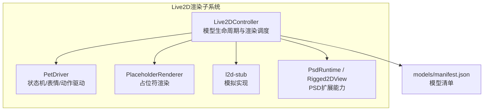
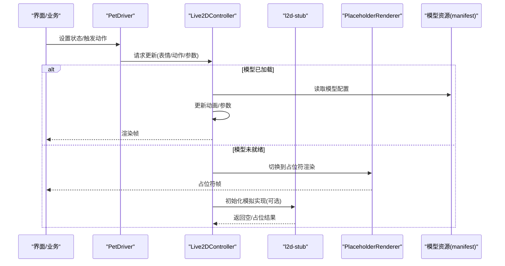
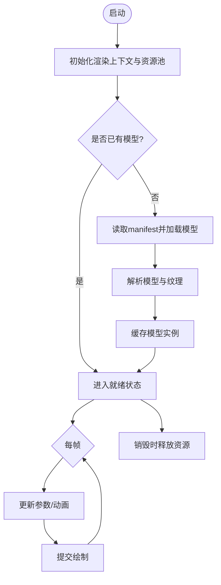
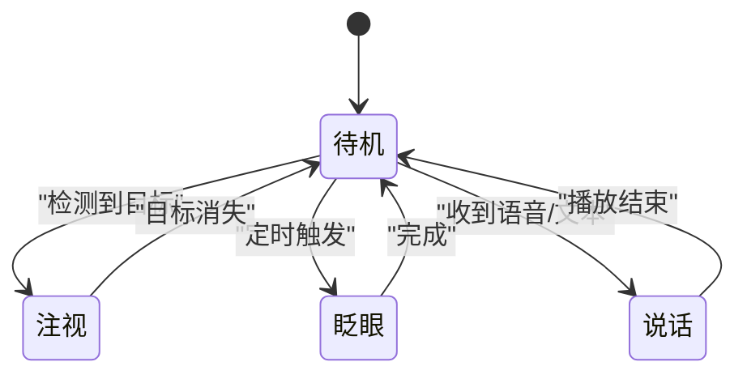
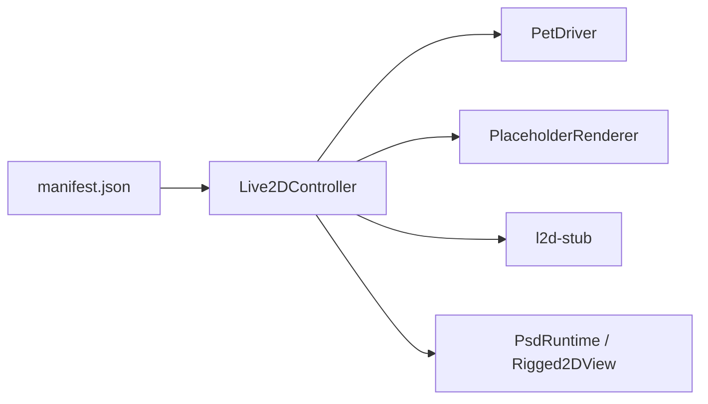

# Live2D渲染系统

<cite>
**本文引用的文件**
- [Live2DController.ts](file://src/live2d/Live2DController.ts)
- [PetDriver.ts](file://src/live2d/PetDriver.ts)
- [PlaceholderRenderer.ts](file://src/live2d/PlaceholderRenderer.ts)
- [l2d-stub.ts](file://src/live2d/l2d-stub.ts)
- [manifest.json](file://public/models/manifest.json)
- [PsdRuntime.ts](file://src/live2d/psd/PsdRuntime.ts)
- [Rigged2DView.ts](file://src/live2d/psd/Rigged2DView.ts)
</cite>

## 目录
1. [简介](#简介)
2. [项目结构](#项目结构)
3. [核心组件](#核心组件)
4. [架构总览](#架构总览)
5. [详细组件分析](#详细组件分析)
6. [依赖关系分析](#依赖关系分析)
7. [性能考虑](#性能考虑)
8. [故障排查指南](#故障排查指南)
9. [结论](#结论)
10. [附录](#附录)

## 简介
本文件系统性地梳理并文档化桌面端桌宠应用中的Live2D渲染子系统。重点覆盖：
- Live2DController如何统一管理与控制模型的加载、渲染与动画播放
- PetDriver的行为驱动机制，包括模型状态管理、表情切换与动作控制
- PlaceholderRenderer的占位符渲染逻辑以及l2d-stub的模拟实现
- 模型文件格式说明、资源管理策略与性能优化技巧
- 典型使用示例（加载模型、触发动画、处理用户交互）
- 错误处理与调试方法

## 项目结构
Live2D相关代码集中在src/live2d目录，包含控制器、行为驱动、占位符渲染与PSD扩展能力；模型清单位于public/models/manifest.json，供运行时发现可用模型。

图表来源
- [Live2DController.ts](file://src/live2d/Live2DController.ts)
- [PetDriver.ts](file://src/live2d/PetDriver.ts)
- [PlaceholderRenderer.ts](file://src/live2d/PlaceholderRenderer.ts)
- [l2d-stub.ts](file://src/live2d/l2d-stub.ts)
- [PsdRuntime.ts](file://src/live2d/psd/PsdRuntime.ts)
- [Rigged2DView.ts](file://src/live2d/psd/Rigged2DView.ts)
- [manifest.json](file://public/models/manifest.json)

章节来源
- [Live2DController.ts](file://src/live2d/Live2DController.ts)
- [PetDriver.ts](file://src/live2d/PetDriver.ts)
- [PlaceholderRenderer.ts](file://src/live2d/PlaceholderRenderer.ts)
- [l2d-stub.ts](file://src/live2d/l2d-stub.ts)
- [PsdRuntime.ts](file://src/live2d/psd/PsdRuntime.ts)
- [Rigged2DView.ts](file://src/live2d/psd/Rigged2DView.ts)
- [manifest.json](file://public/models/manifest.json)

## 核心组件
- Live2DController：负责模型实例的生命周期管理（创建、加载、销毁）、渲染循环调度、动画播放控制、事件分发与资源清理。对外暴露统一的API用于加载模型、触发动画、设置参数等。
- PetDriver：基于状态机的行为驱动层，维护模型当前状态（如待机、注视、眨眼、说话等），驱动表情切换与动作序列，协调外部输入（鼠标、键盘、定时器）到模型参数的映射。
- PlaceholderRenderer：在真实模型未就绪或不可用时提供占位符渲染（例如绘制静态图形或简易动画），保证UI连续性。
- l2d-stub：当缺少真实Live2D运行时或处于测试环境时，提供最小可运行的模拟实现，确保上层调用不崩溃并可继续验证流程。
- PSD扩展（PsdRuntime/Rigged2DView）：为高级场景提供PSD解析与绑定视图能力，便于从设计稿快速生成可运行资产。

章节来源
- [Live2DController.ts](file://src/live2d/Live2DController.ts)
- [PetDriver.ts](file://src/live2d/PetDriver.ts)
- [PlaceholderRenderer.ts](file://src/live2d/PlaceholderRenderer.ts)
- [l2d-stub.ts](file://src/live2d/l2d-stub.ts)
- [PsdRuntime.ts](file://src/live2d/psd/PsdRuntime.ts)
- [Rigged2DView.ts](file://src/live2d/psd/Rigged2DView.ts)

## 架构总览
整体采用分层解耦：上层业务通过PetDriver表达意图（状态/动作），由Live2DController负责具体模型加载与渲染，PlaceholderRenderer兜底显示，l2d-stub保障无运行时时的可用性，PSD模块提供扩展能力。

图表来源
- [Live2DController.ts](file://src/live2d/Live2DController.ts)
- [PetDriver.ts](file://src/live2d/PetDriver.ts)
- [PlaceholderRenderer.ts](file://src/live2d/PlaceholderRenderer.ts)
- [l2d-stub.ts](file://src/live2d/l2d-stub.ts)
- [manifest.json](file://public/models/manifest.json)

## 详细组件分析

### Live2DController：模型生命周期与渲染调度
职责
- 模型加载：根据manifest清单定位模型路径，异步加载模型数据与纹理
- 渲染循环：维护渲染上下文，按帧更新模型参数并绘制
- 动画控制：播放/暂停/混合动画，支持表情与动作切换
- 事件与回调：对外暴露加载完成、错误、动画结束等事件
- 资源管理：缓存模型实例、纹理、动画片段，并在销毁时释放

关键流程
- 初始化：创建渲染上下文、注册占位符与模拟实现、准备资源池
- 加载模型：校验清单、下载/解析模型、构建内部表示、预热纹理
- 渲染帧：计算时间增量、驱动状态机、更新参数、提交绘制
- 销毁：停止渲染、释放GPU资源、清空缓存

图表来源
- [Live2DController.ts](file://src/live2d/Live2DController.ts)
- [manifest.json](file://public/models/manifest.json)

章节来源
- [Live2DController.ts](file://src/live2d/Live2DController.ts)

### PetDriver：行为驱动与状态机
职责
- 状态管理：维护当前状态（如待机、注视、眨眼、说话、移动等）及过渡规则
- 表情切换：将高层语义（开心、惊讶、生气）映射到模型表情参数
- 动作控制：编排动作序列（如挥手、点头），支持打断与优先级
- 输入映射：将用户输入（点击、拖拽、键盘）转换为模型参数变化
- 与控制器协作：向Live2DController下发参数更新与动画指令

状态机要点
- 状态互斥：同一时刻仅一个主状态生效，子状态可叠加
- 超时与中断：支持自动超时回到待机，或被高优先级动作打断
- 平滑过渡：参数插值避免突变，提升观感

图表来源
- [PetDriver.ts](file://src/live2d/PetDriver.ts)

章节来源
- [PetDriver.ts](file://src/live2d/PetDriver.ts)

### PlaceholderRenderer：占位符渲染逻辑
职责
- 在模型未就绪或加载失败时，提供稳定的视觉反馈（静态图或简单动画）
- 与Live2DController协同，在模型就绪后无缝切换回真实渲染
- 提供轻量级绘制接口，降低对真实运行时的依赖

典型实现思路
- 绘制基础几何形状或预渲染的占位纹理
- 支持呼吸/闪烁等简单动画以体现“活跃”状态
- 监听控制器事件，及时切换渲染后端

章节来源
- [PlaceholderRenderer.ts](file://src/live2d/PlaceholderRenderer.ts)

### l2d-stub：模拟实现
职责
- 在无真实Live2D运行时或测试环境下，提供最小可用的接口实现
- 返回空/占位数据，使上层调用不崩溃，便于端到端验证
- 与PlaceholderRenderer配合，形成完整的降级链路

适用场景
- 开发调试阶段快速验证流程
- CI/自动化测试中避免强依赖外部运行时
- 生产环境按需禁用真实渲染（如隐私模式）

章节来源
- [l2d-stub.ts](file://src/live2d/l2d-stub.ts)

### PSD扩展：PsdRuntime与Rigged2DView
职责
- PsdRuntime：解析PSD工程，提取图层、蒙版、骨骼等信息，生成运行时可用资产
- Rigged2DView：将解析后的绑定关系映射到渲染视图，支持实时编辑预览

价值
- 缩短从设计到运行的路径，提高迭代效率
- 与Live2DController集成，可直接驱动PSD产出的模型

章节来源
- [PsdRuntime.ts](file://src/live2d/psd/PsdRuntime.ts)
- [Rigged2DView.ts](file://src/live2d/psd/Rigged2DView.ts)

## 依赖关系分析
- Live2DController依赖：
  - 模型清单manifest.json（模型发现与路径解析）
  - PlaceholderRenderer（降级渲染）
  - l2d-stub（模拟运行时）
  - 可选：PsdRuntime/Rigged2DView（PSD管线）
- PetDriver依赖：
  - Live2DController（下发参数/动画）
  - 输入源（鼠标/键盘/定时器）
- PlaceholderRenderer与l2d-stub：
  - 被控制器在特定条件下激活，保证UI连续性

图表来源
- [Live2DController.ts](file://src/live2d/Live2DController.ts)
- [PetDriver.ts](file://src/live2d/PetDriver.ts)
- [PlaceholderRenderer.ts](file://src/live2d/PlaceholderRenderer.ts)
- [l2d-stub.ts](file://src/live2d/l2d-stub.ts)
- [PsdRuntime.ts](file://src/live2d/psd/PsdRuntime.ts)
- [Rigged2DView.ts](file://src/live2d/psd/Rigged2DView.ts)
- [manifest.json](file://public/models/manifest.json)

章节来源
- [Live2DController.ts](file://src/live2d/Live2DController.ts)
- [PetDriver.ts](file://src/live2d/PetDriver.ts)
- [PlaceholderRenderer.ts](file://src/live2d/PlaceholderRenderer.ts)
- [l2d-stub.ts](file://src/live2d/l2d-stub.ts)
- [PsdRuntime.ts](file://src/live2d/psd/PsdRuntime.ts)
- [Rigged2DView.ts](file://src/live2d/psd/Rigged2DView.ts)
- [manifest.json](file://public/models/manifest.json)

## 性能考虑
- 资源复用与缓存
  - 模型实例、纹理与动画片段应缓存并按需复用，避免重复加载
  - 对频繁切换的表情/动作进行预加载
- 渲染节流与批处理
  - 合并同帧的参数更新，减少绘制调用次数
  - 在低优先级场景降低更新频率
- 内存管理
  - 及时释放不再使用的模型与纹理
  - 限制同时存在的模型数量，必要时懒加载
- 降级策略
  - 模型加载失败或资源不足时，自动切换到PlaceholderRenderer或l2d-stub
- 热路径优化
  - 将高频更新的参数（如眼球追踪、嘴型）放在独立更新通道，避免阻塞主线程

[本节为通用性能建议，不直接分析具体文件]

## 故障排查指南
常见问题与定位方法
- 模型无法加载
  - 检查manifest.json路径是否正确、资源是否存在
  - 查看控制器日志与错误回调，确认网络/权限问题
- 动画不播放或卡顿
  - 确认PetDriver状态机是否处于预期状态
  - 检查是否有长时间阻塞的任务影响渲染循环
- 占位符一直显示
  - 确认模型加载成功且已切换到真实渲染
  - 检查l2d-stub是否被意外启用
- 资源泄漏
  - 确保在销毁时释放模型与纹理
  - 监控内存增长，定位未释放对象

调试建议
- 启用详细日志：记录加载、切换、错误等关键节点
- 逐步断点：在控制器加载与渲染循环处设置断点
- 最小复现：剥离无关逻辑，聚焦问题模块
- 可视化辅助：在占位符渲染中输出调试信息（如FPS、状态名）

章节来源
- [Live2DController.ts](file://src/live2d/Live2DController.ts)
- [PlaceholderRenderer.ts](file://src/live2d/PlaceholderRenderer.ts)
- [l2d-stub.ts](file://src/live2d/l2d-stub.ts)

## 结论
本Live2D渲染系统通过清晰的层次划分与完善的降级机制，实现了模型加载、渲染与动画播放的统一管理。PetDriver以状态机驱动行为，PlaceholderRenderer与l2d-stub共同保障在不同环境下的稳定性。结合PSD扩展能力，可有效提升从设计到运行的效率。建议在工程中遵循资源复用、渲染节流与内存管理最佳实践，以获得更流畅的用户体验。

[本节为总结性内容，不直接分析具体文件]

## 附录

### 模型文件格式与清单
- manifest.json用于声明可用模型及其元数据（名称、版本、入口文件、资源列表等）
- 控制器依据清单解析并加载对应模型资源

章节来源
- [manifest.json](file://public/models/manifest.json)

### 使用示例（步骤指引）
以下为典型操作流程的步骤说明（不包含具体代码）：
- 加载模型
  - 通过控制器提供的加载接口传入模型标识或路径
  - 监听加载完成事件，进入就绪状态
  - 参考：[Live2DController.ts](file://src/live2d/Live2DController.ts)
- 触发动画
  - 使用控制器接口播放指定动画或表情
  - 可通过PetDriver设置状态来间接触发
  - 参考：[Live2DController.ts](file://src/live2d/Live2DController.ts)、[PetDriver.ts](file://src/live2d/PetDriver.ts)
- 处理用户交互
  - 将输入事件映射为模型参数变化（如视线跟随、嘴型同步）
  - 由PetDriver协调状态与动作优先级
  - 参考：[PetDriver.ts](file://src/live2d/PetDriver.ts)

### 资源管理策略
- 清单驱动：以manifest.json为中心管理模型发现与版本
- 缓存策略：按模型ID缓存实例与纹理，避免重复加载
- 懒加载：仅在需要时加载模型资源，降低初始开销
- 释放时机：在页面关闭或模型切换时主动释放资源

章节来源
- [manifest.json](file://public/models/manifest.json)
- [Live2DController.ts](file://src/live2d/Live2DController.ts)

### 性能优化技巧
- 预加载常用表情与动作，减少首帧延迟
- 合并参数更新，减少绘制调用
- 使用占位符与模拟实现，避免阻塞主线程
- 监控并限制并发模型数量

[本节为通用优化建议，不直接分析具体文件]