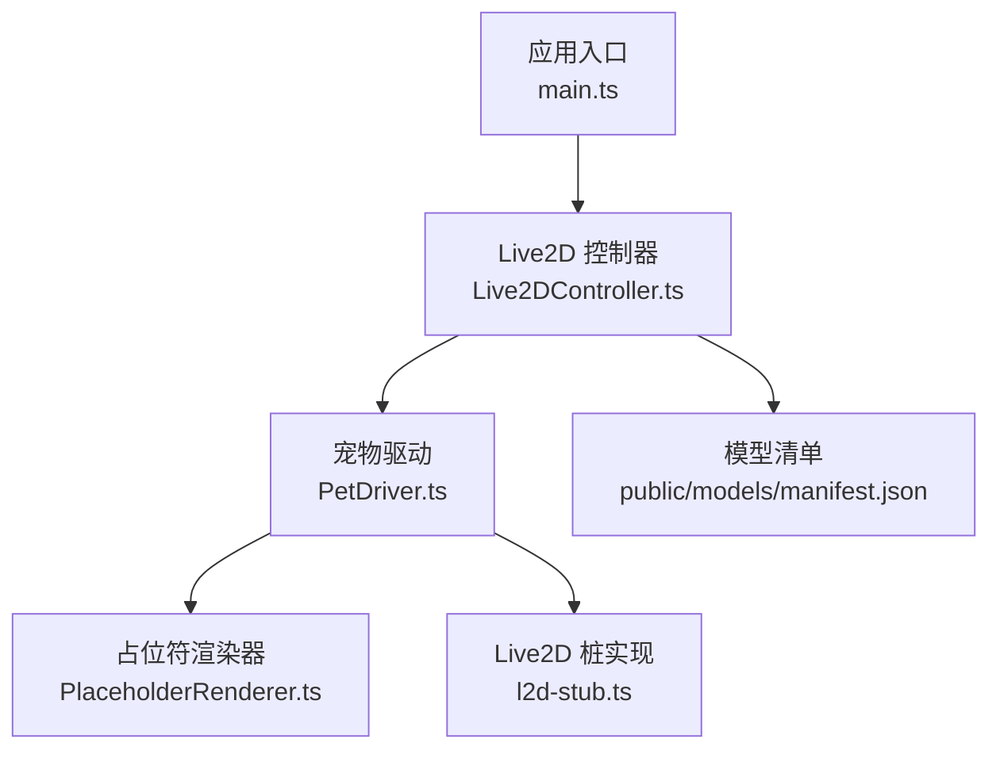
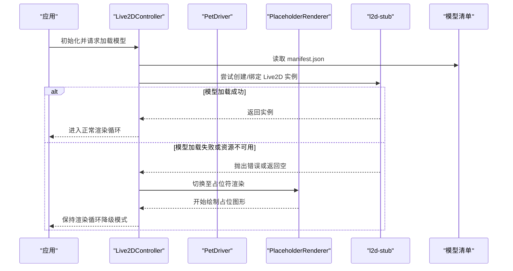
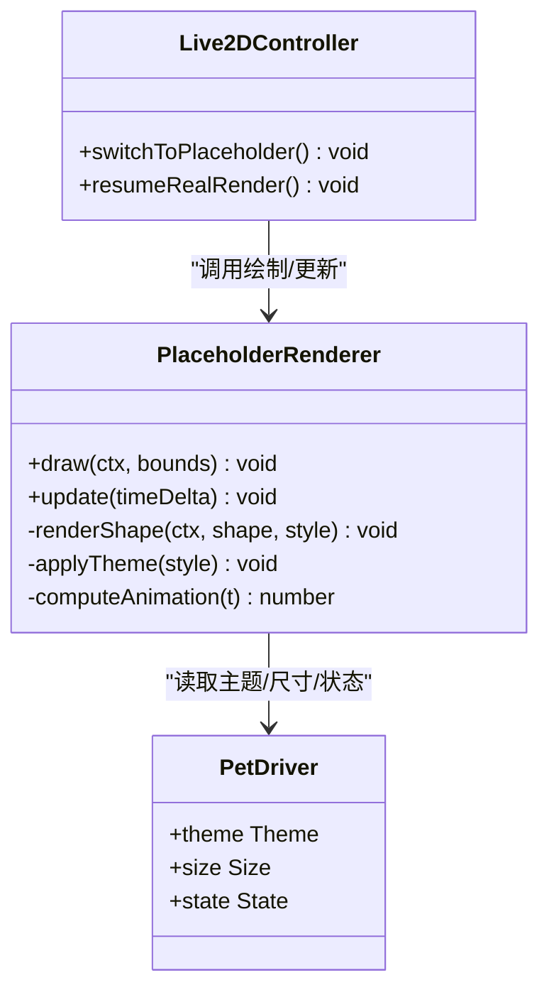
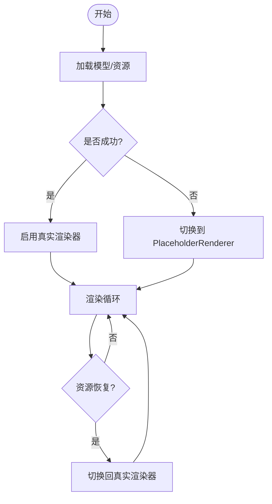
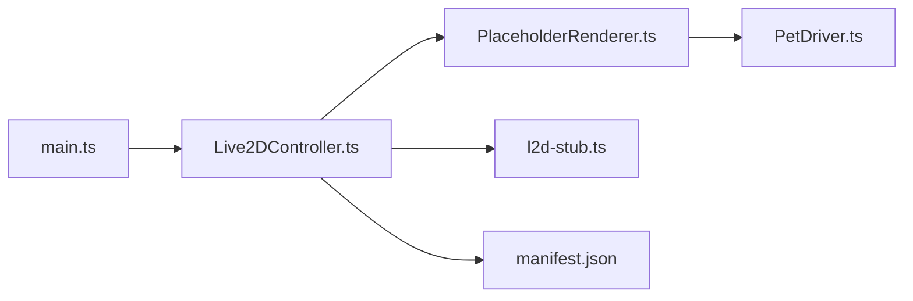

# 占位符渲染器

<cite>
**本文引用的文件**
- [PlaceholderRenderer.ts](file://src/live2d/PlaceholderRenderer.ts)
- [Live2DController.ts](file://src/live2d/Live2DController.ts)
- [PetDriver.ts](file://src/live2d/PetDriver.ts)
- [l2d-stub.ts](file://src/live2d/l2d-stub.ts)
- [main.ts](file://src/main.ts)
- [manifest.json](file://public/models/manifest.json)
</cite>

## 目录
1. [简介](#简介)
2. [项目结构](#项目结构)
3. [核心组件](#核心组件)
4. [架构总览](#架构总览)
5. [详细组件分析](#详细组件分析)
6. [依赖关系分析](#依赖关系分析)
7. [性能考虑](#性能考虑)
8. [故障排查指南](#故障排查指南)
9. [结论](#结论)
10. [附录](#附录)

## 简介
本文件围绕 PlaceholderRenderer 类，系统化说明其在模型加载失败或资源不可用时的降级显示机制。内容涵盖：
- 占位符图形的绘制逻辑（基础形状、颜色方案、动画效果）
- 基于上下文动态生成合适占位符内容的策略
- 与主渲染系统的集成方式与无缝切换机制
- 配置占位符样式、自定义占位符内容与处理渲染异常的具体示例路径
- 性能优化与兼容性注意事项

## 项目结构
本项目采用分层组织：UI 与业务逻辑位于 src，桌面端能力由 src-tauri 提供；Live2D 相关能力集中在 src/live2d 目录，其中 PlaceholderRenderer 作为降级渲染的核心模块，配合控制器与驱动完成整体流程。

图表来源
- [main.ts:1-200](file://src/main.ts#L1-L200)
- [Live2DController.ts:1-200](file://src/live2d/Live2DController.ts#L1-L200)
- [PetDriver.ts:1-200](file://src/live2d/PetDriver.ts#L1-L200)
- [PlaceholderRenderer.ts:1-200](file://src/live2d/PlaceholderRenderer.ts#L1-L200)
- [l2d-stub.ts:1-200](file://src/live2d/l2d-stub.ts#L1-L200)
- [manifest.json:1-200](file://public/models/manifest.json#L1-L200)

章节来源
- [main.ts:1-200](file://src/main.ts#L1-L200)
- [Live2DController.ts:1-200](file://src/live2d/Live2DController.ts#L1-L200)
- [PetDriver.ts:1-200](file://src/live2d/PetDriver.ts#L1-L200)
- [PlaceholderRenderer.ts:1-200](file://src/live2d/PlaceholderRenderer.ts#L1-L200)
- [l2d-stub.ts:1-200](file://src/live2d/l2d-stub.ts#L1-L200)
- [manifest.json:1-200](file://public/models/manifest.json#L1-L200)

## 核心组件
- PlaceholderRenderer：负责在 Live2D 模型不可用时绘制轻量级占位图形，支持基础形状、主题色与简单动画，确保界面不空白且交互可预期。
- Live2DController：协调模型加载、错误捕获与渲染回退，决定何时切换到 PlaceholderRenderer。
- PetDriver：承载运行时上下文（尺寸、主题、状态），向渲染层提供绘制所需信息。
- l2d-stub：在缺少真实 Live2D 运行时或模型资源时提供最小可用接口，便于测试与降级。
- manifest.json：描述可用模型与资源路径，供控制器校验与选择。

章节来源
- [PlaceholderRenderer.ts:1-200](file://src/live2d/PlaceholderRenderer.ts#L1-L200)
- [Live2DController.ts:1-200](file://src/live2d/Live2DController.ts#L1-L200)
- [PetDriver.ts:1-200](file://src/live2d/PetDriver.ts#L1-L200)
- [l2d-stub.ts:1-200](file://src/live2d/l2d-stub.ts#L1-L200)
- [manifest.json:1-200](file://public/models/manifest.json#L1-L200)

## 架构总览
PlaceholderRenderer 通过“控制器 + 驱动”的协作模式接入主渲染管线：当模型加载成功则使用真实渲染器；失败或资源缺失时自动切换至占位符渲染，保证 UI 连续性与一致性。

图表来源
- [Live2DController.ts:1-200](file://src/live2d/Live2DController.ts#L1-L200)
- [PetDriver.ts:1-200](file://src/live2d/PetDriver.ts#L1-L200)
- [PlaceholderRenderer.ts:1-200](file://src/live2d/PlaceholderRenderer.ts#L1-L200)
- [l2d-stub.ts:1-200](file://src/live2d/l2d-stub.ts#L1-L200)
- [manifest.json:1-200](file://public/models/manifest.json#L1-L200)

## 详细组件分析

### PlaceholderRenderer：降级渲染与绘制逻辑
- 职责
  - 在模型不可用时绘制占位图形，避免空白区域
  - 根据上下文（尺寸、主题、状态）动态调整外观
  - 提供轻量动画以增强可用性感知
- 绘制要点
  - 基础形状：圆形/椭圆、圆角矩形、线条等，用于表达“等待/加载中”语义
  - 颜色方案：从主题或驱动获取主色/强调色，保证与 UI 一致
  - 动画效果：呼吸缩放、淡入淡出、进度指示等，注意帧率与开销控制
- 动态内容
  - 依据当前窗口尺寸自适应布局
  - 依据主题模式（亮/暗）切换配色
  - 依据错误类型展示不同提示文案或图标
- 与主渲染系统对接
  - 暴露统一的 draw/update 接口，被控制器纳入渲染循环
  - 与真实渲染器共享生命周期管理（创建、销毁、重绘）

图表来源
- [PlaceholderRenderer.ts:1-200](file://src/live2d/PlaceholderRenderer.ts#L1-L200)
- [PetDriver.ts:1-200](file://src/live2d/PetDriver.ts#L1-L200)
- [Live2DController.ts:1-200](file://src/live2d/Live2DController.ts#L1-L200)

章节来源
- [PlaceholderRenderer.ts:1-200](file://src/live2d/PlaceholderRenderer.ts#L1-L200)
- [PetDriver.ts:1-200](file://src/live2d/PetDriver.ts#L1-L200)
- [Live2DController.ts:1-200](file://src/live2d/Live2DController.ts#L1-L200)

### Live2DController：切换与集成
- 职责
  - 管理模型加载生命周期，捕获异常并触发降级
  - 维护渲染目标（真实渲染器或占位符渲染器）
  - 在资源恢复后无缝切回真实渲染
- 关键流程
  - 初始化时读取 manifest.json 校验模型可用性
  - 加载失败时立即切换到 PlaceholderRenderer
  - 定时或事件驱动检测资源恢复，切换回真实渲染

图表来源
- [Live2DController.ts:1-200](file://src/live2d/Live2DController.ts#L1-L200)
- [manifest.json:1-200](file://public/models/manifest.json#L1-L200)

章节来源
- [Live2DController.ts:1-200](file://src/live2d/Live2DController.ts#L1-L200)
- [manifest.json:1-200](file://public/models/manifest.json#L1-L200)

### PetDriver：上下文提供者
- 职责
  - 提供主题、尺寸、状态等上下文给渲染器
  - 在窗口大小变化或主题切换时通知渲染层
- 对占位符的影响
  - 尺寸变化触发重绘与布局计算
  - 主题变化影响占位符配色
  - 状态变化影响提示文案与动画行为

章节来源
- [PetDriver.ts:1-200](file://src/live2d/PetDriver.ts#L1-L200)

### l2d-stub：最小可用接口
- 职责
  - 在缺少真实运行时或资源时提供空实现，避免崩溃
  - 为控制器提供一致的 API，简化错误分支处理
- 与 PlaceholderRenderer 的关系
  - 控制器在 stub 失败时转向 PlaceholderRenderer
  - 两者共同保障“始终有画面”的体验

章节来源
- [l2d-stub.ts:1-200](file://src/live2d/l2d-stub.ts#L1-L200)

### 应用入口 main.ts：启动与装配
- 职责
  - 初始化控制器、驱动与渲染目标
  - 启动渲染循环，统一调度真实/占位符渲染
- 与 PlaceholderRenderer 的关系
  - 通过控制器间接使用，无需直接耦合

章节来源
- [main.ts:1-200](file://src/main.ts#L1-L200)

## 依赖关系分析
- 低耦合设计
  - PlaceholderRenderer 仅依赖 PetDriver 提供的上下文，不关心模型加载细节
  - Live2DController 屏蔽底层差异，向上提供稳定接口
- 外部依赖
  - 模型清单 manifest.json 决定资源路径与可用性
  - 浏览器/宿主环境 Canvas/WebGL 能力影响绘制与动画性能

图表来源
- [main.ts:1-200](file://src/main.ts#L1-L200)
- [Live2DController.ts:1-200](file://src/live2d/Live2DController.ts#L1-L200)
- [PlaceholderRenderer.ts:1-200](file://src/live2d/PlaceholderRenderer.ts#L1-L200)
- [l2d-stub.ts:1-200](file://src/live2d/l2d-stub.ts#L1-L200)
- [manifest.json:1-200](file://public/models/manifest.json#L1-L200)
- [PetDriver.ts:1-200](file://src/live2d/PetDriver.ts#L1-L200)

章节来源
- [main.ts:1-200](file://src/main.ts#L1-L200)
- [Live2DController.ts:1-200](file://src/live2d/Live2DController.ts#L1-L200)
- [PlaceholderRenderer.ts:1-200](file://src/live2d/PlaceholderRenderer.ts#L1-L200)
- [l2d-stub.ts:1-200](file://src/live2d/l2d-stub.ts#L1-L200)
- [manifest.json:1-200](file://public/models/manifest.json#L1-L200)
- [PetDriver.ts:1-200](file://src/live2d/PetDriver.ts#L1-L200)

## 性能考虑
- 绘制开销
  - 优先使用简单几何形状与少量填充，减少复杂路径计算
  - 合并绘制批次，避免频繁状态切换
- 动画性能
  - 使用 requestAnimationFrame 节流，限制最大帧率
  - 将动画时间增量控制在合理范围，避免跳帧抖动
- 内存与资源
  - 避免在占位符渲染中加载大图或额外资源
  - 及时释放不再使用的临时对象
- 兼容性与降级
  - 检测 Canvas/WebGL 能力，必要时退回 2D 绘制
  - 在低端设备上降低动画复杂度或关闭部分动效

[本节为通用性能建议，不直接分析具体文件]

## 故障排查指南
- 常见问题
  - 模型清单缺失或路径错误：检查 manifest.json 中的模型条目与相对路径
  - 资源跨域或权限问题：确认服务器 CORS 与本地文件访问策略
  - 渲染异常导致回退：查看控制器日志，确认是否进入 PlaceholderRenderer
- 定位步骤
  - 在控制器加载阶段添加断点，观察错误堆栈
  - 在 PlaceholderRenderer 的 draw/update 中记录绘制参数与耗时
  - 对比真实渲染与占位符渲染的差异，确认切换时机
- 修复建议
  - 修正模型路径或替换可用资源
  - 增加重试与超时机制，提升鲁棒性
  - 为异常场景提供更明确的占位提示

章节来源
- [Live2DController.ts:1-200](file://src/live2d/Live2DController.ts#L1-L200)
- [PlaceholderRenderer.ts:1-200](file://src/live2d/PlaceholderRenderer.ts#L1-L200)
- [manifest.json:1-200](file://public/models/manifest.json#L1-L200)

## 结论
PlaceholderRenderer 通过简洁的绘制逻辑与稳定的上下文接口，实现了在模型不可用时的无缝降级显示。结合 Live2DController 的生命周期管理与 PetDriver 的上下文提供，系统在异常情况下仍能保持良好用户体验。建议在后续迭代中继续优化动画性能、扩展占位内容类型，并完善错误诊断与可观测性。

[本节为总结性内容，不直接分析具体文件]

## 附录

### 配置占位符样式的示例路径
- 主题与配色：参考 PetDriver 的主题字段与 PlaceholderRenderer 的 applyTheme 调用位置
- 尺寸与布局：参考 PlaceholderRenderer 的 draw 方法中对 bounds 的处理
- 动画强度：参考 update 方法中对时间增量与动画参数的计算

章节来源
- [PetDriver.ts:1-200](file://src/live2d/PetDriver.ts#L1-L200)
- [PlaceholderRenderer.ts:1-200](file://src/live2d/PlaceholderRenderer.ts#L1-L200)

### 自定义占位符内容的示例路径
- 新增图形元素：在 PlaceholderRenderer 中添加新的绘制函数并在 draw 中调用
- 动态文案：根据 PetDriver.state 或错误类型渲染不同提示
- 组合动画：在 update 中叠加多个动画参数

章节来源
- [PlaceholderRenderer.ts:1-200](file://src/live2d/PlaceholderRenderer.ts#L1-L200)
- [PetDriver.ts:1-200](file://src/live2d/PetDriver.ts#L1-L200)

### 处理渲染异常的示例路径
- 捕获加载异常：在 Live2DController 的加载流程中添加 try/catch 与回退逻辑
- 记录诊断信息：在异常分支输出错误类型与上下文快照
- 恢复机制：监听资源就绪事件，自动切回真实渲染

章节来源
- [Live2DController.ts:1-200](file://src/live2d/Live2DController.ts#L1-L200)
- [l2d-stub.ts:1-200](file://src/live2d/l2d-stub.ts#L1-L200)