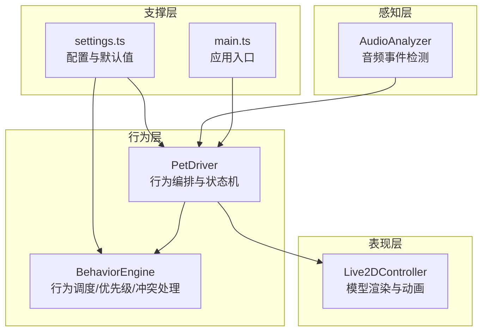
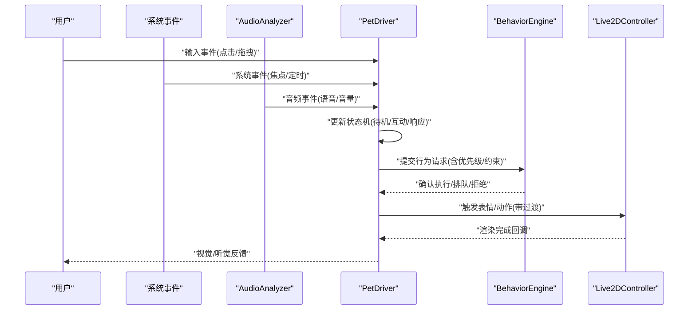
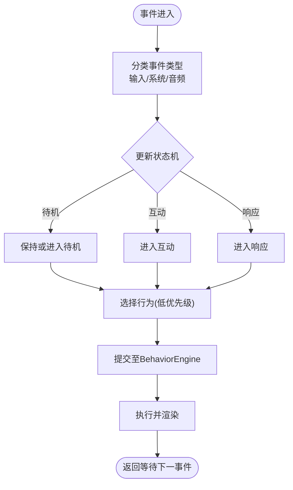
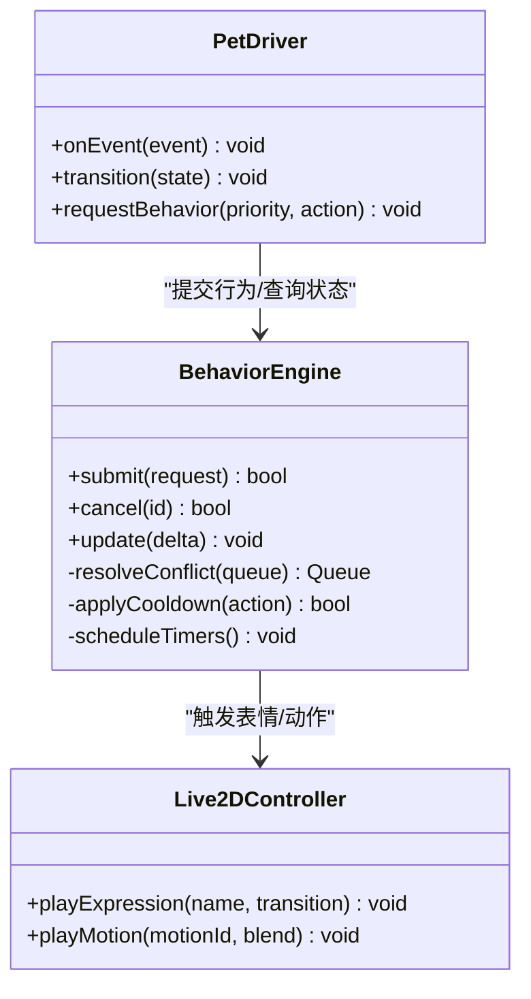
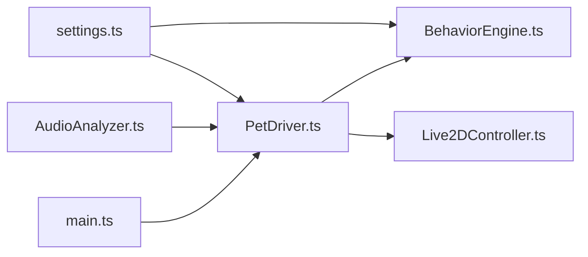

# 宠物行为驱动

<cite>
**本文引用的文件**
- [PetDriver.ts](file://src/live2d/PetDriver.ts)
- [BehaviorEngine.ts](file://src/autonomous/BehaviorEngine.ts)
- [Live2DController.ts](file://src/live2d/Live2DController.ts)
- [AudioAnalyzer.ts](file://src/audio/AudioAnalyzer.ts)
- [main.ts](file://src/main.ts)
- [settings.ts](file://src/utils/settings.ts)
</cite>

## 目录
1. [简介](#简介)
2. [项目结构](#项目结构)
3. [核心组件](#核心组件)
4. [架构总览](#架构总览)
5. [详细组件分析](#详细组件分析)
6. [依赖关系分析](#依赖关系分析)
7. [性能考量](#性能考量)
8. [故障排查指南](#故障排查指南)
9. [结论](#结论)
10. [附录](#附录)

## 简介
本文件面向“宠物行为驱动”子系统，聚焦于 PetDriver 类如何驱动宠物的自主行为与响应式交互。文档围绕以下目标展开：
- 行为状态机设计：待机、互动、响应等状态的转换逻辑与触发条件
- 事件驱动的行为调度：用户输入、系统事件、时间触发对行为动作的影响
- 表情管理系统：预设表情定义、动态表情生成与过渡效果
- 扩展与配置：如何添加新行为、配置行为规则、实现自定义交互逻辑
- 优先级与冲突解决：多行为并发时的优先级策略与冲突消解机制

## 项目结构
本项目采用分层组织方式，行为驱动相关代码主要分布在 live2d、autonomous、audio 与 utils 等模块中：
- live2d：负责 Live2D 模型渲染控制与宠物行为编排（PetDriver、Live2DController）
- autonomous：行为引擎（BehaviorEngine），提供行为调度、状态机与优先级管理
- audio：音频分析（AudioAnalyzer），用于语音/声音事件到行为的映射
- utils：通用工具与设置（settings.ts），提供可配置项读取与默认值
- main：应用入口，初始化各子系统并启动行为循环

图表来源
- [PetDriver.ts:1-200](file://src/live2d/PetDriver.ts#L1-L200)
- [BehaviorEngine.ts:1-200](file://src/autonomous/BehaviorEngine.ts#L1-L200)
- [Live2DController.ts:1-200](file://src/live2d/Live2DController.ts#L1-L200)
- [AudioAnalyzer.ts:1-200](file://src/audio/AudioAnalyzer.ts#L1-L200)
- [settings.ts:1-200](file://src/utils/settings.ts#L1-L200)
- [main.ts:1-200](file://src/main.ts#L1-L200)

章节来源
- [main.ts:1-200](file://src/main.ts#L1-L200)
- [PetDriver.ts:1-200](file://src/live2d/PetDriver.ts#L1-L200)
- [BehaviorEngine.ts:1-200](file://src/autonomous/BehaviorEngine.ts#L1-L200)

## 核心组件
- PetDriver：行为编排中枢，维护宠物当前状态、监听输入与系统事件、协调表情与动作、调用 BehaviorEngine 执行具体行为
- BehaviorEngine：行为调度器，管理行为队列、优先级、冲突解决、定时任务与状态机转换
- Live2DController：底层模型控制器，负责表情切换、动作播放、参数插值与渲染同步
- AudioAnalyzer：音频事件检测，将音量/语音片段转化为行为触发信号
- settings：全局配置，包含行为权重、冷却时间、表情库路径、默认状态等

章节来源
- [PetDriver.ts:1-200](file://src/live2d/PetDriver.ts#L1-L200)
- [BehaviorEngine.ts:1-200](file://src/autonomous/BehaviorEngine.ts#L1-L200)
- [Live2DController.ts:1-200](file://src/live2d/Live2DController.ts#L1-L200)
- [AudioAnalyzer.ts:1-200](file://src/audio/AudioAnalyzer.ts#L1-L200)
- [settings.ts:1-200](file://src/utils/settings.ts#L1-L200)

## 架构总览
行为驱动采用“事件驱动 + 状态机 + 行为队列”的架构：
- 事件源：用户输入（点击、拖拽）、系统事件（窗口焦点变化、定时器）、音频事件（语音、音量阈值）
- 行为编排：PetDriver 接收事件，更新状态机，选择合适行为并交由 BehaviorEngine 调度
- 执行与反馈：BehaviorEngine 按优先级执行行为，必要时与 Live2DController 协作完成表情/动作播放
- 配置驱动：通过 settings 调整行为权重、冷却、表情资源与默认状态

图表来源
- [PetDriver.ts:1-200](file://src/live2d/PetDriver.ts#L1-L200)
- [BehaviorEngine.ts:1-200](file://src/autonomous/BehaviorEngine.ts#L1-L200)
- [Live2DController.ts:1-200](file://src/live2d/Live2DController.ts#L1-L200)
- [AudioAnalyzer.ts:1-200](file://src/audio/AudioAnalyzer.ts#L1-L200)

## 详细组件分析

### PetDriver：行为编排与状态机
- 职责
  - 维护宠物状态机（待机、互动、响应），根据事件进行状态迁移
  - 聚合输入与系统事件，统一转换为行为请求
  - 协调表情与动作，调用 BehaviorEngine 执行
  - 管理表情过渡与生命周期
- 关键流程
  - 事件接入：监听用户输入、系统事件、音频事件
  - 状态迁移：依据事件类型与当前状态决定下一状态
  - 行为选择：结合优先级、冷却、上下文选择最合适的行为
  - 执行与反馈：通知 BehaviorEngine 执行，并与 Live2DController 同步表情/动作

图表来源
- [PetDriver.ts:1-200](file://src/live2d/PetDriver.ts#L1-L200)
- [BehaviorEngine.ts:1-200](file://src/autonomous/BehaviorEngine.ts#L1-L200)

章节来源
- [PetDriver.ts:1-200](file://src/live2d/PetDriver.ts#L1-L200)

### BehaviorEngine：行为调度与优先级
- 职责
  - 维护行为队列与优先级策略
  - 处理行为冲突（互斥、抢占、降级）
  - 管理定时任务与冷却时间
  - 与 PetDriver 协同完成状态迁移
- 关键机制
  - 优先级：基于行为类型、上下文、权重计算综合优先级
  - 冲突解决：互斥组、抢占阈值、降级策略（如高优先级打断低优先级）
  - 冷却：防止频繁触发同一行为导致抖动
  - 执行：顺序执行或并行有限度执行，确保渲染稳定

图表来源
- [BehaviorEngine.ts:1-200](file://src/autonomous/BehaviorEngine.ts#L1-L200)
- [PetDriver.ts:1-200](file://src/live2d/PetDriver.ts#L1-L200)
- [Live2DController.ts:1-200](file://src/live2d/Live2DController.ts#L1-L200)

章节来源
- [BehaviorEngine.ts:1-200](file://src/autonomous/BehaviorEngine.ts#L1-L200)

### Live2DController：表情与动作控制
- 职责
  - 加载与管理表情资源
  - 播放表情与动作，支持过渡插值
  - 暴露统一的渲染接口供上层调用
- 关键点
  - 表情过渡：平滑插值避免突变
  - 动作混合：支持多动作叠加与权重控制
  - 性能优化：批量更新、帧率适配

章节来源
- [Live2DController.ts:1-200](file://src/live2d/Live2DController.ts#L1-L200)

### AudioAnalyzer：音频事件到行为
- 职责
  - 实时分析音频流，检测语音片段与音量阈值
  - 将音频事件转换为行为触发信号
- 关键点
  - 阈值自适应：根据环境噪声动态调整
  - 去抖：避免短暂峰值误触发
  - 事件合并：将相近事件合并为一次触发

章节来源
- [AudioAnalyzer.ts:1-200](file://src/audio/AudioAnalyzer.ts#L1-L200)

### settings：配置与默认值
- 职责
  - 提供行为权重、冷却时间、表情资源路径等配置
  - 支持运行时热更新与持久化
- 关键点
  - 默认值兜底：保证无配置时仍可运行
  - 校验与回退：非法配置自动回退到安全值

章节来源
- [settings.ts:1-200](file://src/utils/settings.ts#L1-L200)

## 依赖关系分析
- 松耦合设计：PetDriver 通过接口与 BehaviorEngine、Live2DController 交互，降低直接依赖
- 事件总线：以事件为中心，解耦输入、处理与渲染
- 配置驱动：通过 settings 集中管理可调参数，便于扩展与调优

图表来源
- [settings.ts:1-200](file://src/utils/settings.ts#L1-L200)
- [PetDriver.ts:1-200](file://src/live2d/PetDriver.ts#L1-L200)
- [BehaviorEngine.ts:1-200](file://src/autonomous/BehaviorEngine.ts#L1-L200)
- [Live2DController.ts:1-200](file://src/live2d/Live2DController.ts#L1-L200)
- [AudioAnalyzer.ts:1-200](file://src/audio/AudioAnalyzer.ts#L1-L200)
- [main.ts:1-200](file://src/main.ts#L1-L200)

章节来源
- [PetDriver.ts:1-200](file://src/live2d/PetDriver.ts#L1-L200)
- [BehaviorEngine.ts:1-200](file://src/autonomous/BehaviorEngine.ts#L1-L200)
- [Live2DController.ts:1-200](file://src/live2d/Live2DController.ts#L1-L200)
- [AudioAnalyzer.ts:1-200](file://src/audio/AudioAnalyzer.ts#L1-L200)
- [settings.ts:1-200](file://src/utils/settings.ts#L1-L200)
- [main.ts:1-200](file://src/main.ts#L1-L200)

## 性能考量
- 事件节流：对高频输入进行节流与合并，减少不必要的状态迁移
- 行为冷却：对重复行为施加冷却时间，避免抖动与资源浪费
- 渲染批处理：在 Live2DController 中批量更新表情与动作，降低绘制开销
- 异步执行：非阻塞地执行耗时操作，保证主线程流畅
- 自适应帧率：根据设备性能动态调整更新频率

[本节为通用性能建议，不直接分析具体文件]

## 故障排查指南
- 行为未触发
  - 检查事件是否被正确捕获与分类
  - 查看 BehaviorEngine 队列是否被占用或存在互斥
  - 验证冷却时间是否阻止了重复触发
- 表情/动作异常
  - 确认表情资源路径与名称是否正确
  - 检查过渡参数是否合理，避免跳变
  - 观察渲染回调是否正常返回
- 音频事件误触发
  - 调整阈值与去抖参数
  - 检查环境噪声影响与事件合并策略

章节来源
- [PetDriver.ts:1-200](file://src/live2d/PetDriver.ts#L1-L200)
- [BehaviorEngine.ts:1-200](file://src/autonomous/BehaviorEngine.ts#L1-L200)
- [Live2DController.ts:1-200](file://src/live2d/Live2DController.ts#L1-L200)
- [AudioAnalyzer.ts:1-200](file://src/audio/AudioAnalyzer.ts#L1-L200)

## 结论
PetDriver 作为行为编排中枢，结合 BehaviorEngine 的优先级与冲突处理、Live2DController 的表情与动作控制、AudioAnalyzer 的音频事件检测，以及 settings 的配置驱动，实现了宠物的自主行为与响应式交互。通过状态机与事件驱动的设计，系统具备良好的可扩展性与可维护性，能够灵活应对不同场景下的行为需求。

[本节为总结性内容，不直接分析具体文件]

## 附录

### 行为状态机设计说明
- 状态定义
  - 待机：空闲状态，低优先级行为（如轻微摆动）
  - 互动：用户主动交互（点击、拖拽），中高优先级行为
  - 响应：系统或音频事件触发的响应行为（如语音回应）
- 状态迁移
  - 输入事件：从待机→互动；从互动→响应（若出现更高优先级事件）
  - 系统事件：根据上下文决定迁移（如窗口失焦→待机）
  - 音频事件：从待机/互动→响应（语音片段检测）
- 迁移规则
  - 优先级比较：高优先级可抢占低优先级
  - 冷却限制：相同行为需满足冷却间隔
  - 互斥组：某些行为不可同时执行

章节来源
- [PetDriver.ts:1-200](file://src/live2d/PetDriver.ts#L1-L200)
- [BehaviorEngine.ts:1-200](file://src/autonomous/BehaviorEngine.ts#L1-L200)

### 表情管理系统
- 预设表情
  - 定义：名称、资源路径、默认强度、过渡时长
  - 管理：加载、缓存、释放
- 动态表情
  - 生成：基于参数插值组合多个基础表情
  - 过渡：平滑切换，避免突变
- 过渡效果
  - 插值算法：线性/缓动曲线
  - 混合权重：多表情叠加控制

章节来源
- [Live2DController.ts:1-200](file://src/live2d/Live2DController.ts#L1-L200)
- [settings.ts:1-200](file://src/utils/settings.ts#L1-L200)

### 扩展指南：添加新行为与自定义交互
- 添加新行为
  - 在 BehaviorEngine 中注册行为类型与优先级
  - 在 PetDriver 中定义事件到行为的映射
  - 在 Live2DController 中实现对应的表情/动作播放
- 配置行为规则
  - 通过 settings 设置权重、冷却、互斥组
  - 支持运行时热更新配置
- 自定义交互逻辑
  - 在 PetDriver 中新增事件处理分支
  - 结合 AudioAnalyzer 的音频事件进行联动

章节来源
- [BehaviorEngine.ts:1-200](file://src/autonomous/BehaviorEngine.ts#L1-L200)
- [PetDriver.ts:1-200](file://src/live2d/PetDriver.ts#L1-L200)
- [Live2DController.ts:1-200](file://src/live2d/Live2DController.ts#L1-L200)
- [settings.ts:1-200](file://src/utils/settings.ts#L1-L200)

### 行为优先级与冲突解决机制
- 优先级策略
  - 基于行为类型、上下文、权重计算综合优先级
  - 支持动态调整（如用户专注时降低干扰行为）
- 冲突解决
  - 互斥组：同组行为不可同时执行
  - 抢占阈值：高优先级可打断低优先级
  - 降级策略：资源紧张时降级为非关键行为
- 冷却与去抖
  - 冷却时间：防止频繁触发
  - 去抖：合并相近事件，减少抖动

章节来源
- [BehaviorEngine.ts:1-200](file://src/autonomous/BehaviorEngine.ts#L1-L200)
- [PetDriver.ts:1-200](file://src/live2d/PetDriver.ts#L1-L200)