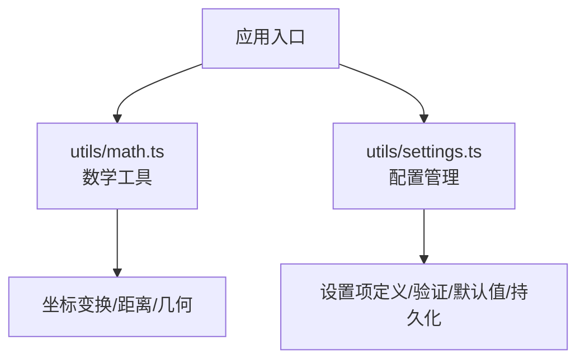
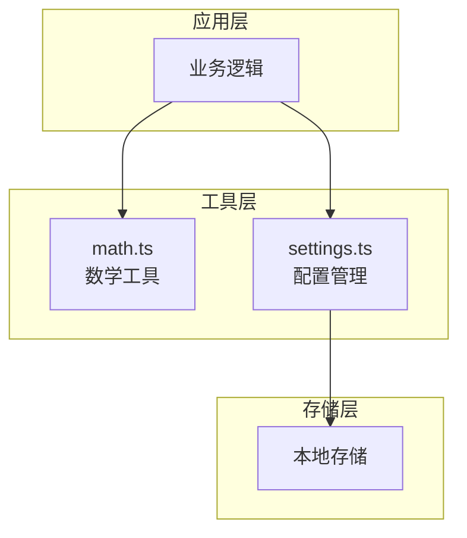
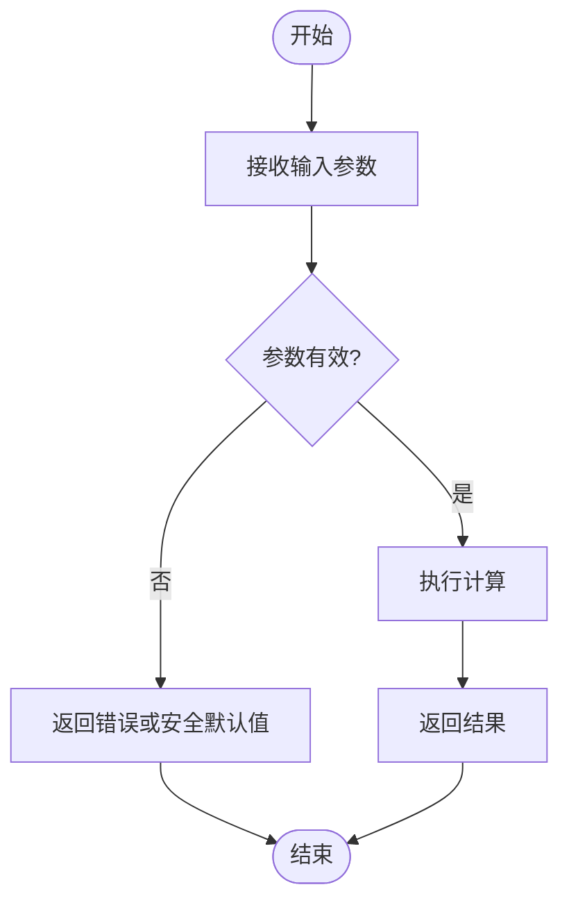
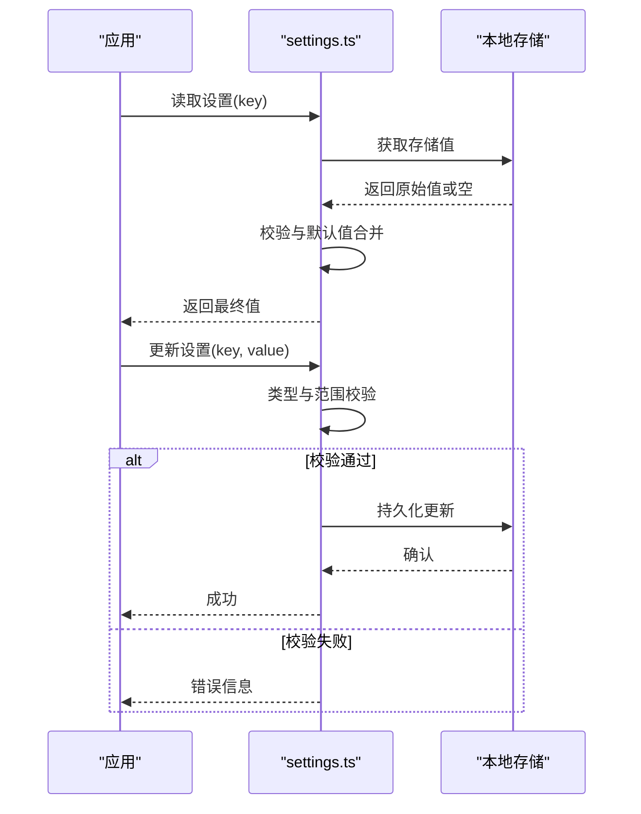
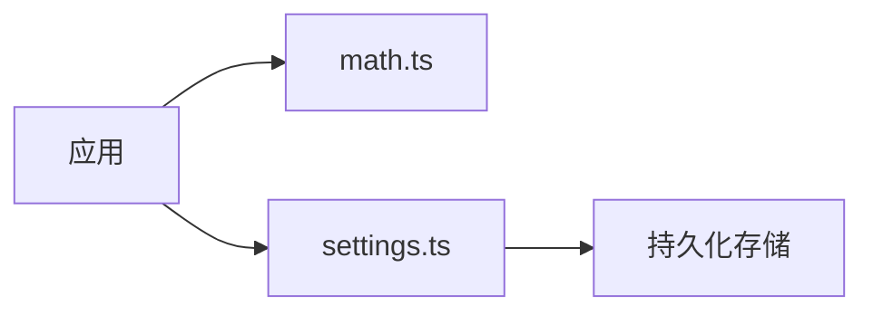

# 工具函数库

<cite>
**本文引用的文件**
- [math.ts](file://src/utils/math.ts)
- [settings.ts](file://src/utils/settings.ts)
</cite>

## 目录
1. [简介](#简介)
2. [项目结构](#项目结构)
3. [核心组件](#核心组件)
4. [架构总览](#架构总览)
5. [详细组件分析](#详细组件分析)
6. [依赖关系分析](#依赖关系分析)
7. [性能考虑](#性能考虑)
8. [故障排查指南](#故障排查指南)
9. [结论](#结论)
10. [附录](#附录)

## 简介
本文件为工具函数库的权威文档，聚焦于以下两个模块：
- math.ts：提供数学计算工具函数，涵盖坐标变换、距离计算与几何运算等常用算法。
- settings.ts：提供配置管理系统，包括设置项定义、验证规则、默认值处理与持久化存储。

文档面向不同技术背景的读者，既提供高层概览，也包含代码级分析与可视化图示，帮助快速理解与扩展。

## 项目结构
本项目采用按功能域组织的方式，工具函数集中在 src/utils 目录下：
- src/utils/math.ts：数学计算工具集合
- src/utils/settings.ts：配置管理与持久化

[本节为概念性说明，不直接分析具体文件，故无“章节来源”]

## 核心组件
- 数学工具（math.ts）
  - 坐标变换：支持二维坐标系之间的转换、旋转、缩放和平移等基础操作。
  - 距离计算：欧氏距离、曼哈顿距离、切比雪夫距离等常见度量。
  - 几何运算：点在线段上的投影、线段相交判断、多边形面积与重心等。
- 配置管理（settings.ts）
  - 设置项定义：以键值对形式声明配置项及其类型、范围、默认值。
  - 验证规则：在写入时进行类型与范围校验，确保数据一致性。
  - 默认值处理：缺失或非法值自动回退到默认值。
  - 持久化存储：将配置持久化到本地存储，并在启动时加载。

**章节来源**
- [math.ts:1-200](file://src/utils/math.ts#L1-L200)
- [settings.ts:1-200](file://src/utils/settings.ts#L1-L200)

## 架构总览
下图展示了工具函数库的整体交互：应用通过统一接口调用数学工具与配置管理；配置管理负责读取、验证与持久化；数学工具提供纯函数式计算能力，便于复用与测试。

**图表来源**
- [math.ts:1-200](file://src/utils/math.ts#L1-L200)
- [settings.ts:1-200](file://src/utils/settings.ts#L1-L200)

**章节来源**
- [math.ts:1-200](file://src/utils/math.ts#L1-L200)
- [settings.ts:1-200](file://src/utils/settings.ts#L1-L200)

## 详细组件分析

### 数学工具（math.ts）
- 设计原则
  - 纯函数：输入确定则输出确定，无副作用，便于测试与缓存。
  - 参数校验：对边界条件与异常输入进行防御性检查，返回明确错误信息或安全默认值。
  - 可组合：基础算子可组合成更复杂的几何运算。
- 关键能力
  - 坐标变换：平移、旋转、缩放、仿射变换矩阵等。
  - 距离计算：多种距离度量，支持批量计算。
  - 几何运算：点线关系、线段相交、多边形面积与重心、凸包等。
- 复杂度与优化
  - 多数基础运算为 O(1)，复杂几何如凸包为 O(n log n)。
  - 避免重复计算，必要时引入缓存策略。
- 使用示例（描述性）
  - 计算两点间欧氏距离：传入两个二维点坐标，返回距离数值。
  - 将点绕原点旋转指定角度：返回新坐标。
  - 判断两条线段是否相交：返回布尔值。
- 扩展方法
  - 新增几何算子时，遵循纯函数约定，补充单元测试与文档注释。
  - 保持命名一致性与参数顺序一致，便于组合。

**图表来源**
- [math.ts:1-200](file://src/utils/math.ts#L1-L200)

**章节来源**
- [math.ts:1-200](file://src/utils/math.ts#L1-L200)

### 配置管理（settings.ts）
- 设计原则
  - 单一事实源：所有设置项集中定义，避免散落配置。
  - 强类型与验证：写入时进行类型与范围校验，失败时拒绝并记录原因。
  - 默认值优先：缺失或非法值自动回退到默认值，保证系统稳定。
  - 持久化透明：读写封装，上层无需关心存储细节。
- 关键能力
  - 设置项定义：键名、类型、取值范围、默认值、描述。
  - 验证规则：类型检查、范围检查、自定义校验器。
  - 默认值处理：合并用户配置与默认配置。
  - 持久化存储：读取、保存、增量更新、版本迁移。
- 使用示例（描述性）
  - 读取某项设置：若不存在则返回默认值。
  - 更新某项设置：先验证再持久化，返回成功状态。
  - 批量导入配置：合并并校验后覆盖现有配置。
- 扩展方法
  - 新增设置项时，同步更新定义、验证规则与文档。
  - 对敏感信息进行加密或脱敏处理。

**图表来源**
- [settings.ts:1-200](file://src/utils/settings.ts#L1-L200)

**章节来源**
- [settings.ts:1-200](file://src/utils/settings.ts#L1-L200)

## 依赖关系分析
- 内部依赖
  - 数学工具为纯函数模块，几乎无外部依赖，易于集成。
  - 配置管理可能依赖本地存储接口，但通过抽象层隔离实现。
- 外部依赖
  - 根据运行环境选择合适存储后端（如浏览器 localStorage、桌面端文件系统）。
- 耦合与内聚
  - 高内聚：每个模块职责清晰。
  - 低耦合：通过接口与约定减少相互影响。

**图表来源**
- [math.ts:1-200](file://src/utils/math.ts#L1-L200)
- [settings.ts:1-200](file://src/utils/settings.ts#L1-L200)

**章节来源**
- [math.ts:1-200](file://src/utils/math.ts#L1-L200)
- [settings.ts:1-200](file://src/utils/settings.ts#L1-L200)

## 性能考虑
- 数学工具
  - 避免不必要的对象创建，尽量使用基本类型与数组缓冲。
  - 对批量计算采用向量化或并行化思路（视平台能力）。
  - 对昂贵计算引入缓存（如最近邻查询、变换矩阵重用）。
- 配置管理
  - 延迟加载与按需读取，减少启动开销。
  - 增量更新与差异持久化，降低 I/O 压力。
  - 校验失败快速失败，避免无效写盘。
- 最佳实践
  - 对热点路径进行基准测试，定位瓶颈。
  - 合理拆分模块，避免单文件过大导致解析与加载成本上升。

[本节为通用指导，不直接分析具体文件，故无“章节来源”]

## 故障排查指南
- 常见问题
  - 数学计算出现 NaN/Infinity：检查输入范围与除零情况。
  - 配置写入失败：查看校验错误日志与存储权限。
  - 默认值未生效：确认键名拼写与类型匹配。
- 调试建议
  - 启用详细日志，记录输入、中间结果与错误堆栈。
  - 使用最小复现用例隔离问题。
  - 对关键路径添加断言与单元测试。

**章节来源**
- [math.ts:1-200](file://src/utils/math.ts#L1-L200)
- [settings.ts:1-200](file://src/utils/settings.ts#L1-L200)

## 结论
本工具函数库以清晰的职责划分与稳定的接口设计，为应用提供可靠的数学计算与配置管理能力。通过纯函数、强校验与持久化封装，提升了可维护性与可扩展性。建议在实际使用中遵循本文档的设计原则与最佳实践，持续完善测试与文档。

[本节为总结性内容，不直接分析具体文件，故无“章节来源”]

## 附录
- 如何添加新的工具函数
  - 在对应模块中新增函数，遵循纯函数约定与参数校验。
  - 编写单元测试与使用示例，确保行为正确。
  - 更新文档与类型定义，保持一致性。
- 保持代码一致性
  - 统一命名风格与参数顺序。
  - 统一的错误处理与日志格式。
  - 定期代码审查与自动化检查。

[本节为操作性指导，不直接分析具体文件，故无“章节来源”]