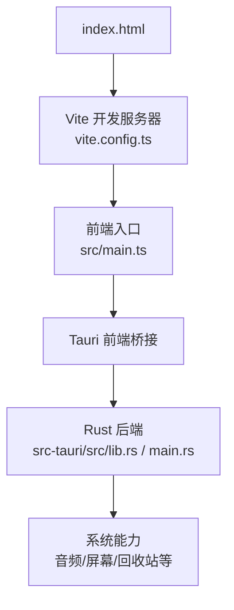
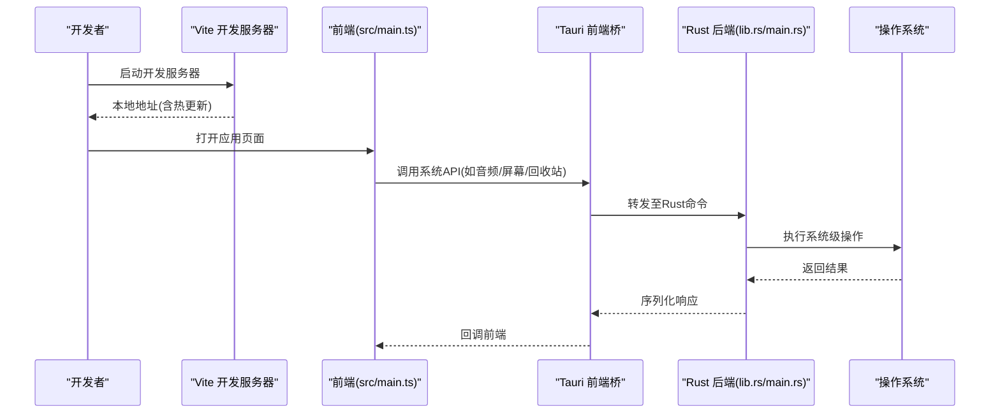
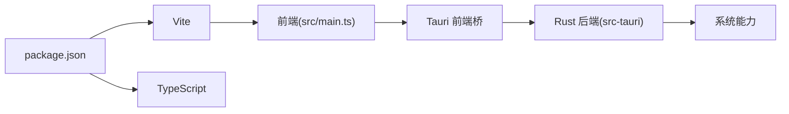

# 快速开始

<cite>
**本文引用的文件**
- [package.json](file://package.json)
- [vite.config.ts](file://vite.config.ts)
- [tsconfig.json](file://tsconfig.json)
- [index.html](file://index.html)
- [src/main.ts](file://src/main.ts)
- [src-tauri/Cargo.toml](file://src-tauri/Cargo.toml)
- [src-tauri/tauri.conf.json](file://src-tauri/tauri.conf.json)
- [src-tauri/src/lib.rs](file://src-tauri/src/lib.rs)
- [src-tauri/src/main.rs](file://src-tauri/src/main.rs)
- [启动桌宠.dev.bat](file://启动桌宠.dev.bat)
</cite>

## 目录
1. [简介](#简介)
2. [项目结构](#项目结构)
3. [核心组件](#核心组件)
4. [架构总览](#架构总览)
5. [详细组件分析](#详细组件分析)
6. [依赖分析](#依赖分析)
7. [性能注意事项](#性能注意事项)
8. [故障排除指南](#故障排除指南)
9. [结论](#结论)
10. [附录](#附录)

## 简介
本指南面向首次接触本项目的开发者，目标是帮助你在最短时间内完成环境准备、安装依赖并成功运行桌面宠物应用。本项目采用 Tauri + Vite + TypeScript 的前后端一体化方案：前端使用 Vite 构建与开发服务器，Rust 作为后端通过 Tauri 提供系统级能力（如音频、屏幕、回收站等）。文档同时覆盖 Windows、macOS 与 Linux 的常见差异与注意事项。

## 项目结构
- 前端资源与页面入口位于根目录与 src 目录：
  - index.html：应用 HTML 入口
  - vite.config.ts：Vite 构建配置
  - tsconfig.json：TypeScript 编译选项
  - package.json：Node.js 依赖与脚本命令
  - src/main.ts：前端主入口逻辑
- Rust/Tauri 后端位于 src-tauri：
  - Cargo.toml：Rust 包元数据
  - tauri.conf.json：Tauri 应用配置
  - src/lib.rs、src/main.rs：Rust 后端逻辑与 Tauri 插件注册
- 其他：
  - public/models/manifest.json：模型清单
  - scripts/：辅助脚本
  - 启动桌宠.dev.bat：Windows 快捷启动脚本

图表来源
- [index.html:1-200](file://index.html#L1-L200)
- [vite.config.ts:1-200](file://vite.config.ts#L1-L200)
- [src/main.ts:1-200](file://src/main.ts#L1-L200)
- [src-tauri/src/lib.rs:1-200](file://src-tauri/src/lib.rs#L1-L200)
- [src-tauri/src/main.rs:1-200](file://src-tauri/src/main.rs#L1-L200)

章节来源
- [package.json:1-200](file://package.json#L1-L200)
- [vite.config.ts:1-200](file://vite.config.ts#L1-L200)
- [tsconfig.json:1-200](file://tsconfig.json#L1-L200)
- [index.html:1-200](file://index.html#L1-L200)
- [src/main.ts:1-200](file://src/main.ts#L1-L200)
- [src-tauri/Cargo.toml:1-200](file://src-tauri/Cargo.toml#L1-L200)
- [src-tauri/tauri.conf.json:1-200](file://src-tauri/tauri.conf.json#L1-L200)

## 核心组件
- 前端运行时
  - Vite 开发服务器：负责热更新、模块打包与静态资源服务
  - TypeScript 编译：类型检查与转译
  - 主入口：初始化 UI、事件绑定与与 Tauri 后端的通信
- 后端运行时
  - Tauri 应用：封装系统 API，暴露给前端调用
  - Rust 模块：实现音频分析、屏幕捕获、回收站操作等能力

章节来源
- [vite.config.ts:1-200](file://vite.config.ts#L1-L200)
- [tsconfig.json:1-200](file://tsconfig.json#L1-L200)
- [src/main.ts:1-200](file://src/main.ts#L1-L200)
- [src-tauri/src/lib.rs:1-200](file://src-tauri/src/lib.rs#L1-L200)
- [src-tauri/src/main.rs:1-200](file://src-tauri/src/main.rs#L1-L200)

## 架构总览
下图展示了从浏览器到系统能力的完整链路：HTML 由 Vite 提供服务，前端通过 Tauri 调用 Rust 后端，最终访问操作系统能力。

图表来源
- [vite.config.ts:1-200](file://vite.config.ts#L1-L200)
- [src/main.ts:1-200](file://src/main.ts#L1-L200)
- [src-tauri/src/lib.rs:1-200](file://src-tauri/src/lib.rs#L1-L200)
- [src-tauri/src/main.rs:1-200](file://src-tauri/src/main.rs#L1-L200)

## 详细组件分析

### 环境与系统要求
- Node.js
  - 版本建议：根据包管理器与依赖兼容性选择 LTS 版本
  - 验证方式：在终端执行版本查看命令，确认已安装且可用
- Rust 工具链
  - 需要 rustc、cargo 以及 Tauri 所需的系统依赖（如 macOS 上的 Xcode 命令行工具、Linux 上的 webkitgtk 等）
  - 验证方式：执行 cargo --version 与 rustc --version
- 平台特定说明
  - Windows：确保已安装 Visual Studio Build Tools 或所需编译器；可使用提供的批处理脚本快速启动
  - macOS：需安装 Xcode Command Line Tools；若遇到签名或权限问题，按提示授权
  - Linux：需安装 webkitgtk 及相关开发库；不同发行版包名略有差异

章节来源
- [package.json:1-200](file://package.json#L1-L200)
- [src-tauri/Cargo.toml:1-200](file://src-tauri/Cargo.toml#L1-L200)
- [启动桌宠.dev.bat:1-200](file://启动桌宠.dev.bat#L1-L200)

### 依赖安装步骤
- 安装 Node.js 依赖
  - 在项目根目录执行包管理器安装命令（npm/yarn/pnpm），等待依赖下载完成
- 安装 Rust 与 Tauri 系统依赖
  - 使用 rustup 安装最新稳定版工具链
  - 根据平台安装 Tauri 所需的系统库（例如 macOS 的 xcode-select --install，Linux 的 webkitgtk 开发包）
- 验证安装
  - 运行开发服务器与构建命令，确认无报错

章节来源
- [package.json:1-200](file://package.json#L1-L200)
- [src-tauri/Cargo.toml:1-200](file://src-tauri/Cargo.toml#L1-L200)

### 开发服务器启动方法
- 通用流程
  - 安装依赖后，启动 Vite 开发服务器，自动打开应用窗口进行调试
  - 修改代码后，Vite 会热更新前端资源，无需重启
- 平台差异
  - Windows：可直接运行提供的批处理脚本以简化启动流程
  - macOS/Linux：通过包管理器脚本启动开发服务器
- 常见问题
  - 端口占用：如遇端口冲突，可修改配置或关闭占用进程
  - 代理/镜像：网络受限环境下配置国内镜像加速依赖安装

章节来源
- [vite.config.ts:1-200](file://vite.config.ts#L1-L200)
- [package.json:1-200](file://package.json#L1-L200)
- [启动桌宠.dev.bat:1-200](file://启动桌宠.dev.bat#L1-L200)

### 项目结构概览（目录职责）
- 根目录
  - index.html：应用入口页面
  - package.json：Node 依赖与脚本命令
  - vite.config.ts：Vite 构建与开发服务器配置
  - tsconfig.json：TypeScript 编译选项
- src：前端源码
  - main.ts：前端主入口，初始化界面与事件
  - 其他子目录：功能模块（如 Live2D、UI、工具类等）
- src-tauri：Rust/Tauri 后端
  - Cargo.toml：Rust 包配置
  - tauri.conf.json：Tauri 应用配置（窗口、权限、菜单等）
  - src/lib.rs、src/main.rs：Rust 后端逻辑与命令注册
- public/models：静态资源（如模型清单）
- scripts：辅助脚本（如图标生成、诊断工具）

章节来源
- [index.html:1-200](file://index.html#L1-L200)
- [package.json:1-200](file://package.json#L1-L200)
- [vite.config.ts:1-200](file://vite.config.ts#L1-L200)
- [tsconfig.json:1-200](file://tsconfig.json#L1-L200)
- [src/main.ts:1-200](file://src/main.ts#L1-L200)
- [src-tauri/Cargo.toml:1-200](file://src-tauri/Cargo.toml#L1-L200)
- [src-tauri/tauri.conf.json:1-200](file://src-tauri/tauri.conf.json#L1-L200)
- [src-tauri/src/lib.rs:1-200](file://src-tauri/src/lib.rs#L1-L200)
- [src-tauri/src/main.rs:1-200](file://src-tauri/src/main.rs#L1-L200)

## 依赖分析
- 前端依赖
  - Vite：开发与构建工具
  - TypeScript：类型系统与编译
  - 其他业务依赖：由 package.json 声明
- 后端依赖
  - Tauri：跨平台桌面壳层
  - Rust crates：音频、屏幕、回收站等功能模块
- 依赖关系图

图表来源
- [package.json:1-200](file://package.json#L1-L200)
- [vite.config.ts:1-200](file://vite.config.ts#L1-L200)
- [src/main.ts:1-200](file://src/main.ts#L1-L200)
- [src-tauri/Cargo.toml:1-200](file://src-tauri/Cargo.toml#L1-L200)

章节来源
- [package.json:1-200](file://package.json#L1-L200)
- [src-tauri/Cargo.toml:1-200](file://src-tauri/Cargo.toml#L1-L200)

## 性能注意事项
- 开发阶段
  - 合理使用 Vite 热更新，避免频繁全量刷新
  - 控制日志输出，减少 I/O 开销
- 运行时
  - 合理调度系统级任务（如音频采集、屏幕捕获），避免阻塞主线程
  - 对大文件或高频数据进行缓存与增量更新
- 构建优化
  - 按需引入依赖，减少包体积
  - 启用生产模式构建以获得更好的性能

[本节为通用指导，不直接分析具体文件]

## 故障排除指南
- 无法启动开发服务器
  - 检查 Node.js 版本与包管理器是否可用
  - 清理 node_modules 后重新安装依赖
  - 检查端口占用情况
- Rust/Tauri 相关错误
  - 确认已安装 rustup、cargo 及平台所需系统依赖
  - macOS 上执行必要的命令行工具安装
  - Linux 上安装 webkitgtk 等开发库
- 权限与沙箱问题
  - 在 Tauri 配置中申请必要权限
  - 在系统设置中授予麦克风、屏幕录制等权限
- 网络与镜像
  - 配置 npm/yarn/pnpm 国内镜像源以提升下载速度
  - 代理环境下确保能访问外部资源

章节来源
- [package.json:1-200](file://package.json#L1-L200)
- [src-tauri/tauri.conf.json:1-200](file://src-tauri/tauri.conf.json#L1-L200)
- [启动桌宠.dev.bat:1-200](file://启动桌宠.dev.bat#L1-L200)

## 结论
通过以上步骤，你可以在 Windows、macOS 与 Linux 平台上快速搭建开发环境并运行桌面宠物应用。建议在熟悉基础流程后，进一步阅读各模块源码以理解前后端交互与系统能力集成方式。遇到问题时，优先检查环境版本、依赖安装与权限配置。

[本节为总结性内容，不直接分析具体文件]

## 附录
- 常用命令参考
  - 安装依赖：使用包管理器执行安装命令
  - 启动开发服务器：执行开发脚本
  - 构建发布产物：执行构建脚本
- 平台脚本
  - Windows：可使用提供的批处理脚本快速启动
  - macOS/Linux：通过包管理器脚本启动

章节来源
- [package.json:1-200](file://package.json#L1-L200)
- [启动桌宠.dev.bat:1-200](file://启动桌宠.dev.bat#L1-L200)