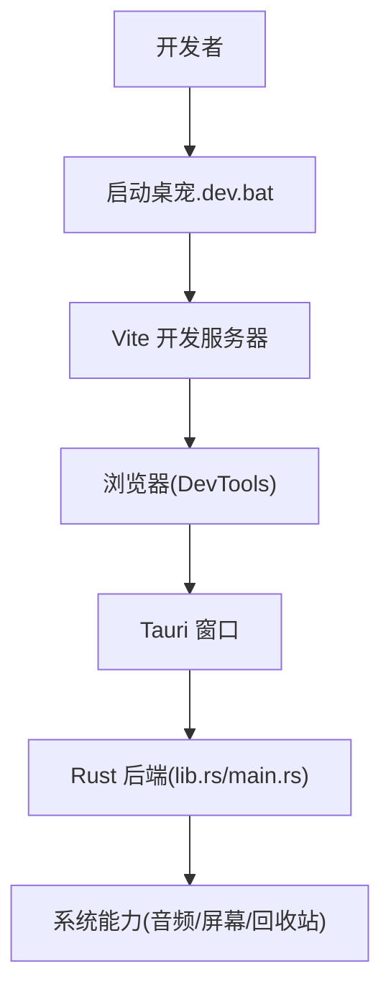
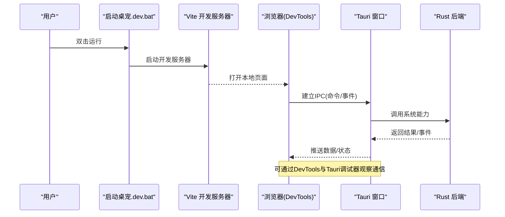
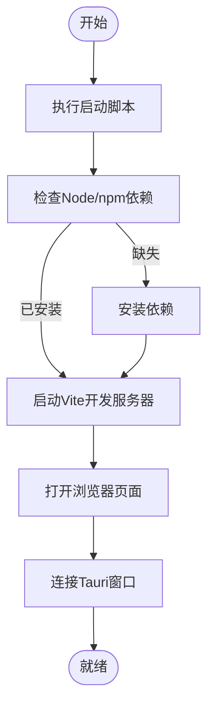
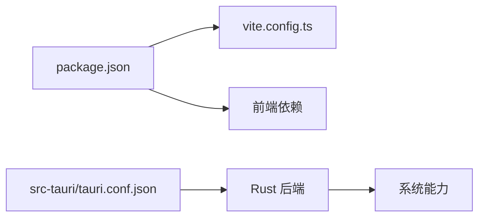

# 故障排除

<cite>
**本文引用的文件**
- [scripts/cdp-diag.mjs](file://scripts/cdp-diag.mjs)
- [启动桌宠.dev.bat](file://启动桌宠.dev.bat)
- [src-tauri/tauri.conf.json](file://src-tauri/tauri.conf.json)
- [src-tauri/src/lib.rs](file://src-tauri/src/lib.rs)
- [src-tauri/src/main.rs](file://src-tauri/src/main.rs)
- [package.json](file://package.json)
- [vite.config.ts](file://vite.config.ts)
- [README.md](file://README.md)
</cite>

## 目录
1. [简介](#简介)
2. [项目结构](#项目结构)
3. [核心组件](#核心组件)
4. [架构总览](#架构总览)
5. [详细组件分析](#详细组件分析)
6. [依赖分析](#依赖分析)
7. [性能注意事项](#性能注意事项)
8. [故障排除指南](#故障排除指南)
9. [结论](#结论)
10. [附录](#附录)

## 简介
本指南面向安装、运行与调试阶段可能遇到的常见问题，提供系统化的排查步骤与解决方案。内容覆盖：
- 安装问题（依赖、权限、端口冲突）
- 运行时错误（Tauri窗口、Rust后端、前端资源加载）
- 性能问题（渲染、音频、屏幕捕获）
- 调试工具使用（Chrome DevTools、Tauri调试器、Rust日志）
- 诊断脚本使用（CDP诊断脚本）
- 错误日志分析方法与问题复现步骤
- 系统信息收集模板与社区支持渠道

## 项目结构
本项目采用 Tauri + Vite + TypeScript 的前后端混合架构：
- 前端：Vite 构建的 Web 应用，通过 Tauri 注入到桌面窗口
- 后端：Rust 编写的原生能力（音频、屏幕、回收站等），通过 Tauri 命令暴露给前端
- 配置：Tauri 配置文件管理窗口、权限、能力集；Vite 配置开发服务器与代理
- 脚本：包含 CDP 诊断脚本与 Windows 快捷启动批处理

**图表来源**
- [启动桌宠.dev.bat](file://启动桌宠.dev.bat)
- [vite.config.ts](file://vite.config.ts)
- [src-tauri/src/lib.rs](file://src-tauri/src/lib.rs)
- [src-tauri/src/main.rs](file://src-tauri/src/main.rs)

**章节来源**
- [启动桌宠.dev.bat](file://启动桌宠.dev.bat)
- [vite.config.ts](file://vite.config.ts)
- [src-tauri/tauri.conf.json](file://src-tauri/tauri.conf.json)
- [src-tauri/src/lib.rs](file://src-tauri/src/lib.rs)
- [src-tauri/src/main.rs](file://src-tauri/src/main.rs)

## 核心组件
- 前端入口与页面：由 Vite 托管，开发时通过浏览器打开并连接 Tauri 窗口
- Tauri 配置：控制窗口行为、能力集、安全策略与调试开关
- Rust 后端：实现音频分析、屏幕捕获、回收站操作等系统级功能，并通过 Tauri 命令暴露
- 诊断脚本：用于检测 Chrome DevTools Protocol（CDP）连通性，辅助定位前端与调试通道问题

**章节来源**
- [src-tauri/tauri.conf.json](file://src-tauri/tauri.conf.json)
- [src-tauri/src/lib.rs](file://src-tauri/src/lib.rs)
- [scripts/cdp-diag.mjs](file://scripts/cdp-diag.mjs)

## 架构总览
下图展示了从启动到前后端交互的关键路径，以及调试工具介入点：

**图表来源**
- [启动桌宠.dev.bat](file://启动桌宠.dev.bat)
- [vite.config.ts](file://vite.config.ts)
- [src-tauri/src/lib.rs](file://src-tauri/src/lib.rs)
- [src-tauri/src/main.rs](file://src-tauri/src/main.rs)

## 详细组件分析

### 启动流程与开发环境
- 启动脚本负责快速拉起开发环境，便于本地调试
- Vite 提供热重载与开发服务器，配合浏览器 DevTools 进行前端调试
- Tauri 窗口承载前端页面，同时桥接 Rust 后端能力

**图表来源**
- [启动桌宠.dev.bat](file://启动桌宠.dev.bat)
- [package.json](file://package.json)
- [vite.config.ts](file://vite.config.ts)

**章节来源**
- [启动桌宠.dev.bat](file://启动桌宠.dev.bat)
- [package.json](file://package.json)
- [vite.config.ts](file://vite.config.ts)

### Tauri 配置与安全策略
- 能力集（capabilities）控制可访问的系统资源与API
- 调试模式影响日志输出与远程调试可用性
- 窗口配置决定初始大小、可见性与行为

建议：
- 在开发环境开启调试模式以获取更详细的日志
- 按需最小化能力集，避免过度授权导致的安全风险

**章节来源**
- [src-tauri/tauri.conf.json](file://src-tauri/tauri.conf.json)

### Rust 后端与系统能力
- 通过 Tauri 命令暴露音频、屏幕、回收站等功能
- 错误应向上层抛出并记录，便于前端或日志系统捕获
- 长时间任务建议使用异步与事件通知，避免阻塞UI线程

建议：
- 对系统调用增加超时与重试机制
- 对异常路径添加明确日志与错误码

**章节来源**
- [src-tauri/src/lib.rs](file://src-tauri/src/lib.rs)
- [src-tauri/src/main.rs](file://src-tauri/src/main.rs)

### 前端与调试集成
- 使用浏览器 DevTools 查看网络请求、控制台日志、性能面板
- 结合 Tauri 调试器观察 IPC 调用栈与返回值
- 使用 CDP 诊断脚本验证调试通道连通性

**章节来源**
- [scripts/cdp-diag.mjs](file://scripts/cdp-diag.mjs)

## 依赖分析
- 前端依赖由 package.json 管理，确保 Node.js 与 npm/yarn/pnpm 版本兼容
- Vite 作为构建与开发服务器，需正确配置代理与端口
- Tauri 依赖 Rust 工具链与平台特定依赖，需按官方文档安装

**图表来源**
- [package.json](file://package.json)
- [vite.config.ts](file://vite.config.ts)
- [src-tauri/tauri.conf.json](file://src-tauri/tauri.conf.json)
- [src-tauri/src/lib.rs](file://src-tauri/src/lib.rs)

**章节来源**
- [package.json](file://package.json)
- [vite.config.ts](file://vite.config.ts)
- [src-tauri/tauri.conf.json](file://src-tauri/tauri.conf.json)

## 性能注意事项
- 音频分析：避免在主线程进行重计算，考虑使用 Web Worker 或后端处理
- 屏幕捕获：限制帧率与区域，减少CPU/GPU占用
- 渲染优化：合并DOM更新，避免频繁重排；合理使用虚拟列表
- 日志级别：生产环境降低日志量，仅保留关键错误与指标

[本节为通用指导，不直接分析具体文件]

## 故障排除指南

### 安装问题
- 现象：依赖安装失败、Node版本不兼容、权限不足
- 排查步骤：
  - 确认 Node.js 与包管理器版本满足要求
  - 清理缓存后重新安装依赖
  - 以管理员身份运行终端，解决写入权限问题
  - 检查代理设置与网络连通性
- 参考：
  - 启动脚本用于快速拉起开发环境
  - 包管理与构建配置位于前端工程根目录

**章节来源**
- [启动桌宠.dev.bat](file://启动桌宠.dev.bat)
- [package.json](file://package.json)

### 运行时错误（前端）
- 现象：页面空白、资源404、JS报错、样式未加载
- 排查步骤：
  - 打开浏览器 DevTools，查看控制台与网络面板
  - 检查 Vite 开发服务器是否正常运行与端口占用
  - 核对静态资源路径与构建产物
  - 若启用代理，检查代理目标可达性
- 参考：
  - 使用 DevTools 断点与源码映射定位问题
  - 检查 Vite 配置中的基础路径与代理规则

**章节来源**
- [vite.config.ts](file://vite.config.ts)

### 运行时错误（Tauri/Rust）
- 现象：窗口无法创建、命令调用失败、崩溃或无响应
- 排查步骤：
  - 启用 Tauri 调试模式，查看窗口与命令日志
  - 检查能力集配置是否允许所需系统资源
  - 在 Rust 后端添加必要日志与错误码
  - 使用平台日志查看器（如 Windows Event Viewer）收集崩溃信息
- 参考：
  - Tauri 配置与后端实现文件

**章节来源**
- [src-tauri/tauri.conf.json](file://src-tauri/tauri.conf.json)
- [src-tauri/src/lib.rs](file://src-tauri/src/lib.rs)
- [src-tauri/src/main.rs](file://src-tauri/src/main.rs)

### 性能问题
- 现象：界面卡顿、CPU/GPU占用高、内存泄漏
- 排查步骤：
  - 使用 DevTools Performance 面板录制并分析瓶颈
  - 检查音频分析与屏幕捕获的频率与范围
  - 减少不必要的重绘与布局抖动
  - 在后端实现长耗时任务的异步化与节流
- 参考：
  - 前端性能面板与后端日志

**章节来源**
- [vite.config.ts](file://vite.config.ts)
- [src-tauri/src/lib.rs](file://src-tauri/src/lib.rs)

### 调试工具使用

#### Chrome DevTools
- 打开方式：F12 或通过菜单“更多工具 > 开发者工具”
- 常用面板：
  - 控制台：查看日志与错误
  - 网络：检查请求与响应
  - 性能：录制与分析性能
  - 源代码：设置断点与单步调试
- 建议：
  - 启用“禁用缓存”以便实时查看变更
  - 使用“设备模拟”测试不同分辨率

[本节为通用指导，不直接分析具体文件]

#### Tauri 调试器
- 启用调试模式：在 Tauri 配置中开启调试选项
- 查看日志：在终端或平台日志查看器中检索 Tauri 输出
- 检查IPC：在 DevTools 控制台或 Tauri 调试插件中观察命令调用

**章节来源**
- [src-tauri/tauri.conf.json](file://src-tauri/tauri.conf.json)

#### Rust 日志输出
- 在关键路径添加日志，包括输入参数、中间结果与异常信息
- 区分日志级别（调试、信息、警告、错误），生产环境降低日志量
- 将错误码与上下文一起记录，便于追踪

**章节来源**
- [src-tauri/src/lib.rs](file://src-tauri/src/lib.rs)
- [src-tauri/src/main.rs](file://src-tauri/src/main.rs)

### 诊断脚本使用（CDP 诊断）
- 用途：检测 Chrome DevTools Protocol 连通性，帮助定位前端与调试通道问题
- 使用方法：
  - 在项目根目录执行诊断脚本
  - 根据输出判断 CDP 是否可用、端口是否被占用、浏览器是否可连接
  - 如遇失败，检查浏览器版本、命令行参数与防火墙设置
- 参考：
  - 诊断脚本位于 scripts 目录

**章节来源**
- [scripts/cdp-diag.mjs](file://scripts/cdp-diag.mjs)

### 错误日志分析方法
- 前端日志：
  - 控制台输出与网络请求详情
  - 使用统一日志封装，记录时间戳与上下文
- 后端日志：
  - 在 Rust 后端记录关键调用与异常堆栈
  - 结合平台日志查看器收集崩溃转储
- 分析技巧：
  - 按时间线串联前后端日志
  - 过滤重复与噪声日志，聚焦关键错误
  - 使用关键字搜索定位问题模块

**章节来源**
- [src-tauri/src/lib.rs](file://src-tauri/src/lib.rs)
- [src-tauri/src/main.rs](file://src-tauri/src/main.rs)

### 问题复现步骤
- 最小化复现：
  - 关闭非必要功能，逐步启用以定位触发点
  - 固定输入数据与环境变量
- 记录信息：
  - 操作步骤、预期结果与实际结果
  - 相关日志片段与截图
- 自动化复现：
  - 编写简单脚本或用例，确保每次一致地触发问题

[本节为通用指导，不直接分析具体文件]

### 系统信息收集模板
提交问题时请附带以下信息：
- 操作系统版本与架构
- Node.js 与包管理器版本
- Tauri 与 Rust 工具链版本
- 浏览器类型与版本（如适用）
- 启动方式（开发/生产）与命令行参数
- 相关日志（前端控制台、后端日志、平台日志）
- 问题复现步骤与期望行为

[本节为通用指导，不直接分析具体文件]

### 社区支持与获取帮助
- 查阅项目 README，了解基本用法与常见问题
- 在社区论坛或讨论区搜索类似问题
- 提交 Issue 时附上系统信息与日志
- 参与贡献与反馈，帮助改进项目稳定性

**章节来源**
- [README.md](file://README.md)

## 结论
通过系统化的安装检查、运行时调试、性能分析与日志方法，大多数问题可在本地快速定位与修复。建议：
- 始终启用调试模式进行开发与问题复现
- 保持日志完整且结构化，便于跨团队协作
- 使用诊断脚本与 DevTools 提高排查效率
- 遇到问题及时收集系统信息并寻求社区支持

[本节为总结性内容，不直接分析具体文件]

## 附录
- 常见命令与脚本位置：
  - 启动脚本：启动桌宠.dev.bat
  - 诊断脚本：scripts/cdp-diag.mjs
  - 前端配置：vite.config.ts、package.json
  - Tauri 配置：src-tauri/tauri.conf.json
  - 后端实现：src-tauri/src/lib.rs、src-tauri/src/main.rs

[本节为索引性内容，不直接分析具体文件]