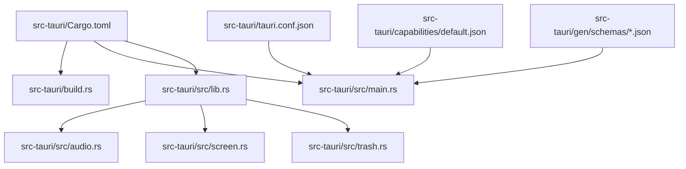
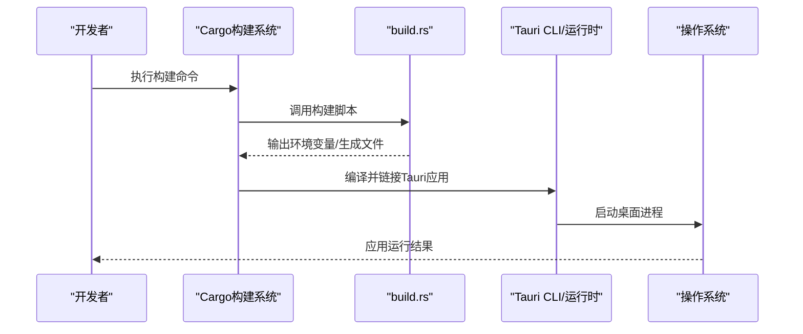
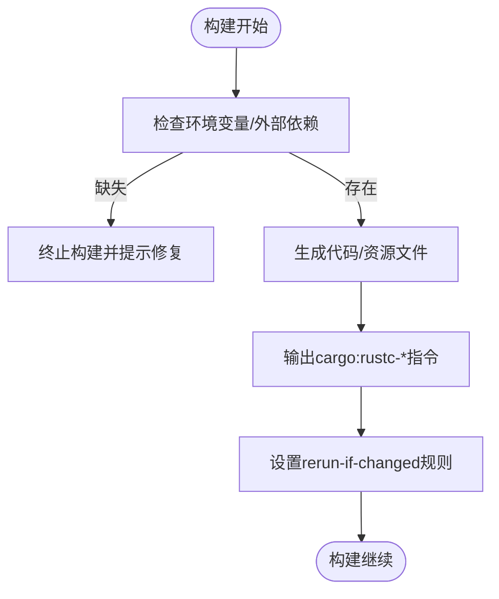
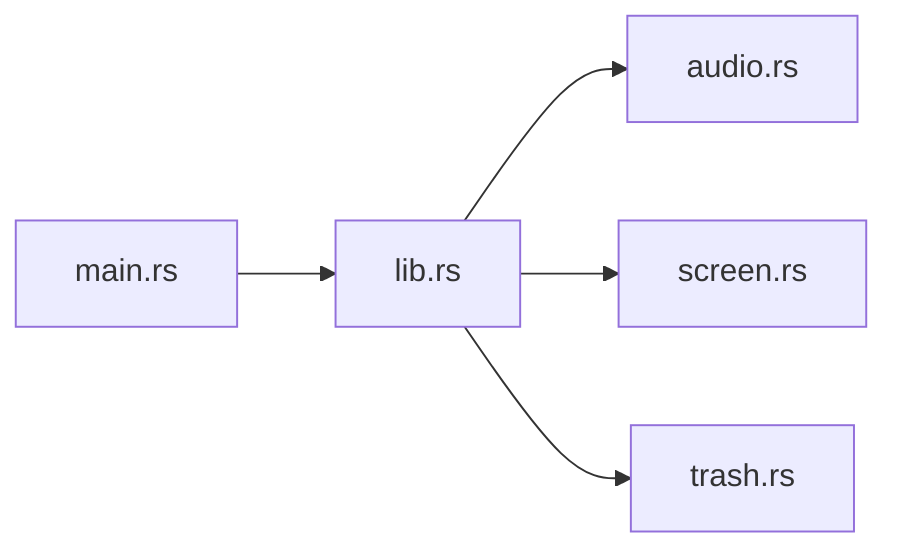
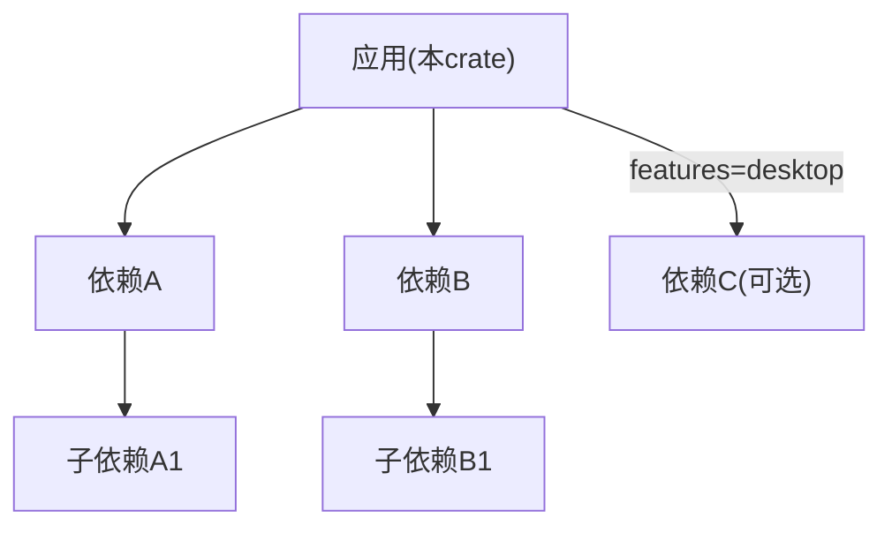

# Rust后端构建

<cite>
**本文引用的文件**
- [Cargo.toml](file://src-tauri/Cargo.toml)
- [build.rs](file://src-tauri/build.rs)
- [main.rs](file://src-tauri/src/main.rs)
- [lib.rs](file://src-tauri/src/lib.rs)
- [audio.rs](file://src-tauri/src/audio.rs)
- [screen.rs](file://src-tauri/src/screen.rs)
- [trash.rs](file://src-tauri/src/trash.rs)
- [tauri.conf.json](file://src-tauri/tauri.conf.json)
- [capabilities/default.json](file://src-tauri/capabilities/default.json)
- [gen/schemas/capabilities.json](file://src-tauri/gen/schemas/capabilities.json)
- [gen/schemas/desktop-schema.json](file://src-tauri/gen/schemas/desktop-schema.json)
- [gen/schemas/windows-schema.json](file://src-tauri/gen/schemas/windows-schema.json)
</cite>

## 目录
1. [简介](#简介)
2. [项目结构](#项目结构)
3. [核心组件](#核心组件)
4. [架构总览](#架构总览)
5. [详细组件分析](#详细组件分析)
6. [依赖关系分析](#依赖关系分析)
7. [性能考虑](#性能考虑)
8. [故障排查指南](#故障排查指南)
9. [结论](#结论)
10. [附录](#附录)

## 简介
本指南面向Rust后端（Tauri应用）的构建与发布，聚焦以下目标：
- 解释 Cargo.toml 的作用：依赖声明、特性开关、构建目标设置。
- 说明 build.rs 的功能：预处理步骤、文件生成、平台特定配置。
- 阐述Rust项目的依赖管理机制：版本锁定、条件编译、可选依赖。
- 提供跨平台交叉编译配置：Windows、macOS、Linux原生构建。
- 给出调试配置与性能分析工具使用建议。

## 项目结构
本项目采用Tauri工程组织方式：前端资源位于根目录，Rust后端位于 src-tauri。关键目录与职责如下：
- src-tauri/Cargo.toml：定义包名、版本、依赖、特性、构建目标等。
- src-tauri/build.rs：构建时脚本，用于在编译前执行预处理或生成代码/资源。
- src-tauri/src/main.rs：桌面端入口，负责启动Tauri应用。
- src-tauri/src/lib.rs：库入口，暴露给前端调用的命令/插件逻辑。
- src-tauri/src/*.rs：功能模块（音频、屏幕、回收站等）。
- src-tauri/tauri.conf.json：Tauri应用配置（窗口、权限、捆绑产物等）。
- src-tauri/capabilities/* 与 gen/schemas/*：能力与权限Schema，由Tauri工具链生成/管理。

图表来源
- [Cargo.toml:1-200](file://src-tauri/Cargo.toml#L1-L200)
- [build.rs:1-200](file://src-tauri/build.rs#L1-L200)
- [main.rs:1-200](file://src-tauri/src/main.rs#L1-L200)
- [lib.rs:1-200](file://src-tauri/src/lib.rs#L1-L200)
- [tauri.conf.json:1-200](file://src-tauri/tauri.conf.json#L1-L200)

章节来源
- [Cargo.toml:1-200](file://src-tauri/Cargo.toml#L1-L200)
- [build.rs:1-200](file://src-tauri/build.rs#L1-L200)
- [main.rs:1-200](file://src-tauri/src/main.rs#L1-L200)
- [lib.rs:1-200](file://src-tauri/src/lib.rs#L1-L200)
- [tauri.conf.json:1-200](file://src-tauri/tauri.conf.json#L1-L200)

## 核心组件
- Cargo.toml：集中声明包元数据、依赖项、特性标志、构建目标、打包配置等。是构建系统的核心配置文件。
- build.rs：在编译阶段运行，可完成预处理、生成代码/资源、读取环境变量、按平台差异化处理等。
- main.rs：桌面端进程入口，初始化Tauri运行时并注册命令/插件。
- lib.rs：库入口，聚合业务模块并向Tauri暴露API。
- 功能模块：audio.rs、screen.rs、trash.rs 分别实现音频、屏幕、回收站相关能力。
- tauri.conf.json：控制Tauri行为（窗口、权限、图标、Bundle产物等）。
- capabilities 与 schemas：权限模型与JSON Schema，确保前后端能力契约一致。

章节来源
- [Cargo.toml:1-200](file://src-tauri/Cargo.toml#L1-L200)
- [build.rs:1-200](file://src-tauri/build.rs#L1-L200)
- [main.rs:1-200](file://src-tauri/src/main.rs#L1-L200)
- [lib.rs:1-200](file://src-tauri/src/lib.rs#L1-L200)
- [audio.rs:1-200](file://src-tauri/src/audio.rs#L1-L200)
- [screen.rs:1-200](file://src-tauri/src/screen.rs#L1-L200)
- [trash.rs:1-200](file://src-tauri/src/trash.rs#L1-L200)
- [tauri.conf.json:1-200](file://src-tauri/tauri.conf.json#L1-L200)
- [capabilities/default.json:1-200](file://src-tauri/capabilities/default.json#L1-L200)
- [gen/schemas/capabilities.json:1-200](file://src-tauri/gen/schemas/capabilities.json#L1-L200)
- [gen/schemas/desktop-schema.json:1-200](file://src-tauri/gen/schemas/desktop-schema.json#L1-L200)
- [gen/schemas/windows-schema.json:1-200](file://src-tauri/gen/schemas/windows-schema.json#L1-L200)

## 架构总览
下图展示了从构建到运行的关键路径：Cargo解析配置→执行构建脚本→编译Rust源码→链接Tauri运行时→生成桌面应用。

图表来源
- [Cargo.toml:1-200](file://src-tauri/Cargo.toml#L1-L200)
- [build.rs:1-200](file://src-tauri/build.rs#L1-L200)
- [main.rs:1-200](file://src-tauri/src/main.rs#L1-L200)

## 详细组件分析

### Cargo.toml：依赖、特性与构建目标
- 依赖声明：集中列出运行时依赖与开发依赖，便于版本管理与复用。
- 特性开关：通过 features 为不同场景启用/禁用功能（如仅桌面端特性、调试特性等），实现条件编译。
- 构建目标：指定 target 三元组（如 x86_64-pc-windows-msvc、aarch64-apple-darwin、x86_64-unknown-linux-gnu）以支持多平台构建。
- 与Tauri集成：通常包含 tauri 与 tauri-build 等依赖，配合 tauri.conf.json 完成打包与权限配置。

章节来源
- [Cargo.toml:1-200](file://src-tauri/Cargo.toml#L1-L200)

### build.rs：预处理、文件生成与平台配置
- 预处理：在编译前读取环境变量、检查外部工具或SDK是否存在，必要时中止构建并提示安装要求。
- 文件生成：根据模板或配置生成Rust源文件或资源文件，减少重复代码并保证一致性。
- 平台特定配置：依据目标平台设置编译标志、链接参数或选择不同实现分支。
- 与Cargo交互：通过 cargo:rustc-* 指令注入编译信息，或通过 cargo:rerun-if-changed 触发增量重建。

图表来源
- [build.rs:1-200](file://src-tauri/build.rs#L1-L200)

章节来源
- [build.rs:1-200](file://src-tauri/build.rs#L1-L200)

### 主程序与库入口：main.rs 与 lib.rs
- main.rs：初始化Tauri应用、加载配置、注册命令/插件、启动事件循环。
- lib.rs：作为库入口，聚合业务模块并通过Tauri暴露命令接口；同时可作为其他crate的依赖。
- 模块划分：audio.rs、screen.rs、trash.rs 分别封装具体能力，保持高内聚低耦合。

图表来源
- [main.rs:1-200](file://src-tauri/src/main.rs#L1-L200)
- [lib.rs:1-200](file://src-tauri/src/lib.rs#L1-L200)
- [audio.rs:1-200](file://src-tauri/src/audio.rs#L1-L200)
- [screen.rs:1-200](file://src-tauri/src/screen.rs#L1-L200)
- [trash.rs:1-200](file://src-tauri/src/trash.rs#L1-L200)

章节来源
- [main.rs:1-200](file://src-tauri/src/main.rs#L1-L200)
- [lib.rs:1-200](file://src-tauri/src/lib.rs#L1-L200)
- [audio.rs:1-200](file://src-tauri/src/audio.rs#L1-L200)
- [screen.rs:1-200](file://src-tauri/src/screen.rs#L1-L200)
- [trash.rs:1-200](file://src-tauri/src/trash.rs#L1-L200)

### Tauri配置与权限：tauri.conf.json 与 capabilities/schemas
- tauri.conf.json：定义窗口、菜单、权限、图标、Bundle产物等，影响最终桌面应用的形态与行为。
- capabilities/default.json：声明应用可用能力集合，供前端校验与授权。
- gen/schemas/*.json：由Tauri工具链生成的Schema，确保前后端能力契约一致，提升安全性与可维护性。

章节来源
- [tauri.conf.json:1-200](file://src-tauri/tauri.conf.json#L1-L200)
- [capabilities/default.json:1-200](file://src-tauri/capabilities/default.json#L1-L200)
- [gen/schemas/capabilities.json:1-200](file://src-tauri/gen/schemas/capabilities.json#L1-L200)
- [gen/schemas/desktop-schema.json:1-200](file://src-tauri/gen/schemas/desktop-schema.json#L1-L200)
- [gen/schemas/windows-schema.json:1-200](file://src-tauri/gen/schemas/windows-schema.json#L1-L200)

## 依赖关系分析
- 直接依赖：Cargo.toml 中声明的 crate，包括Tauri生态（如 tauri、tauri-build）与业务所需第三方库。
- 间接依赖：由Cargo解析并锁定在 Cargo.lock 中，确保构建可重现。
- 条件依赖：通过 features 与 cfg 表达式在不同平台/模式下启用不同依赖。
- 可选依赖：通过 optional = true 声明，仅在显式启用特性时被引入。

图表来源
- [Cargo.toml:1-200](file://src-tauri/Cargo.toml#L1-L200)

章节来源
- [Cargo.toml:1-200](file://src-tauri/Cargo.toml#L1-L200)

## 性能考虑
- 构建优化：使用 release 模式进行构建以获得更优性能；结合 lto、strip 等选项减小体积并提升运行速度。
- 依赖裁剪：通过 features 仅启用必要功能，减少二进制体积与启动开销。
- I/O与并发：对音频、屏幕捕获等重I/O操作，合理拆分任务并使用异步/线程池避免阻塞UI。
- 缓存与增量构建：利用 Cargo 增量编译与 build.rs 的 rerun-if-changed 机制，缩短迭代时间。
- 性能剖析：在release下使用采样器或火焰图定位热点，结合日志与指标持续优化。

[本节为通用指导，不直接分析具体文件]

## 故障排查指南
- 构建失败：检查 build.rs 的环境变量与外部依赖是否满足；查看Cargo输出中的错误上下文。
- 权限问题：确认 tauri.conf.json 与 capabilities 配置与实际能力需求一致；重新生成 schemas 后重试。
- 平台差异：针对不同目标平台检查工具链与SDK安装情况；必要时调整链接参数或启用平台特性。
- 依赖冲突：升级或降级依赖版本，必要时使用 Cargo.lock 锁定版本；通过 cargo tree 分析依赖树。
- 调试技巧：启用 debug assertions；使用日志宏记录关键路径；在IDE中配置断点与变量监视。

章节来源
- [build.rs:1-200](file://src-tauri/build.rs#L1-L200)
- [tauri.conf.json:1-200](file://src-tauri/tauri.conf.json#L1-L200)
- [capabilities/default.json:1-200](file://src-tauri/capabilities/default.json#L1-L200)

## 结论
本指南围绕Rust后端（Tauri）的构建体系展开，明确了 Cargo.toml 与 build.rs 的职责边界，梳理了依赖管理与条件编译策略，并提供了跨平台构建与调试优化的实践建议。遵循本文流程，可在多平台上稳定地构建、调试与发布桌面应用。

[本节为总结性内容，不直接分析具体文件]

## 附录

### 依赖管理机制要点
- 版本锁定：Cargo.lock 固定所有依赖版本，确保团队与CI构建一致。
- 条件编译：使用 features 与 cfg 表达式按平台/模式切换实现。
- 可选依赖：通过 optional 与 features 按需引入，降低默认体积。
- 更新策略：定期更新依赖并回归测试，关注安全公告与兼容性变更。

章节来源
- [Cargo.toml:1-200](file://src-tauri/Cargo.toml#L1-L200)

### 交叉编译配置（Windows、macOS、Linux）
- Windows：安装MSVC工具链或MinGW，配置目标为 x86_64-pc-windows-msvc 或 i686-pc-windows-msvc。
- macOS：安装Xcode命令行工具，配置目标为 aarch64-apple-darwin 或 x86_64-apple-darwin。
- Linux：安装对应架构的glibc/静态库，配置目标为 x86_64-unknown-linux-gnu 或 musl 目标。
- 注意事项：确保各平台的外部依赖（如系统库）已正确安装；必要时在 build.rs 中注入平台特定的链接参数。

[本节为通用指导，不直接分析具体文件]

### 调试与性能分析
- 调试：启用 debug=true，使用 IDE 断点、日志与变量观察；针对Tauri命令添加输入输出校验与错误返回。
- 性能分析：在release模式下使用采样器（如perf、 Instruments、ETW）或火焰图工具定位瓶颈；结合内存分析工具检测泄漏。
- 基准测试：为关键算法编写基准测试，评估优化效果。

[本节为通用指导，不直接分析具体文件]