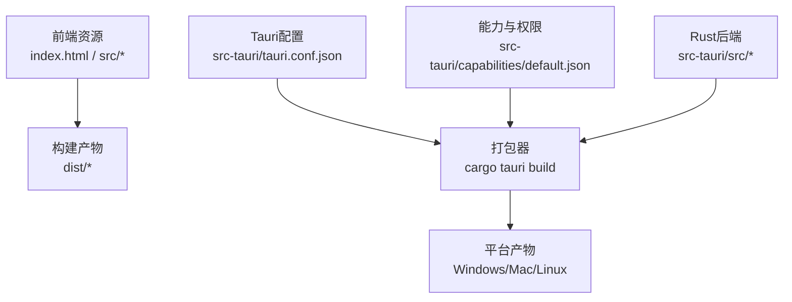
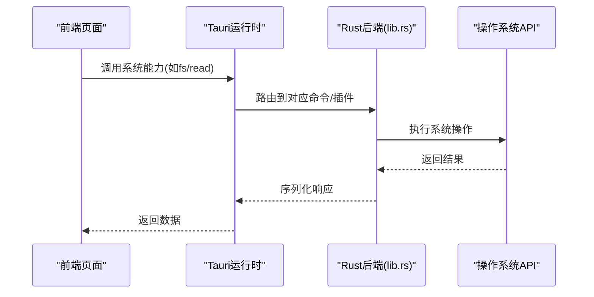
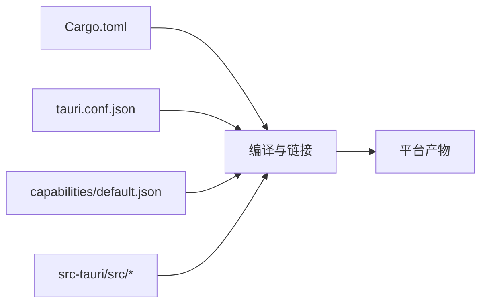

# Tauri打包发布

<cite>
**本文引用的文件**
- [tauri.conf.json](file://src-tauri/tauri.conf.json)
- [default.json](file://src-tauri/capabilities/default.json)
- [lib.rs](file://src-tauri/src/lib.rs)
- [main.rs](file://src-tauri/src/main.rs)
- [Cargo.toml](file://src-tauri/Cargo.toml)
- [build.rs](file://src-tauri/build.rs)
</cite>

## 目录
1. [简介](#简介)
2. [项目结构](#项目结构)
3. [核心组件](#核心组件)
4. [架构总览](#架构总览)
5. [详细组件分析](#详细组件分析)
6. [依赖分析](#依赖分析)
7. [性能考虑](#性能考虑)
8. [故障排查指南](#故障排查指南)
9. [结论](#结论)
10. [附录](#附录)

## 简介
本指南面向使用Tauri构建桌面应用的开发者，聚焦“打包与发布”的完整流程。内容涵盖：
- tauri.conf.json配置详解（应用元数据、窗口、安全策略、资源管理）
- 权限系统capabilities的配置方法（文件系统访问、网络请求、系统API调用）
- 多平台打包流程（Windows安装包、macOS应用程序包、Linux发行版）
- 应用签名与验证配置（确保安全性与完整性）
- 发布渠道配置与自动更新机制设置

## 项目结构
本项目采用标准Tauri工程布局：前端资源位于根目录，Rust后端位于src-tauri目录，Tauri配置集中在src-tauri/tauri.conf.json，能力与权限在src-tauri/capabilities下定义，Rust入口与插件逻辑在src-tauri/src中。

图表来源
- [tauri.conf.json:1-200](file://src-tauri/tauri.conf.json#L1-L200)
- [default.json:1-200](file://src-tauri/capabilities/default.json#L1-L200)
- [lib.rs:1-200](file://src-tauri/src/lib.rs#L1-L200)
- [main.rs:1-200](file://src-tauri/src/main.rs#L1-L200)

章节来源
- [tauri.conf.json:1-200](file://src-tauri/tauri.conf.json#L1-L200)
- [default.json:1-200](file://src-tauri/capabilities/default.json#L1-L200)
- [lib.rs:1-200](file://src-tauri/src/lib.rs#L1-L200)
- [main.rs:1-200](file://src-tauri/src/main.rs#L1-L200)

## 核心组件
- 应用元数据与窗口：由tauri.conf.json集中管理，包括应用名称、标识符、版本、图标、启动页面、窗口尺寸与行为等。
- 安全策略与能力：通过capabilities/default.json声明前端可使用的系统能力（如文件系统、网络、剪贴板等），并在构建时生成schema校验。
- Rust后端与插件：在src-tauri/src中实现业务逻辑与系统交互，通过lib.rs注册命令或插件，main.rs作为程序入口。
- 构建脚本：build.rs可用于自定义构建前/后处理（例如生成资源、执行代码生成）。

章节来源
- [tauri.conf.json:1-200](file://src-tauri/tauri.conf.json#L1-L200)
- [default.json:1-200](file://src-tauri/capabilities/default.json#L1-L200)
- [lib.rs:1-200](file://src-tauri/src/lib.rs#L1-L200)
- [main.rs:1-200](file://src-tauri/src/main.rs#L1-L200)
- [build.rs:1-200](file://src-tauri/build.rs#L1-L200)

## 架构总览
下图展示了从前端到Rust后端再到系统能力的调用链，以及打包产物如何形成。

图表来源
- [lib.rs:1-200](file://src-tauri/src/lib.rs#L1-L200)
- [main.rs:1-200](file://src-tauri/src/main.rs#L1-L200)
- [tauri.conf.json:1-200](file://src-tauri/tauri.conf.json#L1-L200)

## 详细组件分析

### tauri.conf.json 配置详解
该文件是Tauri打包的核心配置，建议按以下维度组织与审查：
- 应用元数据
  - 应用名称、唯一标识符、版本号、描述、作者、许可证等
  - 图标集路径（用于各平台生成不同尺寸图标）
- 窗口配置
  - 启动URL（本地静态资源或远程地址）
  - 窗口大小、最小/最大尺寸、是否全屏、是否透明、是否无边框等
  - 开发模式下的调试选项（如启用DevTools）
- 安全策略
  - CSP（内容安全策略）限制
  - 协议白名单（允许加载的协议）
  - 与capabilities配合的最小权限原则
- 资源管理
  - 将静态资源纳入打包范围
  - 外部二进制或模型文件的包含与路径映射
- 构建与目标平台
  - 指定构建目标（x86_64、aarch64等）
  - 是否启用Webview相关特性
  - 输出目录与产物命名规则

章节来源
- [tauri.conf.json:1-200](file://src-tauri/tauri.conf.json#L1-L200)

### 权限系统 capabilities 配置
capabilities定义了前端可访问的系统能力集合，遵循最小权限原则：
- 文件系统访问
  - 仅授予必要的读/写/列举权限
  - 限定作用域（如仅限应用数据目录或用户指定目录）
- 网络请求
  - 配置允许的域名与协议
  - 限制跨域与代理行为
- 系统API调用
  - 剪贴板、对话框、进程管理等能力按需开启
- 作用域与粒度
  - 可为不同窗口或模块定义独立的能力集
  - 结合tRPC/命令层进行二次鉴权

章节来源
- [default.json:1-200](file://src-tauri/capabilities/default.json#L1-L200)

### Rust后端与命令注册
- lib.rs负责注册命令、插件与事件总线，暴露给前端调用
- main.rs作为程序入口，初始化Tauri应用并加载配置
- 建议在lib.rs中集中管理能力路由，便于权限审计与扩展

章节来源
- [lib.rs:1-200](file://src-tauri/src/lib.rs#L1-L200)
- [main.rs:1-200](file://src-tauri/src/main.rs#L1-L200)

### 构建脚本 build.rs
- 可在构建前/后执行自定义任务（如生成资源、下载依赖、预处理文件）
- 常用于自动化图标生成、模型文件打包、版本注入等

章节来源
- [build.rs:1-200](file://src-tauri/build.rs#L1-L200)

## 依赖分析
- Cargo.toml声明了Rust依赖与Tauri插件，影响最终产物体积与功能
- 构建阶段会解析tauri.conf.json与capabilities，生成对应的schema与权限约束
- 前端静态资源将被打包进应用包，受CSP与能力控制

图表来源
- [Cargo.toml:1-200](file://src-tauri/Cargo.toml#L1-L200)
- [tauri.conf.json:1-200](file://src-tauri/tauri.conf.json#L1-L200)
- [default.json:1-200](file://src-tauri/capabilities/default.json#L1-L200)
- [lib.rs:1-200](file://src-tauri/src/lib.rs#L1-L200)

章节来源
- [Cargo.toml:1-200](file://src-tauri/Cargo.toml#L1-L200)
- [tauri.conf.json:1-200](file://src-tauri/tauri.conf.json#L1-L200)
- [default.json:1-200](file://src-tauri/capabilities/default.json#L1-L200)

## 性能考虑
- 精简capabilities：仅开启必要能力，减少攻击面与运行时开销
- 合理划分窗口：避免单窗口承载过多逻辑，降低内存占用
- 资源优化：压缩图片与模型，按需加载；将大资源放入外部目录并通过相对路径引用
- 构建优化：关闭不必要的调试符号，选择Release构建，按需裁剪Rust依赖

## 故障排查指南
- 权限不足
  - 检查capabilities是否授予相应能力与作用域
  - 确认前端调用的命令是否在lib.rs中正确注册
- 资源未找到
  - 核对tauri.conf.json中的资源路径与构建输出目录
  - 确认build.rs是否正确复制/生成所需文件
- 构建失败
  - 检查Cargo.toml依赖版本与平台工具链
  - 查看构建日志定位具体错误位置
- 安全策略拦截
  - 调整CSP与协议白名单，确保合法资源可被加载
  - 对网络请求配置可信域名与协议

章节来源
- [default.json:1-200](file://src-tauri/capabilities/default.json#L1-L200)
- [lib.rs:1-200](file://src-tauri/src/lib.rs#L1-L200)
- [tauri.conf.json:1-200](file://src-tauri/tauri.conf.json#L1-L200)
- [build.rs:1-200](file://src-tauri/build.rs#L1-L200)

## 结论
通过合理的tauri.conf.json配置、严格的capabilities权限管理、清晰的Rust后端职责划分以及规范的构建脚本，可实现安全、可维护且高效的Tauri应用打包与发布。在多平台上，应统一配置元数据与窗口行为，并结合签名与校验机制保障应用完整性。

## 附录

### 多平台打包流程（概览）
- Windows
  - 准备安装包签名证书
  - 配置tauri.conf.json的Windows目标与安装程序选项
  - 执行构建命令生成安装包
- macOS
  - 准备开发者证书与配置文件
  - 配置macOS目标、签名与Notarization
  - 执行构建命令生成.app与.dmg
- Linux
  - 选择发行版目标（deb/rpm/appimage等）
  - 配置依赖与图标
  - 执行构建命令生成安装包

[本节为概念性说明，不直接分析具体文件]

### 应用签名与验证（概览）
- Windows：使用代码签名证书对安装包与二进制签名
- macOS：对二进制与应用包签名，并可选择提交公证
- Linux：可选GPG签名与校验哈希文件

[本节为概念性说明，不直接分析具体文件]

### 发布渠道与自动更新（概览）
- 发布渠道：配置GitHub Releases或其他分发源
- 自动更新：在tauri.conf.json中设置更新服务器与校验规则
- 安全校验：启用签名校验与完整性检查，防止篡改

[本节为概念性说明，不直接分析具体文件]