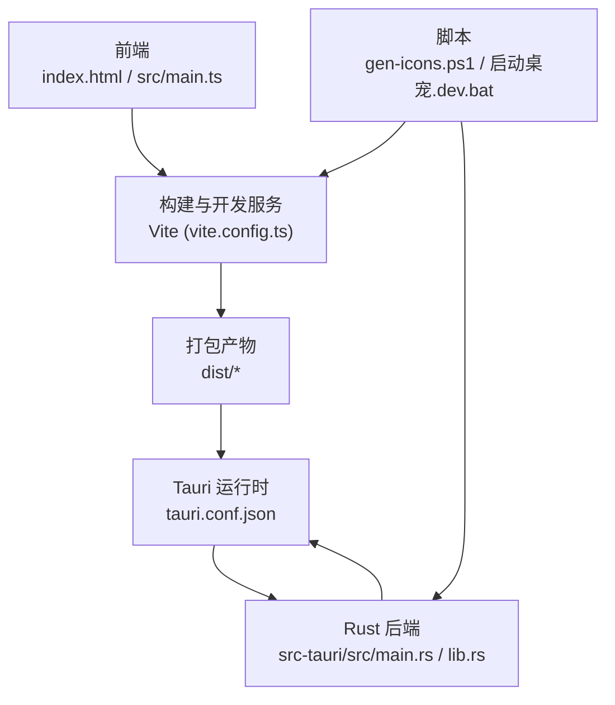
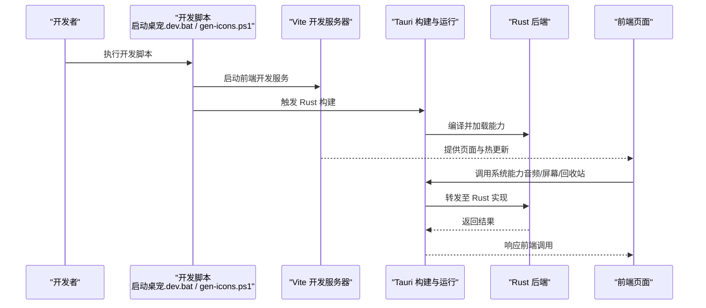
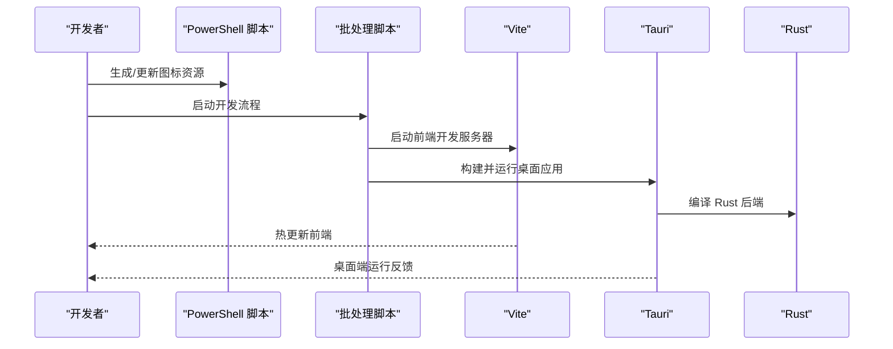
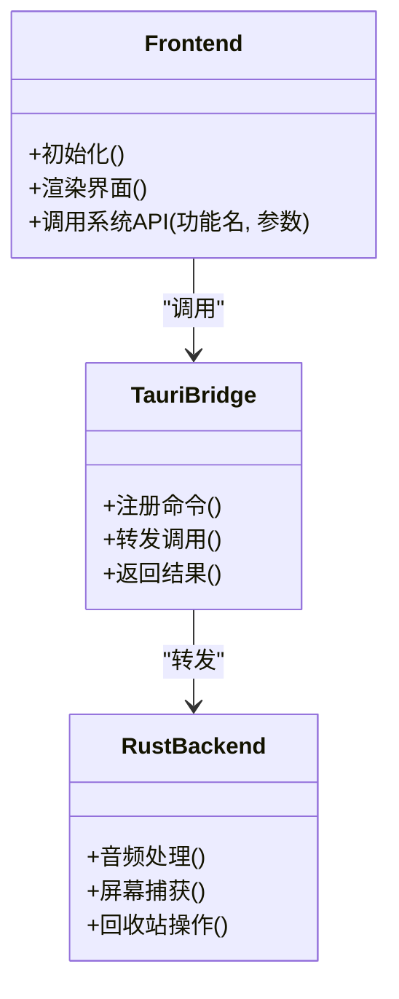
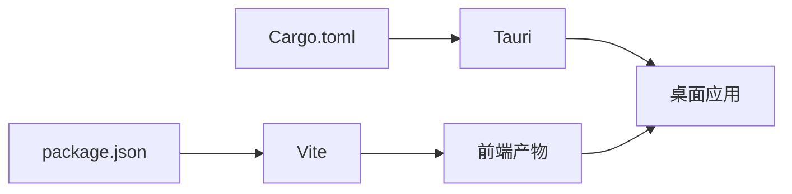

# 开发工作流

<cite>
**本文引用的文件**
- [package.json](file://package.json)
- [vite.config.ts](file://vite.config.ts)
- [tsconfig.json](file://tsconfig.json)
- [启动桌宠.dev.bat](file://启动桌宠.dev.bat)
- [scripts/gen-icons.ps1](file://scripts/gen-icons.ps1)
- [src-tauri/Cargo.toml](file://src-tauri/Cargo.toml)
- [src-tauri/tauri.conf.json](file://src-tauri/tauri.conf.json)
- [src-tauri/build.rs](file://src-tauri/build.rs)
- [src-tauri/src/main.rs](file://src-tauri/src/main.rs)
- [src-tauri/src/lib.rs](file://src-tauri/src/lib.rs)
- [.gitignore](file://.gitignore)
- [README.md](file://README.md)
</cite>

## 目录
1. [简介](#简介)
2. [项目结构](#项目结构)
3. [核心组件](#核心组件)
4. [架构总览](#架构总览)
5. [详细组件分析](#详细组件分析)
6. [依赖关系分析](#依赖关系分析)
7. [性能考虑](#性能考虑)
8. [故障排查指南](#故障排查指南)
9. [结论](#结论)
10. [附录](#附录)

## 简介
本文件面向本地开发者，提供端到端的开发工作流说明。内容涵盖：
- 本地环境搭建（Node.js、Rust）
- 依赖安装与开发服务器启动
- 开发脚本使用（Windows 批处理与 PowerShell）
- 版本控制配置（.gitignore 规则与提交规范建议）
- 图标生成工具用法（尺寸转换与格式转换）
- 开发最佳实践（代码格式化、错误处理、日志记录）

## 项目结构
本项目采用 Tauri 桌面应用架构：前端基于 Vite + TypeScript，后端通过 Rust 提供系统能力（音频、屏幕、回收站等）。关键目录与职责如下：
- 前端资源与入口
  - index.html：应用入口页面
  - src/main.ts：前端主逻辑入口
  - vite.config.ts：Vite 构建与开发服务器配置
  - tsconfig.json：TypeScript 编译选项
  - package.json：NPM 脚本、依赖与工程元信息
- 后端 Rust 模块
  - src-tauri/src/main.rs：Tauri 应用进程入口
  - src-tauri/src/lib.rs：Rust 侧能力注册与桥接
  - src-tauri/Cargo.toml：Rust 依赖与特性开关
  - src-tauri/tauri.conf.json：Tauri 应用配置（窗口、权限、资源等）
  - src-tauri/build.rs：构建期脚本（如生成 schema）
- 工具与脚本
  - scripts/gen-icons.ps1：PowerShell 图标生成脚本
  - 启动桌宠.dev.bat：Windows 开发快捷启动脚本
- 其他
  - .gitignore：版本控制忽略规则
  - README.md：项目说明

**图表来源**
- [vite.config.ts:1-200](file://vite.config.ts#L1-L200)
- [src-tauri/src/main.rs:1-200](file://src-tauri/src/main.rs#L1-L200)
- [src-tauri/src/lib.rs:1-200](file://src-tauri/src/lib.rs#L1-L200)
- [src-tauri/tauri.conf.json:1-200](file://src-tauri/tauri.conf.json#L1-L200)
- [scripts/gen-icons.ps1:1-200](file://scripts/gen-icons.ps1#L1-L200)
- [启动桌宠.dev.bat:1-200](file://启动桌宠.dev.bat#L1-L200)

**章节来源**
- [package.json:1-200](file://package.json#L1-L200)
- [vite.config.ts:1-200](file://vite.config.ts#L1-L200)
- [tsconfig.json:1-200](file://tsconfig.json#L1-L200)
- [src-tauri/Cargo.toml:1-200](file://src-tauri/Cargo.toml#L1-L200)
- [src-tauri/tauri.conf.json:1-200](file://src-tauri/tauri.conf.json#L1-L200)
- [src-tauri/build.rs:1-200](file://src-tauri/build.rs#L1-L200)
- [src-tauri/src/main.rs:1-200](file://src-tauri/src/main.rs#L1-L200)
- [src-tauri/src/lib.rs:1-200](file://src-tauri/src/lib.rs#L1-L200)
- [scripts/gen-icons.ps1:1-200](file://scripts/gen-icons.ps1#L1-L200)
- [启动桌宠.dev.bat:1-200](file://启动桌宠.dev.bat#L1-L200)
- [.gitignore:1-200](file://.gitignore#L1-L200)
- [README.md:1-200](file://README.md#L1-L200)

## 核心组件
- 前端构建与服务
  - Vite 负责开发服务器与热更新，TypeScript 提供类型检查与编译
  - 入口为 index.html，业务逻辑从 src/main.ts 开始
- 后端能力
  - Tauri 将 Rust 函数暴露给前端调用，实现系统级能力（音频、屏幕、回收站等）
  - 通过 Cargo.toml 管理 Rust 依赖，build.rs 在构建时生成必要文件
- 脚本与自动化
  - PowerShell 脚本用于图标资源生成
  - Windows 批处理脚本用于一键启动开发流程

**章节来源**
- [package.json:1-200](file://package.json#L1-L200)
- [vite.config.ts:1-200](file://vite.config.ts#L1-L200)
- [src-tauri/Cargo.toml:1-200](file://src-tauri/Cargo.toml#L1-L200)
- [src-tauri/build.rs:1-200](file://src-tauri/build.rs#L1-L200)
- [scripts/gen-icons.ps1:1-200](file://scripts/gen-icons.ps1#L1-L200)
- [启动桌宠.dev.bat:1-200](file://启动桌宠.dev.bat#L1-L200)

## 架构总览
下图展示了开发到运行的整体流程：开发者运行脚本后，Vite 启动前端开发服务器并监听变更；Tauri 构建 Rust 后端并与前端产物集成；最终在桌面端运行。

**图表来源**
- [启动桌宠.dev.bat:1-200](file://启动桌宠.dev.bat#L1-L200)
- [scripts/gen-icons.ps1:1-200](file://scripts/gen-icons.ps1#L1-L200)
- [vite.config.ts:1-200](file://vite.config.ts#L1-L200)
- [src-tauri/src/main.rs:1-200](file://src-tauri/src/main.rs#L1-L200)
- [src-tauri/src/lib.rs:1-200](file://src-tauri/src/lib.rs#L1-L200)

## 详细组件分析

### 本地开发环境搭建
- Node.js 环境
  - 确保已安装 Node.js 与 npm（或 pnpm/yarn）
  - 在项目根目录执行依赖安装命令以拉取前端依赖
- Rust 环境
  - 安装 Rust 工具链（rustup），确保包含 cargo 与 rustc
  - 若需跨平台目标，按提示添加相应 target
- 依赖安装
  - 前端依赖由 NPM 管理，位于 package.json
  - Rust 依赖由 Cargo 管理，位于 src-tauri/Cargo.toml
- 开发服务器启动
  - 使用 Vite 启动前端开发服务器，支持热更新
  - 使用 Tauri CLI 启动桌面应用，自动构建 Rust 后端并注入前端产物

**章节来源**
- [package.json:1-200](file://package.json#L1-L200)
- [src-tauri/Cargo.toml:1-200](file://src-tauri/Cargo.toml#L1-L200)
- [vite.config.ts:1-200](file://vite.config.ts#L1-L200)

### 开发脚本使用说明
- Windows 批处理脚本（启动桌宠.dev.bat）
  - 作用：一键启动前端开发服务与 Tauri 应用，简化本地调试流程
  - 典型行为：先安装/更新依赖，再并行或串行启动 Vite 与 Tauri
  - 适用场景：Windows 环境下快速进入开发状态
- PowerShell 脚本（scripts/gen-icons.ps1）
  - 作用：生成或转换图标资源，支持多尺寸与多格式输出
  - 典型行为：读取源图标，按配置生成不同分辨率与格式的图标文件
  - 适用场景：维护应用图标集，保证各平台一致性

**章节来源**
- [启动桌宠.dev.bat:1-200](file://启动桌宠.dev.bat#L1-L200)
- [scripts/gen-icons.ps1:1-200](file://scripts/gen-icons.ps1#L1-L200)

### 版本控制配置与提交规范
- .gitignore 规则
  - 忽略构建产物、依赖目录、临时文件与平台特定文件
  - 常见条目包括 node_modules、dist、target、*.log 等
- 提交规范建议
  - 使用语义化提交信息（feat、fix、docs、refactor、chore 等）
  - 提交前进行本地检查（类型检查、格式化、测试）
  - 对敏感配置与密钥不要提交到仓库

**章节来源**
- [.gitignore:1-200](file://.gitignore#L1-L200)

### 图标生成工具用法
- 输入与输出
  - 输入：源图标文件（推荐 PNG/SVG）
  - 输出：多尺寸与多格式的图标集合（适配桌面与移动端）
- 使用方法
  - 在 PowerShell 中执行脚本，指定源路径与输出目录
  - 脚本会按预设尺寸生成对应图标，并写入目标目录
- 注意事项
  - 确保系统已安装所需图像处理工具（如 ImageMagick 或相关依赖）
  - 保持源图标质量，避免缩放失真

**章节来源**
- [scripts/gen-icons.ps1:1-200](file://scripts/gen-icons.ps1#L1-L200)

### 开发与构建流程（序列图）

**图表来源**
- [scripts/gen-icons.ps1:1-200](file://scripts/gen-icons.ps1#L1-L200)
- [启动桌宠.dev.bat:1-200](file://启动桌宠.dev.bat#L1-L200)
- [vite.config.ts:1-200](file://vite.config.ts#L1-L200)
- [src-tauri/src/main.rs:1-200](file://src-tauri/src/main.rs#L1-L200)
- [src-tauri/src/lib.rs:1-200](file://src-tauri/src/lib.rs#L1-L200)

### 前端与后端交互（类图）

**图表来源**
- [src-tauri/src/lib.rs:1-200](file://src-tauri/src/lib.rs#L1-L200)
- [src-tauri/src/main.rs:1-200](file://src-tauri/src/main.rs#L1-L200)

## 依赖关系分析
- 前端依赖
  - 由 package.json 声明，包含构建工具、运行时库与开发工具
- Rust 依赖
  - 由 Cargo.toml 声明，包含 Tauri 框架与系统能力库
- 构建与运行
  - Vite 负责前端构建与开发服务
  - Tauri 负责整合前后端并生成桌面应用

**图表来源**
- [package.json:1-200](file://package.json#L1-L200)
- [src-tauri/Cargo.toml:1-200](file://src-tauri/Cargo.toml#L1-L200)
- [vite.config.ts:1-200](file://vite.config.ts#L1-L200)
- [src-tauri/tauri.conf.json:1-200](file://src-tauri/tauri.conf.json#L1-L200)

**章节来源**
- [package.json:1-200](file://package.json#L1-L200)
- [src-tauri/Cargo.toml:1-200](file://src-tauri/Cargo.toml#L1-L200)

## 性能考虑
- 前端
  - 合理使用懒加载与按需引入，减少首屏体积
  - 利用 Vite 的 HMR 提升开发体验
- 后端
  - 避免阻塞式 I/O，尽量异步处理耗时任务
  - 合理设置日志级别，生产环境降低冗余日志
- 构建
  - 启用增量构建与缓存，缩短构建时间
  - 优化资源压缩与图片尺寸

[本节为通用指导，不直接分析具体文件]

## 故障排查指南
- 常见问题
  - 端口占用：修改 Vite 端口或释放占用端口
  - Rust 编译失败：检查工具链版本与目标平台是否匹配
  - 图标生成失败：确认图像处理工具已安装且环境变量正确
- 日志与调试
  - 前端：浏览器控制台查看错误与网络请求
  - 后端：Tauri 日志与 Rust 标准输出，结合日志级别定位问题
- 回滚与恢复
  - 清理依赖与构建缓存后重新安装
  - 回退到稳定分支或标签进行对比验证

**章节来源**
- [vite.config.ts:1-200](file://vite.config.ts#L1-L200)
- [src-tauri/tauri.conf.json:1-200](file://src-tauri/tauri.conf.json#L1-L200)
- [src-tauri/src/main.rs:1-200](file://src-tauri/src/main.rs#L1-L200)

## 结论
通过本工作流文档，开发者可以快速搭建本地环境、理解前后端交互、使用脚本提升效率，并遵循良好的版本控制与编码实践。建议在团队内统一脚本与环境配置，确保一致的开发体验与交付质量。

[本节为总结性内容，不直接分析具体文件]

## 附录
- 常用命令参考
  - 安装依赖：根据 package.json 中的脚本执行
  - 启动开发：使用批处理脚本或命令行组合
  - 生成图标：执行 PowerShell 脚本并传入参数
- 配置文件位置
  - 前端构建：vite.config.ts
  - TypeScript：tsconfig.json
  - Rust 配置：src-tauri/Cargo.toml 与 tauri.conf.json
  - 忽略规则：.gitignore

**章节来源**
- [package.json:1-200](file://package.json#L1-L200)
- [vite.config.ts:1-200](file://vite.config.ts#L1-L200)
- [tsconfig.json:1-200](file://tsconfig.json#L1-L200)
- [src-tauri/Cargo.toml:1-200](file://src-tauri/Cargo.toml#L1-L200)
- [src-tauri/tauri.conf.json:1-200](file://src-tauri/tauri.conf.json#L1-L200)
- [.gitignore:1-200](file://.gitignore#L1-L200)