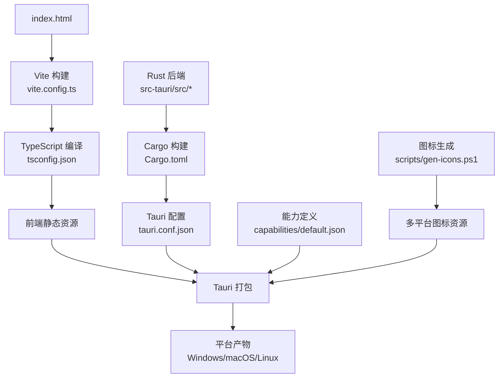
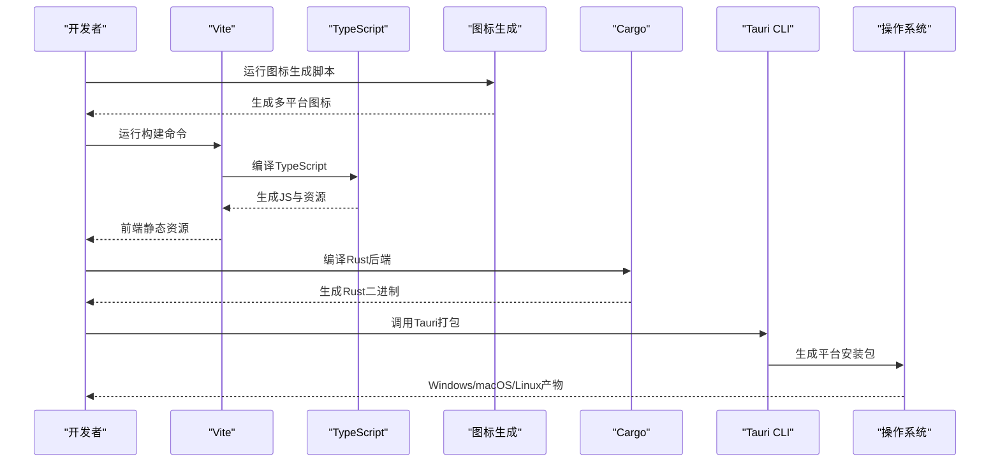
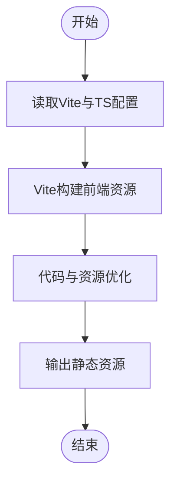
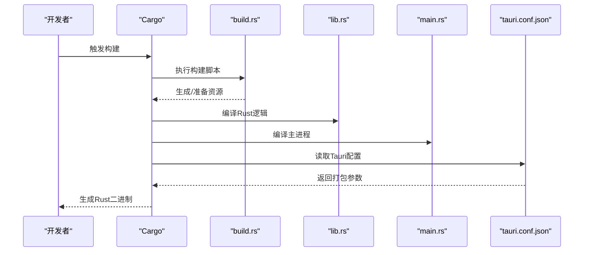
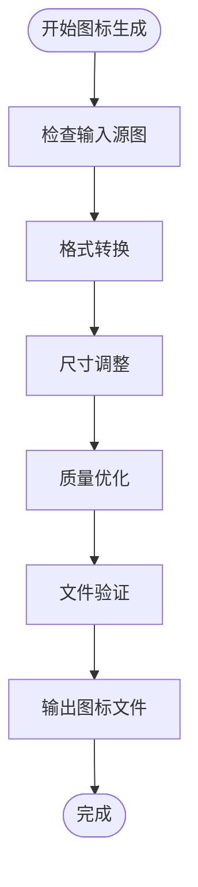
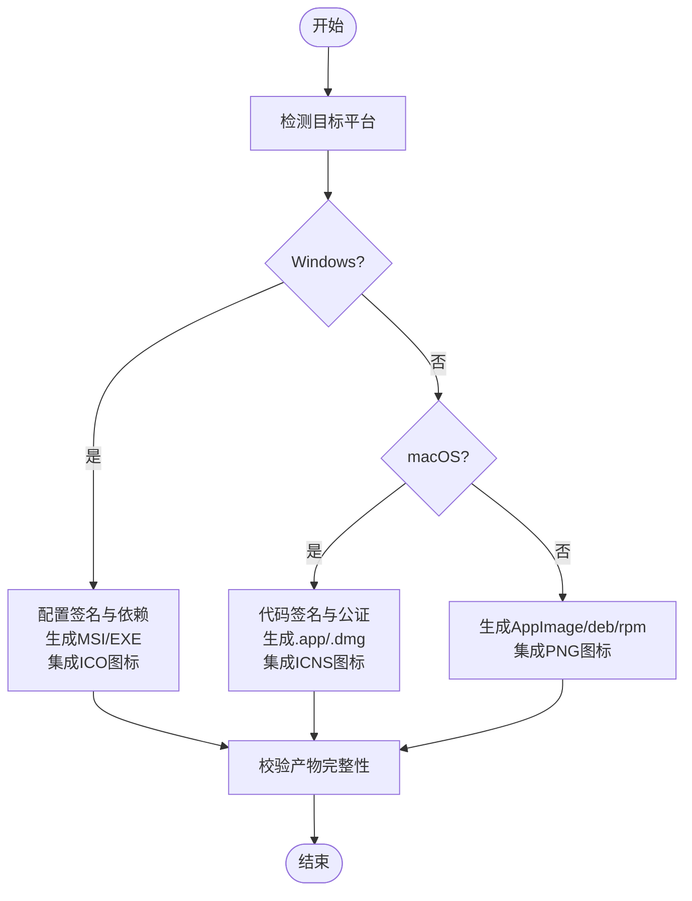
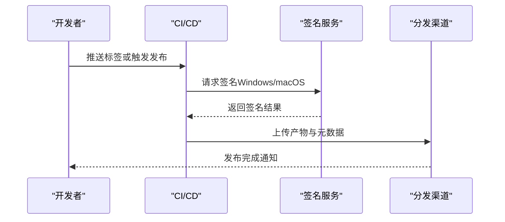
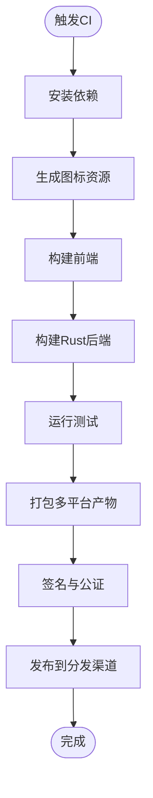
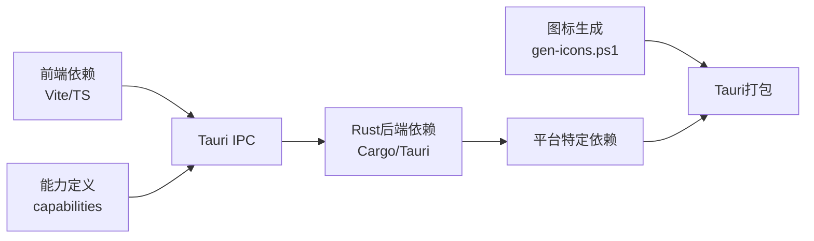

# 构建与部署

<cite>
**本文引用的文件**
- [vite.config.ts](file://vite.config.ts)
- [tsconfig.json](file://tsconfig.json)
- [package.json](file://package.json)
- [index.html](file://index.html)
- [src/main.ts](file://src/main.ts)
- [src-tauri/Cargo.toml](file://src-tauri/Cargo.toml)
- [src-tauri/build.rs](file://src-tauri/build.rs)
- [src-tauri/tauri.conf.json](file://src-tauri/tauri.conf.json)
- [src-tauri/src/lib.rs](file://src-tauri/src/lib.rs)
- [src-tauri/src/main.rs](file://src-tauri/src/main.rs)
- [src-tauri/capabilities/default.json](file://src-tauri/capabilities/default.json)
- [scripts/gen-icons.ps1](file://scripts/gen-icons.ps1)
</cite>

## 更新摘要
**所做更改**
- 新增图标生成工作流章节，详细说明scripts/gen-icons.ps1脚本的功能和使用方法
- 更新多平台打包流程，包含图标资源处理步骤
- 增强构建配置说明，涵盖图标资源的自动化生成和优化

## 目录
1. [简介](#简介)
2. [项目结构](#项目结构)
3. [核心组件](#核心组件)
4. [架构总览](#架构总览)
5. [详细组件分析](#详细组件分析)
6. [依赖分析](#依赖分析)
7. [性能考虑](#性能考虑)
8. [故障排查指南](#故障排查指南)
9. [结论](#结论)
10. [附录](#附录)

## 简介
本指南面向Tauri桌面应用的前端（Vite + TypeScript）与Rust后端，提供从本地开发到多平台打包、签名验证与发布的完整构建与部署流程。文档涵盖：
- 前端构建配置：Vite配置、TypeScript编译选项、代码优化策略
- Rust后端构建流程：Cargo配置、构建脚本、依赖管理
- 图标资源处理：自动化图标生成工作流和多格式图标优化
- 多平台打包：Windows、macOS、Linux的特定配置与注意事项
- 发布流程：版本号管理、签名验证、分发渠道
- CI/CD集成与自动化测试
- 性能优化与包体积优化方法

## 项目结构
本项目采用Tauri双端架构：
- 前端：基于Vite与TypeScript，入口为index.html与src/main.ts
- 后端：基于Rust，使用Cargo构建，Tauri运行时通过src-tauri目录组织
- 图标资源：通过scripts/gen-icons.ps1脚本自动生成多平台所需图标
- 能力与权限：通过capabilities进行细粒度控制
- 构建产物：前端静态资源由Vite生成，Rust二进制由Cargo生成，最终由Tauri打包为各平台安装包

**图表来源**
- [vite.config.ts:1-200](file://vite.config.ts#L1-L200)
- [tsconfig.json:1-200](file://tsconfig.json#L1-L200)
- [src-tauri/Cargo.toml:1-200](file://src-tauri/Cargo.toml#L1-L200)
- [src-tauri/tauri.conf.json:1-200](file://src-tauri/tauri.conf.json#L1-L200)
- [src-tauri/capabilities/default.json:1-200](file://src-tauri/capabilities/default.json#L1-L200)
- [scripts/gen-icons.ps1:1-200](file://scripts/gen-icons.ps1#L1-L200)

**章节来源**
- [vite.config.ts:1-200](file://vite.config.ts#L1-L200)
- [tsconfig.json:1-200](file://tsconfig.json#L1-L200)
- [package.json:1-200](file://package.json#L1-L200)
- [index.html:1-200](file://index.html#L1-L200)
- [src-tauri/Cargo.toml:1-200](file://src-tauri/Cargo.toml#L1-L200)
- [src-tauri/tauri.conf.json:1-200](file://src-tauri/tauri.conf.json#L1-L200)
- [src-tauri/capabilities/default.json:1-200](file://src-tauri/capabilities/default.json#L1-L200)

## 核心组件
- 前端构建管线：Vite负责模块打包、资源处理与优化；TypeScript负责类型检查与编译；package.json提供脚本与依赖声明
- Rust后端：Cargo负责编译与依赖解析；build.rs用于构建前预处理；lib.rs与main.rs实现Tauri命令与主进程逻辑
- 图标生成工作流：PowerShell脚本自动处理图标资源的转换、优化和平台适配
- Tauri配置：tauri.conf.json定义应用元数据、窗口、插件与打包目标；capabilities控制IPC权限
- 能力与权限：default.json定义默认能力集，限制或允许特定API访问

**章节来源**
- [package.json:1-200](file://package.json#L1-L200)
- [src-tauri/src/lib.rs:1-200](file://src-tauri/src/lib.rs#L1-L200)
- [src-tauri/src/main.rs:1-200](file://src-tauri/src/main.rs#L1-L200)
- [src-tauri/tauri.conf.json:1-200](file://src-tauri/tauri.conf.json#L1-L200)
- [src-tauri/capabilities/default.json:1-200](file://src-tauri/capabilities/default.json#L1-L200)
- [scripts/gen-icons.ps1:1-200](file://scripts/gen-icons.ps1#L1-L200)

## 架构总览
下图展示了从源码到可执行包的端到端构建流程，包括前端构建、Rust编译、图标资源处理和Tauri打包与各平台产物输出。

**图表来源**
- [vite.config.ts:1-200](file://vite.config.ts#L1-L200)
- [tsconfig.json:1-200](file://tsconfig.json#L1-L200)
- [src-tauri/Cargo.toml:1-200](file://src-tauri/Cargo.toml#L1-L200)
- [src-tauri/tauri.conf.json:1-200](file://src-tauri/tauri.conf.json#L1-L200)
- [scripts/gen-icons.ps1:1-200](file://scripts/gen-icons.ps1#L1-L200)

## 详细组件分析

### 前端构建配置（Vite + TypeScript）
- Vite配置要点
  - 入口与输出：定义HTML入口与构建输出目录，确保与Tauri前端资源路径一致
  - 模块与别名：配置路径别名提升可读性与维护性
  - 插件生态：按需启用压缩、图片处理、字体优化等插件
  - 开发服务器：热重载、代理、调试端口等
- TypeScript编译选项
  - 严格模式与类型检查：开启严格类型检查，减少运行时错误
  - 目标与库：设置ES目标与DOM/Node库以匹配运行环境
  - 模块解析：配置模块解析策略与外部依赖排除
- 代码优化策略
  - 生产构建：启用代码分割、Tree Shaking、死代码消除
  - 资源优化：图片压缩、字体子集化、内联小资源
  - 缓存策略：长缓存文件名与版本化，提高加载性能

**图表来源**
- [vite.config.ts:1-200](file://vite.config.ts#L1-L200)
- [tsconfig.json:1-200](file://tsconfig.json#L1-L200)

**章节来源**
- [vite.config.ts:1-200](file://vite.config.ts#L1-L200)
- [tsconfig.json:1-200](file://tsconfig.json#L1-L200)
- [package.json:1-200](file://package.json#L1-L200)
- [index.html:1-200](file://index.html#L1-L200)

### Rust后端构建流程（Cargo + Tauri）
- Cargo配置
  - 包元数据：名称、版本、作者、许可证等
  - 依赖管理：声明运行时与开发依赖，锁定版本避免漂移
  - 特性开关：按平台或功能启用可选特性
- 构建脚本
  - build.rs：在编译前执行预处理任务，如生成代码、拷贝资源、条件编译
- 依赖管理
  - Cargo.lock：锁定依赖树，保证构建可重复
  - 平台特定依赖：针对不同操作系统引入必要库
- Tauri集成
  - lib.rs：暴露给前端的命令与函数
  - main.rs：应用主进程初始化与生命周期管理
  - tauri.conf.json：应用元数据、窗口、插件、打包目标与签名配置

**图表来源**
- [src-tauri/Cargo.toml:1-200](file://src-tauri/Cargo.toml#L1-L200)
- [src-tauri/build.rs:1-200](file://src-tauri/build.rs#L1-L200)
- [src-tauri/src/lib.rs:1-200](file://src-tauri/src/lib.rs#L1-L200)
- [src-tauri/src/main.rs:1-200](file://src-tauri/src/main.rs#L1-L200)
- [src-tauri/tauri.conf.json:1-200](file://src-tauri/tauri.conf.json#L1-L200)

**章节来源**
- [src-tauri/Cargo.toml:1-200](file://src-tauri/Cargo.toml#L1-L200)
- [src-tauri/build.rs:1-200](file://src-tauri/build.rs#L1-L200)
- [src-tauri/src/lib.rs:1-200](file://src-tauri/src/lib.rs#L1-L200)
- [src-tauri/src/main.rs:1-200](file://src-tauri/src/main.rs#L1-L200)
- [src-tauri/tauri.conf.json:1-200](file://src-tauri/tauri.conf.json#L1-L200)

### 图标资源处理工作流
**新增** 图标生成脚本提供了自动化的图标资源处理工作流，支持多平台图标格式转换和优化。

- 脚本功能
  - 多格式转换：支持PNG、ICO、ICNS等格式的相互转换
  - 尺寸优化：自动生成不同分辨率的图标文件
  - 平台适配：针对Windows、macOS、Android、iOS等平台生成专用图标
  - 批量处理：支持批量图标文件的统一处理
- 工作流程
  - 输入源图：接收高质量源图标文件
  - 格式转换：转换为目标平台所需的图标格式
  - 质量优化：应用压缩算法减小文件大小
  - 输出验证：验证生成的图标文件完整性
- 集成方式
  - 构建前处理：在Tauri构建前自动执行图标生成
  - 增量更新：仅处理变更的图标文件，提升构建效率
  - 错误处理：完善的错误日志和异常恢复机制

**图表来源**
- [scripts/gen-icons.ps1:1-200](file://scripts/gen-icons.ps1#L1-L200)

**章节来源**
- [scripts/gen-icons.ps1:1-200](file://scripts/gen-icons.ps1#L1-L200)

### 多平台打包过程（Windows、macOS、Linux）
- Windows
  - 目标：生成MSI/EXE安装包
  - 签名：配置证书与签名工具链，确保安装可信
  - 依赖：系统运行时与动态库的打包策略
  - 图标：集成生成的ICO图标文件
- macOS
  - 目标：生成.app与.dmg安装包
  - 签名：代码签名与公证（Notarization），满足安全要求
  - 架构：支持x86_64与arm64双架构
  - 图标：集成生成的ICNS图标文件
- Linux
  - 目标：生成AppImage、deb或rpm包
  - 依赖：系统库兼容性与FHS规范
  - 权限：用户权限与沙箱策略
  - 图标：集成生成的PNG图标文件

**图表来源**
- [src-tauri/tauri.conf.json:1-200](file://src-tauri/tauri.conf.json#L1-L200)
- [scripts/gen-icons.ps1:1-200](file://scripts/gen-icons.ps1#L1-L200)

**章节来源**
- [src-tauri/tauri.conf.json:1-200](file://src-tauri/tauri.conf.json#L1-L200)

### 发布流程（版本号、签名、分发）
- 版本号管理
  - 统一版本源：建议在前端与后端共享版本信息，避免不一致
  - 语义化版本：遵循MAJOR.MINOR.PATCH规则
- 签名验证
  - Windows：使用代码签名证书对安装包与二进制签名
  - macOS：代码签名与公证，确保应用可信
  - Linux：可选GPG签名与仓库签名
- 分发渠道
  - 本地测试：生成安装包进行内测
  - 自动发布：结合CI/CD将产物上传至GitHub Releases或企业内部分发服务
  - 更新机制：配置Tauri更新通道与增量更新策略

**图表来源**
- [src-tauri/tauri.conf.json:1-200](file://src-tauri/tauri.conf.json#L1-L200)

**章节来源**
- [src-tauri/tauri.conf.json:1-200](file://src-tauri/tauri.conf.json#L1-L200)

### CI/CD集成与自动化测试
- 流水线设计
  - 构建阶段：安装依赖、编译前端与Rust后端、生成平台产物
  - 图标处理：执行图标生成脚本，确保图标资源完整性
  - 测试阶段：单元测试、集成测试、UI测试（可选）
  - 发布阶段：签名、归档、上传至分发渠道
- 缓存与并行
  - 缓存Cargo与npm依赖，缩短构建时间
  - 并行构建多平台产物，提升效率
  - 缓存图标生成结果，避免重复处理
- 质量门禁
  - 代码风格检查、类型检查、安全扫描
  - 图标资源验证和质量检查
  - 失败阻断发布流程

**图表来源**
- [package.json:1-200](file://package.json#L1-L200)
- [src-tauri/Cargo.toml:1-200](file://src-tauri/Cargo.toml#L1-L200)
- [scripts/gen-icons.ps1:1-200](file://scripts/gen-icons.ps1#L1-L200)

**章节来源**
- [package.json:1-200](file://package.json#L1-L200)
- [src-tauri/Cargo.toml:1-200](file://src-tauri/Cargo.toml#L1-L200)

## 依赖分析
- 前端依赖
  - Vite与TypeScript：构建与类型检查基础
  - 业务依赖：根据功能模块按需引入，避免冗余
- Rust依赖
  - Tauri相关：运行时与命令绑定
  - 平台库：针对Windows/macOS/Linux的特定依赖
- 图标处理依赖
  - PowerShell脚本：跨平台图标处理工具
  - 图像处理库：支持多种图标格式的转换和优化
- 耦合关系
  - 前端通过Tauri IPC与Rust后端通信，需保持接口稳定
  - 能力定义限制前端可访问的后端API，确保安全边界
  - 图标生成脚本与Tauri构建流程紧密集成

**图表来源**
- [package.json:1-200](file://package.json#L1-L200)
- [src-tauri/Cargo.toml:1-200](file://src-tauri/Cargo.toml#L1-L200)
- [src-tauri/capabilities/default.json:1-200](file://src-tauri/capabilities/default.json#L1-L200)
- [scripts/gen-icons.ps1:1-200](file://scripts/gen-icons.ps1#L1-L200)

**章节来源**
- [package.json:1-200](file://package.json#L1-L200)
- [src-tauri/Cargo.toml:1-200](file://src-tauri/Cargo.toml#L1-L200)
- [src-tauri/capabilities/default.json:1-200](file://src-tauri/capabilities/default.json#L1-L200)

## 性能考虑
- 前端性能优化
  - 代码分割与懒加载：按路由或功能拆分模块，减少首屏体积
  - 资源优化：图片压缩、字体子集化、内联关键CSS/JS
  - 缓存策略：利用浏览器缓存与HTTP缓存头提升加载速度
- Rust后端性能优化
  - 编译优化：启用Release模式与LTO，减少二进制体积并提升性能
  - 内存管理：避免不必要的分配与拷贝，使用零拷贝技术
  - 并发模型：合理运用异步与多线程，提升响应速度
- 图标资源优化
  - 智能压缩：根据平台需求选择最优压缩算法
  - 增量处理：仅处理变更的图标文件，提升构建效率
  - 缓存机制：缓存已处理的图标文件，避免重复计算
- 包体积优化
  - 移除未使用依赖：定期审计依赖树，剔除冗余包
  - 平台裁剪：仅包含目标平台所需的功能与库
  - 资源精简：压缩媒体资源，移除调试符号与日志

## 故障排查指南
- 构建失败
  - 检查Node与Rust工具链版本是否匹配项目要求
  - 清理缓存后重试：删除node_modules与target目录
- 图标生成问题
  - 检查PowerShell脚本执行权限和环境变量
  - 验证源图标文件格式和尺寸是否符合要求
  - 查看脚本输出的错误日志定位具体问题
- 签名问题
  - Windows：确认证书有效且工具链正确配置
  - macOS：检查钥匙串与开发者账户权限，执行公证流程
- 运行时错误
  - 查看Tauri日志与前端控制台，定位IPC调用失败原因
  - 检查capabilities配置是否允许所需API访问

**章节来源**
- [src-tauri/tauri.conf.json:1-200](file://src-tauri/tauri.conf.json#L1-L200)
- [src-tauri/capabilities/default.json:1-200](file://src-tauri/capabilities/default.json#L1-L200)
- [scripts/gen-icons.ps1:1-200](file://scripts/gen-icons.ps1#L1-L200)

## 结论
本指南提供了从前端到后端的完整构建与部署方案，覆盖Vite与TypeScript配置、Rust后端构建、图标资源自动化处理、多平台打包、签名与发布、CI/CD集成以及性能优化。新增的图标生成工作流显著提升了图标资源管理的效率和一致性，确保各平台应用具有统一的视觉体验。遵循本文流程可确保构建稳定性、安全性与可维护性，同时兼顾性能与包体积。

## 附录
- 常用命令参考
  - 前端开发：启动开发服务器、构建生产包
  - 后端构建：编译Rust代码、运行测试
  - 图标处理：执行图标生成脚本、验证图标资源
  - Tauri打包：生成各平台安装包
- 环境变量与配置
  - 构建模式：开发/生产切换
  - 平台标志：按目标平台启用特性
  - 签名参数：证书路径与密码
  - 图标配置：源图路径、输出目录、压缩级别
- 图标生成脚本参数
  - 输入源图：指定高质量源图标文件路径
  - 输出格式：选择目标平台所需的图标格式
  - 质量设置：调整压缩质量和文件大小平衡
  - 批量模式：支持多个图标文件的统一处理