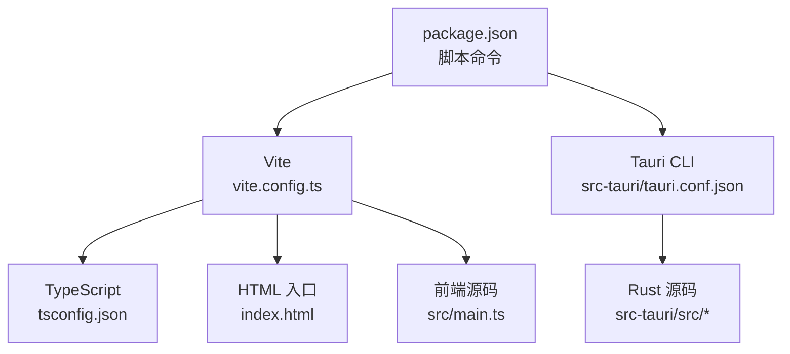
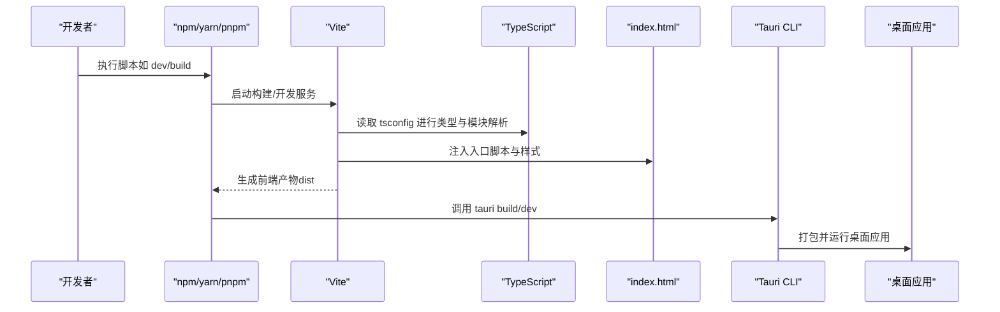
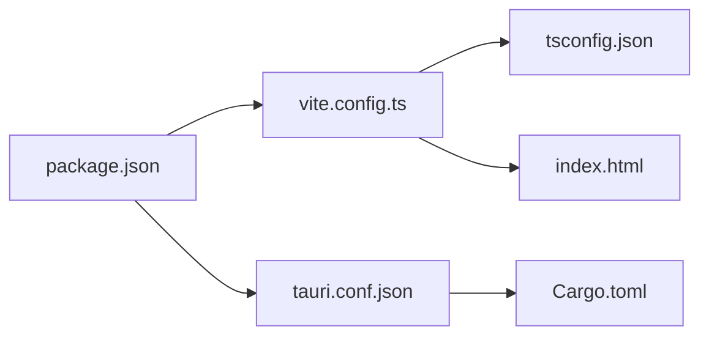

# 构建配置

<cite>
**本文引用的文件**
- [vite.config.ts](file://vite.config.ts)
- [tsconfig.json](file://tsconfig.json)
- [package.json](file://package.json)
- [index.html](file://index.html)
- [src/main.ts](file://src/main.ts)
- [tauri.conf.json](file://src-tauri/tauri.conf.json)
- [Cargo.toml](file://src-tauri/Cargo.toml)
</cite>

## 目录
1. [简介](#简介)
2. [项目结构](#项目结构)
3. [核心组件](#核心组件)
4. [架构总览](#架构总览)
5. [详细组件分析](#详细组件分析)
6. [依赖关系分析](#依赖关系分析)
7. [性能考虑](#性能考虑)
8. [故障排查指南](#故障排查指南)
9. [结论](#结论)
10. [附录](#附录)

## 简介
本文件面向本项目的前端与桌面端（Tauri）构建配置，系统性说明 Vite 构建工具的配置项、TypeScript 编译选项、Node.js 项目脚本与环境变量、以及构建性能优化策略。同时提供常见构建问题的定位方法与解决方案，帮助开发者快速搭建、调试和优化本地开发体验与生产构建产物。

## 项目结构
本项目采用“前端 + Tauri 桌面端”的混合工程：
- 前端使用 Vite + TypeScript，入口为 index.html 与 src/main.ts。
- 桌面端基于 Tauri（Rust），通过 src-tauri 目录管理 Rust 源码与配置。
- 构建流程由 package.json 中的脚本驱动，Vite 负责前端资源打包，Tauri CLI 负责桌面端打包。

图表来源
- [package.json:1-200](file://package.json#L1-L200)
- [vite.config.ts:1-200](file://vite.config.ts#L1-L200)
- [tsconfig.json:1-200](file://tsconfig.json#L1-L200)
- [index.html:1-200](file://index.html#L1-L200)
- [src/main.ts:1-200](file://src/main.ts#L1-L200)
- [tauri.conf.json:1-200](file://src-tauri/tauri.conf.json#L1-L200)

章节来源
- [package.json:1-200](file://package.json#L1-L200)
- [vite.config.ts:1-200](file://vite.config.ts#L1-L200)
- [tsconfig.json:1-200](file://tsconfig.json#L1-L200)
- [index.html:1-200](file://index.html#L1-L200)
- [src/main.ts:1-200](file://src/main.ts#L1-L200)
- [tauri.conf.json:1-200](file://src-tauri/tauri.conf.json#L1-L200)

## 核心组件
- Vite 构建配置：定义开发服务器、插件、资源处理、输出目录、代码分割等。
- TypeScript 编译配置：类型检查、模块解析、目标平台、输出格式。
- Node.js 项目脚本：开发、构建、预览、桌面端打包等命令。
- Tauri 集成：前端产物注入桌面应用，环境变量与能力声明。

章节来源
- [vite.config.ts:1-200](file://vite.config.ts#L1-L200)
- [tsconfig.json:1-200](file://tsconfig.json#L1-L200)
- [package.json:1-200](file://package.json#L1-L200)
- [tauri.conf.json:1-200](file://src-tauri/tauri.conf.json#L1-L200)

## 架构总览
下图展示了从脚本到构建产物的完整链路：npm 脚本触发 Vite/Tauri，Vite 读取 tsconfig 进行类型与模块解析，生成前端产物；Tauri 将前端产物打包进桌面应用。

图表来源
- [package.json:1-200](file://package.json#L1-L200)
- [vite.config.ts:1-200](file://vite.config.ts#L1-L200)
- [tsconfig.json:1-200](file://tsconfig.json#L1-L200)
- [index.html:1-200](file://index.html#L1-L200)
- [tauri.conf.json:1-200](file://src-tauri/tauri.conf.json#L1-L200)

## 详细组件分析

### Vite 构建配置
- 开发服务器
  - 监听端口、主机地址、热更新（HMR）、代理设置、基础路径等。
  - 建议：开发环境开启 HMR，合理设置代理以对接后端或 API。
- 插件配置
  - 常用插件包括 TypeScript 支持、路径别名、静态资源处理、压缩、图片优化等。
  - 建议：按需启用插件，避免不必要的转换开销。
- 资源优化
  - 静态资源（图片、字体、模型）可通过内联或外部 CDN 策略优化加载。
  - 建议：大资源按需懒加载，启用 gzip/brotli 压缩。
- 代码分割
  - 按路由或功能模块拆分，减少首屏体积。
  - 建议：对重型库与第三方模块进行分包，利用浏览器缓存。

章节来源
- [vite.config.ts:1-200](file://vite.config.ts#L1-L200)

### TypeScript 编译配置
- 类型检查选项
  - 严格模式、空值检查、模块类型推断等。
  - 建议：开启严格模式提升类型安全。
- 模块解析规则
  - 模块扩展名、路径别名、节点模块解析策略。
  - 建议：统一使用路径别名，简化导入路径。
- 输出格式设置
  - 目标 ES 版本、模块系统（ESM/CommonJS）、声明文件生成。
  - 建议：根据运行环境与打包器选择合适输出。

章节来源
- [tsconfig.json:1-200](file://tsconfig.json#L1-L200)

### Node.js 项目配置
- 依赖管理
  - 包管理器锁定文件（lockfile）确保可重复构建。
  - 建议：固定依赖版本，定期审计漏洞。
- 脚本命令
  - 开发、构建、预览、桌面端打包等命令。
  - 建议：将复杂逻辑拆分为子脚本，便于维护。
- 环境变量
  - 通过 .env 文件与构建时注入变量，区分开发与生产环境。
  - 建议：敏感信息不入库，使用运行时注入。

章节来源
- [package.json:1-200](file://package.json#L1-L200)

### Tauri 集成与桌面端构建
- 前端产物注入
  - Tauri 将 Vite 构建产物作为 Webview 内容加载。
- 能力与权限
  - 通过 capabilities 与 schema 声明所需权限。
- 构建流程
  - 先构建前端，再调用 Tauri CLI 打包桌面应用。

章节来源
- [tauri.conf.json:1-200](file://src-tauri/tauri.conf.json#L1-L200)
- [Cargo.toml:1-200](file://src-tauri/Cargo.toml#L1-L200)

## 依赖关系分析
下图展示关键配置文件之间的依赖关系：脚本命令驱动 Vite 与 Tauri，Vite 依赖 TypeScript 配置与 HTML 入口，Tauri 依赖 Rust 配置与前端产物。

图表来源
- [package.json:1-200](file://package.json#L1-L200)
- [vite.config.ts:1-200](file://vite.config.ts#L1-L200)
- [tsconfig.json:1-200](file://tsconfig.json#L1-L200)
- [index.html:1-200](file://index.html#L1-L200)
- [tauri.conf.json:1-200](file://src-tauri/tauri.conf.json#L1-L200)
- [Cargo.toml:1-200](file://src-tauri/Cargo.toml#L1-L200)

章节来源
- [package.json:1-200](file://package.json#L1-L200)
- [vite.config.ts:1-200](file://vite.config.ts#L1-L200)
- [tsconfig.json:1-200](file://tsconfig.json#L1-L200)
- [index.html:1-200](file://index.html#L1-L200)
- [tauri.conf.json:1-200](file://src-tauri/tauri.conf.json#L1-L200)
- [Cargo.toml:1-200](file://src-tauri/Cargo.toml#L1-L200)

## 性能考虑
- 缓存策略
  - 利用 Vite 的依赖预构建与文件系统缓存，缩短冷启动时间。
  - 建议：保持依赖稳定，避免频繁升级导致缓存失效。
- 并行构建
  - 多进程与多线程并行处理资源与类型检查。
  - 建议：在 CI 中启用并行任务，缩短流水线时长。
- 增量编译
  - 仅重新编译变更模块，提升迭代速度。
  - 建议：合理使用路径别名与模块化，降低耦合度。
- 代码分割与懒加载
  - 按路由/功能拆分，减少首屏体积。
  - 建议：对重型模块使用动态导入。
- 资源优化
  - 图片、字体、模型等资源压缩与按需加载。
  - 建议：使用现代格式（WebP/AVIF）与 CDN 加速。

[本节为通用指导，无需具体文件引用]

## 故障排查指南
- 开发服务器无法启动
  - 检查端口占用、主机绑定、代理配置是否正确。
  - 参考：开发服务器相关配置位置。
- 类型错误与模块解析失败
  - 核对 tsconfig 的模块解析、路径别名与目标平台。
  - 参考：TypeScript 配置位置。
- 构建产物缺失或路径错误
  - 确认 HTML 入口与脚本注入、输出目录配置。
  - 参考：HTML 入口与 Vite 配置位置。
- Tauri 打包失败
  - 检查 Rust 工具链、依赖安装、能力声明与权限。
  - 参考：Tauri 与 Cargo 配置位置。
- 环境变量未生效
  - 确认 .env 文件命名、前缀约定与注入方式。
  - 参考：脚本命令与环境变量注入位置。

章节来源
- [vite.config.ts:1-200](file://vite.config.ts#L1-L200)
- [tsconfig.json:1-200](file://tsconfig.json#L1-L200)
- [index.html:1-200](file://index.html#L1-L200)
- [package.json:1-200](file://package.json#L1-L200)
- [tauri.conf.json:1-200](file://src-tauri/tauri.conf.json#L1-L200)
- [Cargo.toml:1-200](file://src-tauri/Cargo.toml#L1-L200)

## 结论
通过合理的 Vite 配置、严格的 TypeScript 编译选项、清晰的 Node.js 脚本与环境变量管理，以及 Tauri 的桌面端集成，本项目可实现高效的开发与稳定的生产构建。建议持续优化代码分割与资源加载策略，结合缓存与并行构建，进一步提升构建性能与用户体验。

[本节为总结性内容，无需具体文件引用]

## 附录
- 常用命令
  - 开发：启动本地开发服务器与热更新。
  - 构建：生成生产环境前端产物。
  - 预览：预览构建结果。
  - 桌面端：打包并运行桌面应用。
- 最佳实践
  - 保持依赖稳定，定期审计。
  - 使用路径别名统一管理导入。
  - 分离环境变量与敏感信息。
  - 按需启用插件与优化策略。

[本节为补充信息，无需具体文件引用]