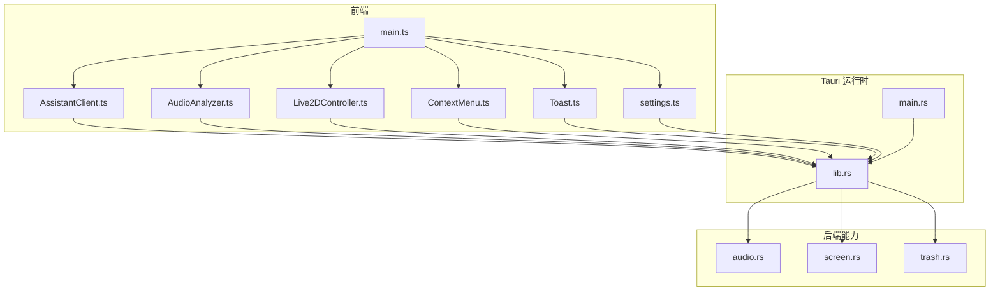
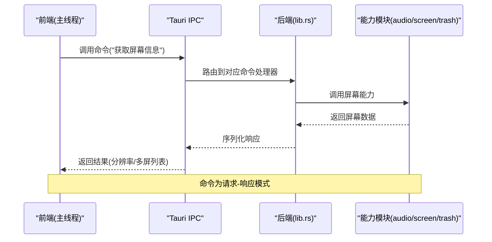
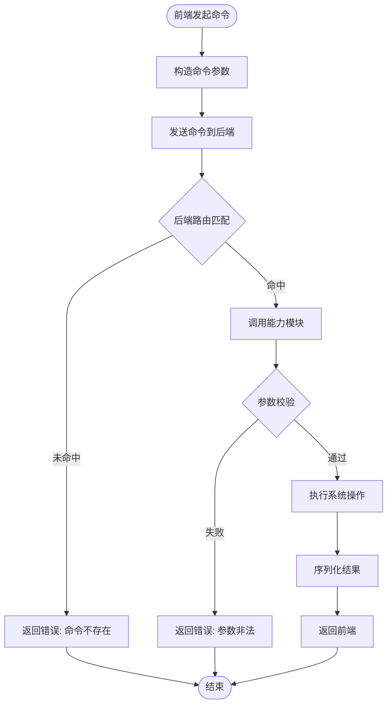
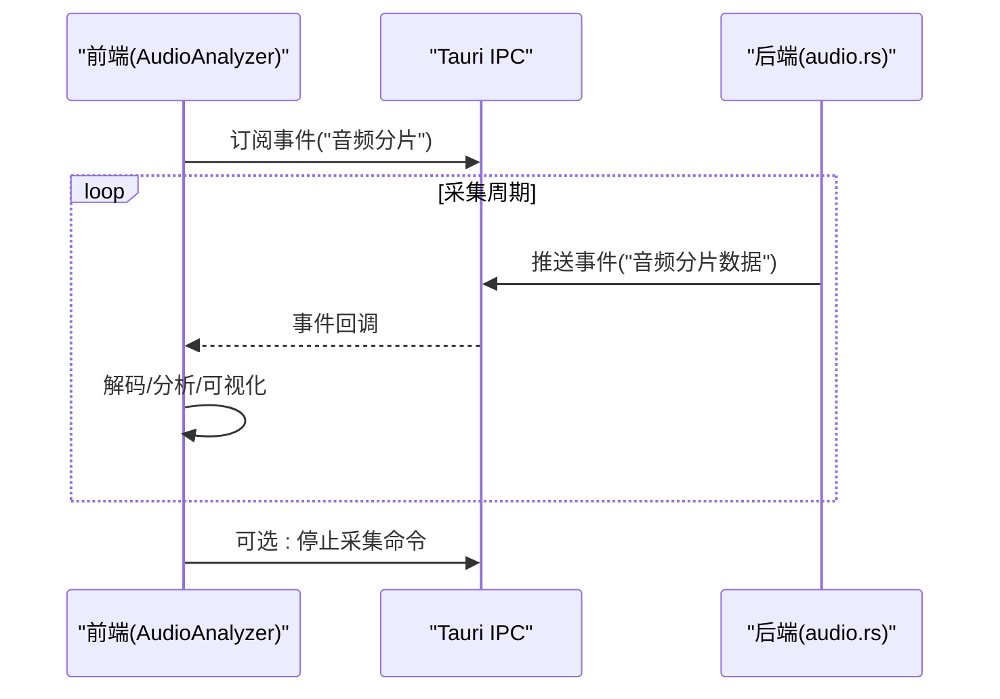
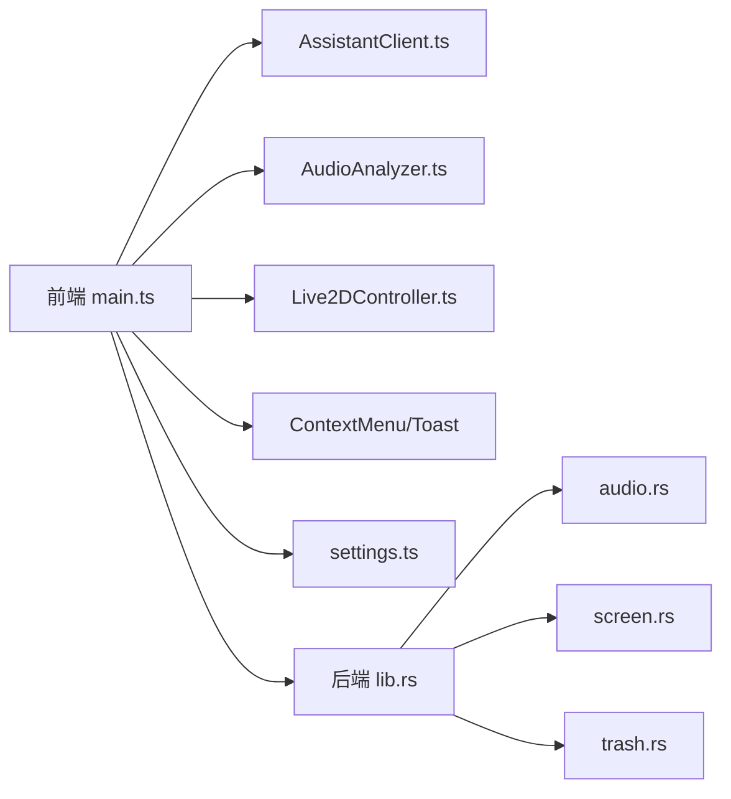

# 前后端通信机制

<cite>
**本文引用的文件**
- [src/main.ts](file://src/main.ts)
- [src/assistant/AssistantClient.ts](file://src/assistant/AssistantClient.ts)
- [src/assistant/AssistantPanel.ts](file://src/assistant/AssistantPanel.ts)
- [src/audio/AudioAnalyzer.ts](file://src/audio/AudioAnalyzer.ts)
- [src/live2d/Live2DController.ts](file://src/live2d/Live2DController.ts)
- [src/ui/ContextMenu.ts](file://src/ui/ContextMenu.ts)
- [src/ui/Toast.ts](file://src/ui/Toast.ts)
- [src/utils/settings.ts](file://src/utils/settings.ts)
- [src-tauri/src/lib.rs](file://src-tauri/src/lib.rs)
- [src-tauri/src/main.rs](file://src-tauri/src/main.rs)
- [src-tauri/src/audio.rs](file://src-tauri/src/audio.rs)
- [src-tauri/src/screen.rs](file://src-tauri/src/screen.rs)
- [src-tauri/src/trash.rs](file://src-tauri/src/trash.rs)
- [src-tauri/Cargo.toml](file://src-tauri/Cargo.toml)
- [src-tauri/tauri.conf.json](file://src-tauri/tauri.conf.json)
- [src-tauri/capabilities/default.json](file://src-tauri/capabilities/default.json)
</cite>

## 目录
1. [简介](#简介)
2. [项目结构](#项目结构)
3. [核心组件](#核心组件)
4. [架构总览](#架构总览)
5. [详细组件分析](#详细组件分析)
6. [依赖关系分析](#依赖关系分析)
7. [性能考虑](#性能考虑)
8. [故障排查指南](#故障排查指南)
9. [结论](#结论)
10. [附录](#附录)

## 简介
本文件面向使用 Tauri 构建的桌面应用，系统性说明前端 TypeScript 与后端 Rust 之间的 IPC（进程间通信）设计与实现。内容涵盖命令调用、事件监听、状态同步、权限与安全边界、异步通信模式、错误处理策略、性能优化方案与调试技巧，并提供通信流程图与典型使用示例路径，帮助读者快速理解并安全高效地扩展前后端交互。

## 项目结构
本项目采用典型的 Tauri 双端结构：
- 前端（TypeScript/Vue/React 等）位于 src 目录，负责 UI 渲染与用户交互，通过 Tauri 客户端 API 发起命令与订阅事件。
- 后端（Rust）位于 src-tauri 目录，暴露命令与事件，封装系统能力（音频、屏幕、回收站等），并通过 Tauri 运行时桥接到前端。

图表来源
- [src/main.ts:1-200](file://src/main.ts#L1-L200)
- [src/assistant/AssistantClient.ts:1-200](file://src/assistant/AssistantClient.ts#L1-L200)
- [src/audio/AudioAnalyzer.ts:1-200](file://src/audio/AudioAnalyzer.ts#L1-L200)
- [src/live2d/Live2DController.ts:1-200](file://src/live2d/Live2DController.ts#L1-L200)
- [src/ui/ContextMenu.ts:1-200](file://src/ui/ContextMenu.ts#L1-L200)
- [src/ui/Toast.ts:1-200](file://src/ui/Toast.ts#L1-L200)
- [src/utils/settings.ts:1-200](file://src/utils/settings.ts#L1-L200)
- [src-tauri/src/lib.rs:1-200](file://src-tauri/src/lib.rs#L1-L200)
- [src-tauri/src/main.rs:1-200](file://src-tauri/src/main.rs#L1-L200)
- [src-tauri/src/audio.rs:1-200](file://src-tauri/src/audio.rs#L1-L200)
- [src-tauri/src/screen.rs:1-200](file://src-tauri/src/screen.rs#L1-L200)
- [src-tauri/src/trash.rs:1-200](file://src-tauri/src/trash.rs#L1-L200)

章节来源
- [src/main.ts:1-200](file://src/main.ts#L1-L200)
- [src-tauri/src/lib.rs:1-200](file://src-tauri/src/lib.rs#L1-L200)
- [src-tauri/src/main.rs:1-200](file://src-tauri/src/main.rs#L1-L200)

## 核心组件
- 前端入口与模块组织
  - main.ts：应用初始化、全局事件总线、UI 与业务模块装配。
  - AssistantClient.ts：封装与助手相关的 IPC 命令与事件订阅。
  - AudioAnalyzer.ts：采集与分析音频数据，可能通过 IPC 将分片数据发送到后端或接收处理结果。
  - Live2DController.ts：控制 Live2D 模型行为，可能通过 IPC 触发后端渲染或资源加载。
  - ContextMenu.ts / Toast.ts：UI 交互反馈，通常不直接涉及 IPC，但可触发命令。
  - settings.ts：读取/写入本地设置，可能通过 IPC 持久化到文件系统。

- 后端能力与命令注册
  - lib.rs：集中注册 Tauri 命令与事件，协调各子系统（音频、屏幕、回收站）。
  - audio.rs：音频采集、分析、播放等能力。
  - screen.rs：屏幕尺寸、分辨率、多屏信息等能力。
  - trash.rs：回收站操作（清空、查询等）。
  - main.rs：Tauri 应用启动与配置注入。

章节来源
- [src/assistant/AssistantClient.ts:1-200](file://src/assistant/AssistantClient.ts#L1-L200)
- [src/audio/AudioAnalyzer.ts:1-200](file://src/audio/AudioAnalyzer.ts#L1-L200)
- [src/live2d/Live2DController.ts:1-200](file://src/live2d/Live2DController.ts#L1-L200)
- [src/ui/ContextMenu.ts:1-200](file://src/ui/ContextMenu.ts#L1-L200)
- [src/ui/Toast.ts:1-200](file://src/ui/Toast.ts#L1-L200)
- [src/utils/settings.ts:1-200](file://src/utils/settings.ts#L1-L200)
- [src-tauri/src/lib.rs:1-200](file://src-tauri/src/lib.rs#L1-L200)
- [src-tauri/src/audio.rs:1-200](file://src-tauri/src/audio.rs#L1-L200)
- [src-tauri/src/screen.rs:1-200](file://src-tauri/src/screen.rs#L1-L200)
- [src-tauri/src/trash.rs:1-200](file://src-tauri/src/trash.rs#L1-L200)
- [src-tauri/src/main.rs:1-200](file://src-tauri/src/main.rs#L1-L200)

## 架构总览
Tauri 的前后端通信基于“命令”和“事件”两种通道：
- 命令（Command）：前端主动调用后端函数，请求执行某项操作并返回结果。适合一次性请求-响应场景。
- 事件（Event）：后端向前端推送消息，适合流式数据、状态变更通知、长连接回调等场景。

图表来源
- [src-tauri/src/lib.rs:1-200](file://src-tauri/src/lib.rs#L1-L200)
- [src-tauri/src/screen.rs:1-200](file://src-tauri/src/screen.rs#L1-L200)

章节来源
- [src-tauri/src/lib.rs:1-200](file://src-tauri/src/lib.rs#L1-L200)
- [src-tauri/src/screen.rs:1-200](file://src-tauri/src/screen.rs#L1-L200)

## 详细组件分析

### 命令调用流程（以屏幕信息为例）
- 前端通过 Tauri 客户端 API 发起命令，携带必要参数。
- 后端在 lib.rs 中注册命令处理器，解析参数并调用具体能力模块。
- 能力模块执行系统级操作后返回数据，后端进行校验与序列化，再经 IPC 返回前端。
- 前端根据返回结果更新 UI 或继续后续逻辑。

图表来源
- [src-tauri/src/lib.rs:1-200](file://src-tauri/src/lib.rs#L1-L200)
- [src-tauri/src/screen.rs:1-200](file://src-tauri/src/screen.rs#L1-L200)

章节来源
- [src-tauri/src/lib.rs:1-200](file://src-tauri/src/lib.rs#L1-L200)
- [src-tauri/src/screen.rs:1-200](file://src-tauri/src/screen.rs#L1-L200)

### 事件监听与状态同步（音频分析为例）
- 后端在音频采集或分析过程中，周期性向前端推送事件（如分片数据、进度、状态）。
- 前端订阅相应事件，累积或渲染数据，必要时反向调用命令确认或中止。
- 适用于高频率、低延迟的数据流场景。

图表来源
- [src-tauri/src/audio.rs:1-200](file://src-tauri/src/audio.rs#L1-L200)
- [src/audio/AudioAnalyzer.ts:1-200](file://src/audio/AudioAnalyzer.ts#L1-L200)

章节来源
- [src-tauri/src/audio.rs:1-200](file://src-tauri/src/audio.rs#L1-L200)
- [src/audio/AudioAnalyzer.ts:1-200](file://src/audio/AudioAnalyzer.ts#L1-L200)

### 权限配置与安全边界
- 能力声明：通过 capabilities/default.json 定义前端可访问的后端能力集合，最小权限原则。
- 配置约束：在 tauri.conf.json 中限制窗口、协议、插件等，避免不必要的能力暴露。
- 命令白名单：仅注册必要的命令，对敏感操作增加二次确认或权限检查。
- 输入校验：后端对所有命令参数进行严格校验，拒绝非法输入，防止注入与越权。
- 日志与审计：记录关键命令调用与事件推送，便于追踪与审计。

章节来源
- [src-tauri/capabilities/default.json:1-200](file://src-tauri/capabilities/default.json#L1-L200)
- [src-tauri/tauri.conf.json:1-200](file://src-tauri/tauri.conf.json#L1-L200)
- [src-tauri/src/lib.rs:1-200](file://src-tauri/src/lib.rs#L1-L200)

### 异步通信模式与错误处理
- 异步模式：命令与事件均支持异步；高频事件建议批量推送与节流，减少 IPC 开销。
- 错误处理：统一错误码与消息结构；前端对超时、网络异常、权限不足等情况做降级与提示。
- 重试与回退：对非幂等命令提供重试策略；对失败事件提供补偿逻辑。
- 资源管理：及时释放音频句柄、屏幕捕获资源，避免内存泄漏。

章节来源
- [src-tauri/src/lib.rs:1-200](file://src-tauri/src/lib.rs#L1-L200)
- [src-tauri/src/audio.rs:1-200](file://src-tauri/src/audio.rs#L1-L200)
- [src-tauri/src/screen.rs:1-200](file://src-tauri/src/screen.rs#L1-L200)
- [src-tauri/src/trash.rs:1-200](file://src-tauri/src/trash.rs#L1-L200)

### 典型使用示例（路径指引）
- 屏幕信息获取：前端调用命令 -> 后端 screen.rs 返回分辨率/多屏列表 -> 前端更新 UI。
  - 参考路径：[src-tauri/src/screen.rs:1-200](file://src-tauri/src/screen.rs#L1-L200)
- 音频分片推送：前端订阅事件 -> 后端 audio.rs 周期性推送分片 -> 前端分析与可视化。
  - 参考路径：[src-tauri/src/audio.rs:1-200](file://src-tauri/src/audio.rs#L1-L200), [src/audio/AudioAnalyzer.ts:1-200](file://src/audio/AudioAnalyzer.ts#L1-L200)
- 回收站操作：前端调用命令 -> 后端 trash.rs 执行清空/查询 -> 前端反馈结果。
  - 参考路径：[src-tauri/src/trash.rs:1-200](file://src-tauri/src/trash.rs#L1-L200)
- 设置持久化：前端读取/写入设置 -> 后端通过文件系统持久化 -> 前端缓存与同步。
  - 参考路径：[src/utils/settings.ts:1-200](file://src/utils/settings.ts#L1-L200)

章节来源
- [src-tauri/src/screen.rs:1-200](file://src-tauri/src/screen.rs#L1-L200)
- [src-tauri/src/audio.rs:1-200](file://src-tauri/src/audio.rs#L1-L200)
- [src-tauri/src/trash.rs:1-200](file://src-tauri/src/trash.rs#L1-L200)
- [src/utils/settings.ts:1-200](file://src/utils/settings.ts#L1-L200)

## 依赖关系分析
- 前端模块依赖
  - main.ts 作为入口，装配 AssistantClient、AudioAnalyzer、Live2DController、UI 组件与设置模块。
  - 各功能模块通过 Tauri 客户端 API 与后端交互，形成松耦合的模块化设计。

- 后端模块依赖
  - lib.rs 集中注册命令与事件，按职责拆分至 audio.rs、screen.rs、trash.rs。
  - main.rs 负责应用生命周期与配置注入。

图表来源
- [src/main.ts:1-200](file://src/main.ts#L1-L200)
- [src/assistant/AssistantClient.ts:1-200](file://src/assistant/AssistantClient.ts#L1-L200)
- [src/audio/AudioAnalyzer.ts:1-200](file://src/audio/AudioAnalyzer.ts#L1-L200)
- [src/live2d/Live2DController.ts:1-200](file://src/live2d/Live2DController.ts#L1-L200)
- [src/ui/ContextMenu.ts:1-200](file://src/ui/ContextMenu.ts#L1-L200)
- [src/ui/Toast.ts:1-200](file://src/ui/Toast.ts#L1-L200)
- [src/utils/settings.ts:1-200](file://src/utils/settings.ts#L1-L200)
- [src-tauri/src/lib.rs:1-200](file://src-tauri/src/lib.rs#L1-L200)
- [src-tauri/src/audio.rs:1-200](file://src-tauri/src/audio.rs#L1-L200)
- [src-tauri/src/screen.rs:1-200](file://src-tauri/src/screen.rs#L1-L200)
- [src-tauri/src/trash.rs:1-200](file://src-tauri/src/trash.rs#L1-L200)

章节来源
- [src/main.ts:1-200](file://src/main.ts#L1-L200)
- [src-tauri/src/lib.rs:1-200](file://src-tauri/src/lib.rs#L1-L200)

## 性能考虑
- 事件批处理：将高频小数据包合并为批次推送，降低 IPC 次数与序列化开销。
- 节流与去抖：对 UI 相关事件进行节流，避免频繁重绘。
- 零拷贝传输：尽可能使用共享内存或原生缓冲区（如音频分片），减少 JSON 序列化成本。
- 按需加载：仅在需要时建立长连接或订阅事件，用完即释放。
- 并发控制：限制并发命令数，避免阻塞主线程或耗尽系统资源。
- 测量与监控：记录命令耗时、事件速率、内存占用，定位瓶颈。

[本节为通用指导，无需特定文件来源]

## 故障排查指南
- 常见问题
  - 命令未注册：检查 lib.rs 是否注册了对应命令，以及 capabilities 是否允许。
  - 参数校验失败：核对前端传入参数类型与范围，后端返回错误消息。
  - 事件未触发：确认前端已正确订阅事件，后端是否正确推送。
  - 权限不足：检查 tauri.conf.json 与 capabilities/default.json 的配置。
  - 资源泄漏：确保音频句柄、屏幕捕获等资源在使用后释放。

- 调试技巧
  - 启用 Tauri 日志：查看后端日志输出，定位错误堆栈。
  - 前端控制台：打印命令调用与事件回调，验证数据流向。
  - 最小复现：剥离无关模块，聚焦问题链路。
  - 断点与插桩：在后端命令处理器与能力模块插入日志，观察执行路径。

章节来源
- [src-tauri/src/lib.rs:1-200](file://src-tauri/src/lib.rs#L1-L200)
- [src-tauri/capabilities/default.json:1-200](file://src-tauri/capabilities/default.json#L1-L200)
- [src-tauri/tauri.conf.json:1-200](file://src-tauri/tauri.conf.json#L1-L200)

## 结论
本项目的 Tauri 前后端通信遵循命令与事件分离的设计，结合清晰的模块划分与严格的权限控制，实现了安全、可扩展且高性能的交互机制。通过批处理、节流、零拷贝与并发控制等手段，可在复杂场景下保持良好性能。建议在新增能力时遵循最小权限原则，完善错误处理与日志审计，持续优化通信效率与稳定性。

[本节为总结性内容，无需特定文件来源]

## 附录
- 术语
  - 命令（Command）：前端调用的后端函数，返回一次性结果。
  - 事件（Event）：后端向前端推送的消息，用于状态同步与流式数据。
  - 能力（Capability）：前端可访问的后端功能集合，受权限控制。

- 参考路径
  - 命令注册与路由：[src-tauri/src/lib.rs:1-200](file://src-tauri/src/lib.rs#L1-L200)
  - 音频事件推送：[src-tauri/src/audio.rs:1-200](file://src-tauri/src/audio.rs#L1-L200)
  - 屏幕信息查询：[src-tauri/src/screen.rs:1-200](file://src-tauri/src/screen.rs#L1-L200)
  - 回收站操作：[src-tauri/src/trash.rs:1-200](file://src-tauri/src/trash.rs#L1-L200)
  - 权限配置：[src-tauri/capabilities/default.json:1-200](file://src-tauri/capabilities/default.json#L1-L200), [src-tauri/tauri.conf.json:1-200](file://src-tauri/tauri.conf.json#L1-L200)

[本节为补充信息，无需特定文件来源]