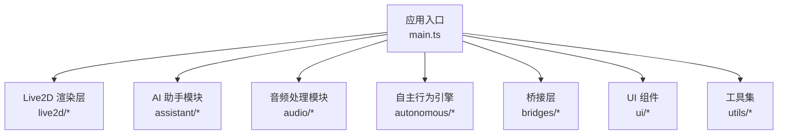
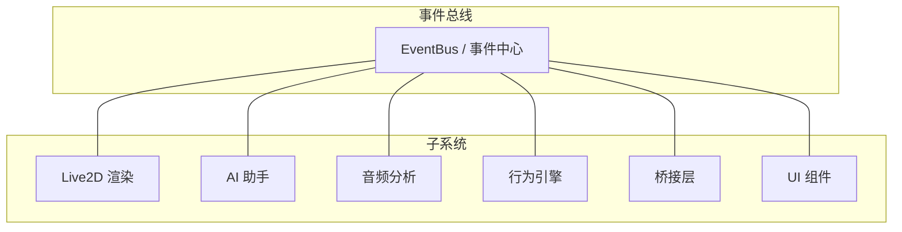
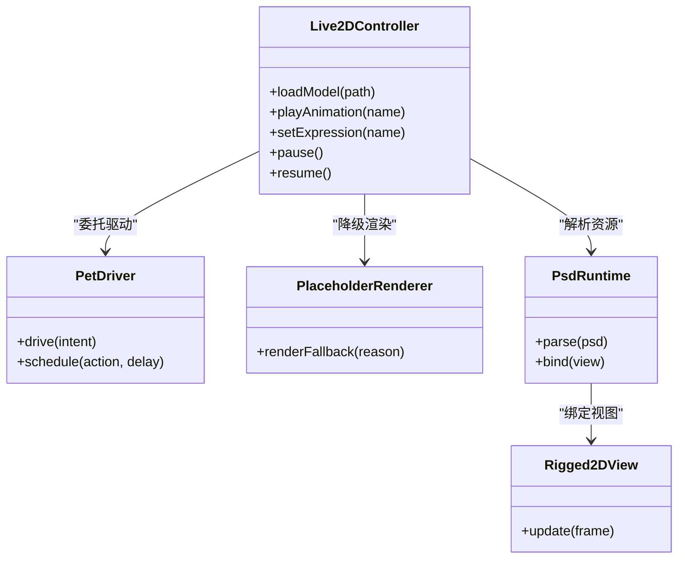
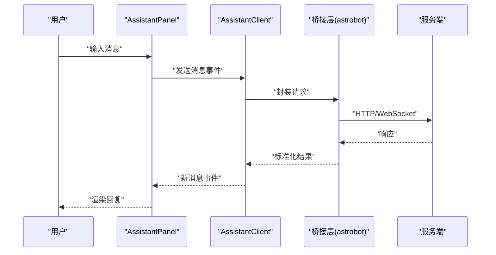
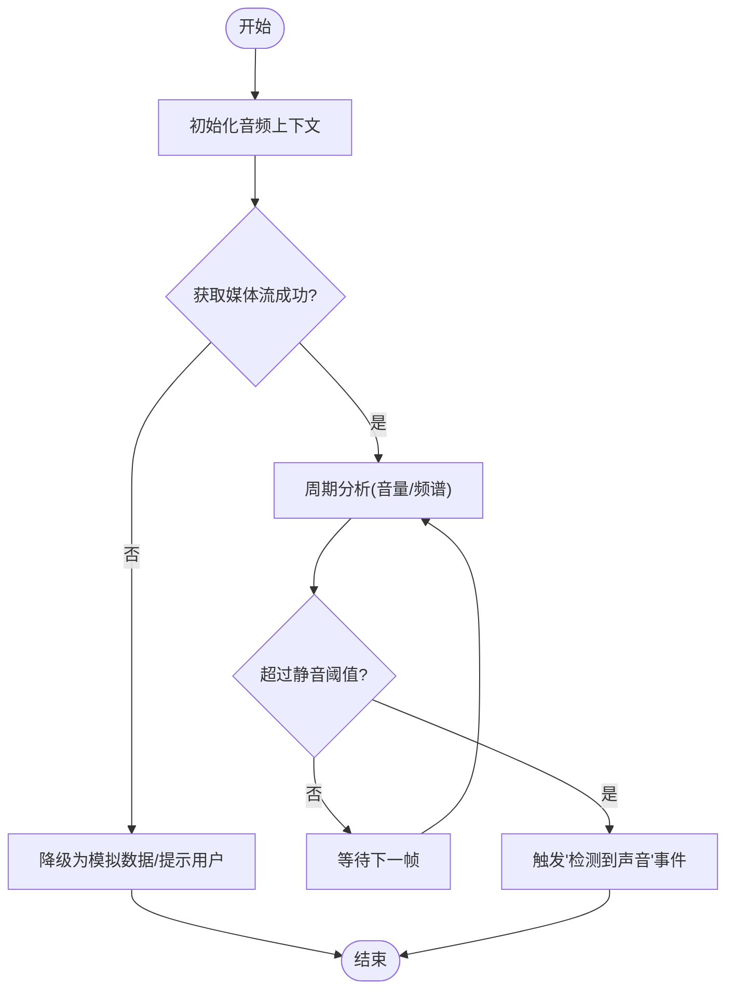
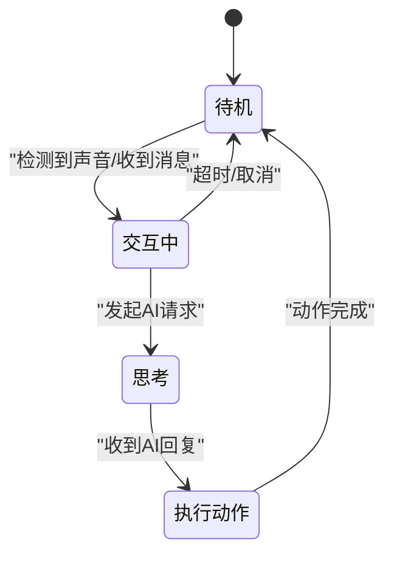
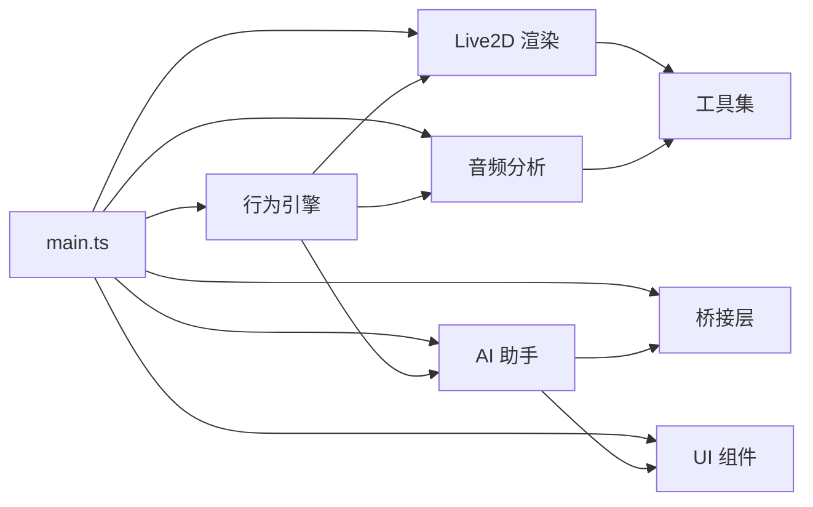

# 前端架构

<cite>
**本文引用的文件**
- [main.ts](file://src/main.ts)
- [vite.config.ts](file://vite.config.ts)
- [tsconfig.json](file://tsconfig.json)
- [package.json](file://package.json)
- [index.html](file://index.html)
- [Live2DController.ts](file://src/live2d/Live2DController.ts)
- [PetDriver.ts](file://src/live2d/PetDriver.ts)
- [PlaceholderRenderer.ts](file://src/live2d/PlaceholderRenderer.ts)
- [l2d-stub.ts](file://src/live2d/l2d-stub.ts)
- [PsdRuntime.ts](file://src/live2d/psd/PsdRuntime.ts)
- [Rigged2DView.ts](file://src/live2d/psd/Rigged2DView.ts)
- [AssistantClient.ts](file://src/assistant/AssistantClient.ts)
- [AssistantPanel.ts](file://src/assistant/AssistantPanel.ts)
- [AudioAnalyzer.ts](file://src/audio/AudioAnalyzer.ts)
- [BehaviorEngine.ts](file://src/autonomous/BehaviorEngine.ts)
- [astrobot.ts](file://src/bridges/astrobot.ts)
- [ContextMenu.ts](file://src/ui/ContextMenu.ts)
- [Toast.ts](file://src/ui/Toast.ts)
- [math.ts](file://src/utils/math.ts)
- [settings.ts](file://src/utils/settings.ts)
</cite>

## 目录
1. [简介](#简介)
2. [项目结构](#项目结构)
3. [核心组件](#核心组件)
4. [架构总览](#架构总览)
5. [详细组件分析](#详细组件分析)
6. [依赖分析](#依赖分析)
7. [性能考虑](#性能考虑)
8. [故障排查指南](#故障排查指南)
9. [结论](#结论)
10. [附录](#附录)

## 简介
本文件面向基于 TypeScript 的前端工程，系统化阐述模块化架构与事件驱动设计。重点覆盖 Live2D 渲染系统、AI 助手模块、音频处理系统等核心职责划分与依赖关系；说明事件监听、消息传递与状态管理方式；描述组件间通信机制与数据流设计；并给出技术栈选型（Vite、TypeScript、现代 Web API）与架构图、交互流程图，帮助读者快速理解与扩展该前端系统。

## 项目结构
项目采用按“功能域”划分的模块化组织方式：
- src/live2d：Live2D 模型加载、驱动与渲染抽象
- src/assistant：AI 助手客户端与面板 UI
- src/audio：音频分析与输入处理
- src/autonomous：自主行为引擎（状态机/行为调度）
- src/bridges：与后端或外部系统的桥接（如 astrobot）
- src/ui：通用 UI 组件（上下文菜单、提示等）
- src/utils：数学工具、设置管理等通用能力
- 根入口 main.ts 负责应用初始化与子系统装配

图表来源
- [main.ts:1-200](file://src/main.ts#L1-L200)

章节来源
- [main.ts:1-200](file://src/main.ts#L1-L200)
- [vite.config.ts:1-200](file://vite.config.ts#L1-L200)
- [tsconfig.json:1-200](file://tsconfig.json#L1-L200)
- [package.json:1-200](file://package.json#L1-L200)
- [index.html:1-200](file://index.html#L1-L200)

## 核心组件
- Live2D 渲染系统
  - 负责模型加载、资源管理、动画驱动与渲染输出，提供统一控制器接口供上层调用。
  - 关键职责：模型生命周期管理、动作/表情切换、PSD 资源解析与绑定、占位渲染降级。
- AI 助手模块
  - 负责与后端/外部服务通信、对话状态维护、消息路由与 UI 展示。
  - 关键职责：会话管理、消息编解码、面板渲染、错误重试与降级。
- 音频处理系统
  - 负责音频采集、频谱/音量分析、静音检测与事件上报。
  - 关键职责：媒体流获取、实时分析、节流与采样策略、异常恢复。
- 自主行为引擎
  - 基于事件的状态机/行为调度器，驱动宠物/助手的自然行为循环。
  - 关键职责：状态定义、事件订阅、行为优先级与冷却、与渲染/音频的联动。
- 桥接层
  - 封装与后端或第三方服务的通信细节，屏蔽协议差异。
  - 关键职责：请求/响应映射、鉴权、重试、错误归一化。
- UI 组件
  - 提供可复用的界面元素与交互模式。
  - 关键职责：渲染更新、用户输入捕获、无障碍与可访问性。
- 工具集
  - 提供数学计算、配置读取/写入、日志与调试辅助。
  - 关键职责：纯函数工具、跨平台兼容、类型安全。

章节来源
- [Live2DController.ts:1-200](file://src/live2d/Live2DController.ts#L1-L200)
- [PetDriver.ts:1-200](file://src/live2d/PetDriver.ts#L1-L200)
- [PlaceholderRenderer.ts:1-200](file://src/live2d/PlaceholderRenderer.ts#L1-L200)
- [l2d-stub.ts:1-200](file://src/live2d/l2d-stub.ts#L1-L200)
- [PsdRuntime.ts:1-200](file://src/live2d/psd/PsdRuntime.ts#L1-L200)
- [Rigged2DView.ts:1-200](file://src/live2d/psd/Rigged2DView.ts#L1-L200)
- [AssistantClient.ts:1-200](file://src/assistant/AssistantClient.ts#L1-L200)
- [AssistantPanel.ts:1-200](file://src/assistant/AssistantPanel.ts#L1-L200)
- [AudioAnalyzer.ts:1-200](file://src/audio/AudioAnalyzer.ts#L1-L200)
- [BehaviorEngine.ts:1-200](file://src/autonomous/BehaviorEngine.ts#L1-L200)
- [astrobot.ts:1-200](file://src/bridges/astrobot.ts#L1-L200)
- [ContextMenu.ts:1-200](file://src/ui/ContextMenu.ts#L1-L200)
- [Toast.ts:1-200](file://src/ui/Toast.ts#L1-L200)
- [math.ts:1-200](file://src/utils/math.ts#L1-L200)
- [settings.ts:1-200](file://src/utils/settings.ts#L1-L200)

## 架构总览
整体采用“事件驱动 + 模块化”的架构：
- 入口 main.ts 初始化各子系统，注册全局事件总线或事件中心。
- 各子系统通过发布/订阅进行解耦通信，避免直接耦合。
- 渲染、音频、AI、行为引擎围绕一个“状态源”进行协作，形成单向数据流。

图表来源
- [main.ts:1-200](file://src/main.ts#L1-L200)
- [BehaviorEngine.ts:1-200](file://src/autonomous/BehaviorEngine.ts#L1-L200)
- [AudioAnalyzer.ts:1-200](file://src/audio/AudioAnalyzer.ts#L1-L200)
- [AssistantClient.ts:1-200](file://src/assistant/AssistantClient.ts#L1-L200)
- [Live2DController.ts:1-200](file://src/live2d/Live2DController.ts#L1-L200)

## 详细组件分析

### Live2D 渲染系统
职责与边界
- 控制器：对外暴露统一的模型控制接口（加载、播放、暂停、切换动作/表情）。
- 驱动器：将高层意图（如“眨眼”“说话”）转换为具体动画序列。
- 渲染适配：支持 PSD 资源解析与绑定视图，提供占位渲染以应对缺失资源。
- 降级策略：在环境不支持时回退到 stub 或占位渲染。

图表来源
- [Live2DController.ts:1-200](file://src/live2d/Live2DController.ts#L1-L200)
- [PetDriver.ts:1-200](file://src/live2d/PetDriver.ts#L1-L200)
- [PlaceholderRenderer.ts:1-200](file://src/live2d/PlaceholderRenderer.ts#L1-L200)
- [PsdRuntime.ts:1-200](file://src/live2d/psd/PsdRuntime.ts#L1-L200)
- [Rigged2DView.ts:1-200](file://src/live2d/psd/Rigged2DView.ts#L1-L200)

章节来源
- [Live2DController.ts:1-200](file://src/live2d/Live2DController.ts#L1-L200)
- [PetDriver.ts:1-200](file://src/live2d/PetDriver.ts#L1-L200)
- [PlaceholderRenderer.ts:1-200](file://src/live2d/PlaceholderRenderer.ts#L1-L200)
- [l2d-stub.ts:1-200](file://src/live2d/l2d-stub.ts#L1-L200)
- [PsdRuntime.ts:1-200](file://src/live2d/psd/PsdRuntime.ts#L1-L200)
- [Rigged2DView.ts:1-200](file://src/live2d/psd/Rigged2DView.ts#L1-L200)

### AI 助手模块
职责与边界
- 客户端：负责与后端/外部服务通信、消息序列化、重连与错误处理。
- 面板：负责对话历史渲染、输入框交互、消息气泡与滚动定位。
- 与事件总线集成：接收“新消息”“用户输入”“连接状态”等事件。

图表来源
- [AssistantClient.ts:1-200](file://src/assistant/AssistantClient.ts#L1-L200)
- [AssistantPanel.ts:1-200](file://src/assistant/AssistantPanel.ts#L1-L200)
- [astrobot.ts:1-200](file://src/bridges/astrobot.ts#L1-L200)

章节来源
- [AssistantClient.ts:1-200](file://src/assistant/AssistantClient.ts#L1-L200)
- [AssistantPanel.ts:1-200](file://src/assistant/AssistantPanel.ts#L1-L200)
- [astrobot.ts:1-200](file://src/bridges/astrobot.ts#L1-L200)

### 音频处理系统
职责与边界
- 媒体接入：使用现代 Web Audio API 获取麦克风或系统音频流。
- 实时分析：计算分贝/频谱/静音阈值，周期性上报事件。
- 容错与节流：网络/权限异常时的降级策略，避免高频回调造成卡顿。

图表来源
- [AudioAnalyzer.ts:1-200](file://src/audio/AudioAnalyzer.ts#L1-L200)

章节来源
- [AudioAnalyzer.ts:1-200](file://src/audio/AudioAnalyzer.ts#L1-L200)

### 自主行为引擎
职责与边界
- 状态机：定义可观察状态（待机、交互中、思考、执行动作等）。
- 事件驱动：订阅音频、AI、用户输入等事件，驱动状态迁移。
- 行为队列：支持优先级与冷却时间，避免行为冲突。

图表来源
- [BehaviorEngine.ts:1-200](file://src/autonomous/BehaviorEngine.ts#L1-L200)

章节来源
- [BehaviorEngine.ts:1-200](file://src/autonomous/BehaviorEngine.ts#L1-L200)

### 桥接层
职责与边界
- 统一封装外部通信协议，屏蔽差异。
- 提供重试、超时、鉴权、错误归一化能力。
- 向其他模块暴露稳定的事件与 API。

章节来源
- [astrobot.ts:1-200](file://src/bridges/astrobot.ts#L1-L200)

### UI 组件
职责与边界
- 上下文菜单：右键/长按触发的操作菜单。
- Toast：轻量级提示通知。
- 与事件总线集成：响应业务事件进行局部更新。

章节来源
- [ContextMenu.ts:1-200](file://src/ui/ContextMenu.ts#L1-L200)
- [Toast.ts:1-200](file://src/ui/Toast.ts#L1-L200)

### 工具集
职责与边界
- math.ts：几何、插值、缓动等数学工具。
- settings.ts：本地设置读写、默认值合并、类型校验。

章节来源
- [math.ts:1-200](file://src/utils/math.ts#L1-L200)
- [settings.ts:1-200](file://src/utils/settings.ts#L1-L200)

## 依赖分析
模块间依赖遵循“低耦合、高内聚”原则：
- main.ts 作为装配点，仅负责初始化与启动，不承载业务逻辑。
- 子系统之间通过事件总线或集中式状态源进行通信，避免直接引用。
- 渲染、音频、AI、行为引擎分别对工具集与 UI 有弱依赖。

图表来源
- [main.ts:1-200](file://src/main.ts#L1-L200)
- [Live2DController.ts:1-200](file://src/live2d/Live2DController.ts#L1-L200)
- [AssistantClient.ts:1-200](file://src/assistant/AssistantClient.ts#L1-L200)
- [AudioAnalyzer.ts:1-200](file://src/audio/AudioAnalyzer.ts#L1-L200)
- [BehaviorEngine.ts:1-200](file://src/autonomous/BehaviorEngine.ts#L1-L200)
- [astrobot.ts:1-200](file://src/bridges/astrobot.ts#L1-L200)

章节来源
- [main.ts:1-200](file://src/main.ts#L1-L200)
- [Live2DController.ts:1-200](file://src/live2d/Live2DController.ts#L1-L200)
- [AssistantClient.ts:1-200](file://src/assistant/AssistantClient.ts#L1-L200)
- [AudioAnalyzer.ts:1-200](file://src/audio/AudioAnalyzer.ts#L1-L200)
- [BehaviorEngine.ts:1-200](file://src/autonomous/BehaviorEngine.ts#L1-L200)
- [astrobot.ts:1-200](file://src/bridges/astrobot.ts#L1-L200)

## 性能考虑
- 渲染优化
  - 按需加载 Live2D 模型与资源，延迟初始化非关键路径。
  - 使用占位渲染与降级策略，减少首屏阻塞。
  - 动画批处理与帧率限制，避免主线程拥塞。
- 音频分析
  - 合理设置采样间隔与分析窗口，平衡精度与性能。
  - 使用 Offscreen/Worker 隔离耗时任务（若后续引入）。
- 网络与 I/O
  - 请求去抖与合并，失败重试与指数退避。
  - 缓存热点数据（如模型清单、配置），降低重复请求。
- 内存管理
  - 及时释放不再使用的模型与媒体流。
  - 避免长生命周期闭包导致的引用泄漏。

## 故障排查指南
- 常见问题定位
  - 模型加载失败：检查资源路径、CDN 可达性与 CORS 策略。
  - 音频不可用：确认浏览器权限、设备可用性与 API 兼容性。
  - AI 通信异常：检查鉴权、网络连通性与服务端状态。
  - 行为冲突：查看行为队列与冷却时间配置，调整优先级。
- 诊断建议
  - 启用详细日志与埋点，记录关键事件与状态变化。
  - 使用浏览器开发者工具的 Performance 面板分析瓶颈。
  - 针对 Live2D 资源，使用断言与校验确保格式正确。
- 降级与恢复
  - 当 Live2D 不可用时，自动切换到占位渲染。
  - 音频采集失败时，提示用户授权或回退到模拟输入。
  - 网络异常时，进入离线模式并缓存待提交消息。

章节来源
- [PlaceholderRenderer.ts:1-200](file://src/live2d/PlaceholderRenderer.ts#L1-L200)
- [l2d-stub.ts:1-200](file://src/live2d/l2d-stub.ts#L1-L200)
- [AudioAnalyzer.ts:1-200](file://src/audio/AudioAnalyzer.ts#L1-L200)
- [AssistantClient.ts:1-200](file://src/assistant/AssistantClient.ts#L1-L200)
- [BehaviorEngine.ts:1-200](file://src/autonomous/BehaviorEngine.ts#L1-L200)

## 结论
本项目采用模块化与事件驱动的架构，清晰划分了 Live2D 渲染、AI 助手、音频处理、行为引擎等核心职责，并通过桥接层与工具集实现稳定扩展。借助 Vite 构建与 TypeScript 类型系统，开发体验与可维护性得到保障。建议在后续迭代中持续完善事件契约、性能监控与自动化测试，进一步提升系统的健壮性与可观测性。

## 附录
- 技术栈选型要点
  - Vite：快速构建、热更新友好、插件生态完善。
  - TypeScript：强类型约束、更好的重构与文档生成能力。
  - 现代 Web API：Web Audio API、Fetch/WebSocket、Canvas/WebGL（视渲染需求）。
- 最佳实践
  - 单一职责：每个模块聚焦一个领域，保持内聚。
  - 事件契约：明确事件命名、载荷结构与生命周期。
  - 可观测性：统一日志、指标与错误上报。
  - 渐进增强：优先保证基础功能，再叠加高级特性。