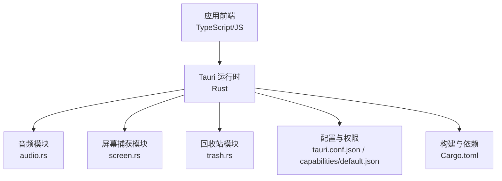
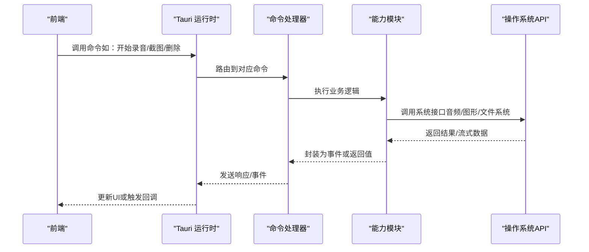
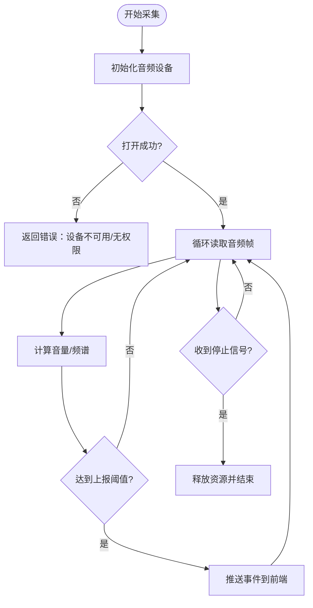
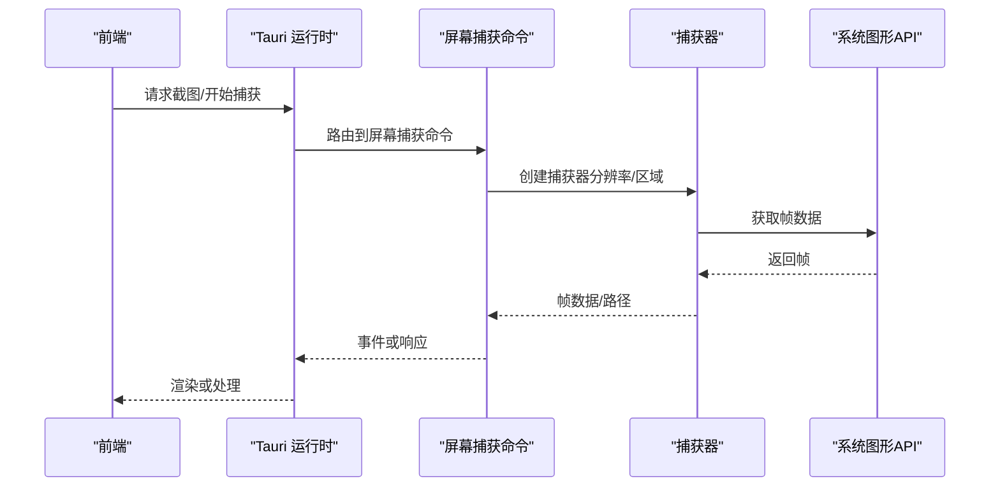
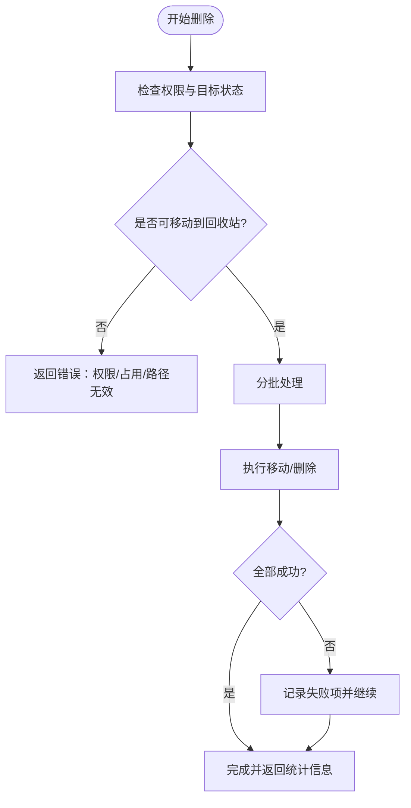
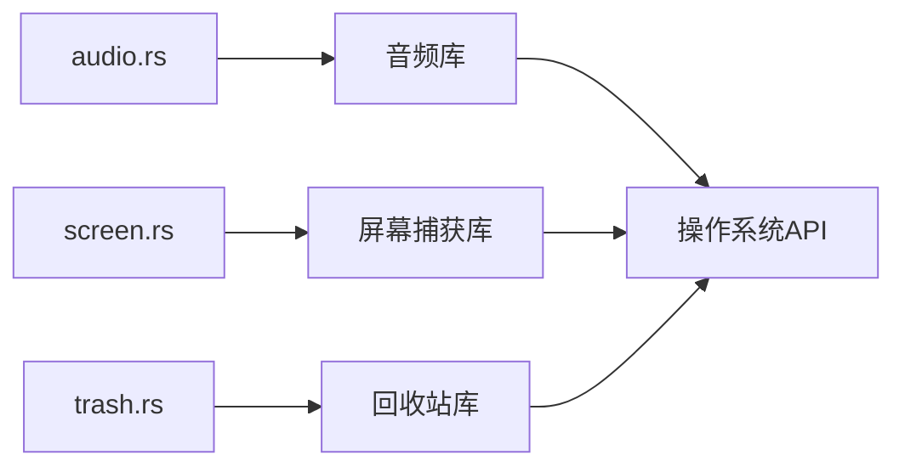

# 后端架构

<cite>
**本文引用的文件**
- [src-tauri/src/lib.rs](file://src-tauri/src/lib.rs)
- [src-tauri/src/main.rs](file://src-tauri/src/main.rs)
- [src-tauri/src/audio.rs](file://src-tauri/src/audio.rs)
- [src-tauri/src/screen.rs](file://src-tauri/src/screen.rs)
- [src-tauri/src/trash.rs](file://src-tauri/src/trash.rs)
- [src-tauri/Cargo.toml](file://src-tauri/Cargo.toml)
- [src-tauri/tauri.conf.json](file://src-tauri/tauri.conf.json)
- [src-tauri/capabilities/default.json](file://src-tauri/capabilities/default.json)
</cite>

## 目录
1. [简介](#简介)
2. [项目结构](#项目结构)
3. [核心组件](#核心组件)
4. [架构总览](#架构总览)
5. [详细组件分析](#详细组件分析)
6. [依赖关系分析](#依赖关系分析)
7. [性能与资源管理](#性能与资源管理)
8. [故障排查指南](#故障排查指南)
9. [结论](#结论)
10. [附录](#附录)

## 简介
本文件面向基于 Rust 的 Tauri 后端，系统性阐述系统级功能模块的职责划分与协作方式，涵盖音频处理、屏幕捕获、回收站操作等原生能力封装；说明异步编程模型与错误处理策略；解释与操作系统 API 的集成方式及权限管理机制；并给出内存管理、性能优化与资源调度的实现方案。文末提供后端模块架构图与关键系统调用流程图，帮助读者快速理解整体设计与落地细节。

## 项目结构
后端位于 src-tauri 目录，采用 Tauri 标准布局：
- 入口与注册：main.rs、lib.rs
- 能力模块：audio.rs（音频）、screen.rs（屏幕捕获）、trash.rs（回收站）
- 配置与权限：Cargo.toml、tauri.conf.json、capabilities/default.json

图表来源
- [src-tauri/src/main.rs:1-200](file://src-tauri/src/main.rs#L1-L200)
- [src-tauri/src/lib.rs:1-200](file://src-tauri/src/lib.rs#L1-L200)
- [src-tauri/tauri.conf.json:1-200](file://src-tauri/tauri.conf.json#L1-L200)
- [src-tauri/capabilities/default.json:1-200](file://src-tauri/capabilities/default.json#L1-L200)

章节来源
- [src-tauri/src/main.rs:1-200](file://src-tauri/src/main.rs#L1-L200)
- [src-tauri/src/lib.rs:1-200](file://src-tauri/src/lib.rs#L1-L200)
- [src-tauri/Cargo.toml:1-200](file://src-tauri/Cargo.toml#L1-L200)
- [src-tauri/tauri.conf.json:1-200](file://src-tauri/tauri.conf.json#L1-L200)
- [src-tauri/capabilities/default.json:1-200](file://src-tauri/capabilities/default.json#L1-L200)

## 核心组件
- 音频模块（audio.rs）
  - 职责：采集系统或麦克风音频、进行基础分析（如音量/频谱），将结果以事件或命令形式暴露给前端。
  - 关键点：使用跨平台音频库抽象设备枚举与采样；在后台任务中持续采集并节流上报；对高频数据做降采样与缓冲。
- 屏幕捕获模块（screen.rs）
  - 职责：捕获指定显示器或窗口区域，输出帧数据或截图路径，供前端渲染或AI处理。
  - 关键点：选择合适后端（Windows/GDI+、macOS/CoreGraphics、Linux/X11/Wayland）；控制分辨率与帧率；避免阻塞 UI 线程。
- 回收站模块（trash.rs）
  - 职责：安全删除文件或移动到系统回收站，支持批量操作与回滚提示。
  - 关键点：跨平台差异处理；失败时保留原文件并返回明确错误码；大文件分批处理。

章节来源
- [src-tauri/src/audio.rs:1-200](file://src-tauri/src/audio.rs#L1-L200)
- [src-tauri/src/screen.rs:1-200](file://src-tauri/src/screen.rs#L1-L200)
- [src-tauri/src/trash.rs:1-200](file://src-tauri/src/trash.rs#L1-L200)

## 架构总览
Tauri 后端通过 lib.rs 统一注册命令与插件，main.rs 启动应用并加载配置。各能力模块以“命令”形式暴露给前端，遵循“前端发起请求 -> Tauri 路由 -> Rust 命令执行 -> 返回结果/推送事件”的异步流程。权限由 tauri.conf.json 与 capabilities/default.json 共同约束，确保最小权限原则。

图表来源
- [src-tauri/src/lib.rs:1-200](file://src-tauri/src/lib.rs#L1-L200)
- [src-tauri/src/main.rs:1-200](file://src-tauri/src/main.rs#L1-L200)
- [src-tauri/src/audio.rs:1-200](file://src-tauri/src/audio.rs#L1-L200)
- [src-tauri/src/screen.rs:1-200](file://src-tauri/src/screen.rs#L1-L200)
- [src-tauri/src/trash.rs:1-200](file://src-tauri/src/trash.rs#L1-L200)

## 详细组件分析

### 音频模块（audio.rs）
- 设计要点
  - 设备发现与选择：枚举可用输入设备，支持默认设备与用户选择。
  - 采集与处理：后台任务循环读取音频帧，计算音量/频谱，按固定频率推送到前端。
  - 资源管理：开启/停止采集需显式管理句柄与缓冲区，防止泄漏。
- 错误处理
  - 设备不可用/权限拒绝：返回具体错误码并提示授权。
  - 采集异常：自动重试与降级（降低采样率/通道数）。
- 性能优化
  - 环形缓冲 + 批处理上报，减少 IPC 开销。
  - 按需启用 FFT，避免不必要的计算。

图表来源
- [src-tauri/src/audio.rs:1-200](file://src-tauri/src/audio.rs#L1-L200)

章节来源
- [src-tauri/src/audio.rs:1-200](file://src-tauri/src/audio.rs#L1-L200)

### 屏幕捕获模块（screen.rs）
- 设计要点
  - 多平台后端：根据目标平台选择最优捕获后端。
  - 区域与分辨率：支持全屏/窗口/自定义矩形，动态调整分辨率与帧率。
  - 流式输出：优先以帧事件推送，必要时落盘临时文件以降低内存占用。
- 错误处理
  - 权限不足：引导用户授予屏幕录制权限。
  - 捕获失败：回退到较低分辨率或关闭特效后重试。
- 性能优化
  - GPU 加速（如可用）与零拷贝传输。
  - 帧率自适应：根据 CPU/GPU 负载动态调节。

图表来源
- [src-tauri/src/screen.rs:1-200](file://src-tauri/src/screen.rs#L1-L200)

章节来源
- [src-tauri/src/screen.rs:1-200](file://src-tauri/src/screen.rs#L1-L200)

### 回收站模块（trash.rs）
- 设计要点
  - 跨平台移动：调用系统回收站 API，保证可恢复性。
  - 批量操作：支持多文件/文件夹，失败项隔离并记录。
  - 进度反馈：长耗时操作分片上报进度。
- 错误处理
  - 权限不足/文件被占用：返回明确原因与重试建议。
  - 磁盘空间不足：提前检测并中止。
- 性能优化
  - 并行化小文件移动，限制并发度避免 I/O 风暴。
  - 大文件采用增量校验与断点续删。

图表来源
- [src-tauri/src/trash.rs:1-200](file://src-tauri/src/trash.rs#L1-L200)

章节来源
- [src-tauri/src/trash.rs:1-200](file://src-tauri/src/trash.rs#L1-L200)

### 命令注册与生命周期（lib.rs / main.rs）
- 职责
  - 初始化 Tauri 应用、加载配置、注册命令与插件。
  - 管理全局状态（如音频会话、捕获会话）的生命周期。
- 关键点
  - 命令命名空间清晰，便于前端调用。
  - 启动阶段进行能力可用性探测（如屏幕录制权限）。

章节来源
- [src-tauri/src/lib.rs:1-200](file://src-tauri/src/lib.rs#L1-L200)
- [src-tauri/src/main.rs:1-200](file://src-tauri/src/main.rs#L1-L200)

## 依赖关系分析
- 外部依赖
  - 音频：跨平台音频库（如 cpal 或 rodio），用于设备枚举与采集。
  - 屏幕捕获：平台特定后端（如 Windows GDI+/DXGI、macOS CoreGraphics、Linux X11/Wayland）。
  - 回收站：跨平台 trash 库，封装系统回收站行为。
- 内部耦合
  - 模块间通过命令层解耦，避免直接依赖。
  - 共享配置与日志工具集中管理。

图表来源
- [src-tauri/Cargo.toml:1-200](file://src-tauri/Cargo.toml#L1-L200)
- [src-tauri/src/audio.rs:1-200](file://src-tauri/src/audio.rs#L1-L200)
- [src-tauri/src/screen.rs:1-200](file://src-tauri/src/screen.rs#L1-L200)
- [src-tauri/src/trash.rs:1-200](file://src-tauri/src/trash.rs#L1-L200)

章节来源
- [src-tauri/Cargo.toml:1-200](file://src-tauri/Cargo.toml#L1-L200)

## 性能与资源管理
- 异步模型
  - 使用 Tokio 异步运行时处理长时间任务（采集、捕获、批量删除）。
  - 事件驱动上报，避免阻塞 UI 线程。
- 内存管理
  - 音频/视频帧使用环形缓冲与对象池，减少分配与 GC 压力。
  - 大文件操作采用流式读写，避免一次性加载。
- 资源调度
  - 限制并发度（I/O 与 CPU 密集型任务分别限流）。
  - 动态调整参数（帧率、采样率）以适应系统负载。
- 错误恢复
  - 自动重试与降级策略，提升鲁棒性。
  - 详细错误分类，便于前端展示与用户引导。

[本节为通用指导，不直接分析具体文件]

## 故障排查指南
- 常见问题
  - 音频无法采集：检查设备权限与默认设备设置；尝试切换输入源。
  - 屏幕捕获失败：确认已授予屏幕录制权限；降低分辨率或关闭特效。
  - 回收站操作失败：检查文件占用、权限与磁盘空间；查看失败列表重试。
- 调试建议
  - 启用详细日志，定位错误栈与上下文。
  - 使用独立测试用例验证各模块边界条件。
  - 监控资源使用（CPU/内存/句柄），识别泄漏点。

章节来源
- [src-tauri/src/audio.rs:1-200](file://src-tauri/src/audio.rs#L1-L200)
- [src-tauri/src/screen.rs:1-200](file://src-tauri/src/screen.rs#L1-L200)
- [src-tauri/src/trash.rs:1-200](file://src-tauri/src/trash.rs#L1-L200)

## 结论
本后端以 Tauri 为核心，将音频、屏幕捕获与回收站等原生能力模块化封装，通过命令层与前端交互。借助异步模型与严格的权限控制，系统在跨平台环境下具备良好稳定性与性能。未来可扩展更多系统能力（如剪贴板、通知、进程管理），并保持模块解耦与最小权限原则。

[本节为总结性内容，不直接分析具体文件]

## 附录
- 权限与配置
  - tauri.conf.json：定义应用元数据、窗口与能力开关。
  - capabilities/default.json：声明允许的命令与资源访问范围。
- 构建与发布
  - Cargo.toml：管理依赖与特性开关，确保跨平台编译。

章节来源
- [src-tauri/tauri.conf.json:1-200](file://src-tauri/tauri.conf.json#L1-L200)
- [src-tauri/capabilities/default.json:1-200](file://src-tauri/capabilities/default.json#L1-L200)
- [src-tauri/Cargo.toml:1-200](file://src-tauri/Cargo.toml#L1-L200)