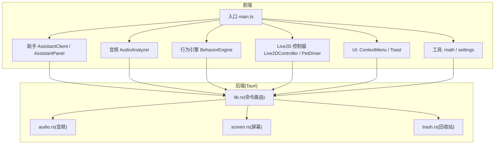
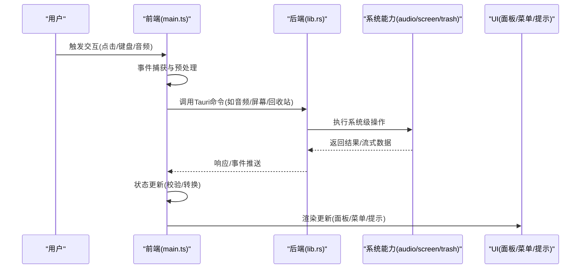
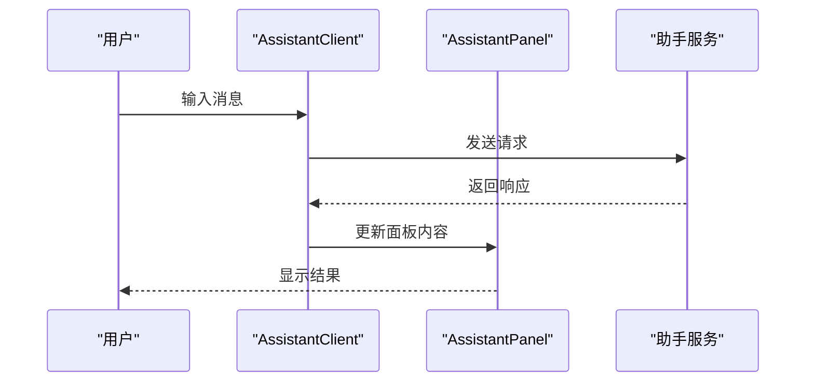
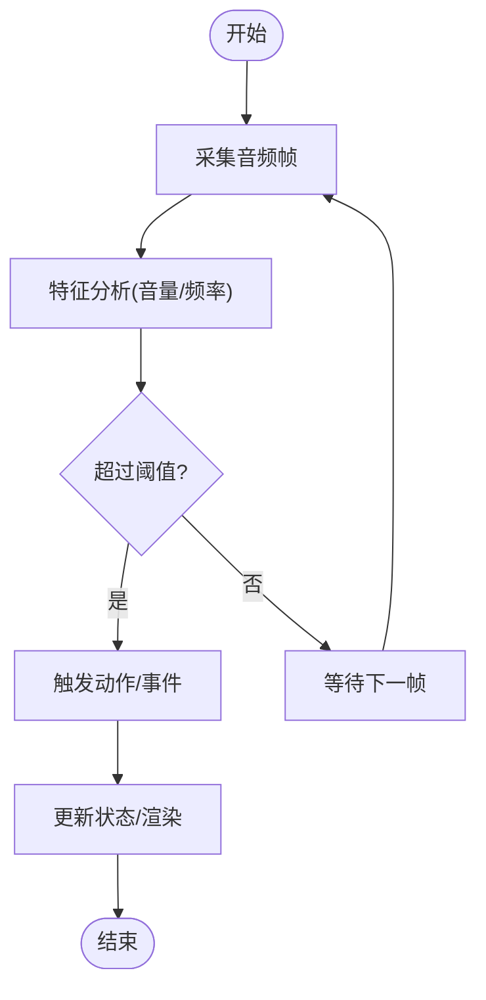
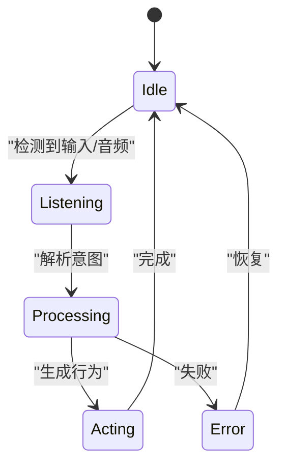
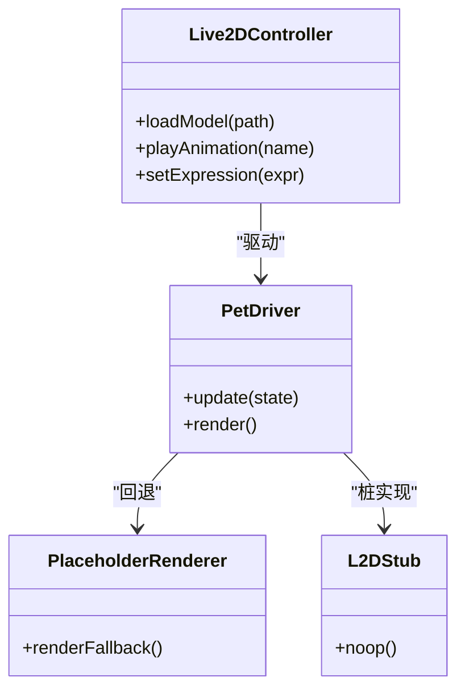
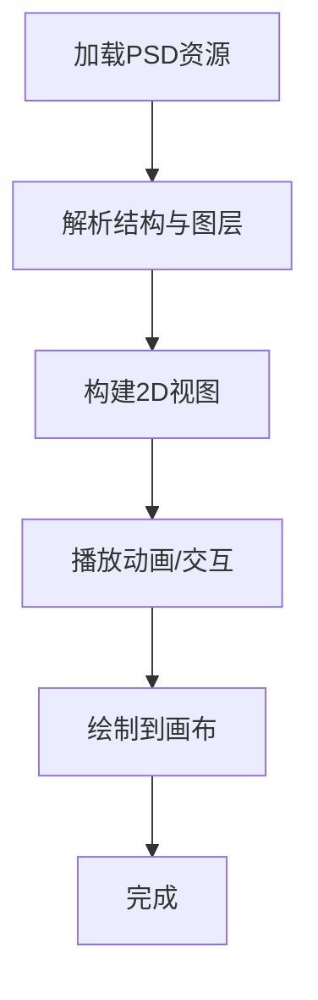
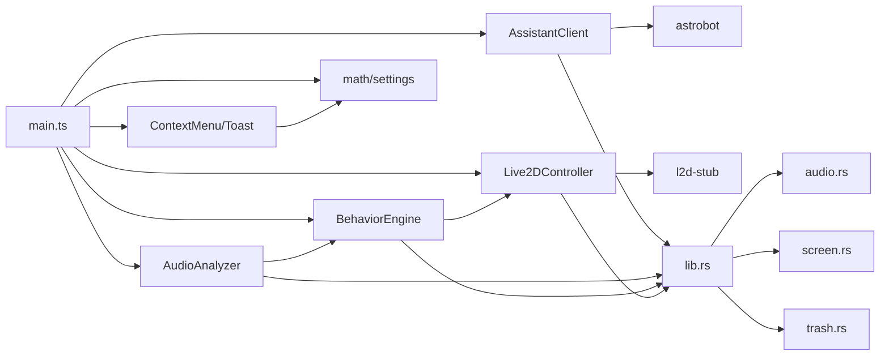

# 数据流设计

<cite>
**本文引用的文件**
- [main.ts](file://src/main.ts)
- [index.html](file://index.html)
- [vite.config.ts](file://vite.config.ts)
- [package.json](file://package.json)
- [AssistantClient.ts](file://src/assistant/AssistantClient.ts)
- [AssistantPanel.ts](file://src/assistant/AssistantPanel.ts)
- [AudioAnalyzer.ts](file://src/audio/AudioAnalyzer.ts)
- [BehaviorEngine.ts](file://src/autonomous/BehaviorEngine.ts)
- [astrobot.ts](file://src/bridges/astrobot.ts)
- [TrashHandler.ts](file://src/features/trash/TrashHandler.ts)
- [PsdRuntime.ts](file://src/live2d/psd/PsdRuntime.ts)
- [Rigged2DView.ts](file://src/live2d/psd/Rigged2DView.ts)
- [Live2DController.ts](file://src/live2d/Live2DController.ts)
- [PetDriver.ts](file://src/live2d/PetDriver.ts)
- [PlaceholderRenderer.ts](file://src/live2d/PlaceholderRenderer.ts)
- [l2d-stub.ts](file://src/live2d/l2d-stub.ts)
- [ContextMenu.ts](file://src/ui/ContextMenu.ts)
- [Toast.ts](file://src/ui/Toast.ts)
- [math.ts](file://src/utils/math.ts)
- [settings.ts](file://src/utils/settings.ts)
- [lib.rs](file://src-tauri/src/lib.rs)
- [audio.rs](file://src-tauri/src/audio.rs)
- [screen.rs](file://src-tauri/src/screen.rs)
- [trash.rs](file://src-tauri/src/trash.rs)
- [main.rs](file://src-tauri/src/main.rs)
- [tauri.conf.json](file://src-tauri/tauri.conf.json)
</cite>

## 目录
1. [简介](#简介)
2. [项目结构](#项目结构)
3. [核心组件](#核心组件)
4. [架构总览](#架构总览)
5. [详细组件分析](#详细组件分析)
6. [依赖关系分析](#依赖关系分析)
7. [性能考量](#性能考量)
8. [故障排查指南](#故障排查指南)
9. [结论](#结论)
10. [附录](#附录)

## 简介
本文件面向“桌宠”应用的数据流设计，聚焦从用户输入到界面响应的完整数据流转与处理机制。文档涵盖事件捕获、业务逻辑处理、状态更新与UI渲染；说明状态管理模式与数据持久化策略；解释实时数据处理与缓存机制；并提供数据验证、转换与错误恢复的设计方案。同时给出数据流图与状态转换图，帮助读者快速理解系统如何组织数据在前后端之间流动。

## 项目结构
本项目采用前端（TypeScript + Vite）与后端（Tauri Rust）协作的桌面应用架构：
- 前端负责用户交互、实时音频分析、Live2D 驱动、助手面板、上下文菜单与提示等 UI 能力。
- 后端通过 Tauri 暴露系统级能力（音频采集、屏幕信息、回收站操作等），供前端调用。
- 配置与构建由 Vite 管理，打包与原生能力由 Tauri 提供。

图表来源
- [main.ts:1-200](file://src/main.ts#L1-L200)
- [lib.rs:1-200](file://src-tauri/src/lib.rs#L1-L200)

章节来源
- [main.ts:1-200](file://src/main.ts#L1-L200)
- [index.html:1-200](file://index.html#L1-L200)
- [vite.config.ts:1-200](file://vite.config.ts#L1-L200)
- [package.json:1-200](file://package.json#L1-L200)
- [lib.rs:1-200](file://src-tauri/src/lib.rs#L1-L200)
- [main.rs:1-200](file://src-tauri/src/main.rs#L1-L200)
- [tauri.conf.json:1-200](file://src-tauri/tauri.conf.json#L1-L200)

## 核心组件
- 助手模块：负责与外部助手服务通信、消息收发与面板展示。
- 音频模块：实时采集与分析音频，用于触发行为或反馈。
- 行为引擎：根据输入与状态驱动宠物行为（动作、表情、动画）。
- Live2D 模块：控制模型加载、播放与渲染，提供占位与回退。
- UI 模块：上下文菜单与提示，提升交互体验。
- 工具模块：数学计算与设置读写，支撑通用能力。
- Tauri 后端：封装系统能力，提供稳定 API 给前端调用。

章节来源
- [AssistantClient.ts:1-200](file://src/assistant/AssistantClient.ts#L1-L200)
- [AssistantPanel.ts:1-200](file://src/assistant/AssistantPanel.ts#L1-L200)
- [AudioAnalyzer.ts:1-200](file://src/audio/AudioAnalyzer.ts#L1-L200)
- [BehaviorEngine.ts:1-200](file://src/autonomous/BehaviorEngine.ts#L1-L200)
- [Live2DController.ts:1-200](file://src/live2d/Live2DController.ts#L1-L200)
- [PetDriver.ts:1-200](file://src/live2d/PetDriver.ts#L1-L200)
- [PlaceholderRenderer.ts:1-200](file://src/live2d/PlaceholderRenderer.ts#L1-L200)
- [l2d-stub.ts:1-200](file://src/live2d/l2d-stub.ts#L1-L200)
- [ContextMenu.ts:1-200](file://src/ui/ContextMenu.ts#L1-L200)
- [Toast.ts:1-200](file://src/ui/Toast.ts#L1-L200)
- [math.ts:1-200](file://src/utils/math.ts#L1-L200)
- [settings.ts:1-200](file://src/utils/settings.ts#L1-L200)
- [audio.rs:1-200](file://src-tauri/src/audio.rs#L1-L200)
- [screen.rs:1-200](file://src-tauri/src/screen.rs#L1-L200)
- [trash.rs:1-200](file://src-tauri/src/trash.rs#L1-L200)

## 架构总览
整体数据流遵循“事件驱动 + 状态集中 + 分层处理”的模式：
- 事件层：捕获用户输入、系统事件与异步回调。
- 业务层：对事件进行校验、转换与编排，调用后端能力。
- 状态层：统一维护应用状态，驱动 UI 更新。
- 渲染层：将状态映射为视图变化，保证可观测性与一致性。
- 持久化层：将关键状态落盘，支持重启恢复。

图表来源
- [main.ts:1-200](file://src/main.ts#L1-L200)
- [lib.rs:1-200](file://src-tauri/src/lib.rs#L1-L200)
- [audio.rs:1-200](file://src-tauri/src/audio.rs#L1-L200)
- [screen.rs:1-200](file://src-tauri/src/screen.rs#L1-L200)
- [trash.rs:1-200](file://src-tauri/src/trash.rs#L1-L200)

## 详细组件分析

### 助手模块数据流（AssistantClient / AssistantPanel）
- 职责：建立与助手服务的连接，发送/接收消息，管理面板显示与交互。
- 数据流：
  - 用户输入 -> 助手客户端 -> 网络/IPC -> 助手服务 -> 响应 -> 面板渲染。
  - 面板状态变更 -> 更新本地状态 -> 触发 UI 刷新。
- 关键点：
  - 消息序列化与反序列化的校验。
  - 断线重连与错误重试。
  - 面板生命周期管理与内存释放。

图表来源
- [AssistantClient.ts:1-200](file://src/assistant/AssistantClient.ts#L1-L200)
- [AssistantPanel.ts:1-200](file://src/assistant/AssistantPanel.ts#L1-L200)

章节来源
- [AssistantClient.ts:1-200](file://src/assistant/AssistantClient.ts#L1-L200)
- [AssistantPanel.ts:1-200](file://src/assistant/AssistantPanel.ts#L1-L200)

### 音频分析数据流（AudioAnalyzer）
- 职责：实时采集音频并分析特征，驱动行为或反馈。
- 数据流：
  - 系统音频源 -> 音频分析器 -> 特征提取 -> 行为引擎 -> UI/模型动作。
- 关键点：
  - 采样率与缓冲策略，避免卡顿。
  - 阈值判定与去抖，减少误触发。
  - 异常降级（无权限/设备不可用）时回退到默认行为。

图表来源
- [AudioAnalyzer.ts:1-200](file://src/audio/AudioAnalyzer.ts#L1-L200)
- [BehaviorEngine.ts:1-200](file://src/autonomous/BehaviorEngine.ts#L1-L200)

章节来源
- [AudioAnalyzer.ts:1-200](file://src/audio/AudioAnalyzer.ts#L1-L200)
- [BehaviorEngine.ts:1-200](file://src/autonomous/BehaviorEngine.ts#L1-L200)

### 行为引擎（BehaviorEngine）
- 职责：根据输入与当前状态决定宠物行为，协调 Live2D 与 UI。
- 数据流：
  - 输入事件/音频特征 -> 行为决策 -> 状态机切换 -> 驱动模型/UI。
- 关键点：
  - 状态机设计，确保互斥与可预测性。
  - 行为优先级与冲突消解。
  - 日志与可观测性，便于调试。

图表来源
- [BehaviorEngine.ts:1-200](file://src/autonomous/BehaviorEngine.ts#L1-L200)

章节来源
- [BehaviorEngine.ts:1-200](file://src/autonomous/BehaviorEngine.ts#L1-L200)

### Live2D 驱动（Live2DController / PetDriver / PlaceholderRenderer / l2d-stub）
- 职责：加载模型、播放动画、渲染到画布，提供占位与回退。
- 数据流：
  - 行为指令 -> 控制器 -> 驱动器 -> 渲染器 -> 画面更新。
- 关键点：
  - 模型资源路径与版本管理。
  - 渲染性能优化（批处理/节流）。
  - 回退策略（占位符/桩实现）保障可用性。

图表来源
- [Live2DController.ts:1-200](file://src/live2d/Live2DController.ts#L1-L200)
- [PetDriver.ts:1-200](file://src/live2d/PetDriver.ts#L1-L200)
- [PlaceholderRenderer.ts:1-200](file://src/live2d/PlaceholderRenderer.ts#L1-L200)
- [l2d-stub.ts:1-200](file://src/live2d/l2d-stub.ts#L1-L200)

章节来源
- [Live2DController.ts:1-200](file://src/live2d/Live2DController.ts#L1-L200)
- [PetDriver.ts:1-200](file://src/live2d/PetDriver.ts#L1-L200)
- [PlaceholderRenderer.ts:1-200](file://src/live2d/PlaceholderRenderer.ts#L1-L200)
- [l2d-stub.ts:1-200](file://src/live2d/l2d-stub.ts#L1-L200)

### PSD 运行时与 2D 视图（PsdRuntime / Rigged2DView）
- 职责：解析 PSD 资源，驱动 2D 骨骼/图层，配合 Live2D 使用。
- 数据流：
  - 资源加载 -> 运行时解析 -> 视图渲染 -> 动画/交互。
- 关键点：
  - 资源格式兼容性与容错。
  - 渲染管线优化（层级合并/裁剪）。
  - 错误恢复（缺失图层/无效节点）。

图表来源
- [PsdRuntime.ts:1-200](file://src/live2d/psd/PsdRuntime.ts#L1-L200)
- [Rigged2DView.ts:1-200](file://src/live2d/psd/Rigged2DView.ts#L1-L200)

章节来源
- [PsdRuntime.ts:1-200](file://src/live2d/psd/PsdRuntime.ts#L1-L200)
- [Rigged2DView.ts:1-200](file://src/live2d/psd/Rigged2DView.ts#L1-L200)

### UI 交互（ContextMenu / Toast）
- 职责：提供上下文菜单与全局提示，增强用户体验。
- 数据流：
  - 用户操作 -> 菜单/提示 -> 状态更新 -> 视图刷新。
- 关键点：
  - 位置计算与遮挡处理。
  - 自动消失与手动关闭。
  - 多实例隔离与内存管理。

章节来源
- [ContextMenu.ts:1-200](file://src/ui/ContextMenu.ts#L1-L200)
- [Toast.ts:1-200](file://src/ui/Toast.ts#L1-L200)

### 工具与设置（math / settings）
- 职责：提供通用数学计算与设置读写能力。
- 数据流：
  - 业务模块 -> 工具函数 -> 设置存储 -> 读取/写入。
- 关键点：
  - 数值精度与边界检查。
  - 设置项校验与默认值回退。
  - 跨平台兼容性。

章节来源
- [math.ts:1-200](file://src/utils/math.ts#L1-L200)
- [settings.ts:1-200](file://src/utils/settings.ts#L1-L200)

### 桥接与特性（astrobot / TrashHandler）
- 职责：对接第三方/内部服务，封装回收站特性。
- 数据流：
  - 业务需求 -> 桥接层 -> 后端命令 -> 系统能力 -> 结果返回。
- 关键点：
  - 接口契约与版本兼容。
  - 错误码映射与重试策略。
  - 安全与权限校验。

章节来源
- [astrobot.ts:1-200](file://src/bridges/astrobot.ts#L1-L200)
- [TrashHandler.ts:1-200](file://src/features/trash/TrashHandler.ts#L1-L200)

## 依赖关系分析
- 前端模块间耦合：
  - 助手模块依赖 UI 与工具。
  - 音频模块依赖行为引擎与 Live2D。
  - 行为引擎依赖 Live2D 与 UI。
  - Live2D 模块依赖工具与回退实现。
- 前后端依赖：
  - 前端通过 Tauri 命令调用后端能力。
  - 后端集中管理系统资源与权限。

图表来源
- [main.ts:1-200](file://src/main.ts#L1-L200)
- [lib.rs:1-200](file://src-tauri/src/lib.rs#L1-L200)
- [audio.rs:1-200](file://src-tauri/src/audio.rs#L1-L200)
- [screen.rs:1-200](file://src-tauri/src/screen.rs#L1-L200)
- [trash.rs:1-200](file://src-tauri/src/trash.rs#L1-L200)

章节来源
- [main.ts:1-200](file://src/main.ts#L1-L200)
- [lib.rs:1-200](file://src-tauri/src/lib.rs#L1-L200)

## 性能考量
- 实时音频：
  - 合理缓冲与采样率，降低 CPU 占用。
  - 阈值去抖与事件节流，避免频繁触发。
- 渲染优化：
  - 批量更新与脏矩形渲染，减少重绘。
  - 模型与资源懒加载，按需初始化。
- 状态管理：
  - 最小化状态变更粒度，避免不必要重渲染。
  - 使用不可变数据结构提升可预测性。
- 后端能力：
  - 系统调用异步化，避免阻塞主线程。
  - 错误快速失败与降级策略。

[本节为通用指导，不直接分析具体文件]

## 故障排查指南
- 常见问题定位：
  - 音频无输入：检查权限与设备选择，查看音频模块日志。
  - 模型未加载：确认资源路径与格式，启用占位渲染。
  - 行为无响应：检查状态机与事件流，验证阈值与优先级。
  - 后端调用失败：核对命令定义与参数，查看错误码与重试次数。
- 恢复策略：
  - 自动重试与指数退避。
  - 降级模式（禁用非核心功能）。
  - 用户提示与引导修复。

章节来源
- [AudioAnalyzer.ts:1-200](file://src/audio/AudioAnalyzer.ts#L1-L200)
- [Live2DController.ts:1-200](file://src/live2d/Live2DController.ts#L1-L200)
- [BehaviorEngine.ts:1-200](file://src/autonomous/BehaviorEngine.ts#L1-L200)
- [lib.rs:1-200](file://src-tauri/src/lib.rs#L1-L200)

## 结论
本数据流设计以事件驱动为核心，结合状态集中管理与分层处理，实现了从用户输入到界面响应的闭环。通过 Tauri 桥接系统能力，保证了跨平台一致性与稳定性。实时音频与 Live2D 渲染在性能与可用性之间取得平衡，状态机与回退策略提升了鲁棒性。后续可进一步引入更细粒度的状态订阅与可视化调试，以提升开发效率与维护性。

[本节为总结，不直接分析具体文件]

## 附录
- 构建与运行：
  - 前端构建：Vite 配置与脚本。
  - 后端构建：Tauri 命令与能力声明。
- 配置项：
  - 应用配置与能力开关。
  - 模型与资源路径。

章节来源
- [vite.config.ts:1-200](file://vite.config.ts#L1-L200)
- [package.json:1-200](file://package.json#L1-L200)
- [tauri.conf.json:1-200](file://src-tauri/tauri.conf.json#L1-L200)