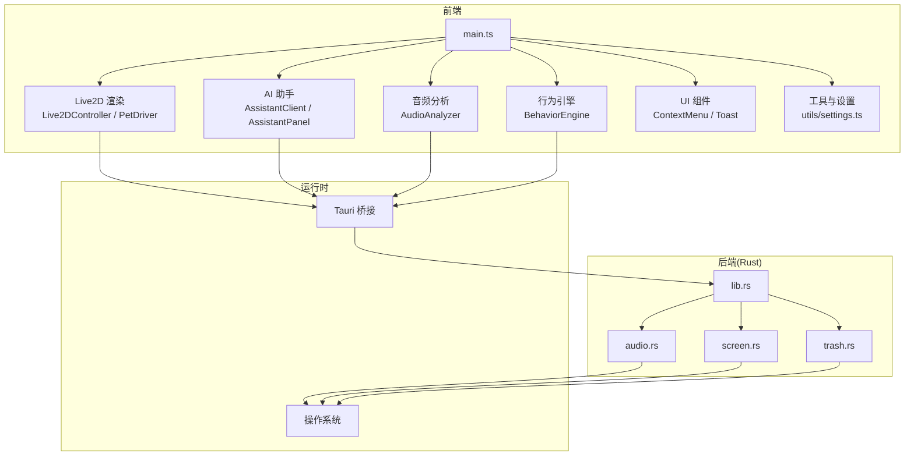
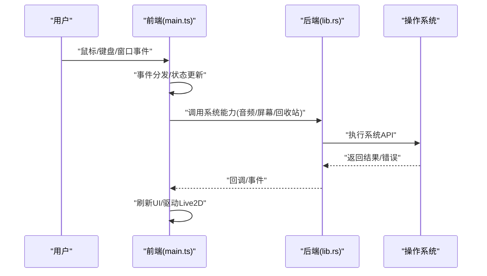
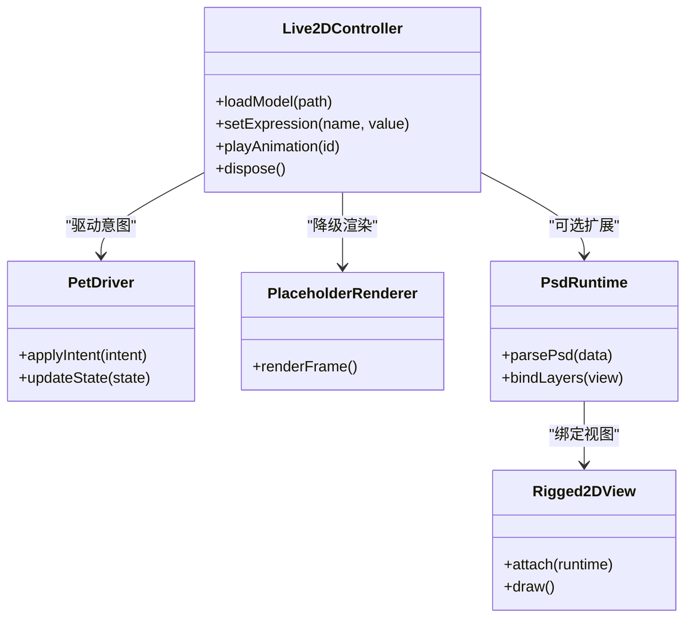
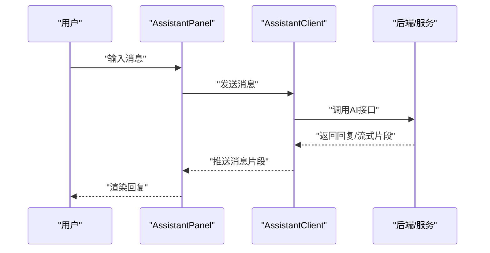
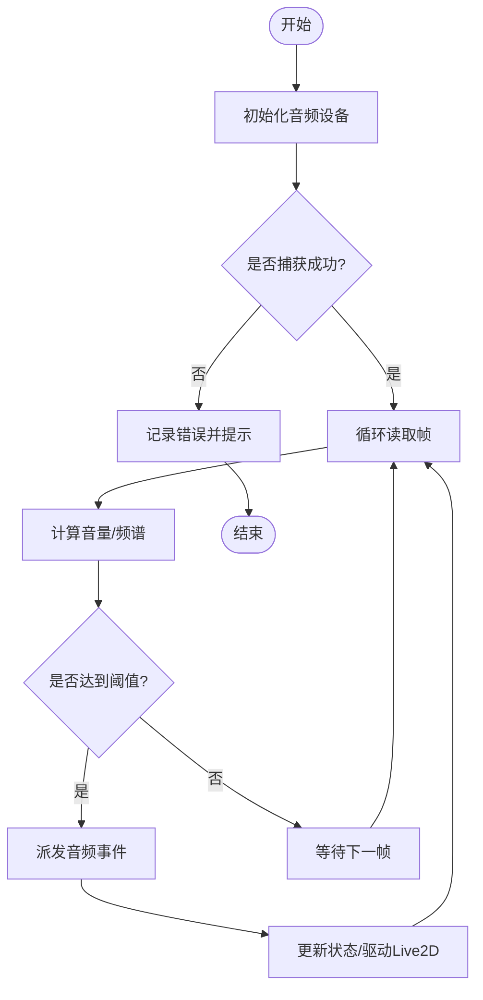
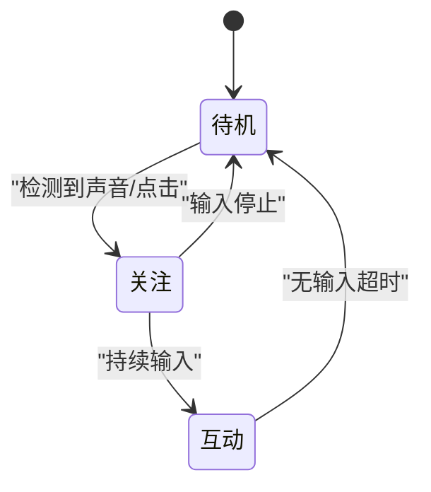
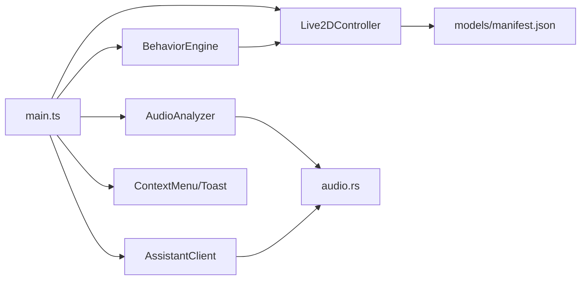

# 架构设计

<cite>
**本文引用的文件**
- [src/main.ts](file://src/main.ts)
- [src/assistant/AssistantClient.ts](file://src/assistant/AssistantClient.ts)
- [src/assistant/AssistantPanel.ts](file://src/assistant/AssistantPanel.ts)
- [src/audio/AudioAnalyzer.ts](file://src/audio/AudioAnalyzer.ts)
- [src/autonomous/BehaviorEngine.ts](file://src/autonomous/BehaviorEngine.ts)
- [src/live2d/Live2DController.ts](file://src/live2d/Live2DController.ts)
- [src/live2d/PetDriver.ts](file://src/live2d/PetDriver.ts)
- [src/live2d/PlaceholderRenderer.ts](file://src/live2d/PlaceholderRenderer.ts)
- [src/live2d/psd/PsdRuntime.ts](file://src/live2d/psd/PsdRuntime.ts)
- [src/live2d/psd/Rigged2DView.ts](file://src/live2d/psd/Rigged2DView.ts)
- [src/ui/ContextMenu.ts](file://src/ui/ContextMenu.ts)
- [src/ui/Toast.ts](file://src/ui/Toast.ts)
- [src/utils/settings.ts](file://src/utils/settings.ts)
- [src/vendor/](file://src/vendor/)
- [src-tauri/src/lib.rs](file://src-tauri/src/lib.rs)
- [src-tauri/src/main.rs](file://src-tauri/src/main.rs)
- [src-tauri/src/audio.rs](file://src-tauri/src/audio.rs)
- [src-tauri/src/screen.rs](file://src-tauri/src/screen.rs)
- [src-tauri/src/trash.rs](file://src-tauri/src/trash.rs)
- [src-tauri/Cargo.toml](file://src-tauri/Cargo.toml)
- [src-tauri/tauri.conf.json](file://src-tauri/tauri.conf.json)
- [public/models/manifest.json](file://public/models/manifest.json)
- [index.html](file://index.html)
- [package.json](file://package.json)
- [vite.config.ts](file://vite.config.ts)
</cite>

## 目录
1. [简介](#简介)
2. [项目结构](#项目结构)
3. [核心组件](#核心组件)
4. [架构总览](#架构总览)
5. [详细组件分析](#详细组件分析)
6. [依赖关系分析](#依赖关系分析)
7. [性能考量](#性能考量)
8. [故障排查指南](#故障排查指南)
9. [结论](#结论)
10. [附录](#附录)

## 简介
本架构设计文档面向“宠物桌面应用”，目标是清晰描述前后端分离的架构模式与技术决策：前端基于 TypeScript，后端基于 Rust，通过 Tauri 进行进程间通信；采用模块化与事件驱动架构，将 Live2D 渲染、AI 助手、音频处理等核心能力解耦为独立模块；定义系统边界、组件交互图与集成模式；并说明数据流从用户输入到界面响应的完整路径。同时给出技术选型的权衡与优化建议。

## 项目结构
仓库采用典型的前后端分离布局：
- 前端（TypeScript）位于 src/，包含 UI、Live2D 渲染、AI 助手、音频分析、行为引擎等模块。
- 后端（Rust）位于 src-tauri/，提供系统级能力（音频、屏幕、回收站等）并通过 Tauri API 暴露给前端。
- 资源与配置：public/models/ 存放模型清单；根目录 index.html、package.json、vite.config.ts 负责构建与入口；Tauri 配置文件 tauri.conf.json 定义窗口与权限。

图表来源
- [src/main.ts:1-200](file://src/main.ts#L1-L200)
- [src-tauri/src/lib.rs:1-200](file://src-tauri/src/lib.rs#L1-L200)
- [src-tauri/tauri.conf.json:1-200](file://src-tauri/tauri.conf.json#L1-L200)

章节来源
- [src/main.ts:1-200](file://src/main.ts#L1-L200)
- [src-tauri/src/lib.rs:1-200](file://src-tauri/src/lib.rs#L1-L200)
- [src-tauri/tauri.conf.json:1-200](file://src-tauri/tauri.conf.json#L1-L200)
- [package.json:1-200](file://package.json#L1-L200)
- [vite.config.ts:1-200](file://vite.config.ts#L1-L200)

## 核心组件
- 前端主入口与装配：负责初始化各模块、注册事件总线、挂载 UI、启动渲染循环。
- Live2D 渲染系统：封装模型加载、驱动、占位渲染与 PSD 运行时视图，提供统一的动画控制接口。
- AI 助手模块：对外提供对话/指令解析能力，管理面板展示与消息流。
- 音频处理系统：采集与分析音频，驱动表情/动作变化，必要时调用后端音频能力。
- 行为引擎：根据状态与事件调度宠物的自主行为（待机、互动、响应）。
- UI 组件：上下文菜单、提示通知等轻量交互元素。
- 后端能力：音频、屏幕、回收站等系统级操作，通过 Tauri 暴露给前端。

章节来源
- [src/main.ts:1-200](file://src/main.ts#L1-L200)
- [src/live2d/Live2DController.ts:1-200](file://src/live2d/Live2DController.ts#L1-L200)
- [src/live2d/PetDriver.ts:1-200](file://src/live2d/PetDriver.ts#L1-L200)
- [src/assistant/AssistantClient.ts:1-200](file://src/assistant/AssistantClient.ts#L1-L200)
- [src/assistant/AssistantPanel.ts:1-200](file://src/assistant/AssistantPanel.ts#L1-L200)
- [src/audio/AudioAnalyzer.ts:1-200](file://src/audio/AudioAnalyzer.ts#L1-L200)
- [src/autonomous/BehaviorEngine.ts:1-200](file://src/autonomous/BehaviorEngine.ts#L1-L200)
- [src/ui/ContextMenu.ts:1-200](file://src/ui/ContextMenu.ts#L1-L200)
- [src/ui/Toast.ts:1-200](file://src/ui/Toast.ts#L1-L200)
- [src-tauri/src/audio.rs:1-200](file://src-tauri/src/audio.rs#L1-L200)
- [src-tauri/src/screen.rs:1-200](file://src-tauri/src/screen.rs#L1-L200)
- [src-tauri/src/trash.rs:1-200](file://src-tauri/src/trash.rs#L1-L200)

## 架构总览
整体采用“前后端分离 + 事件驱动 + 模块化”的架构：
- 前端以模块为单位组织职责，通过事件总线进行松耦合协作。
- 后端通过 Tauri 暴露系统能力，前端通过异步调用获取结果或订阅事件。
- 渲染层与业务逻辑解耦，Live2D 控制器作为抽象层屏蔽具体实现差异。
- 数据流遵循“输入 -> 解析 -> 状态更新 -> 渲染/反馈”的闭环。

图表来源
- [src/main.ts:1-200](file://src/main.ts#L1-L200)
- [src-tauri/src/lib.rs:1-200](file://src-tauri/src/lib.rs#L1-L200)

章节来源
- [src/main.ts:1-200](file://src/main.ts#L1-L200)
- [src-tauri/src/lib.rs:1-200](file://src-tauri/src/lib.rs#L1-L200)

## 详细组件分析

### Live2D 渲染系统
职责划分：
- Live2DController：统一入口，负责模型生命周期、参数同步、动画控制。
- PetDriver：将高层意图（如情绪、动作）转换为 Live2D 可识别的参数变化。
- PlaceholderRenderer：在模型未就绪时提供占位显示，保证 UI 连续性。
- PsdRuntime / Rigged2DView：扩展支持 PSD 资源的运行时解析与绑定视图。

图表来源
- [src/live2d/Live2DController.ts:1-200](file://src/live2d/Live2DController.ts#L1-L200)
- [src/live2d/PetDriver.ts:1-200](file://src/live2d/PetDriver.ts#L1-L200)
- [src/live2d/PlaceholderRenderer.ts:1-200](file://src/live2d/PlaceholderRenderer.ts#L1-L200)
- [src/live2d/psd/PsdRuntime.ts:1-200](file://src/live2d/psd/PsdRuntime.ts#L1-L200)
- [src/live2d/psd/Rigged2DView.ts:1-200](file://src/live2d/psd/Rigged2DView.ts#L1-L200)

章节来源
- [src/live2d/Live2DController.ts:1-200](file://src/live2d/Live2DController.ts#L1-L200)
- [src/live2d/PetDriver.ts:1-200](file://src/live2d/PetDriver.ts#L1-L200)
- [src/live2d/PlaceholderRenderer.ts:1-200](file://src/live2d/PlaceholderRenderer.ts#L1-L200)
- [src/live2d/psd/PsdRuntime.ts:1-200](file://src/live2d/psd/PsdRuntime.ts#L1-L200)
- [src/live2d/psd/Rigged2DView.ts:1-200](file://src/live2d/psd/Rigged2DView.ts#L1-L200)

### AI 助手模块
职责划分：
- AssistantClient：封装与后端或外部服务的对话协议、消息队列、重试与超时策略。
- AssistantPanel：负责消息列表、输入框、富文本渲染与交互。

图表来源
- [src/assistant/AssistantPanel.ts:1-200](file://src/assistant/AssistantPanel.ts#L1-L200)
- [src/assistant/AssistantClient.ts:1-200](file://src/assistant/AssistantClient.ts#L1-L200)

章节来源
- [src/assistant/AssistantPanel.ts:1-200](file://src/assistant/AssistantPanel.ts#L1-L200)
- [src/assistant/AssistantClient.ts:1-200](file://src/assistant/AssistantClient.ts#L1-L200)

### 音频处理系统
职责划分：
- AudioAnalyzer：采集麦克风/系统音频，计算音量、频谱特征，触发表情/动作变化。
- 后端 audio.rs：提供跨平台音频采集与设备枚举能力，供前端调用。

图表来源
- [src/audio/AudioAnalyzer.ts:1-200](file://src/audio/AudioAnalyzer.ts#L1-L200)
- [src-tauri/src/audio.rs:1-200](file://src-tauri/src/audio.rs#L1-L200)

章节来源
- [src/audio/AudioAnalyzer.ts:1-200](file://src/audio/AudioAnalyzer.ts#L1-L200)
- [src-tauri/src/audio.rs:1-200](file://src-tauri/src/audio.rs#L1-L200)

### 行为引擎
职责划分：
- BehaviorEngine：维护宠物状态机，依据事件（音频、时间、用户交互）切换行为（待机、跟随、互动），输出驱动指令给 Live2D。

图表来源
- [src/autonomous/BehaviorEngine.ts:1-200](file://src/autonomous/BehaviorEngine.ts#L1-L200)

章节来源
- [src/autonomous/BehaviorEngine.ts:1-200](file://src/autonomous/BehaviorEngine.ts#L1-L200)

### UI 组件与设置
- ContextMenu：右键菜单，提供快捷操作入口。
- Toast：轻量提示，用于状态反馈。
- settings：集中管理用户偏好与持久化配置。

章节来源
- [src/ui/ContextMenu.ts:1-200](file://src/ui/ContextMenu.ts#L1-L200)
- [src/ui/Toast.ts:1-200](file://src/ui/Toast.ts#L1-L200)
- [src/utils/settings.ts:1-200](file://src/utils/settings.ts#L1-L200)

### 后端能力与系统集成
- lib.rs：Tauri 命令注册、事件通道、错误处理与日志。
- audio.rs：音频采集、设备管理、音量检测。
- screen.rs：屏幕尺寸、多显示器信息、窗口定位辅助。
- trash.rs：回收站操作（清空/查询），提供系统级能力。

章节来源
- [src-tauri/src/lib.rs:1-200](file://src-tauri/src/lib.rs#L1-L200)
- [src-tauri/src/audio.rs:1-200](file://src-tauri/src/audio.rs#L1-L200)
- [src-tauri/src/screen.rs:1-200](file://src-tauri/src/screen.rs#L1-L200)
- [src-tauri/src/trash.rs:1-200](file://src-tauri/src/trash.rs#L1-L200)

## 依赖关系分析
前端模块之间通过事件总线与接口解耦；后端通过 Tauri 暴露能力，避免直接耦合操作系统细节。关键依赖如下：
- main.ts 依赖各功能模块与 UI 组件。
- Live2D 渲染依赖模型清单与运行时资源。
- 音频模块依赖后端 audio.rs。
- 行为引擎依赖音频与 Live2D 控制器。
- AI 助手可能依赖网络或后端代理。

图表来源
- [src/main.ts:1-200](file://src/main.ts#L1-L200)
- [public/models/manifest.json:1-200](file://public/models/manifest.json#L1-L200)
- [src-tauri/src/audio.rs:1-200](file://src-tauri/src/audio.rs#L1-L200)

章节来源
- [src/main.ts:1-200](file://src/main.ts#L1-L200)
- [public/models/manifest.json:1-200](file://public/models/manifest.json#L1-L200)
- [src-tauri/src/audio.rs:1-200](file://src-tauri/src/audio.rs#L1-L200)

## 性能考量
- 渲染节流：Live2D 渲染与音频分析需限制频率，避免阻塞主线程。
- 事件合并：高频事件（如音频帧）应批量处理，减少状态抖动。
- 资源加载：模型与 PSD 资源按需懒加载，首屏使用占位渲染提升体验。
- 后端调用：系统级操作（音频/屏幕/回收站）尽量批量化与缓存结果，降低 IPC 开销。
- 内存管理：及时释放不再使用的模型与视图对象，防止内存泄漏。

[本节为通用指导，不直接分析具体文件]

## 故障排查指南
常见问题与定位思路：
- 模型加载失败：检查 models/manifest.json 路径与权限；确认 Live2D 控制器初始化顺序。
- 音频无法采集：验证后端 audio.rs 的设备枚举与权限；在前端添加错误提示与重试。
- 行为异常：查看 BehaviorEngine 的状态转换日志；核对事件阈值与超时配置。
- 界面卡顿：检查渲染循环与事件分发是否阻塞；启用节流与分片渲染。
- 后端错误：通过 Tauri 日志定位具体命令失败原因；必要时增加错误码与堆栈。

章节来源
- [src-tauri/src/lib.rs:1-200](file://src-tauri/src/lib.rs#L1-L200)
- [src-tauri/src/audio.rs:1-200](file://src-tauri/src/audio.rs#L1-L200)
- [src/live2d/Live2DController.ts:1-200](file://src/live2d/Live2DController.ts#L1-L200)
- [src/autonomous/BehaviorEngine.ts:1-200](file://src/autonomous/BehaviorEngine.ts#L1-L200)

## 结论
本架构通过前后端分离与事件驱动实现了高内聚、低耦合的模块化设计。Live2D 渲染、AI 助手、音频处理与行为引擎各司其职，借助 Tauri 桥接系统能力，形成稳定可扩展的桌面宠物应用。建议在后续迭代中继续完善错误处理、性能监控与可观测性，以提升用户体验与可维护性。

[本节为总结性内容，不直接分析具体文件]

## 附录
- 构建与运行：参考 package.json 与 vite.config.ts 配置；Tauri 窗口与权限由 tauri.conf.json 管理。
- 模型资源：public/models/manifest.json 定义可用模型清单，供 Live2D 控制器加载。
- 入口页面：index.html 作为前端入口，承载主应用容器与脚本加载。

章节来源
- [package.json:1-200](file://package.json#L1-L200)
- [vite.config.ts:1-200](file://vite.config.ts#L1-L200)
- [src-tauri/tauri.conf.json:1-200](file://src-tauri/tauri.conf.json#L1-L200)
- [public/models/manifest.json:1-200](file://public/models/manifest.json#L1-L200)
- [index.html:1-200](file://index.html#L1-L200)