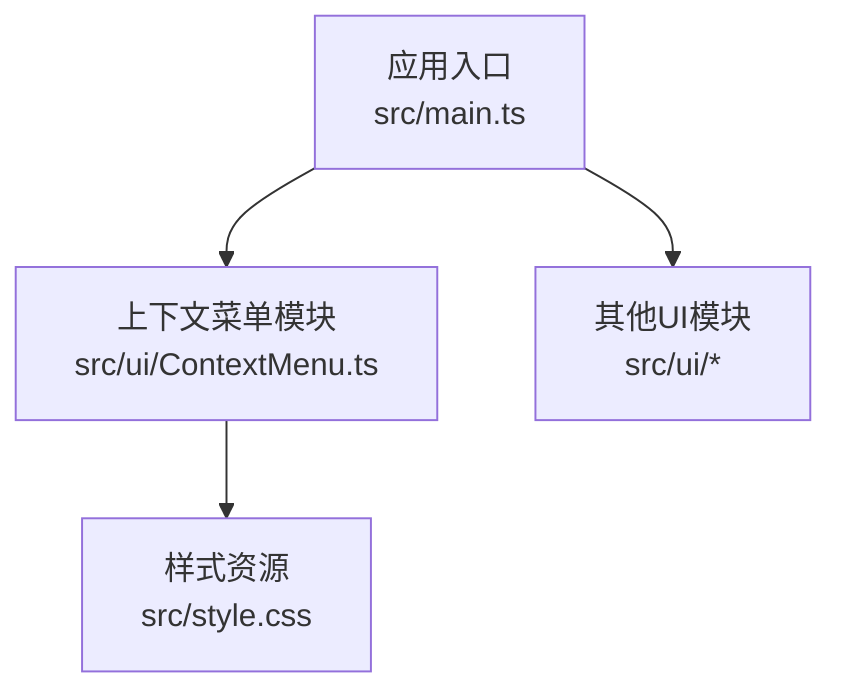
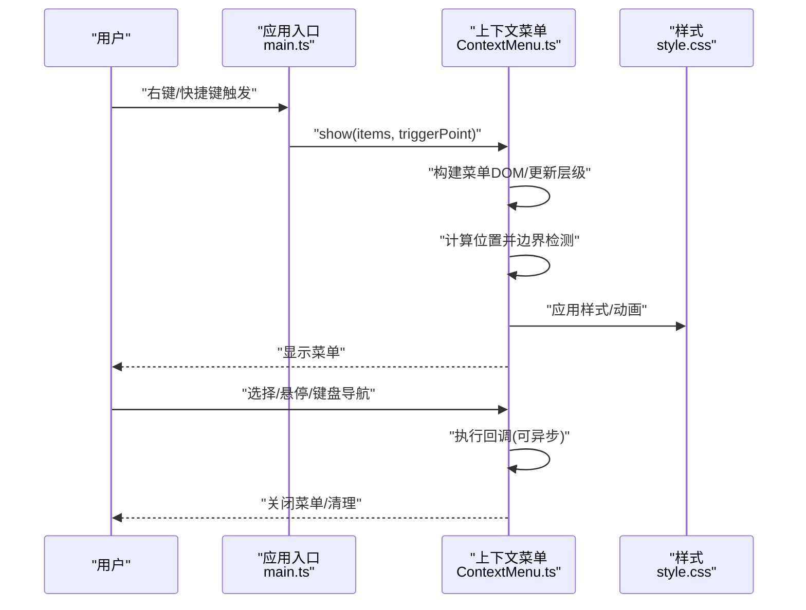
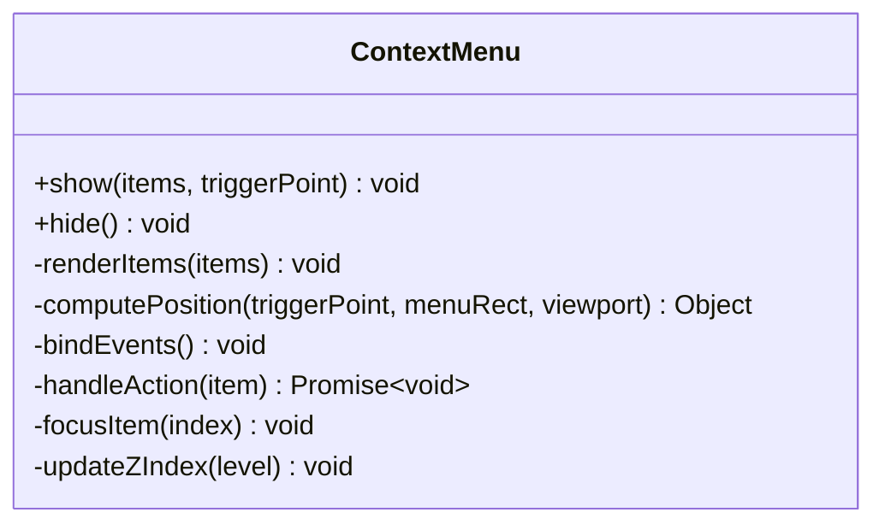
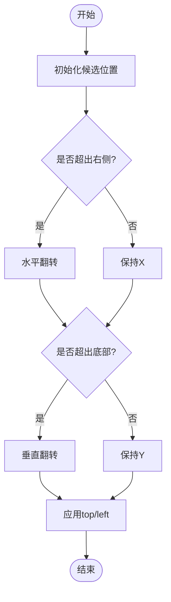
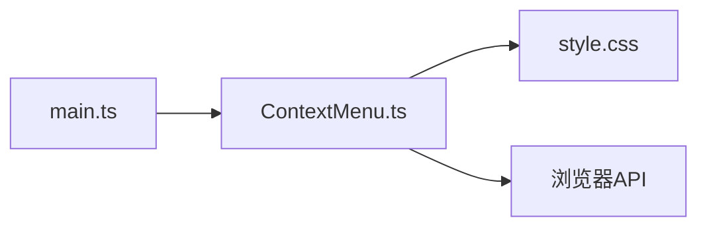

# 上下文菜单组件

<cite>
**本文引用的文件**
- [ContextMenu.ts](file://src/ui/ContextMenu.ts)
- [main.ts](file://src/main.ts)
- [style.css](file://src/style.css)
</cite>

## 目录
1. [简介](#简介)
2. [项目结构](#项目结构)
3. [核心组件](#核心组件)
4. [架构总览](#架构总览)
5. [详细组件分析](#详细组件分析)
6. [依赖关系分析](#依赖关系分析)
7. [性能考虑](#性能考虑)
8. [故障排查指南](#故障排查指南)
9. [结论](#结论)
10. [附录](#附录)

## 简介
本文件围绕 src/ui/ContextMenu.ts 中的上下文菜单组件进行系统化文档化，重点说明：
- ContextMenu 类的职责与实现要点
- 菜单项的动态生成、位置计算与边界检测
- 用户交互事件处理（鼠标、键盘）
- 显示逻辑、层级管理与焦点管理
- 定位策略与响应式适配
- 自定义菜单项、点击事件绑定与异步操作示例
- 性能优化与内存管理最佳实践

## 项目结构
本项目采用前端 TypeScript 工程组织，UI 相关能力集中在 src/ui 目录。上下文菜单由独立的模块提供，便于在应用各处复用。

图表来源
- [main.ts:1-200](file://src/main.ts#L1-L200)
- [ContextMenu.ts:1-200](file://src/ui/ContextMenu.ts#L1-L200)
- [style.css:1-200](file://src/style.css#L1-L200)

章节来源
- [main.ts:1-200](file://src/main.ts#L1-L200)
- [ContextMenu.ts:1-200](file://src/ui/ContextMenu.ts#L1-L200)
- [style.css:1-200](file://src/style.css#L1-L200)

## 核心组件
- ContextMenu：负责创建、显示、隐藏、定位、渲染菜单项、处理交互事件、管理键盘导航与焦点、维护层级与生命周期。
- 菜单项数据模型：描述每个菜单项的文本、图标、禁用状态、分隔符、子菜单、回调等。
- 事件系统：封装鼠标与键盘事件到统一的交互流程，支持异步回调。
- 定位器：根据触发点坐标、视口尺寸与菜单尺寸计算最终显示位置，并进行边界修正。
- 样式层：通过 CSS 类名控制外观与动画，确保在不同主题下的可访问性。

章节来源
- [ContextMenu.ts:1-200](file://src/ui/ContextMenu.ts#L1-L200)

## 架构总览
下图展示了上下文菜单从触发到显示的完整流程，包括事件捕获、菜单构建、定位计算、DOM 挂载、交互处理与销毁。

图表来源
- [main.ts:1-200](file://src/main.ts#L1-L200)
- [ContextMenu.ts:1-200](file://src/ui/ContextMenu.ts#L1-L200)
- [style.css:1-200](file://src/style.css#L1-L200)

## 详细组件分析

### ContextMenu 类设计
- 职责
  - 创建与销毁菜单容器与列表
  - 动态渲染菜单项（支持分隔符、子菜单、禁用态）
  - 计算显示位置并进行边界检测
  - 处理鼠标与键盘交互，支持异步回调
  - 管理焦点与可访问性属性
  - 维护层级（z-index）与全局遮罩/监听
- 关键方法（概念性说明）
  - show(items, triggerPoint): 显示菜单，传入菜单项数组与触发点坐标
  - hide(): 隐藏并清理
  - renderItems(items): 将数据转换为 DOM 节点
  - computePosition(triggerPoint, menuRect, viewport): 计算最终位置并做边界修正
  - bindEvents(): 绑定鼠标/键盘事件
  - handleAction(item): 执行菜单项动作（支持 Promise）
  - focusItem(index): 聚焦指定索引项
  - updateZIndex(level): 设置层级
- 数据结构
  - 菜单项：包含文本、图标、是否分隔符、是否禁用、子菜单、回调函数等字段
  - 触发点：x/y 坐标或元素引用
  - 视图信息：视口宽高、滚动偏移、菜单尺寸

章节来源
- [ContextMenu.ts:1-200](file://src/ui/ContextMenu.ts#L1-L200)

#### 类图（代码级映射）

图表来源
- [ContextMenu.ts:1-200](file://src/ui/ContextMenu.ts#L1-L200)

### 菜单项动态生成
- 输入：菜单项数组（支持嵌套子菜单）
- 输出：DOM 树（ul/li 结构），为每项附加数据属性以便事件处理
- 关键点
  - 递归渲染子菜单，避免重复创建容器
  - 对禁用项跳过事件绑定
  - 为分隔符插入占位节点
  - 使用事件委托统一处理点击/悬停

章节来源
- [ContextMenu.ts:1-200](file://src/ui/ContextMenu.ts#L1-L200)

### 位置计算算法与边界检测
- 输入：触发点坐标、菜单外框尺寸、视口尺寸与滚动偏移
- 过程
  - 初始位置：以触发点为基准放置菜单（例如右下角对齐）
  - 边界检测：若超出视口右/下边缘，则翻转至左侧/上方
  - 滚动适配：考虑页面滚动偏移，保证可见区域正确
  - 优先级：优先保证完全可见；否则尽量靠近触发点
- 输出：最终 top/left 坐标
- 复杂度：O(1) 几何计算

图表来源
- [ContextMenu.ts:1-200](file://src/ui/ContextMenu.ts#L1-L200)

### 用户交互事件处理
- 鼠标事件
  - 点击：执行对应菜单项回调，支持异步任务
  - 悬停：高亮当前项，展开子菜单（如有）
  - 失焦：自动关闭菜单
- 键盘事件
  - 方向键：上下移动焦点
  - Enter/Space：激活当前焦点项
  - Escape：关闭菜单
  - Tab：按顺序在菜单项间移动焦点
- 可访问性
  - role="menu/menuitem"
  - aria-disabled/aria-selected 等属性同步

章节来源
- [ContextMenu.ts:1-200](file://src/ui/ContextMenu.ts#L1-L200)

### 显示逻辑、层级管理与焦点管理
- 显示逻辑
  - 单例/多实例：根据需求决定同一时间仅一个菜单或允许叠加
  - 防抖/节流：快速多次触发时避免重复渲染
- 层级管理
  - z-index 递增，确保新菜单覆盖旧菜单
  - 子菜单相对父项定位，避免遮挡
- 焦点管理
  - 打开时聚焦首项或上次选中项
  - 关闭时恢复焦点到触发源

章节来源
- [ContextMenu.ts:1-200](file://src/ui/ContextMenu.ts#L1-L200)

### 定位策略、边界检测与响应式适配
- 定位策略
  - 基于触发点的绝对定位
  - 支持锚定到元素中心或边角
- 边界检测
  - 视口裁剪、滚动偏移补偿
  - 最小留白，避免贴边
- 响应式适配
  - 窗口 resize 时重新计算位置
  - 移动端触摸事件兼容

章节来源
- [ContextMenu.ts:1-200](file://src/ui/ContextMenu.ts#L1-L200)

### 自定义菜单项、点击事件与异步操作示例
- 创建自定义菜单项
  - 定义菜单项对象，包含必要字段与回调
  - 支持图标、分隔符、禁用态、子菜单
- 绑定点击事件
  - 在菜单项回调中执行业务逻辑
  - 可使用 async/await 处理异步任务
- 错误处理
  - 捕获异常并给出反馈（如 Toast）
  - 避免阻塞 UI 线程

章节来源
- [ContextMenu.ts:1-200](file://src/ui/ContextMenu.ts#L1-L200)

### 与应用的集成
- 在应用入口或业务模块中引入 ContextMenu
- 监听目标元素的右键或快捷键事件
- 调用 show 方法传入菜单项与触发点
- 可选：在全局关闭时清理监听

章节来源
- [main.ts:1-200](file://src/main.ts#L1-L200)
- [ContextMenu.ts:1-200](file://src/ui/ContextMenu.ts#L1-L200)

## 依赖关系分析
- 内部依赖
  - 样式：通过 style.css 控制外观与动画
  - 工具：数学计算、设置读取等（若有）
- 外部依赖
  - 浏览器 API：document、window、event、getBoundingClientRect 等
- 耦合度
  - ContextMenu 与具体业务解耦，仅依赖通用 DOM 与事件接口
  - 通过配置项控制行为，降低耦合

图表来源
- [main.ts:1-200](file://src/main.ts#L1-L200)
- [ContextMenu.ts:1-200](file://src/ui/ContextMenu.ts#L1-L200)
- [style.css:1-200](file://src/style.css#L1-L200)

章节来源
- [main.ts:1-200](file://src/main.ts#L1-L200)
- [ContextMenu.ts:1-200](file://src/ui/ContextMenu.ts#L1-L200)
- [style.css:1-200](file://src/style.css#L1-L200)

## 性能考虑
- 渲染优化
  - 使用 DocumentFragment 批量插入节点
  - 避免在高频事件中创建大量对象
- 事件优化
  - 事件委托减少监听器数量
  - 防抖/节流用于 resize/scroll 等高频事件
- 内存管理
  - 隐藏菜单时移除 DOM 与事件监听
  - 及时释放闭包引用，避免内存泄漏
- 布局抖动
  - 先测量再写入样式，减少重排
  - 使用 transform 替代频繁修改 top/left（必要时）

[本节为通用性能建议，不直接分析具体文件]

## 故障排查指南
- 菜单未显示
  - 检查触发点坐标是否有效
  - 确认 DOM 已挂载且样式生效
- 位置不正确
  - 检查视口尺寸与滚动偏移
  - 验证边界检测逻辑是否被覆盖
- 键盘导航失效
  - 确认焦点是否正确设置
  - 检查事件监听是否被移除
- 异步回调报错
  - 捕获异常并记录日志
  - 避免在回调中执行阻塞操作

章节来源
- [ContextMenu.ts:1-200](file://src/ui/ContextMenu.ts#L1-L200)

## 结论
ContextMenu 组件提供了完整的上下文菜单能力，涵盖动态渲染、精准定位、交互处理与可访问性支持。通过合理的层级管理、边界检测与性能优化，可在复杂应用中稳定运行。建议结合业务场景扩展菜单项类型与交互行为，并保持与样式层的解耦。

[本节为总结性内容，不直接分析具体文件]

## 附录
- 常用配置项
  - items：菜单项数组
  - triggerPoint：触发点坐标或元素
  - options：显示选项（如层级、动画、是否自动关闭等）
- 事件回调
  - onClick：点击菜单项回调
  - onOpen/onClose：打开/关闭回调
- 可访问性
  - 遵循 WAI-ARIA 菜单规范
  - 提供键盘导航与屏幕阅读器支持

[本节为补充信息，不直接分析具体文件]