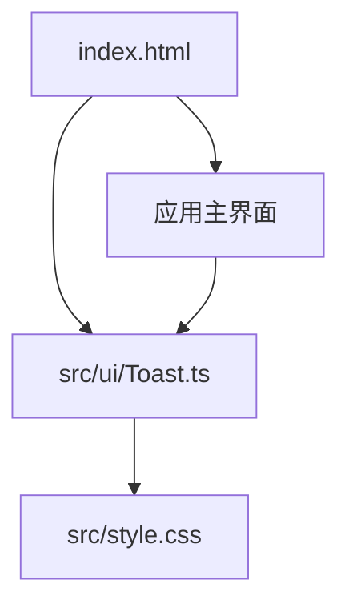
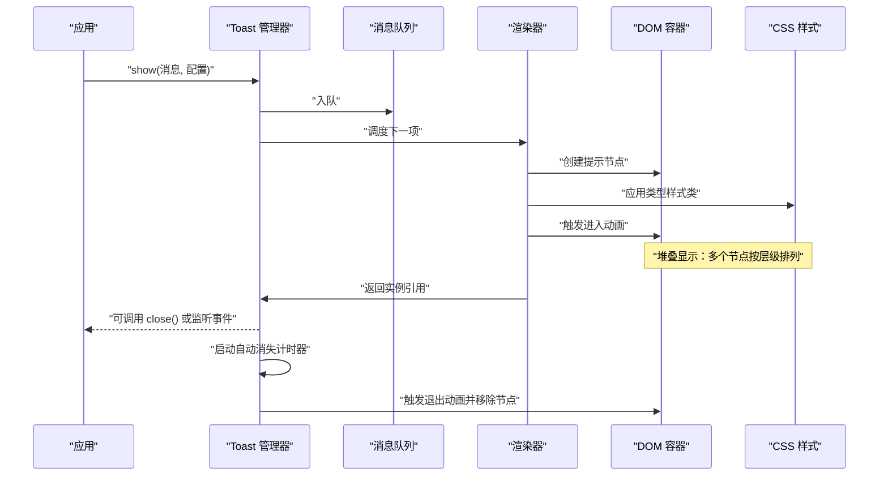
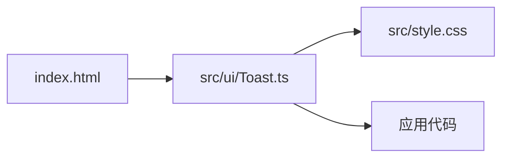

# 提示组件

<cite>
**本文引用的文件**
- [src/ui/Toast.ts](file://src/ui/Toast.ts)
- [src/style.css](file://src/style.css)
- [index.html](file://index.html)
</cite>

## 目录
1. [简介](#简介)
2. [项目结构](#项目结构)
3. [核心组件](#核心组件)
4. [架构总览](#架构总览)
5. [详细组件分析](#详细组件分析)
6. [依赖关系分析](#依赖关系分析)
7. [性能考虑](#性能考虑)
8. [故障排查指南](#故障排查指南)
9. [结论](#结论)
10. [附录](#附录)

## 简介
本章节介绍“提示组件”（Toast）的目标与能力：提供轻量、非阻塞的反馈消息，支持多种样式类型（成功、错误、警告、信息），具备消息队列管理、动画效果、生命周期控制、堆叠显示、自动消失与手动关闭等特性。同时说明无障碍访问支持与屏幕阅读器兼容性要点，帮助开发者在桌面应用中快速集成并正确使用该组件。

## 项目结构
提示组件位于前端 UI 层，核心实现为 TypeScript 模块，样式通过全局 CSS 注入，入口页面负责挂载容器与初始化。

图表来源
- [index.html:1-200](file://index.html#L1-L200)
- [src/ui/Toast.ts:1-200](file://src/ui/Toast.ts#L1-L200)
- [src/style.css:1-200](file://src/style.css#L1-L200)

章节来源
- [index.html:1-200](file://index.html#L1-L200)
- [src/ui/Toast.ts:1-200](file://src/ui/Toast.ts#L1-L200)
- [src/style.css:1-200](file://src/style.css#L1-L200)

## 核心组件
- Toast 管理器：负责创建、展示、堆叠、调度与销毁提示实例；维护消息队列，按策略顺序渲染。
- 提示实例：封装单条消息的生命周期（创建、进入动画、停留、退出动画、销毁），并提供交互回调（如点击关闭）。
- 样式系统：基于 CSS 类名区分类型（成功、错误、警告、信息），统一控制布局、阴影、圆角与过渡动画。
- 无障碍支持：通过语义化标签与属性（如 role、aria-live、aria-atomic）提升屏幕阅读器可读性。

章节来源
- [src/ui/Toast.ts:1-200](file://src/ui/Toast.ts#L1-L200)
- [src/style.css:1-200](file://src/style.css#L1-L200)

## 架构总览
下图展示了从业务调用到 UI 渲染的关键路径：业务侧调用 Toast API → 管理器入队 → 选择器取出首项 → 创建 DOM 节点并添加样式类 → 触发进入动画 → 启动定时器自动消失或等待用户操作 → 触发退出动画并移除节点。

图表来源
- [src/ui/Toast.ts:1-200](file://src/ui/Toast.ts#L1-L200)
- [src/style.css:1-200](file://src/style.css#L1-L200)

## 详细组件分析

### 消息队列与调度机制
- 入队策略：新消息加入队列尾部；若开启“覆盖模式”，则替换当前正在显示的同类消息。
- 出队策略：仅当当前无活跃提示时，从队头取出一条进行渲染；避免并发导致的视觉冲突。
- 优先级：可按类型或自定义权重排序，确保关键提示优先显示。
- 背压处理：当队列过长时，限制最大长度或丢弃最旧条目，防止内存增长。

章节来源
- [src/ui/Toast.ts:1-200](file://src/ui/Toast.ts#L1-L200)

### 动画效果与堆叠显示
- 进入/退出动画：使用 CSS transition 或 keyframes 实现淡入、上滑、缩放等效果；通过类名切换触发。
- 堆叠布局：多提示垂直排列，保持固定间距；顶部对齐，避免遮挡重要内容。
- 层级管理：后出现的提示置于上层，保证可见性与可操作性。
- 性能优化：对频繁创建的节点采用复用或批量更新；减少重排重绘。

章节来源
- [src/ui/Toast.ts:1-200](file://src/ui/Toast.ts#L1-L200)
- [src/style.css:1-200](file://src/style.css#L1-L200)

### 生命周期控制
- 创建：分配唯一 ID，构建 DOM 节点，绑定事件与属性。
- 显示：应用样式类，触发进入动画，记录开始时间。
- 停留：根据配置设置停留时长；期间可响应交互（如点击关闭、暂停计时）。
- 隐藏：触发退出动画，清理定时器与事件监听，释放资源。
- 销毁：从 DOM 与队列中移除，通知外部回调。

章节来源
- [src/ui/Toast.ts:1-200](file://src/ui/Toast.ts#L1-L200)

### 提示类型与样式
- 成功：绿色主题，常用于操作完成反馈。
- 错误：红色主题，用于失败或异常提示。
- 警告：黄色主题，用于需要注意但不阻断的流程。
- 信息：蓝色主题，用于一般性说明。
- 自定义：允许通过配置覆盖颜色、图标、尺寸与位置。

章节来源
- [src/style.css:1-200](file://src/style.css#L1-L200)
- [src/ui/Toast.ts:1-200](file://src/ui/Toast.ts#L1-L200)

### 配置选项
- 文本与标题：支持富文本或纯文本。
- 类型：success、error、warning、info。
- 持续时间：毫秒数，支持动态调整。
- 位置：顶部居中、底部居中、左上、右上等。
- 行为：是否自动消失、是否可点击关闭、是否允许堆叠。
- 回调：显示、隐藏、销毁时的钩子函数。
- 无障碍：aria 属性与朗读策略。

章节来源
- [src/ui/Toast.ts:1-200](file://src/ui/Toast.ts#L1-L200)

### 使用示例
- 发送提示：调用 show 方法传入消息与配置，返回实例以便后续操作。
- 设置时长：在配置中指定 duration，或在运行时修改剩余时间。
- 用户交互：为提示绑定点击事件，执行关闭或跳转等操作。
- 组合用法：链式调用或批量发送，配合队列策略达到预期体验。

章节来源
- [src/ui/Toast.ts:1-200](file://src/ui/Toast.ts#L1-L200)

### 自动消失与手动关闭
- 自动消失：基于定时器，到达时长后触发隐藏流程；支持暂停与恢复。
- 手动关闭：提供 close 方法或通过点击区域触发；支持批量关闭与清空队列。
- 状态同步：隐藏完成后从队列移除，确保后续消息正确推进。

章节来源
- [src/ui/Toast.ts:1-200](file://src/ui/Toast.ts#L1-L200)

### 无障碍访问与屏幕阅读器兼容
- 语义化：使用合适的 HTML 元素与 role 属性，确保可被识别为提示。
- 可朗读：通过 aria-live、aria-atomic 等属性控制朗读时机与范围。
- 键盘可达：焦点管理与 Tab 顺序合理，支持键盘操作关闭。
- 对比度与可读性：遵循 WCAG 对比度要求，确保文字清晰可辨。

章节来源
- [src/ui/Toast.ts:1-200](file://src/ui/Toast.ts#L1-L200)
- [src/style.css:1-200](file://src/style.css#L1-L200)

## 依赖关系分析
- 模块内聚：Toast 管理器与提示实例高内聚，职责清晰。
- 样式耦合：通过 CSS 类名解耦样式逻辑，便于主题扩展。
- 页面集成：index.html 提供挂载容器，确保 DOM 存在后再初始化。
- 外部依赖：最小化第三方依赖，降低版本冲突风险。

图表来源
- [index.html:1-200](file://index.html#L1-L200)
- [src/ui/Toast.ts:1-200](file://src/ui/Toast.ts#L1-L200)
- [src/style.css:1-200](file://src/style.css#L1-L200)

章节来源
- [index.html:1-200](file://index.html#L1-L200)
- [src/ui/Toast.ts:1-200](file://src/ui/Toast.ts#L1-L200)
- [src/style.css:1-200](file://src/style.css#L1-L200)

## 性能考虑
- 节点复用：对频繁创建销毁的 DOM 节点进行池化复用，减少 GC 压力。
- 动画优化：尽量使用 transform 与 opacity 触发 GPU 加速，避免 layout thrashing。
- 队列节流：在高并发场景下合并重复消息或限制速率，避免闪烁。
- 内存管理：及时清理事件监听与定时器，防止泄漏。

[本节为通用指导，不直接分析具体文件]

## 故障排查指南
- 未显示：检查容器是否存在、样式是否加载、队列是否为空。
- 动画卡顿：确认是否触发了大量重排；优化动画属性与节点数量。
- 无法关闭：验证事件绑定是否正确；检查是否有阻止冒泡的逻辑。
- 无障碍问题：核对 aria 属性与语义标签；使用辅助技术工具测试朗读。

章节来源
- [src/ui/Toast.ts:1-200](file://src/ui/Toast.ts#L1-L200)
- [src/style.css:1-200](file://src/style.css#L1-L200)

## 结论
提示组件以简洁的 API 与灵活的配置，满足桌面应用中多样化的反馈需求。通过队列管理、动画与生命周期控制，提供稳定且友好的用户体验；结合无障碍支持，确保不同用户群体均可顺畅获取信息。建议在实际项目中按需定制样式与行为，并遵循最佳实践进行性能与可访问性优化。

[本节为总结性内容，不直接分析具体文件]

## 附录
- 最佳实践
  - 明确消息类型与文案，避免歧义。
  - 合理设置持续时间与堆叠策略，避免信息过载。
  - 为关键操作提供明确的关闭与重试入口。
- 常见问题
  - 多窗口环境下的状态隔离。
  - 主题切换时的样式一致性。
  - 国际化文案的动态加载。

[本节为补充信息，不直接分析具体文件]