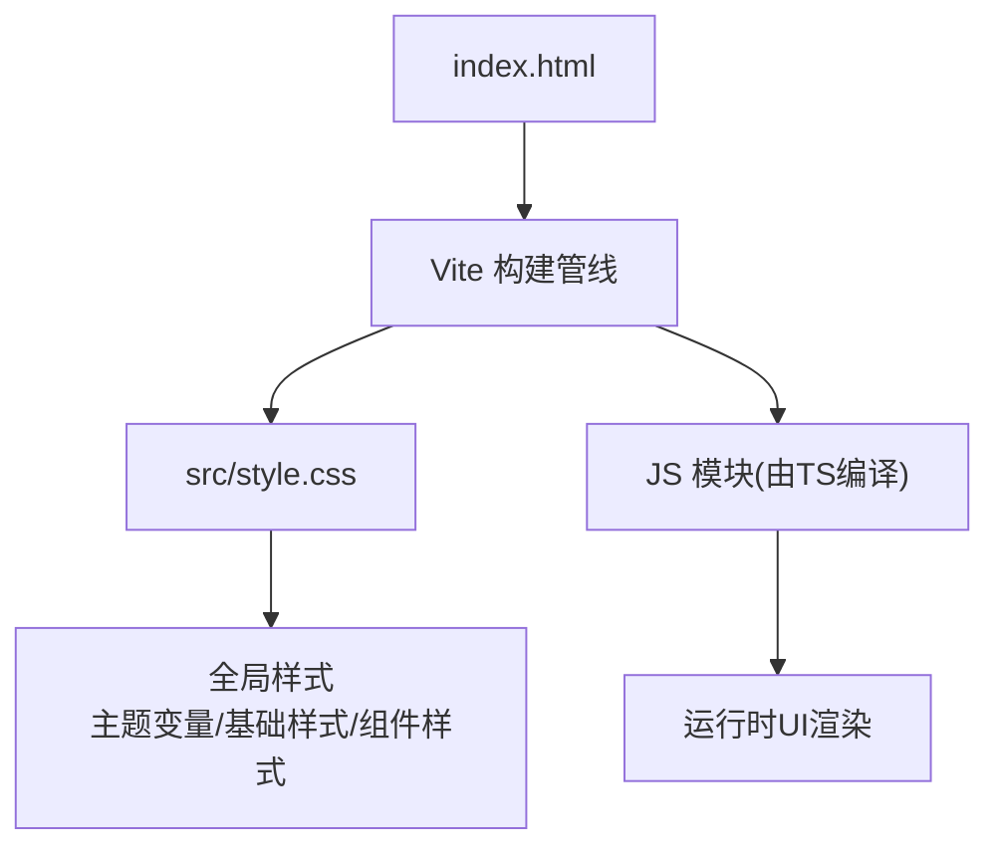
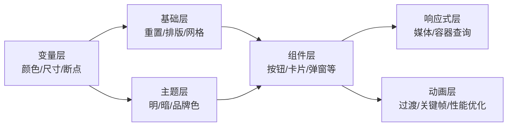
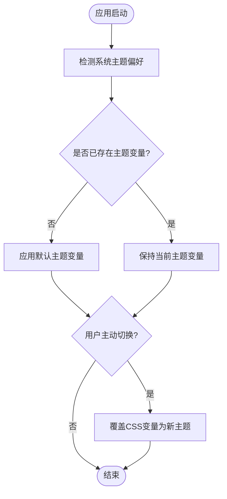
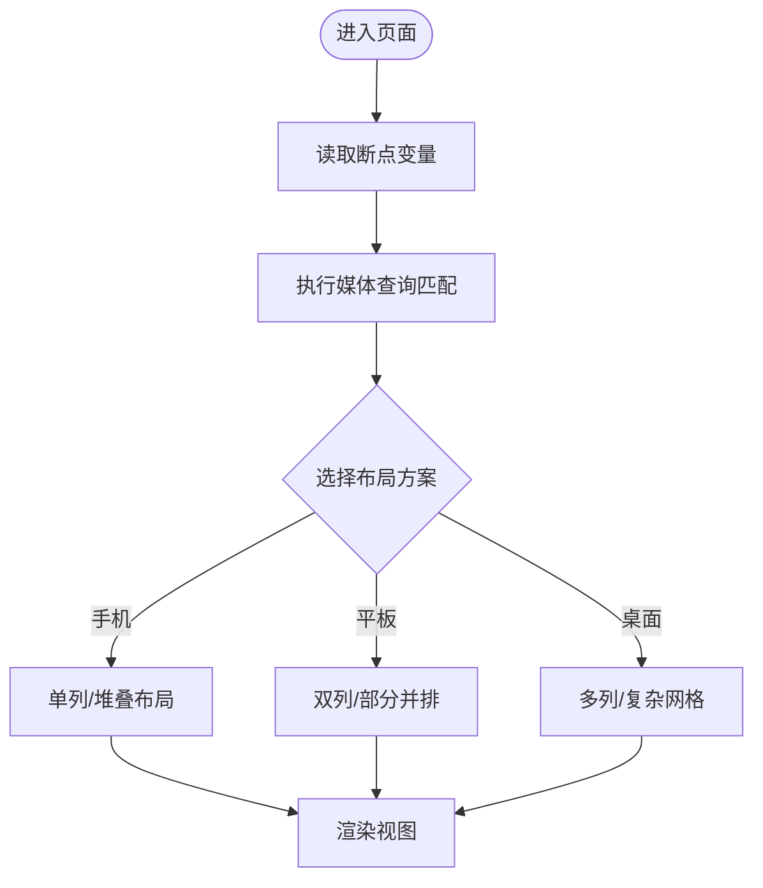
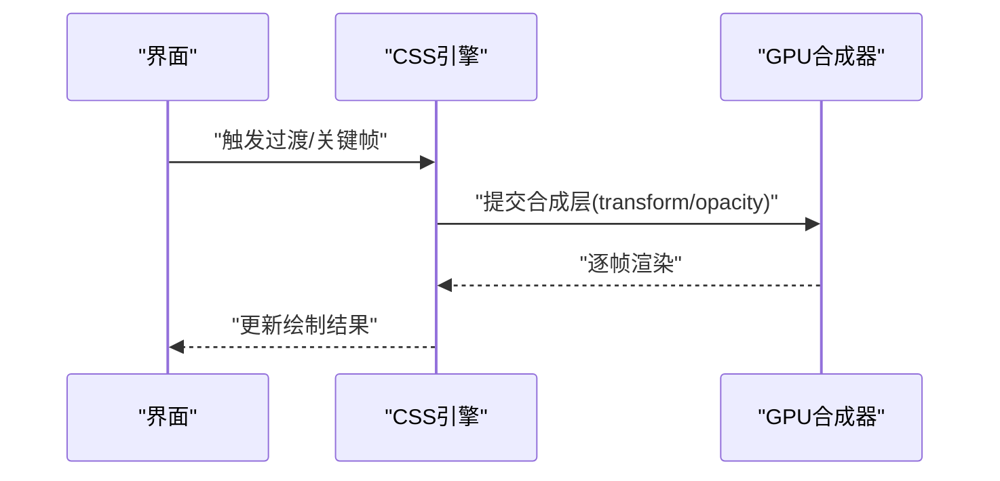
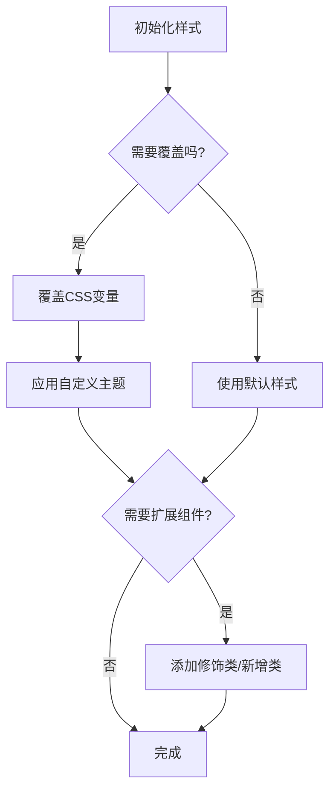
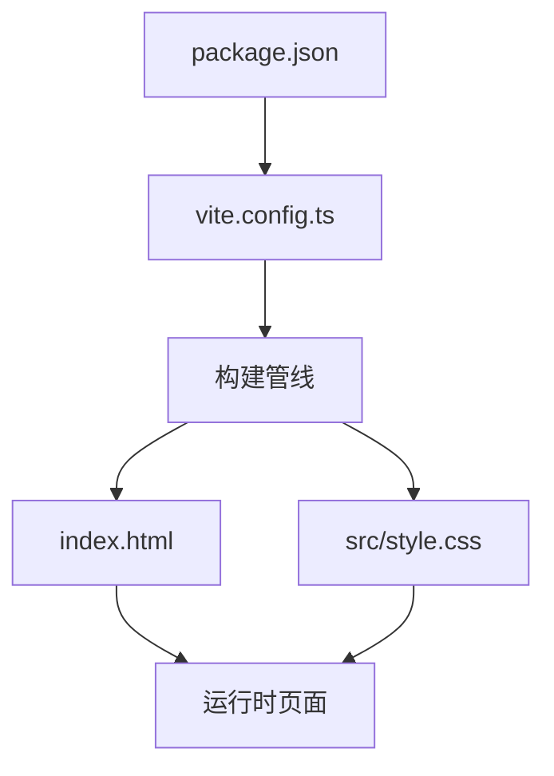

# 样式系统

<cite>
**本文引用的文件**
- [src/style.css](file://src/style.css)
- [index.html](file://index.html)
- [vite.config.ts](file://vite.config.ts)
- [package.json](file://package.json)
</cite>

## 目录
1. [简介](#简介)
2. [项目结构](#项目结构)
3. [核心组件](#核心组件)
4. [架构总览](#架构总览)
5. [详细组件分析](#详细组件分析)
6. [依赖关系分析](#依赖关系分析)
7. [性能考虑](#性能考虑)
8. [故障排查指南](#故障排查指南)
9. [结论](#结论)
10. [附录](#附录)

## 简介
本文件面向本项目的样式系统，聚焦于CSS架构设计、主题与颜色规范、响应式布局策略、动画实现与优化、样式定制方法以及跨浏览器兼容性与最佳实践。目标是帮助开发者快速理解并扩展该桌面应用（基于Tauri + Vite）的前端样式体系，确保在桌面端多窗口、多分辨率场景下保持一致的视觉体验与可维护性。

## 项目结构
本项目采用“单入口HTML + 全局样式”的轻量前端结构：
- index.html 作为页面入口，负责引入构建产物与全局样式。
- src/style.css 为全局样式集中地，承载主题变量、基础重置、通用布局与组件样式。
- vite.config.ts 配置开发/生产构建流程，影响样式资源加载与输出。
- package.json 管理脚本与依赖，间接影响样式构建与工具链。

图表来源
- [index.html:1-200](file://index.html#L1-L200)
- [vite.config.ts:1-200](file://vite.config.ts#L1-L200)
- [src/style.css:1-200](file://src/style.css#L1-L200)

章节来源
- [index.html:1-200](file://index.html#L1-L200)
- [vite.config.ts:1-200](file://vite.config.ts#L1-L200)
- [src/style.css:1-200](file://src/style.css#L1-L200)

## 核心组件
- 全局样式层（src/style.css）
  - 作用：定义CSS自定义属性（变量）、基础重置、排版、间距、颜色语义、通用布局与组件基类。
  - 关键点：通过CSS变量实现主题化；使用语义化命名组织颜色与尺寸；提供响应式断点与容器查询（如适用）。
- 页面入口（index.html）
  - 作用：挂载根节点、引入构建后的样式与脚本。
  - 关键点：确保样式在首屏尽早加载，避免FOUC；按需引入第三方样式。
- 构建配置（vite.config.ts）
  - 作用：配置开发服务器、插件、输出格式等，影响样式资源的打包与注入方式。
  - 关键点：是否启用CSS预处理、压缩、SourceMap等。
- 依赖与脚本（package.json）
  - 作用：声明构建脚本与依赖，间接影响样式处理链。
  - 关键点：确认是否引入CSS相关插件或工具（如PostCSS、Tailwind等）。

章节来源
- [src/style.css:1-200](file://src/style.css#L1-L200)
- [index.html:1-200](file://index.html#L1-L200)
- [vite.config.ts:1-200](file://vite.config.ts#L1-L200)
- [package.json:1-200](file://package.json#L1-L200)

## 架构总览
样式系统遵循“变量驱动 + 语义化命名 + 模块化组织”的原则：
- 变量层：集中定义颜色、字体、字号、行高、圆角、阴影、间距、断点等。
- 基础层：重置默认样式、设置根元素样式、建立排版与网格基础。
- 组件层：以BEM或类似约定组织组件样式，复用变量与基础规则。
- 主题层：通过CSS变量切换明暗主题与品牌色，支持运行时切换。
- 响应式层：基于媒体查询与容器查询实现多分辨率适配。
- 动画层：统一过渡与关键帧动画，结合硬件加速与will-change优化性能。

图表来源
- [src/style.css:1-200](file://src/style.css#L1-L200)

## 详细组件分析

### CSS变量与主题系统
- 变量组织建议
  - 颜色：按语义分组（背景、前景、边框、强调、成功、警告、错误），并提供明暗两套值。
  - 尺寸：字号、行高、间距、圆角、阴影层级，形成设计令牌。
  - 断点：移动端优先，定义最小到最大屏幕宽度阈值。
- 主题切换机制
  - 使用CSS变量在根节点或主题节点上覆盖默认值。
  - 通过数据属性或类名切换主题，配合媒体查询自动匹配系统偏好。
- 颜色规范
  - 使用HSL或LAB色彩空间提升可读性与可组合性。
  - 保证对比度符合无障碍标准（WCAG）。

图表来源
- [src/style.css:1-200](file://src/style.css#L1-L200)

章节来源
- [src/style.css:1-200](file://src/style.css#L1-L200)

### 响应式布局与断点设计
- 移动端优先策略
  - 先编写小屏样式，再逐步增强大屏体验。
  - 使用相对单位（rem、vw/vh）提升可伸缩性。
- 断点设计
  - 基于常见设备宽度与内容密度设定断点，避免过度细分。
  - 结合容器查询实现组件级自适应。
- 栅格与布局
  - 使用Flexbox/Grid构建弹性布局，减少固定宽度依赖。
  - 提供常用布局原语（列、间距、对齐）以便复用。

图表来源
- [src/style.css:1-200](file://src/style.css#L1-L200)

章节来源
- [src/style.css:1-200](file://src/style.css#L1-L200)

### 动画效果与性能优化
- 过渡动画
  - 对transform与opacity使用transition以获得GPU加速。
  - 避免对layout属性（width、height、top/left）进行动画。
- 关键帧动画
  - 使用@keyframes定义复杂动画，合理拆分动画片段。
  - 控制动画时长与缓动函数，避免卡顿。
- 性能优化技巧
  - 合理使用will-change提示浏览器预分配图层。
  - 限制同时运行的动画数量，避免重绘重排风暴。
  - 使用requestAnimationFrame协调JS驱动的动画。

图表来源
- [src/style.css:1-200](file://src/style.css#L1-L200)

章节来源
- [src/style.css:1-200](file://src/style.css#L1-L200)

### 样式定制指南
- 覆盖默认样式
  - 通过提高选择器优先级或使用更具体的类名覆盖。
  - 利用CSS变量在根节点重新赋值，批量替换主题色与尺寸。
- 创建自定义主题
  - 复制默认主题变量块，重命名为新主题前缀。
  - 在根节点添加对应类名或数据属性，切换变量集。
- 扩展组件样式
  - 为组件提供修饰类（如 .btn--primary/.btn--large）。
  - 使用CSS变量控制组件外观，便于主题化与规模化定制。

图表来源
- [src/style.css:1-200](file://src/style.css#L1-L200)

章节来源
- [src/style.css:1-200](file://src/style.css#L1-L200)

### 跨浏览器兼容性与最佳实践
- 兼容性策略
  - 使用现代CSS特性时提供降级方案（如回退到flex布局）。
  - 针对桌面端主流浏览器（Chrome/Firefox/Safari/Edge）测试样式表现。
  - 谨慎使用实验性特性，必要时通过Polyfill或构建工具转换。
- 最佳实践
  - 统一命名约定（BEM或原子化），提升可维护性。
  - 将重复样式提取为变量或混合宏（若使用预处理）。
  - 控制样式文件大小，按需加载与压缩。
  - 使用lint工具检查CSS规范与潜在问题。

章节来源
- [src/style.css:1-200](file://src/style.css#L1-L200)

## 依赖关系分析
样式系统与构建系统的耦合点：
- index.html 引入构建产物，确保样式在正确时机加载。
- vite.config.ts 决定样式如何处理（是否压缩、是否生成SourceMap、是否引入CSS插件）。
- package.json 中的脚本与依赖影响样式构建流程与工具链。

图表来源
- [package.json:1-200](file://package.json#L1-L200)
- [vite.config.ts:1-200](file://vite.config.ts#L1-L200)
- [index.html:1-200](file://index.html#L1-L200)
- [src/style.css:1-200](file://src/style.css#L1-L200)

章节来源
- [package.json:1-200](file://package.json#L1-L200)
- [vite.config.ts:1-200](file://vite.config.ts#L1-L200)
- [index.html:1-200](file://index.html#L1-L200)
- [src/style.css:1-200](file://src/style.css#L1-L200)

## 性能考虑
- 减少重排与重绘
  - 仅对transform与opacity进行动画。
  - 避免在动画中修改布局属性。
- 合理使用缓存
  - 静态资源开启强缓存，动态资源使用协商缓存。
- 控制样式体积
  - 移除未使用的样式，按需加载。
  - 使用构建工具压缩与去重。
- 测量与监控
  - 使用性能面板观察长任务与掉帧。
  - 关注首屏样式加载时间与渲染阻塞。

[本节为通用指导，不直接分析具体文件]

## 故障排查指南
- 主题未生效
  - 检查根节点是否正确设置主题类名或数据属性。
  - 确认CSS变量覆盖顺序与选择器优先级。
- 响应式异常
  - 核对媒体查询断点是否与预期一致。
  - 检查容器尺寸与父级约束是否影响布局。
- 动画卡顿
  - 检查是否触发了不必要的重排。
  - 确认是否使用了GPU加速的属性。
- 构建后样式丢失
  - 检查Vite配置是否正确引入样式。
  - 确认HTML中是否正确引用构建产物。

章节来源
- [src/style.css:1-200](file://src/style.css#L1-L200)
- [index.html:1-200](file://index.html#L1-L200)
- [vite.config.ts:1-200](file://vite.config.ts#L1-L200)

## 结论
本样式系统以CSS变量为核心，结合语义化命名与模块化组织，实现了可维护的主题与响应式能力。通过统一的动画规范与性能优化策略，确保在多分辨率桌面环境下的流畅体验。建议在后续迭代中持续完善设计令牌、扩展组件库，并加强自动化测试与性能监控。

[本节为总结性内容，不直接分析具体文件]

## 附录
- 术语表
  - 设计令牌：用于描述设计决策的可复用变量（颜色、尺寸、间距等）。
  - 容器查询：基于容器尺寸而非视口尺寸的响应式技术。
  - 合成层：浏览器为优化动画而创建的独立渲染层。
- 参考路径
  - 全局样式入口：[src/style.css](file://src/style.css)
  - 页面入口：[index.html](file://index.html)
  - 构建配置：[vite.config.ts](file://vite.config.ts)
  - 依赖与脚本：[package.json](file://package.json)

[本节为补充信息，不直接分析具体文件]