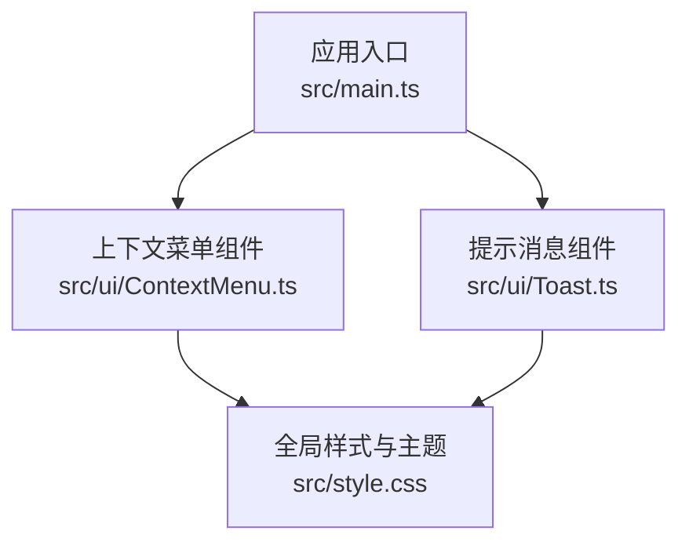
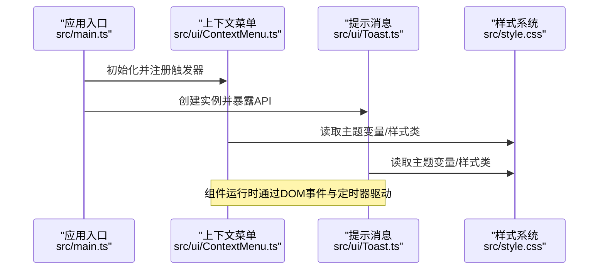
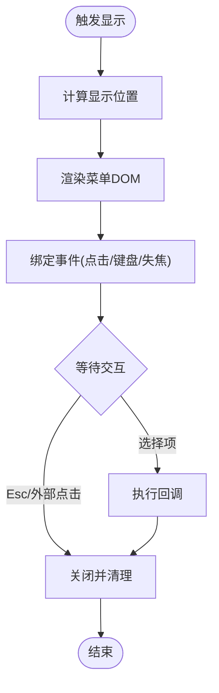
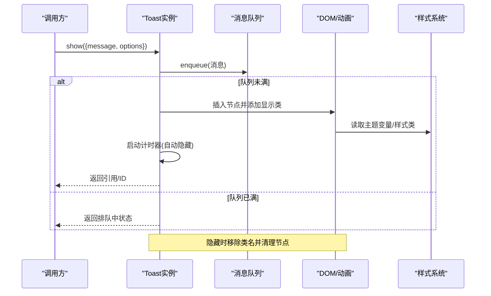
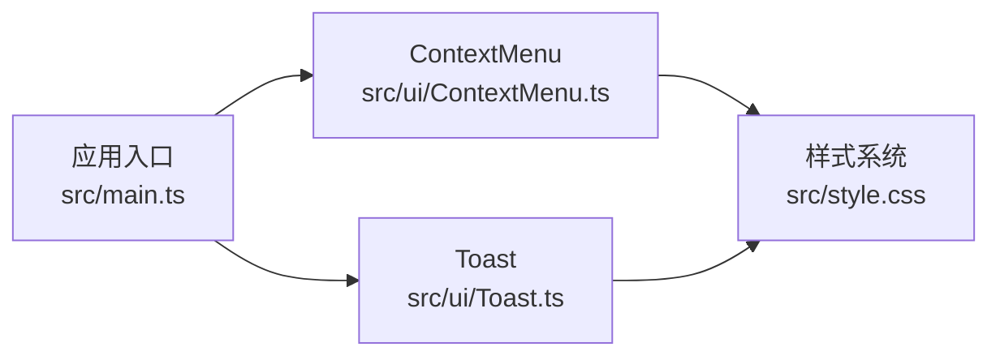

# 用户界面组件

<cite>
**本文引用的文件**
- [ContextMenu.ts](file://src/ui/ContextMenu.ts)
- [Toast.ts](file://src/ui/Toast.ts)
- [style.css](file://src/style.css)
- [main.ts](file://src/main.ts)
</cite>

## 目录
1. [简介](#简介)
2. [项目结构](#项目结构)
3. [核心组件](#核心组件)
4. [架构总览](#架构总览)
5. [详细组件分析](#详细组件分析)
6. [依赖关系分析](#依赖关系分析)
7. [性能考虑](#性能考虑)
8. [故障排查指南](#故障排查指南)
9. [结论](#结论)
10. [附录：使用示例与集成步骤](#附录：使用示例与集成步骤)

## 简介
本文件面向开发者，系统化说明本项目中的两个关键用户界面组件：上下文菜单（ContextMenu）与提示消息（Toast），并阐述其背后的 CSS 架构设计（主题、响应式布局、动画）。文档覆盖组件的职责边界、数据流、交互流程、可定制性、事件处理、样式覆盖方式、无障碍访问支持与跨浏览器兼容性建议，帮助你在应用中快速集成并扩展这些 UI 能力。

## 项目结构
UI 组件位于 src/ui 目录下，样式集中在 src/style.css，应用入口在 src/main.ts。整体组织遵循“功能模块 + 共享样式”的轻量架构，便于独立维护与按需引入。

图表来源
- [main.ts:1-200](file://src/main.ts#L1-L200)
- [ContextMenu.ts:1-200](file://src/ui/ContextMenu.ts#L1-L200)
- [Toast.ts:1-200](file://src/ui/Toast.ts#L1-L200)
- [style.css:1-200](file://src/style.css#L1-L200)

章节来源
- [main.ts:1-200](file://src/main.ts#L1-L200)
- [ContextMenu.ts:1-200](file://src/ui/ContextMenu.ts#L1-L200)
- [Toast.ts:1-200](file://src/ui/Toast.ts#L1-L200)
- [style.css:1-200](file://src/style.css#L1-L200)

## 核心组件
- 上下文菜单（ContextMenu）
  - 职责：在指定触发点显示可操作的菜单项；计算显示位置以避免溢出视口；处理键盘导航与点击选择；管理生命周期（打开/关闭/销毁）。
  - 关键能力：菜单项定义、位置计算、事件绑定、无障碍属性注入、样式覆盖。
- 提示消息（Toast）
  - 职责：以非阻塞方式向用户反馈操作结果或状态；支持消息队列、自动消失、动画效果与自定义样式。
  - 关键能力：队列调度、动画控制、主题适配、可配置时长与样式类名。

章节来源
- [ContextMenu.ts:1-200](file://src/ui/ContextMenu.ts#L1-L200)
- [Toast.ts:1-200](file://src/ui/Toast.ts#L1-L200)

## 架构总览
组件通过应用入口进行初始化与挂载，统一受全局样式驱动。上下文菜单基于 DOM 事件定位与渲染，Toast 基于队列与定时器实现消息流转。两者均提供可配置的选项对象，便于在不同场景下复用。

图表来源
- [main.ts:1-200](file://src/main.ts#L1-L200)
- [ContextMenu.ts:1-200](file://src/ui/ContextMenu.ts#L1-L200)
- [Toast.ts:1-200](file://src/ui/Toast.ts#L1-L200)
- [style.css:1-200](file://src/style.css#L1-L200)

## 详细组件分析

### 上下文菜单（ContextMenu）
- 菜单项定义
  - 通过结构化配置描述菜单项（如标签、动作回调、禁用态、分隔符等），由组件渲染为可交互列表。
- 位置计算
  - 根据触发点坐标与菜单尺寸，结合视口边界，动态计算最终显示位置，确保不溢出屏幕。
- 用户交互处理
  - 支持鼠标点击、键盘方向键导航、回车确认、Esc 关闭；聚焦管理与焦点恢复；点击外部区域关闭。
- 生命周期
  - 打开时注入 DOM 节点与事件监听；关闭时清理监听与临时节点，避免内存泄漏。
- 无障碍访问
  - 设置 role、aria-* 属性，确保屏幕阅读器正确播报；支持 Tab 顺序与键盘可达性。
- 样式覆盖
  - 通过 CSS 变量与约定类名，允许上层覆盖颜色、圆角、阴影、字体等视觉表现。

图表来源
- [ContextMenu.ts:1-200](file://src/ui/ContextMenu.ts#L1-L200)

章节来源
- [ContextMenu.ts:1-200](file://src/ui/ContextMenu.ts#L1-L200)

### 提示消息（Toast）
- 消息队列
  - 内部维护一个先进先出的队列，按序展示多条消息；支持限制同时显示数量与最大排队数。
- 动画效果
  - 进入/离开动画通过 CSS 过渡或关键帧实现；组件负责添加/移除对应类名以驱动动画。
- 自定义样式
  - 支持传入自定义类名或主题标识，结合 CSS 变量实现多主题切换与差异化外观。
- 可配置项
  - 持续时间、位置、是否可关闭、是否自动隐藏、样式类名、回调钩子等。
- 事件与生命周期
  - 显示前/后、隐藏前/后、点击关闭等事件；定时器到期自动隐藏；容器内消息滚动与对齐。

图表来源
- [Toast.ts:1-200](file://src/ui/Toast.ts#L1-L200)
- [style.css:1-200](file://src/style.css#L1-L200)

章节来源
- [Toast.ts:1-200](file://src/ui/Toast.ts#L1-L200)
- [style.css:1-200](file://src/style.css#L1-L200)

### CSS 架构设计（主题、响应式、动画）
- 主题系统
  - 通过 CSS 变量集中管理颜色、间距、圆角、阴影等，组件在运行时读取变量以实现主题切换。
- 响应式布局
  - 使用相对单位与媒体查询适配不同屏幕尺寸；菜单与 Toast 的位置与尺寸随视口变化自适应。
- 动画效果
  - 利用 CSS transition 与 @keyframes 实现平滑过渡；组件通过切换类名触发动画，保证性能与可维护性。

章节来源
- [style.css:1-200](file://src/style.css#L1-L200)

## 依赖关系分析
- 组件与样式
  - ContextMenu 与 Toast 均依赖 style.css 提供的主题变量与样式类，形成松耦合的样式契约。
- 组件与应用
  - main.ts 负责初始化组件实例并暴露 API，组件之间无强依赖，便于单独测试与替换。
- 外部依赖
  - 仅依赖原生 DOM API 与 CSS 能力，无第三方 UI 库依赖，降低运行时代价。

图表来源
- [main.ts:1-200](file://src/main.ts#L1-L200)
- [ContextMenu.ts:1-200](file://src/ui/ContextMenu.ts#L1-L200)
- [Toast.ts:1-200](file://src/ui/Toast.ts#L1-L200)
- [style.css:1-200](file://src/style.css#L1-L200)

章节来源
- [main.ts:1-200](file://src/main.ts#L1-L200)
- [ContextMenu.ts:1-200](file://src/ui/ContextMenu.ts#L1-L200)
- [Toast.ts:1-200](file://src/ui/Toast.ts#L1-L200)
- [style.css:1-200](file://src/style.css#L1-L200)

## 性能考虑
- 最小化重排重绘
  - 批量更新 DOM、使用 transform/opacity 做动画以减少布局抖动。
- 事件优化
  - 合理的事件委托与去抖/节流策略，避免频繁计算与渲染。
- 内存管理
  - 组件销毁时及时移除事件监听与定时器，防止内存泄漏。
- 样式性能
  - 优先使用 CSS 变量与类名切换，减少 JS 直接操作样式。

[本节为通用指导，无需具体文件来源]

## 故障排查指南
- 菜单不显示或位置异常
  - 检查触发点坐标与视口边界计算逻辑；确认菜单容器未被父级 overflow 裁剪。
- Toast 不消失或堆积
  - 核对定时器是否正确清除；检查队列上限与同时显示数量配置；确认动画类名未冲突。
- 主题不生效
  - 确认 CSS 变量已正确注入到根节点；检查样式加载顺序与优先级。
- 键盘不可达
  - 验证 focusable 元素与 tabindex 设置；确保 Esc/Enter/方向键事件绑定正确。

章节来源
- [ContextMenu.ts:1-200](file://src/ui/ContextMenu.ts#L1-L200)
- [Toast.ts:1-200](file://src/ui/Toast.ts#L1-L200)
- [style.css:1-200](file://src/style.css#L1-L200)

## 结论
ContextMenu 与 Toast 提供了常用且易用的 UI 能力，配合统一的 CSS 主题与动画体系，能够在多种场景下保持一致的用户体验。通过合理的配置与样式覆盖，既能满足默认行为，也能灵活适配品牌与业务需求。建议在项目中统一通过入口文件初始化与暴露 API，保持组件使用的规范性与可维护性。

[本节为总结性内容，无需具体文件来源]

## 附录：使用示例与集成步骤
- 集成步骤
  - 在应用入口初始化 ContextMenu 与 Toast，并暴露必要方法供业务模块调用。
  - 将样式文件引入构建流程，确保主题变量与动画类可用。
- 上下文菜单示例
  - 在目标元素上注册右键或点击事件，调用菜单显示方法并传入菜单项配置。
  - 在回调中执行业务逻辑，并在完成后关闭菜单。
- Toast 示例
  - 在操作成功/失败时调用提示方法，传入消息内容与可选配置（时长、样式类等）。
  - 如需多消息并发，注意队列上限与同时显示数量的配置。
- 可定制性与样式覆盖
  - 通过 CSS 变量覆盖主题色、字号、圆角等；通过自定义类名覆盖特定组件外观。
- 事件处理
  - 为菜单项绑定点击/键盘事件；为 Toast 绑定关闭/超时事件，以便记录日志或联动其他逻辑。
- 无障碍访问
  - 为菜单项与可操作元素设置合适的 aria-* 属性；确保键盘可达与屏幕阅读器可读。
- 跨浏览器兼容
  - 使用主流浏览器支持的 CSS 特性；必要时对旧版浏览器提供降级方案（如禁用复杂动画）。

章节来源
- [main.ts:1-200](file://src/main.ts#L1-L200)
- [ContextMenu.ts:1-200](file://src/ui/ContextMenu.ts#L1-L200)
- [Toast.ts:1-200](file://src/ui/Toast.ts#L1-L200)
- [style.css:1-200](file://src/style.css#L1-L200)