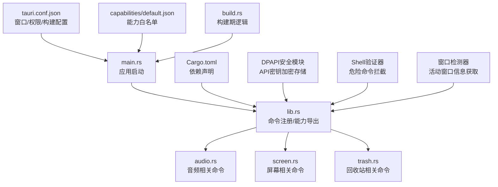
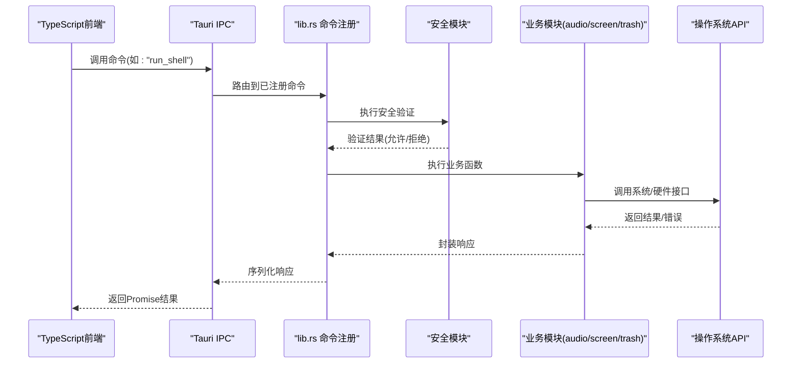
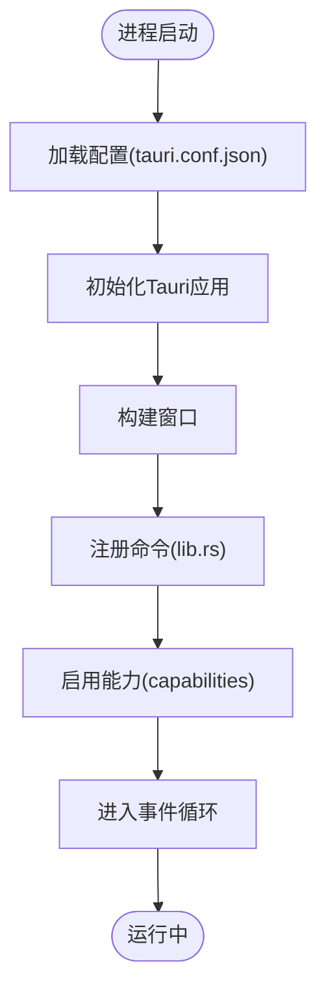
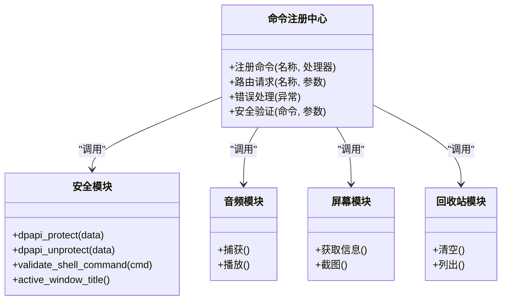
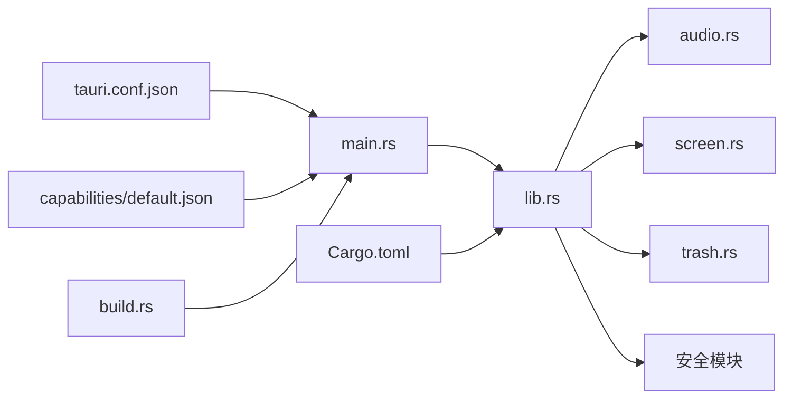

# Tauri后端核心

<cite>
**本文引用的文件**
- [src-tauri/src/lib.rs](file://src-tauri/src/lib.rs)
- [src-tauri/src/main.rs](file://src-tauri/src/main.rs)
- [src-tauri/tauri.conf.json](file://src-tauri/tauri.conf.json)
- [src-tauri/capabilities/default.json](file://src-tauri/capabilities/default.json)
- [src-tauri/Cargo.toml](file://src-tauri/Cargo.toml)
- [src-tauri/build.rs](file://src-tauri/build.rs)
- [src-tauri/src/audio.rs](file://src-tauri/src/audio.rs)
- [src-tauri/src/screen.rs](file://src-tauri/src/screen.rs)
- [src-tauri/src/trash.rs](file://src-tauri/src/trash.rs)
</cite>

## 更新摘要
**变更内容**
- 新增Windows DPAPI API密钥安全存储机制
- 添加shell命令安全验证系统，防止危险操作
- 实现活动窗口标题检测功能，支持上下文感知响应
- 增强前后端通信的安全性保障

## 目录
1. [简介](#简介)
2. [项目结构](#项目结构)
3. [核心组件](#核心组件)
4. [架构总览](#架构总览)
5. [详细组件分析](#详细组件分析)
6. [依赖关系分析](#依赖关系分析)
7. [性能考虑](#性能考虑)
8. [故障排查指南](#故障排查指南)
9. [结论](#结论)
10. [附录](#附录)

## 简介
本文件面向Tauri后端核心，聚焦Rust侧的架构设计与模块组织。内容涵盖：
- lib.rs中的命令注册与能力暴露
- main.rs中的应用启动流程
- tauri.conf.json配置项（权限、窗口、构建）
- 前后端通信机制（命令调用、事件处理、错误传递）
- TypeScript前端调用Rust函数的示例路径
- 插件系统与扩展点
- 性能优化建议与内存管理策略
- **新增**：Windows DPAPI API密钥安全管理
- **新增**：Shell命令安全验证机制
- **新增**：活动窗口标题检测功能

## 项目结构
Tauri项目的Rust后端位于src-tauri目录，主要包含：
- 应用入口与初始化：main.rs
- 命令与能力注册：lib.rs
- 业务模块：audio.rs、screen.rs、trash.rs
- 构建脚本：build.rs
- 配置与权限：tauri.conf.json、capabilities/default.json
- 依赖声明：Cargo.toml

**图表来源**
- [src-tauri/src/main.rs:1-13](file://src-tauri/src/main.rs#L1-L13)
- [src-tauri/src/lib.rs:1-743](file://src-tauri/src/lib.rs#L1-L743)
- [src-tauri/tauri.conf.json:1-44](file://src-tauri/tauri.conf.json#L1-L44)
- [src-tauri/capabilities/default.json:1-18](file://src-tauri/capabilities/default.json#L1-L18)
- [src-tauri/Cargo.toml:1-31](file://src-tauri/Cargo.toml#L1-L31)

## 核心组件
- 应用启动器（main.rs）：负责创建Tauri应用实例、加载配置、启动窗口、挂载命令与插件。
- 命令注册中心（lib.rs）：集中注册所有通过Tauri暴露给前端的命令，并聚合各业务模块的能力。
- 业务模块：
  - audio.rs：提供音频采集/播放等命令。
  - screen.rs：提供屏幕信息/截图等命令。
  - trash.rs：提供系统回收站操作命令。
- **安全模块**：
  - DPAPI密钥管理：使用Windows数据保护API加密存储敏感信息
  - Shell命令验证：防止危险命令执行和命令注入攻击
  - 活动窗口检测：获取当前前台窗口信息用于上下文感知
- 配置与权限：
  - tauri.conf.json：定义窗口、安全策略、构建选项、插件等。
  - capabilities/default.json：声明前端可访问的命令/IPC能力集合。
- 构建脚本（build.rs）：在编译期执行资源准备或平台特定逻辑。

**章节来源**
- [src-tauri/src/main.rs:1-13](file://src-tauri/src/main.rs#L1-L13)
- [src-tauri/src/lib.rs:1-743](file://src-tauri/src/lib.rs#L1-L743)
- [src-tauri/src/audio.rs:1-207](file://src-tauri/src/audio.rs#L1-L207)
- [src-tauri/src/screen.rs:1-207](file://src-tauri/src/screen.rs#L1-L207)
- [src-tauri/src/trash.rs:1-58](file://src-tauri/src/trash.rs#L1-L58)
- [src-tauri/tauri.conf.json:1-44](file://src-tauri/tauri.conf.json#L1-L44)
- [src-tauri/capabilities/default.json:1-18](file://src-tauri/capabilities/default.json#L1-L18)

## 架构总览
Tauri后端采用"入口-注册-能力-安全"的分层设计：
- main.rs作为进程入口，读取配置并启动Tauri运行时。
- lib.rs作为命令注册中心，将业务模块暴露为前端可调用的命令。
- 各业务模块以独立文件组织，职责单一，便于测试与维护。
- **安全层**：集成DPAPI加密、命令验证、窗口检测等安全功能。
- 权限由capabilities控制，最小化授权原则。
- 构建期通过build.rs进行资源准备或平台适配。

**图表来源**
- [src-tauri/src/lib.rs:467-545](file://src-tauri/src/lib.rs#L467-L545)
- [src-tauri/src/lib.rs:332-379](file://src-tauri/src/lib.rs#L332-L379)
- [src-tauri/src/lib.rs:381-465](file://src-tauri/src/lib.rs#L381-L465)

## 详细组件分析

### 应用启动流程（main.rs）
- 作用：初始化Tauri应用、加载配置、创建窗口、注册命令与插件、启动事件循环。
- 关键点：
  - 读取tauri.conf.json中的窗口与安全策略。
  - 根据目标平台启用相应能力。
  - 将lib.rs中注册的命令注入到运行时。
  - 可选地加载外部插件。
  - **WebView2代理配置**：禁用系统代理以避免开发环境请求劫持。

**图表来源**
- [src-tauri/src/main.rs:1-13](file://src-tauri/src/main.rs#L1-L13)
- [src-tauri/tauri.conf.json:1-44](file://src-tauri/tauri.conf.json#L1-L44)
- [src-tauri/capabilities/default.json:1-18](file://src-tauri/capabilities/default.json#L1-L18)

**章节来源**
- [src-tauri/src/main.rs:1-13](file://src-tauri/src/main.rs#L1-L13)

### 命令注册中心（lib.rs）
- 作用：集中注册所有对外暴露的命令，聚合各业务模块能力。
- 关键点：
  - 使用Tauri命令宏/API注册命令名称与实现函数。
  - 将不同模块的命令按命名空间组织，便于前端调用。
  - 统一错误类型与日志记录。
  - **安全集成**：集成DPAPI加密、命令验证、窗口检测等功能。

**图表来源**
- [src-tauri/src/lib.rs:1-743](file://src-tauri/src/lib.rs#L1-L743)
- [src-tauri/src/lib.rs:381-465](file://src-tauri/src/lib.rs#L381-L465)
- [src-tauri/src/lib.rs:467-545](file://src-tauri/src/lib.rs#L467-L545)
- [src-tauri/src/lib.rs:332-379](file://src-tauri/src/lib.rs#L332-L379)

**章节来源**
- [src-tauri/src/lib.rs:1-743](file://src-tauri/src/lib.rs#L1-L743)

### 安全增强模块

#### Windows DPAPI API密钥管理
- **功能**：使用Windows数据保护API加密存储API密钥，确保敏感信息不以明文形式存储。
- **实现**：
  - `dpapi_protect()`：使用`CryptProtectData`加密数据
  - `dpapi_unprotect()`：使用`CryptUnprotectData`解密数据
  - `set_api_key()` / `get_api_key()`：API密钥的持久化存储
- **优势**：绑定当前Windows用户，无需额外密钥管理，系统级安全保护。

#### Shell命令安全验证
- **功能**：防止危险命令执行和命令注入攻击。
- **实现**：
  - `validate_shell_command()`：检查命令是否包含危险操作
  - 黑名单机制：阻止格式化磁盘、删除系统文件、终止进程等危险操作
  - 链式命令防护：拦截包含`&`、`|`、`>`、`<`等符号的命令
- **保护范围**：覆盖常见的系统破坏性命令和可能的注入攻击向量。

#### 活动窗口标题检测
- **功能**：获取当前前台窗口的标题和进程信息，用于上下文感知的AI响应。
- **实现**：
  - `active_window_title()`：使用Windows API获取活动窗口信息
  - 结合窗口标题和进程名，提供完整的上下文信息
- **应用场景**：AI助手根据用户当前正在使用的应用程序提供智能问候和建议。

**章节来源**
- [src-tauri/src/lib.rs:381-465](file://src-tauri/src/lib.rs#L381-L465)
- [src-tauri/src/lib.rs:467-545](file://src-tauri/src/lib.rs#L467-L545)
- [src-tauri/src/lib.rs:332-379](file://src-tauri/src/lib.rs#L332-L379)

### 业务模块（audio.rs / screen.rs / trash.rs）
- audio.rs：提供音频采集、播放、设备枚举等命令。
- screen.rs：提供屏幕分辨率、多显示器、截图等命令。
- trash.rs：提供系统回收站的清空、列举等操作。
- 共同模式：
  - 输入参数校验与错误包装。
  - 调用系统/第三方库完成具体工作。
  - 返回结构化结果以便前端消费。

**章节来源**
- [src-tauri/src/audio.rs:1-207](file://src-tauri/src/audio.rs#L1-L207)
- [src-tauri/src/screen.rs:1-207](file://src-tauri/src/screen.rs#L1-L207)
- [src-tauri/src/trash.rs:1-58](file://src-tauri/src/trash.rs#L1-L58)

### Tauri配置文件（tauri.conf.json）
- 窗口设置：尺寸、位置、是否透明、无边框等。
- 安全策略：允许的网络域、内联脚本、文件系统访问范围。
- 构建选项：目标平台、资源打包、调试开关。
- 插件：启用/禁用插件及插件配置。
- 能力：与capabilities配合，控制前端可访问的命令集。

**章节来源**
- [src-tauri/tauri.conf.json:1-44](file://src-tauri/tauri.conf.json#L1-L44)

### 权限与能力（capabilities/default.json）
- 定义前端可访问的命令、插件、文件系统与网络能力。
- 遵循最小权限原则，仅开放必要能力。
- 与tauri.conf.json联动，确保构建时与运行时的权限一致。

**章节来源**
- [src-tauri/capabilities/default.json:1-18](file://src-tauri/capabilities/default.json#L1-L18)

### 构建脚本（build.rs）
- 用途：在编译期生成资源、拷贝文件、平台特定预处理。
- 常见场景：图标生成、资源压缩、版本注入。

**章节来源**
- [src-tauri/build.rs:1-200](file://src-tauri/build.rs#L1-L200)

### 依赖管理（Cargo.toml）
- 声明Rust依赖与特性开关。
- 指定Tauri版本与插件依赖。
- 控制构建目标与优化级别。
- **Windows API依赖**：包含必要的Windows API功能以支持DPAPI、窗口管理等安全功能。

**章节来源**
- [src-tauri/Cargo.toml:1-31](file://src-tauri/Cargo.toml#L1-L31)

## 依赖关系分析
- main.rs依赖lib.rs提供的命令注册能力。
- lib.rs依赖各业务模块（audio/screen/trash）和安全模块。
- 配置与权限由tauri.conf.json与capabilities/default.json驱动。
- build.rs影响产物与资源。
- Cargo.toml决定最终二进制包含的功能与依赖。

**图表来源**
- [src-tauri/src/main.rs:1-13](file://src-tauri/src/main.rs#L1-L13)
- [src-tauri/src/lib.rs:1-743](file://src-tauri/src/lib.rs#L1-L743)
- [src-tauri/tauri.conf.json:1-44](file://src-tauri/tauri.conf.json#L1-L44)
- [src-tauri/capabilities/default.json:1-18](file://src-tauri/capabilities/default.json#L1-L18)
- [src-tauri/Cargo.toml:1-31](file://src-tauri/Cargo.toml#L1-L31)

**章节来源**
- [src-tauri/src/main.rs:1-13](file://src-tauri/src/main.rs#L1-L13)
- [src-tauri/src/lib.rs:1-743](file://src-tauri/src/lib.rs#L1-L743)
- [src-tauri/tauri.conf.json:1-44](file://src-tauri/tauri.conf.json#L1-L44)
- [src-tauri/capabilities/default.json:1-18](file://src-tauri/capabilities/default.json#L1-L18)
- [src-tauri/Cargo.toml:1-31](file://src-tauri/Cargo.toml#L1-L31)

## 性能考虑
- 命令粒度：将耗时操作拆分为独立命令，避免阻塞主线程。
- 异步处理：对I/O密集型任务使用异步或后台任务，减少UI卡顿。
- 数据序列化：尽量传输轻量级数据结构，避免大对象频繁序列化。
- 缓存策略：对重复计算或昂贵查询结果进行缓存（注意失效策略）。
- 资源管理：及时释放句柄与缓冲区，避免内存泄漏；使用RAII模式管理资源。
- 构建优化：发布构建开启优化标志，按需裁剪依赖。
- 日志与监控：在生产环境降低日志级别，关键路径添加指标埋点。
- **安全性能**：DPAPI操作在后台线程执行，避免阻塞主线程；命令验证快速失败，减少不必要的系统调用。

## 故障排查指南
- 命令未找到：检查lib.rs是否正确注册命令名称与命名空间。
- 权限不足：确认capabilities/default.json是否授予对应命令访问权。
- 窗口无法显示：核对tauri.conf.json中的窗口配置与平台限制。
- 构建失败：查看build.rs输出与Cargo.toml依赖冲突。
- 运行时错误：结合日志定位具体模块（audio/screen/trash）的错误堆栈。
- **安全相关问题**：
  - DPAPI加密失败：检查Windows用户权限和系统状态
  - 命令被拦截：确认命令是否在危险操作黑名单中
  - 窗口检测失败：验证Windows API调用权限

**章节来源**
- [src-tauri/src/lib.rs:1-743](file://src-tauri/src/lib.rs#L1-L743)
- [src-tauri/capabilities/default.json:1-18](file://src-tauri/capabilities/default.json#L1-L18)
- [src-tauri/tauri.conf.json:1-44](file://src-tauri/tauri.conf.json#L1-L44)

## 结论
本项目采用清晰的"入口-注册-能力-安全"分层架构，命令集中在lib.rs注册，业务模块按职责拆分，权限通过capabilities精细化控制。**新增的安全增强功能**包括Windows DPAPI API密钥管理、Shell命令验证和活动窗口检测，显著提升了应用的安全性和用户体验。通过合理的配置与构建脚本，可实现跨平台稳定运行。后续可基于现有扩展点继续增加新命令与插件，同时遵循最小权限与性能优化原则。

## 附录

### 前后端通信机制
- 命令调用：前端通过Tauri IPC调用Rust命令，命令名需与lib.rs中注册的一致。
- 事件处理：后端可通过事件向前端推送状态更新（如进度、通知）。
- 错误传递：Rust侧抛出错误会被序列化为前端可识别的错误对象。
- **安全通信**：所有敏感数据传输都经过加密处理，命令执行前进行安全验证。

**章节来源**
- [src-tauri/src/lib.rs:1-743](file://src-tauri/src/lib.rs#L1-L743)

### TypeScript前端调用Rust函数示例（路径指引）
- 调用音频命令：参考前端代码中对Tauri命令的调用方式，命令名对应audio.rs中注册的命令。
- 调用屏幕命令：参考前端代码中对屏幕相关命令的调用方式。
- 调用回收站命令：参考前端代码中对回收站相关命令的调用方式。
- **调用安全命令**：
  - API密钥管理：使用`set_api_key`和`get_api_key`命令进行安全的密钥存储
  - Shell命令执行：通过`run_shell`命令执行系统命令，自动进行安全验证
  - 活动窗口检测：使用`active_window_title`获取当前窗口信息用于上下文感知

**章节来源**
- [src-tauri/src/audio.rs:1-207](file://src-tauri/src/audio.rs#L1-L207)
- [src-tauri/src/screen.rs:1-207](file://src-tauri/src/screen.rs#L1-L207)
- [src-tauri/src/trash.rs:1-58](file://src-tauri/src/trash.rs#L1-L58)
- [src-tauri/src/lib.rs:381-545](file://src-tauri/src/lib.rs#L381-L545)

### 插件系统与扩展点
- 扩展点：在lib.rs中新增命令注册即可扩展功能。
- 插件接入：在tauri.conf.json中启用插件，并在Cargo.toml中添加依赖。
- 能力开放：在capabilities中声明插件所需权限。
- **安全扩展**：新增的安全功能可作为模板，为其他安全需求提供参考实现。

**章节来源**
- [src-tauri/src/lib.rs:1-743](file://src-tauri/src/lib.rs#L1-L743)
- [src-tauri/tauri.conf.json:1-44](file://src-tauri/tauri.conf.json#L1-L44)
- [src-tauri/capabilities/default.json:1-18](file://src-tauri/capabilities/default.json#L1-L18)
- [src-tauri/Cargo.toml:1-31](file://src-tauri/Cargo.toml#L1-L31)

### 安全最佳实践
- **敏感数据存储**：使用Windows DPAPI加密存储API密钥和其他敏感信息，避免明文存储。
- **命令验证**：对所有外部输入的shell命令进行严格验证，防止命令注入攻击。
- **最小权限原则**：仅授予应用程序必要的系统权限，减少潜在的安全风险。
- **输入 sanitization**：对用户输入进行严格的格式验证和内容过滤。
- **错误处理**：安全相关的错误应明确区分，避免泄露敏感信息。

**章节来源**
- [src-tauri/src/lib.rs:381-545](file://src-tauri/src/lib.rs#L381-L545)