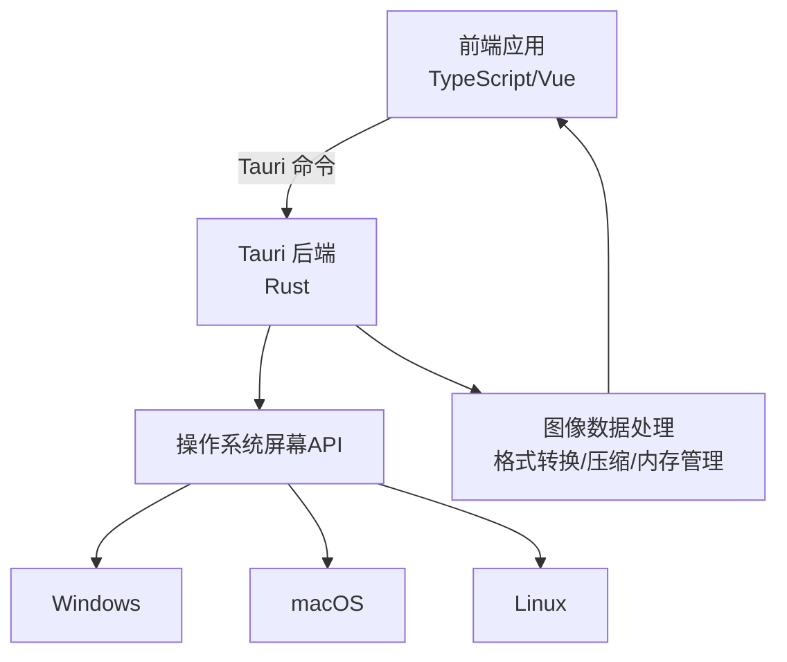
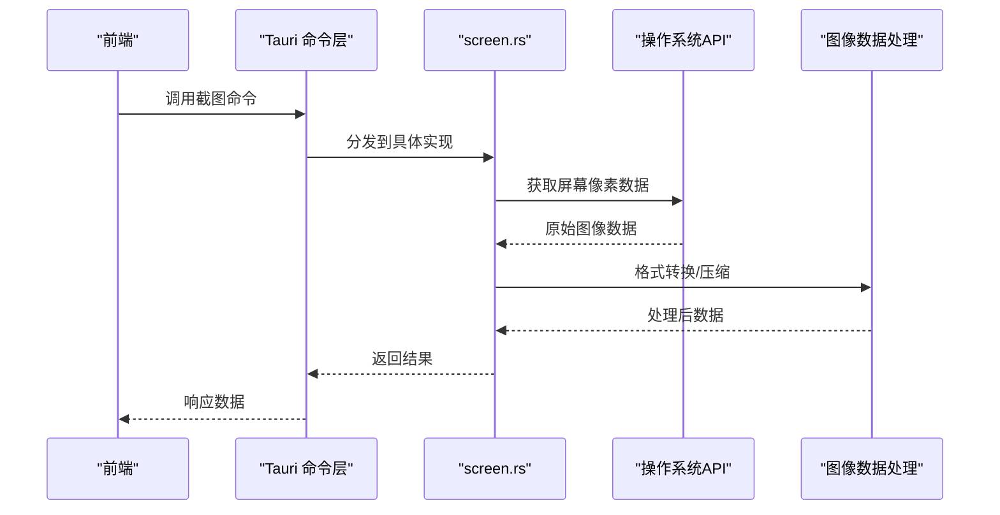
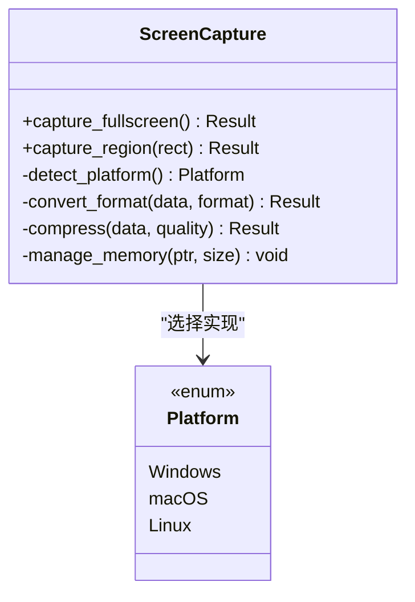
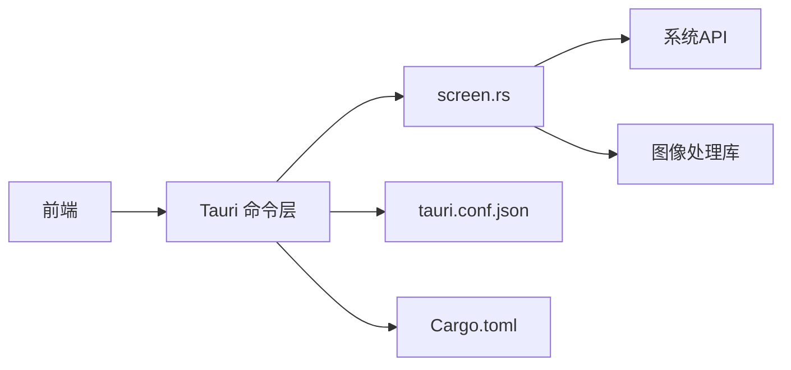
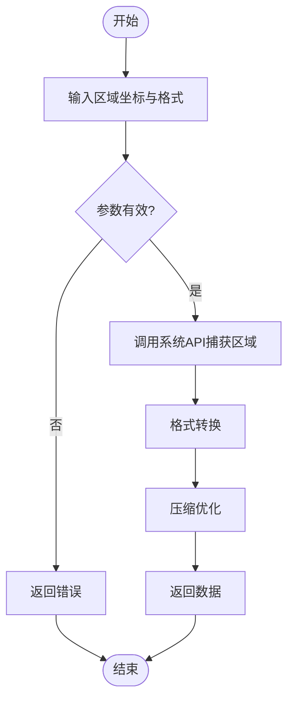

# 屏幕捕获功能

<cite>
**本文引用的文件**
- [src-tauri/src/screen.rs](file://src-tauri/src/screen.rs)
- [src-tauri/Cargo.toml](file://src-tauri/Cargo.toml)
- [src-tauri/tauri.conf.json](file://src-tauri/tauri.conf.json)
- [src-tauri/src/lib.rs](file://src-tauri/src/lib.rs)
- [src-tauri/src/main.rs](file://src-tauri/src/main.rs)
</cite>

## 目录
1. [简介](#简介)
2. [项目结构](#项目结构)
3. [核心组件](#核心组件)
4. [架构总览](#架构总览)
5. [详细组件分析](#详细组件分析)
6. [依赖关系分析](#依赖关系分析)
7. [性能考虑](#性能考虑)
8. [故障排查指南](#故障排查指南)
9. [结论](#结论)
10. [附录](#附录)

## 简介
本章节概述屏幕捕获功能的整体目标与能力边界。该功能基于 Tauri 后端（Rust）实现，负责在不同操作系统上获取屏幕图像数据，并进行格式转换、压缩优化与内存管理；前端通过 Tauri 命令调用后端能力，完成截图、区域选择与图像处理流程。文档重点说明：
- 屏幕截图捕获与区域选择的实现思路
- 不同操作系统（Windows、macOS、Linux）的 API 差异处理
- 图像数据处理流程（格式转换、压缩、内存管理）
- 性能优化策略（异步处理、缓存机制）
- 错误处理与异常恢复方案
- 具体 API 调用示例（以路径引用代替代码片段）

## 项目结构
本项目采用前后端分离架构：
- 前端：TypeScript/Vue 应用，通过 Tauri 暴露的命令调用 Rust 后端能力
- 后端：Tauri + Rust，封装跨平台屏幕捕获逻辑，提供统一接口给前端

图表来源
- [src-tauri/src/screen.rs](file://src-tauri/src/screen.rs)
- [src-tauri/tauri.conf.json](file://src-tauri/tauri.conf.json)

章节来源
- [src-tauri/tauri.conf.json](file://src-tauri/tauri.conf.json)
- [src-tauri/src/lib.rs](file://src-tauri/src/lib.rs)
- [src-tauri/src/main.rs](file://src-tauri/src/main.rs)

## 核心组件
- 屏幕捕获模块（screen.rs）：封装跨平台屏幕截图与区域选择逻辑，统一对外暴露命令接口
- Tauri 命令层（lib.rs/main.rs）：注册并转发前端请求到 screen.rs 的具体实现
- 配置与权限（tauri.conf.json）：声明桌面能力与所需权限，确保可访问屏幕资源
- 构建与依赖（Cargo.toml）：引入必要的系统库或第三方 crate，支持多平台编译

章节来源
- [src-tauri/src/screen.rs](file://src-tauri/src/screen.rs)
- [src-tauri/src/lib.rs](file://src-tauri/src/lib.rs)
- [src-tauri/src/main.rs](file://src-tauri/src/main.rs)
- [src-tauri/tauri.conf.json](file://src-tauri/tauri.conf.json)
- [src-tauri/Cargo.toml](file://src-tauri/Cargo.toml)

## 架构总览
屏幕捕获的整体流程如下：
- 前端发起“全屏截图”或“区域截图”请求
- Tauri 命令路由至 screen.rs 对应函数
- screen.rs 根据运行平台调用相应系统 API 获取原始像素数据
- 进行图像格式转换与压缩优化，返回二进制数据或 Base64 字符串
- 前端接收数据并渲染或进一步处理

图表来源
- [src-tauri/src/screen.rs](file://src-tauri/src/screen.rs)
- [src-tauri/src/lib.rs](file://src-tauri/src/lib.rs)
- [src-tauri/src/main.rs](file://src-tauri/src/main.rs)

## 详细组件分析

### 屏幕捕获模块（screen.rs）
- 职责
  - 提供统一的屏幕截图与区域选择接口
  - 屏蔽 Windows、macOS、Linux 的 API 差异
  - 对原始像素数据进行格式转换与压缩优化
  - 管理内存分配与释放，避免泄漏
- 关键流程
  - 检测当前操作系统，选择对应实现
  - 调用系统 API 获取屏幕或指定区域的像素数据
  - 将像素数据转换为通用图像格式（如 PNG/JPEG），并按需压缩
  - 返回二进制或 Base64 数据供前端使用
- 错误处理
  - 捕获系统 API 调用失败（权限不足、无显示器、分辨率异常等）
  - 返回结构化错误信息，便于前端提示与重试
- 性能优化
  - 使用零拷贝或最小化拷贝策略减少内存占用
  - 按需压缩与分块传输，降低网络与 UI 线程压力
  - 可选缓存最近一次截图，提升重复操作效率

章节来源
- [src-tauri/src/screen.rs](file://src-tauri/src/screen.rs)

#### 类图（概念映射）

图表来源
- [src-tauri/src/screen.rs](file://src-tauri/src/screen.rs)

### Tauri 命令层（lib.rs / main.rs）
- 职责
  - 注册前端可用的命令（如 capture_fullscreen、capture_region）
  - 解析前端参数，校验合法性
  - 调用 screen.rs 的具体实现并返回结果
- 关键点
  - 参数校验与类型转换
  - 错误传播与统一包装
  - 与前端约定数据结构（如图片尺寸、格式、编码方式）

章节来源
- [src-tauri/src/lib.rs](file://src-tauri/src/lib.rs)
- [src-tauri/src/main.rs](file://src-tauri/src/main.rs)

### 配置与权限（tauri.conf.json）
- 声明桌面能力（如允许访问屏幕）
- 设置安全策略与白名单
- 定义命令与插件配置

章节来源
- [src-tauri/tauri.conf.json](file://src-tauri/tauri.conf.json)

### 构建与依赖（Cargo.toml）
- 引入必要的系统库或第三方 crate（例如用于屏幕捕获与图像处理的库）
- 配置多平台编译选项与特性开关
- 管理版本兼容性与依赖更新

章节来源
- [src-tauri/Cargo.toml](file://src-tauri/Cargo.toml)

## 依赖关系分析
- 前端依赖 Tauri 命令层提供的 API
- Tauri 命令层依赖 screen.rs 的屏幕捕获实现
- screen.rs 依赖操作系统 API 与图像处理库
- 构建阶段依赖 Cargo.toml 中声明的 crate 与平台特性

图表来源
- [src-tauri/src/screen.rs](file://src-tauri/src/screen.rs)
- [src-tauri/src/lib.rs](file://src-tauri/src/lib.rs)
- [src-tauri/src/main.rs](file://src-tauri/src/main.rs)
- [src-tauri/tauri.conf.json](file://src-tauri/tauri.conf.json)
- [src-tauri/Cargo.toml](file://src-tauri/Cargo.toml)

章节来源
- [src-tauri/src/screen.rs](file://src-tauri/src/screen.rs)
- [src-tauri/src/lib.rs](file://src-tauri/src/lib.rs)
- [src-tauri/src/main.rs](file://src-tauri/src/main.rs)
- [src-tauri/tauri.conf.json](file://src-tauri/tauri.conf.json)
- [src-tauri/Cargo.toml](file://src-tauri/Cargo.toml)

## 性能考虑
- 异步处理
  - 将屏幕捕获与图像处理放入后台任务，避免阻塞 UI 线程
  - 使用流式或分块传输大图像数据，降低峰值内存占用
- 缓存机制
  - 缓存最近一次全屏截图，缩短重复操作的延迟
  - 区域截图可按区域哈希缓存，命中时直接返回
- 压缩优化
  - 根据用途选择合适格式（PNG 无损、JPEG 有损）
  - 动态调整压缩质量，平衡体积与清晰度
- 内存管理
  - 及时释放原始像素数据与中间缓冲区
  - 避免不必要的深拷贝，尽量使用视图或切片

[本节为通用性能建议，不直接分析具体文件]

## 故障排查指南
- 常见问题
  - 权限不足：检查 tauri.conf.json 是否授予屏幕访问能力
  - 无显示器或多显示器：确认目标显示器存在且可访问
  - 分辨率异常：验证系统 DPI 设置与缩放比例
  - 内存溢出：降低图像尺寸或压缩质量，启用分块传输
- 异常恢复策略
  - 捕获系统 API 错误并返回明确错误码与消息
  - 自动降级：当高分辨率捕获失败时，尝试低分辨率或裁剪区域
  - 重试机制：对临时性错误（如锁屏、显示切换）进行有限次重试
- 调试建议
  - 记录关键步骤日志（平台检测、API 调用、转换过程）
  - 输出图像元数据（尺寸、格式、大小）辅助定位问题

章节来源
- [src-tauri/src/screen.rs](file://src-tauri/src/screen.rs)
- [src-tauri/tauri.conf.json](file://src-tauri/tauri.conf.json)

## 结论
本屏幕捕获功能通过 Tauri 后端统一封装跨平台 API，提供稳定的截图与区域选择能力。结合格式转换、压缩优化与内存管理，满足前端在多种场景下的需求。通过合理的异步处理、缓存机制与错误恢复策略，系统在性能与稳定性方面具备良好表现。后续可根据实际业务需求扩展更多图像处理能力与平台适配。

[本节为总结性内容，不直接分析具体文件]

## 附录

### API 调用示例（路径引用）
- 全屏截图
  - 前端调用命令：参考 [src-tauri/src/lib.rs](file://src-tauri/src/lib.rs) 中的命令注册与调用方式
  - 后端实现：参考 [src-tauri/src/screen.rs](file://src-tauri/src/screen.rs) 的全屏捕获函数
- 区域截图
  - 前端传入区域坐标与目标格式：参考 [src-tauri/src/lib.rs](file://src-tauri/src/lib.rs) 的参数解析
  - 后端实现：参考 [src-tauri/src/screen.rs](file://src-tauri/src/screen.rs) 的区域捕获函数
- 图像格式转换与压缩
  - 转换与压缩逻辑：参考 [src-tauri/src/screen.rs](file://src-tauri/src/screen.rs) 中的处理函数
- 配置与权限
  - 桌面能力与命令配置：参考 [src-tauri/tauri.conf.json](file://src-tauri/tauri.conf.json)
- 构建与依赖
  - 平台特性与第三方库：参考 [src-tauri/Cargo.toml](file://src-tauri/Cargo.toml)

章节来源
- [src-tauri/src/lib.rs](file://src-tauri/src/lib.rs)
- [src-tauri/src/screen.rs](file://src-tauri/src/screen.rs)
- [src-tauri/tauri.conf.json](file://src-tauri/tauri.conf.json)
- [src-tauri/Cargo.toml](file://src-tauri/Cargo.toml)

### 流程图（区域选择与处理）

图表来源
- [src-tauri/src/screen.rs](file://src-tauri/src/screen.rs)