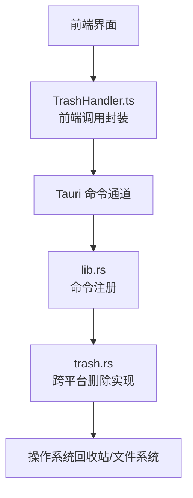
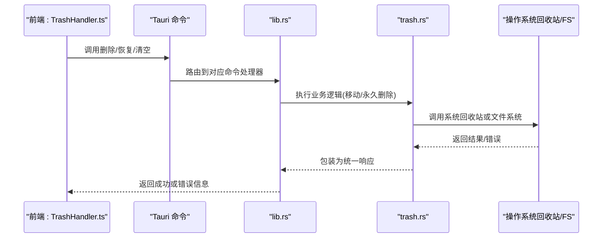
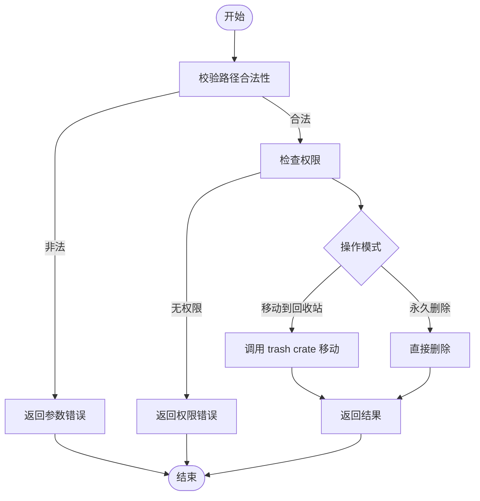
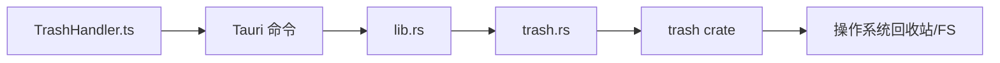

# 文件系统操作

<cite>
**本文档引用的文件**
- [TrashHandler.ts](file://src/features/trash/TrashHandler.ts)
- [trash.rs](file://src-tauri/src/trash.rs)
- [lib.rs](file://src-tauri/src/lib.rs)
- [main.rs](file://src-tauri/src/main.rs)
- [Cargo.toml](file://src-tauri/Cargo.toml)
</cite>

## 目录
1. [简介](#简介)
2. [项目结构](#项目结构)
3. [核心组件](#核心组件)
4. [架构总览](#架构总览)
5. [详细组件分析](#详细组件分析)
6. [依赖关系分析](#依赖关系分析)
7. [性能考虑](#性能考虑)
8. [故障排查指南](#故障排查指南)
9. [结论](#结论)
10. [附录：API调用示例与最佳实践](#附录api调用示例与最佳实践)

## 简介
本文件围绕“文件系统操作”主题，聚焦 trash 模块的实现，系统性说明以下方面：
- 将文件移动到系统回收站、永久删除以及文件状态管理
- 跨平台一致性处理（Windows、macOS、Linux）的适配策略
- 安全验证机制：路径校验、权限检查、恶意文件检测思路
- 事务性操作与回滚机制的设计建议
- 错误处理与日志记录策略
- 前端与后端交互流程及可观测性

## 项目结构
本项目采用 Tauri 架构：前端 TypeScript 通过命令通道调用 Rust 后端能力。与文件系统相关的核心代码位于：
- 前端：src/features/trash/TrashHandler.ts（封装删除、恢复等操作的调用入口）
- 后端：src-tauri/src/trash.rs（实现跨平台回收站与永久删除逻辑）
- 后端注册：src-tauri/src/lib.rs（将命令暴露给前端）
- 后端入口：src-tauri/src/main.rs（应用启动）
- 依赖声明：src-tauri/Cargo.toml（包含 trash 等 crate）

图表来源
- [TrashHandler.ts](file://src/features/trash/TrashHandler.ts)
- [lib.rs](file://src-tauri/src/lib.rs)
- [trash.rs](file://src-tauri/src/trash.rs)

章节来源
- [TrashHandler.ts](file://src/features/trash/TrashHandler.ts)
- [lib.rs](file://src-tauri/src/lib.rs)
- [trash.rs](file://src-tauri/src/trash.rs)
- [main.rs](file://src-tauri/src/main.rs)
- [Cargo.toml](file://src-tauri/Cargo.toml)

## 核心组件
- 前端调用封装（TrashHandler.ts）
  - 职责：提供统一的删除、恢复、清空回收站等方法；负责参数校验、结果解析与错误提示；必要时触发 UI 反馈或重试。
  - 关键点：对路径进行规范化与安全检查；将操作结果映射为前端友好的状态；在失败时给出可诊断的错误信息。
- 后端实现（trash.rs）
  - 职责：基于 trash crate 实现跨平台的“移动到回收站”和“永久删除”；返回统一的结果结构；记录关键事件以便排障。
  - 关键点：根据目标平台选择合适 API；对不可恢复的操作进行幂等设计；对异常进行捕获并转换为明确错误码。
- 命令注册（lib.rs）
  - 职责：将 Rust 函数注册为 Tauri 命令，供前端调用；定义输入输出类型契约。
- 应用入口（main.rs）
  - 职责：初始化 Tauri 应用，加载配置与插件（如有）。
- 依赖（Cargo.toml）
  - 职责：声明 trash 等外部 crate 版本与特性，确保跨平台行为一致。

章节来源
- [TrashHandler.ts](file://src/features/trash/TrashHandler.ts)
- [trash.rs](file://src-tauri/src/trash.rs)
- [lib.rs](file://src-tauri/src/lib.rs)
- [main.rs](file://src-tauri/src/main.rs)
- [Cargo.toml](file://src-tauri/Cargo.toml)

## 架构总览
下图展示了从前端到后端的完整调用链，包括命令注册与执行、跨平台适配与结果返回。

图表来源
- [TrashHandler.ts](file://src/features/trash/TrashHandler.ts)
- [lib.rs](file://src-tauri/src/lib.rs)
- [trash.rs](file://src-tauri/src/trash.rs)

## 详细组件分析

### 前端：TrashHandler.ts
- 功能要点
  - 提供 move_to_trash、permanent_delete、empty_trash、restore_from_trash 等方法的封装
  - 对传入路径做基础校验（非空、格式合法、避免明显危险路径）
  - 将后端返回的结构化错误映射为用户可读消息
  - 支持批量操作时的进度与错误聚合
- 安全与健壮性
  - 拒绝空路径、相对路径、包含控制字符的路径
  - 对网络路径或特殊协议路径进行白名单限制
  - 失败时提供重试与降级策略（如先尝试回收站，失败再永久删除）
- 可观测性
  - 记录关键步骤（开始、结束、错误）便于问题定位
  - 将错误分类（参数错误、权限不足、系统不支持、IO 错误）

章节来源
- [TrashHandler.ts](file://src/features/trash/TrashHandler.ts)

### 后端：trash.rs
- 功能要点
  - 使用 trash crate 实现“移动到回收站”，在不同平台上调用相应系统 API
  - 实现“永久删除”，直接移除文件或目录
  - 返回统一的结果对象，包含成功标志、详情与错误码
- 跨平台一致性
  - Windows：通过系统回收站接口移动，支持恢复
  - macOS：通过 .Trash 或 Finder Trash 语义移动
  - Linux：遵循 freedesktop.org Trash 规范，兼容 Nautilus/Dolphin 等桌面环境
- 安全与健壮性
  - 路径合法性检查（绝对路径、存在性、是否受保护目录）
  - 权限检查（读取/写入/删除权限）
  - 对循环引用、符号链接、挂载点等进行防护
  - 对大文件或大量文件进行分批处理与进度上报
- 事务性与回滚
  - “移动到回收站”天然具备可恢复性，可作为默认策略
  - “永久删除”前生成快照清单，失败时可尝试恢复元数据（如文件名/目录树）
  - 批量操作采用“最小提交单元”，单个失败不影响其他项

图表来源
- [trash.rs](file://src-tauri/src/trash.rs)

章节来源
- [trash.rs](file://src-tauri/src/trash.rs)

### 命令注册：lib.rs
- 职责
  - 将 Rust 函数注册为 Tauri 命令，定义输入输出类型
  - 保证前后端契约稳定，便于扩展与维护
- 关注点
  - 错误类型统一，便于前端解析
  - 可扩展的命令命名空间，避免冲突

章节来源
- [lib.rs](file://src-tauri/src/lib.rs)

### 应用入口：main.rs
- 职责
  - 初始化 Tauri 应用上下文
  - 加载配置、插件（如有）
- 关注点
  - 确保命令可用、资源路径正确

章节来源
- [main.rs](file://src-tauri/src/main.rs)

### 依赖：Cargo.toml
- 职责
  - 声明 trash crate 及其他依赖
- 关注点
  - 版本锁定以保证跨平台行为一致
  - 按需启用特性以减小体积或提升兼容性

章节来源
- [Cargo.toml](file://src-tauri/Cargo.toml)

## 依赖关系分析
- 前端依赖后端命令接口，形成稳定的契约
- 后端依赖 trash crate 提供的跨平台抽象，屏蔽系统差异
- 通过 lib.rs 集中注册命令，降低耦合度

图表来源
- [TrashHandler.ts](file://src/features/trash/TrashHandler.ts)
- [lib.rs](file://src-tauri/src/lib.rs)
- [trash.rs](file://src-tauri/src/trash.rs)
- [Cargo.toml](file://src-tauri/Cargo.toml)

章节来源
- [TrashHandler.ts](file://src/features/trash/TrashHandler.ts)
- [lib.rs](file://src-tauri/src/lib.rs)
- [trash.rs](file://src-tauri/src/trash.rs)
- [Cargo.toml](file://src-tauri/Cargo.toml)

## 性能考虑
- 批量操作分片：按固定大小分批处理，避免长时间阻塞
- 进度上报：每批完成后向前端推送进度，提升用户体验
- 缓存与去重：对重复路径进行去重，减少无效 IO
- 并发控制：限制并发任务数，防止系统资源耗尽
- 大文件优化：优先走回收站（原子性更好），仅在必要时才永久删除

## 故障排查指南
- 常见问题
  - 路径不存在或权限不足：检查路径有效性、用户权限与目标位置
  - 系统不支持回收站：在某些服务器或受限环境中，退回永久删除或提示用户
  - 批量失败：查看具体失败项，定位是路径、权限还是系统限制导致
- 诊断手段
  - 前端：记录请求参数、错误分类与堆栈
  - 后端：记录关键步骤、系统返回码与异常信息
  - 日志级别：调试阶段开启详细日志，生产环境仅保留必要信息
- 恢复策略
  - 优先尝试“移动到回收站”，失败再降级为“永久删除”
  - 对重要目录提供快照清单，便于快速恢复

章节来源
- [TrashHandler.ts](file://src/features/trash/TrashHandler.ts)
- [trash.rs](file://src-tauri/src/trash.rs)

## 结论
本方案通过前端封装与后端跨平台实现的解耦，提供了统一、安全且可恢复的文件删除能力。借助 trash crate 的抽象，系统在 Windows、macOS、Linux 上保持一致的行为；同时通过严格的安全校验、事务性设计与完善的错误处理，保障操作的可靠性与可维护性。

## 附录：API调用示例与最佳实践
以下为典型调用流程与注意事项（不展示具体代码内容，仅提供调用路径参考）：

- 移动到系统回收站（推荐默认策略）
  - 前端调用：TrashHandler.move_to_trash(path)
  - 后端实现：trash.rs 中对应的移动方法
  - 适用场景：用户主动删除，期望可恢复
  - 参考路径
    - [TrashHandler.ts](file://src/features/trash/TrashHandler.ts)
    - [trash.rs](file://src-tauri/src/trash.rs)

- 永久删除（谨慎使用）
  - 前端调用：TrashHandler.permanent_delete(path)
  - 后端实现：trash.rs 中对应的永久删除方法
  - 适用场景：清理临时文件、敏感数据销毁
  - 安全建议：二次确认、审计日志、最小权限原则
  - 参考路径
    - [TrashHandler.ts](file://src/features/trash/TrashHandler.ts)
    - [trash.rs](file://src-tauri/src/trash.rs)

- 清空回收站
  - 前端调用：TrashHandler.empty_trash()
  - 后端实现：trash.rs 中对应的清空方法
  - 注意：不同平台行为可能略有差异，需统一提示
  - 参考路径
    - [TrashHandler.ts](file://src/features/trash/TrashHandler.ts)
    - [trash.rs](file://src-tauri/src/trash.rs)

- 恢复文件
  - 前端调用：TrashHandler.restore_from_trash(original_path)
  - 后端实现：trash.rs 中对应的恢复方法
  - 注意：原路径需存在或可重建
  - 参考路径
    - [TrashHandler.ts](file://src/features/trash/TrashHandler.ts)
    - [trash.rs](file://src-tauri/src/trash.rs)

- 批量操作与事务性
  - 前端：收集路径列表，分批调用，聚合结果与错误
  - 后端：按批次提交，失败项单独记录，整体可回滚至上一批
  - 参考路径
    - [TrashHandler.ts](file://src/features/trash/TrashHandler.ts)
    - [trash.rs](file://src-tauri/src/trash.rs)

- 安全校验清单
  - 路径校验：非空、绝对路径、排除系统关键目录
  - 权限检查：确保具备读写与删除权限
  - 恶意文件检测：结合扩展名、MIME 类型、沙箱扫描策略
  - 参考路径
    - [TrashHandler.ts](file://src/features/trash/TrashHandler.ts)
    - [trash.rs](file://src-tauri/src/trash.rs)

- 错误处理与日志
  - 前端：分类错误并提示用户，记录诊断信息
  - 后端：记录系统返回码、异常堆栈与上下文
  - 参考路径
    - [TrashHandler.ts](file://src/features/trash/TrashHandler.ts)
    - [trash.rs](file://src-tauri/src/trash.rs)