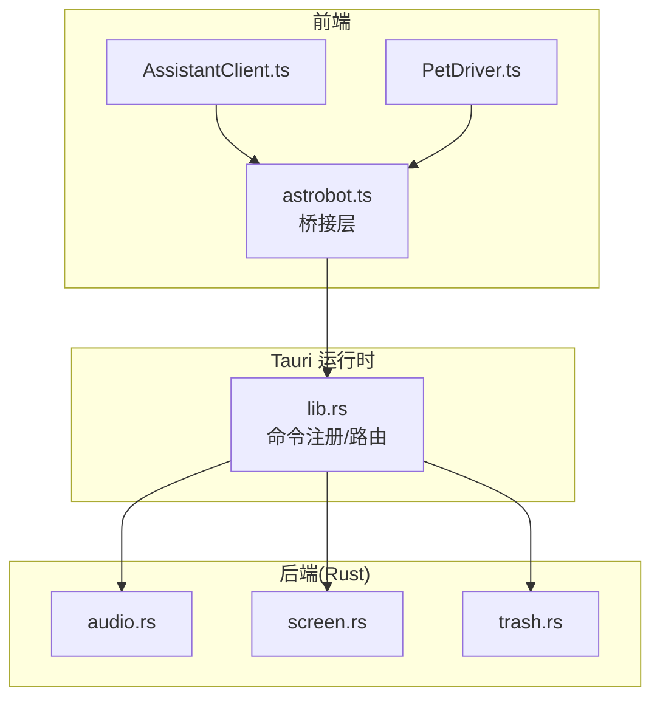
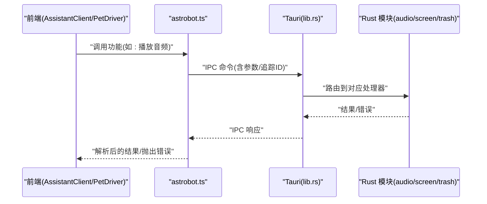
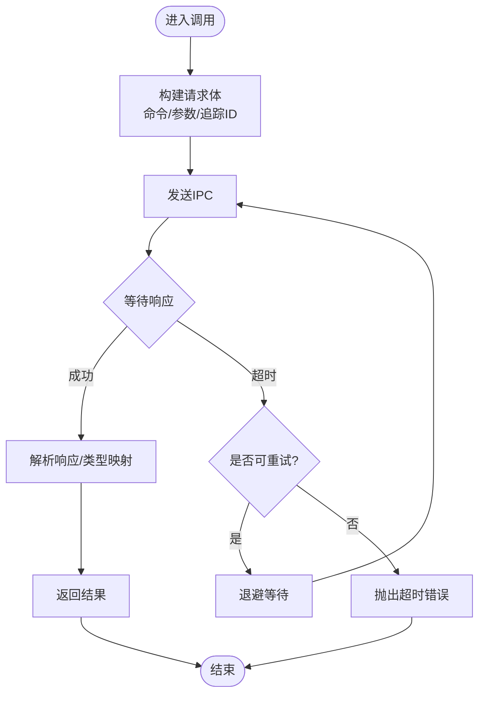
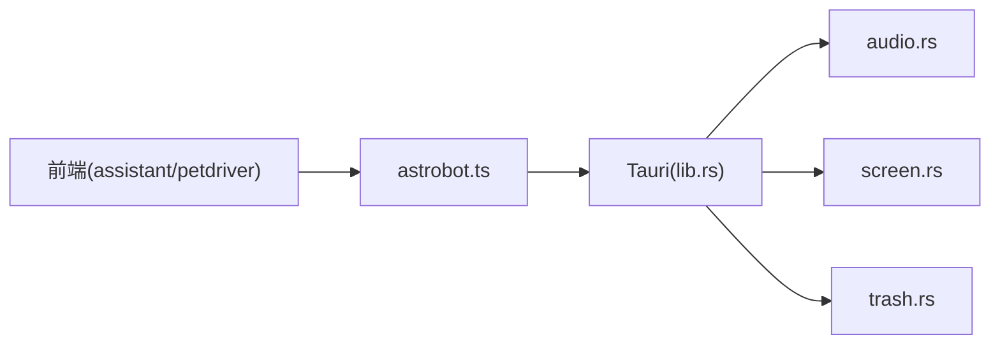

# 桥接层通信

<cite>
**本文引用的文件**
- [src/bridges/astrobot.ts](file://src/bridges/astrobot.ts)
- [src/main.ts](file://src/main.ts)
- [src-tauri/src/lib.rs](file://src-tauri/src/lib.rs)
- [src-tauri/src/audio.rs](file://src-tauri/src/audio.rs)
- [src-tauri/src/screen.rs](file://src-tauri/src/screen.rs)
- [src-tauri/src/trash.rs](file://src-tauri/src/trash.rs)
- [src-tauri/Cargo.toml](file://src-tauri/Cargo.toml)
- [src-tauri/tauri.conf.json](file://src-tauri/tauri.conf.json)
- [src/assistant/AssistantClient.ts](file://src/assistant/AssistantClient.ts)
- [src/live2d/PetDriver.ts](file://src/live2d/PetDriver.ts)
</cite>

## 目录
1. [简介](#简介)
2. [项目结构](#项目结构)
3. [核心组件](#核心组件)
4. [架构总览](#架构总览)
5. [详细组件分析](#详细组件分析)
6. [依赖关系分析](#依赖关系分析)
7. [性能考虑](#性能考虑)
8. [故障排除指南](#故障排除指南)
9. [结论](#结论)
10. [附录](#附录)

## 简介
本文件聚焦于 astrobot 桥接层的通信机制与数据转换逻辑，覆盖前后端消息协议、类型映射与序列化、IPC 异步调用、事件监听、错误传播、连接管理与重连策略，以及调试与排障方法。目标是帮助开发者在前端（TypeScript）与后端（Rust/Tauri）之间建立稳定、可观测、可扩展的通信通道。

## 项目结构
本项目采用 Tauri 架构：前端为 TypeScript/Vue 应用，通过 Tauri IPC 调用 Rust 后端能力；桥接层位于 src/bridges/astrobot.ts，封装了与后端的统一接口，供 Assistant、Live2D 等模块使用。

图表来源
- [src/assistant/AssistantClient.ts:1-200](file://src/assistant/AssistantClient.ts#L1-L200)
- [src/live2d/PetDriver.ts:1-200](file://src/live2d/PetDriver.ts#L1-L200)
- [src/bridges/astrobot.ts:1-200](file://src/bridges/astrobot.ts#L1-L200)
- [src-tauri/src/lib.rs:1-200](file://src-tauri/src/lib.rs#L1-L200)
- [src-tauri/src/audio.rs:1-200](file://src-tauri/src/audio.rs#L1-L200)
- [src-tauri/src/screen.rs:1-200](file://src-tauri/src/screen.rs#L1-L200)
- [src-tauri/src/trash.rs:1-200](file://src-tauri/src/trash.rs#L1-L200)

章节来源
- [src/bridges/astrobot.ts:1-200](file://src/bridges/astrobot.ts#L1-L200)
- [src-tauri/src/lib.rs:1-200](file://src-tauri/src/lib.rs#L1-L200)

## 核心组件
- 桥接层（astrobot.ts）：统一封装 IPC 调用、事件订阅、重试与超时、错误包装、类型映射与序列化。
- 前端消费者：AssistantClient、PetDriver 等通过桥接层调用后端能力。
- Tauri 后端：在 lib.rs 中注册命令，将 IPC 路由到 audio.rs、screen.rs、trash.rs 等具体实现。

章节来源
- [src/bridges/astrobot.ts:1-200](file://src/bridges/astrobot.ts#L1-L200)
- [src-tauri/src/lib.rs:1-200](file://src-tauri/src/lib.rs#L1-L200)

## 架构总览
前后端通过 Tauri IPC 进行通信。桥接层负责：
- 构造请求对象（包含命令名、参数、追踪 ID、时间戳）。
- 发送 IPC 并等待响应或事件回调。
- 处理超时、重试、断线重连。
- 将后端返回的数据转换为前端类型。
- 将错误标准化为前端异常对象。

图表来源
- [src/bridges/astrobot.ts:1-200](file://src/bridges/astrobot.ts#L1-L200)
- [src-tauri/src/lib.rs:1-200](file://src-tauri/src/lib.rs#L1-L200)
- [src-tauri/src/audio.rs:1-200](file://src-tauri/src/audio.rs#L1-L200)
- [src-tauri/src/screen.rs:1-200](file://src-tauri/src/screen.rs#L1-L200)
- [src-tauri/src/trash.rs:1-200](file://src-tauri/src/trash.rs#L1-L200)

## 详细组件分析

### 桥接层（astrobot.ts）
职责
- 定义统一的 IPC 调用 API，屏蔽底层 Tauri 细节。
- 管理事件总线，支持一次性订阅与长期监听。
- 实现重试、超时、取消、错误归一化。
- 负责数据类型映射与序列化/反序列化。

关键流程
- 调用流程：构建请求 -> 发送 IPC -> 等待响应 -> 解析响应 -> 返回结果。
- 事件流程：订阅事件 -> 接收事件 -> 分发到回调 -> 清理资源。
- 错误流程：捕获后端错误 -> 包装为前端错误 -> 触发重试或上报。

图表来源
- [src/bridges/astrobot.ts:1-200](file://src/bridges/astrobot.ts#L1-L200)

章节来源
- [src/bridges/astrobot.ts:1-200](file://src/bridges/astrobot.ts#L1-L200)

### 前端消费者（AssistantClient.ts、PetDriver.ts）
- AssistantClient：通过桥接层发起助手相关命令（如对话、状态查询），处理异步结果与错误。
- PetDriver：驱动 Live2D 行为，调用屏幕/音频等系统能力，订阅事件以更新 UI。

交互示例（概念）
- 前端调用“播放音频”：
  - 组装参数（音频源、音量、循环）。
  - 调用桥接层 API。
  - 根据响应更新 UI 或继续后续动作。
  - 若失败，记录日志并重试或降级。

章节来源
- [src/assistant/AssistantClient.ts:1-200](file://src/assistant/AssistantClient.ts#L1-L200)
- [src/live2d/PetDriver.ts:1-200](file://src/live2d/PetDriver.ts#L1-L200)

### Tauri 后端（lib.rs、audio.rs、screen.rs、trash.rs）
- lib.rs：集中注册 IPC 命令，将命令路由到具体模块。
- audio.rs：提供音频播放、录制、设备枚举等能力。
- screen.rs：提供屏幕截图、分辨率获取、多显示器信息等能力。
- trash.rs：提供回收站操作（清空、列出项目）等能力。

命令与事件
- 命令：由前端通过桥接层调用，后端执行并返回结果。
- 事件：后端主动推送事件（如音频进度、屏幕变化），前端通过桥接层订阅。

章节来源
- [src-tauri/src/lib.rs:1-200](file://src-tauri/src/lib.rs#L1-L200)
- [src-tauri/src/audio.rs:1-200](file://src-tauri/src/audio.rs#L1-L200)
- [src-tauri/src/screen.rs:1-200](file://src-tauri/src/screen.rs#L1-L200)
- [src-tauri/src/trash.rs:1-200](file://src-tauri/src/trash.rs#L1-L200)

## 依赖关系分析
- 前端依赖桥接层，桥接层依赖 Tauri IPC。
- 后端通过 Cargo 配置引入所需 crate，并在 lib.rs 中暴露命令。
- 各后端模块相互独立，通过命令路由解耦。

图表来源
- [src/assistant/AssistantClient.ts:1-200](file://src/assistant/AssistantClient.ts#L1-L200)
- [src/live2d/PetDriver.ts:1-200](file://src/live2d/PetDriver.ts#L1-L200)
- [src/bridges/astrobot.ts:1-200](file://src/bridges/astrobot.ts#L1-L200)
- [src-tauri/src/lib.rs:1-200](file://src-tauri/src/lib.rs#L1-L200)

章节来源
- [src-tauri/Cargo.toml:1-200](file://src-tauri/Cargo.toml#L1-L200)
- [src-tauri/tauri.conf.json:1-200](file://src-tauri/tauri.conf.json#L1-L200)

## 性能考虑
- 批量与节流：对高频事件（如屏幕尺寸变化）进行节流或合并，减少 IPC 频率。
- 超时与重试：合理设置超时阈值与最大重试次数，避免雪崩。
- 背压与队列：对长任务使用队列，避免阻塞主线程。
- 序列化开销：尽量传递最小必要字段，避免大对象频繁传输。
- 资源释放：及时取消订阅与清理定时器，防止内存泄漏。

## 故障排除指南
常见问题与定位步骤
- 无法连接后端
  - 检查 Tauri 进程是否启动、端口/权限是否正确。
  - 查看浏览器控制台与 Tauri 日志，确认 IPC 是否可达。
- 调用超时
  - 增大超时阈值或检查后端耗时操作。
  - 启用重试并观察是否偶发网络抖动导致。
- 事件未触发
  - 确认订阅是否在正确时机创建。
  - 检查事件命名空间与过滤条件。
- 类型不匹配
  - 核对前后端数据结构定义，确保字段一致。
  - 在桥接层增加类型校验与默认值填充。

调试工具
- 前端：浏览器控制台、网络面板、自定义日志器。
- 后端：Tauri 日志输出、Rust 日志框架。
- 诊断脚本：scripts/cdp-diag.mjs 可用于诊断 CDP 相关问题（如适用）。

章节来源
- [scripts/cdp-diag.mjs:1-200](file://scripts/cdp-diag.mjs#L1-L200)

## 结论
astrobot 桥接层通过统一的 IPC 抽象，将前端与 Tauri 后端解耦，提供了稳定的异步调用、事件订阅、错误处理与重试机制。配合合理的超时、重试与类型校验策略，可在复杂桌面应用中实现高可靠的前后端通信。建议持续完善日志与监控，提升问题定位效率。

## 附录

### 前后端消息协议与序列化
- 请求格式：包含命令名、参数对象、追踪 ID、时间戳。
- 响应格式：包含结果对象或错误对象。
- 事件格式：包含事件名、负载、可选元数据。
- 序列化：JSON 为主，必要时使用二进制或分块传输大对象。

### 类型安全与数据验证
- 前端：在桥接层对入参进行基础校验（非空、范围、枚举）。
- 后端：在 Rust 侧进行强类型校验与业务规则检查。
- 错误：统一错误码与消息，便于前端分类处理。

### 连接管理与重连策略
- 心跳：定期发送轻量心跳，检测连接健康。
- 重连：指数退避 + 最大重试次数。
- 优雅关闭：取消所有订阅与待处理请求，释放资源。

### 通信示例（概念）
- 播放音频
  - 前端调用：传入音频 URL、音量、循环标志。
  - 后端执行：加载音频、播放、返回状态。
  - 前端处理：更新 UI、监听播放完成事件。
- 屏幕截图
  - 前端调用：指定区域或全屏。
  - 后端执行：截取屏幕、编码为图片。
  - 前端处理：显示预览或保存文件。

[本节为概念性说明，不直接分析具体代码文件]