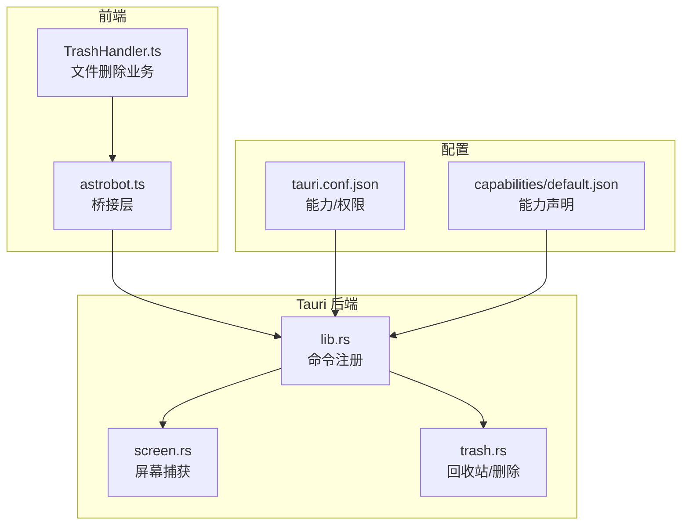
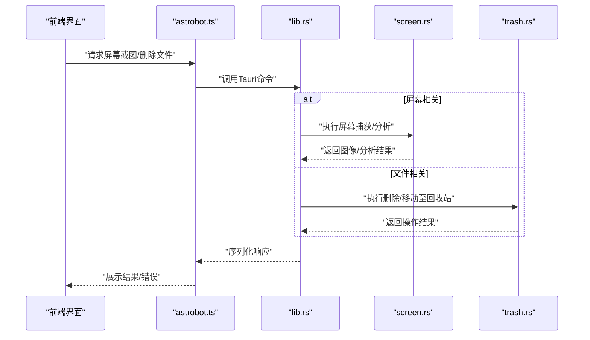
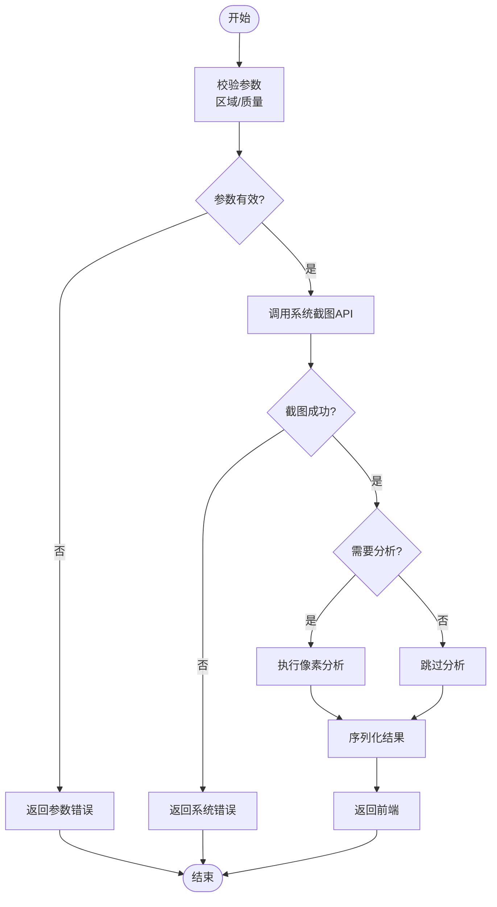
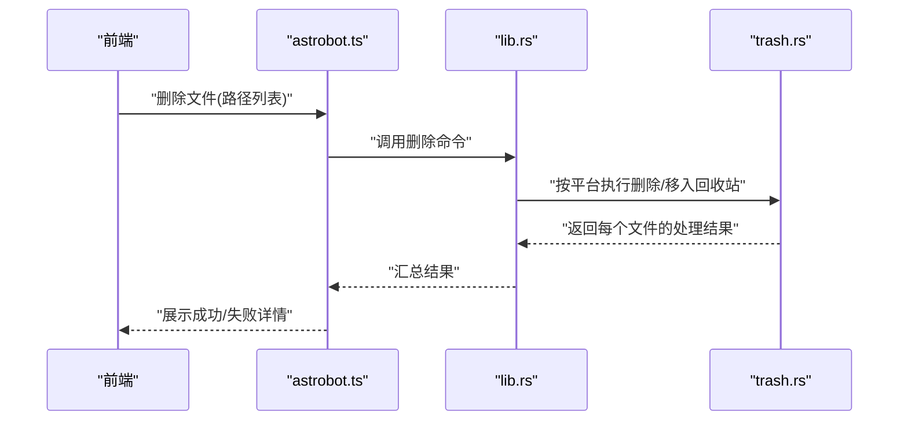
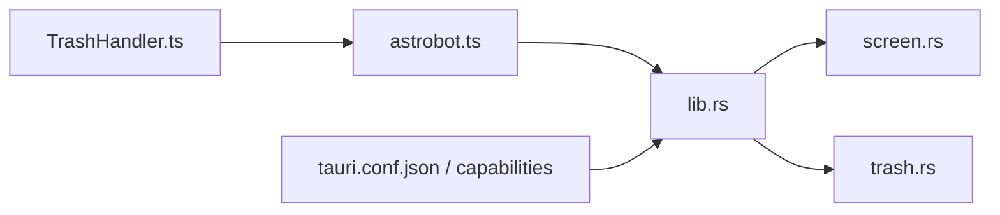

# 系统集成

<cite>
**本文引用的文件**
- [src-tauri/src/screen.rs](file://src-tauri/src/screen.rs)
- [src-tauri/src/trash.rs](file://src-tauri/src/trash.rs)
- [src-tauri/src/lib.rs](file://src-tauri/src/lib.rs)
- [src-tauri/tauri.conf.json](file://src-tauri/tauri.conf.json)
- [src-tauri/capabilities/default.json](file://src-tauri/capabilities/default.json)
- [src/bridges/astrobot.ts](file://src/bridges/astrobot.ts)
- [src/features/trash/TrashHandler.ts](file://src/features/trash/TrashHandler.ts)
</cite>

## 目录
1. [简介](#简介)
2. [项目结构](#项目结构)
3. [核心组件](#核心组件)
4. [架构总览](#架构总览)
5. [详细组件分析](#详细组件分析)
6. [依赖关系分析](#依赖关系分析)
7. [性能考虑](#性能考虑)
8. [故障排查指南](#故障排查指南)
9. [结论](#结论)
10. [附录](#附录)

## 简介
本文件聚焦于Tauri后端的系统级功能实现，涵盖屏幕捕获、文件删除与回收站处理、以及前端桥接层的通信机制。文档从架构到实现细节逐步展开，帮助读者理解screen模块的屏幕内容获取与分析流程、trash模块的文件删除处理路径，以及astrobot桥接层在前端与Rust后端之间的数据转换与调用方式。同时提供权限配置与安全注意事项、错误处理策略、跨平台差异说明，并给出从前端调用系统能力的示例指引。

## 项目结构
本项目采用前后端分离的Tauri架构：
- 前端（TypeScript）通过桥接层调用Rust后端暴露的系统能力。
- Rust后端以Tauri命令形式暴露系统API，封装操作系统相关的屏幕捕获与文件删除逻辑。
- 配置文件集中管理权限、能力与打包行为。

图表来源
- [src/bridges/astrobot.ts:1-200](file://src/bridges/astrobot.ts#L1-L200)
- [src/features/trash/TrashHandler.ts:1-200](file://src/features/trash/TrashHandler.ts#L1-L200)
- [src-tauri/src/lib.rs:1-200](file://src-tauri/src/lib.rs#L1-L200)
- [src-tauri/src/screen.rs:1-200](file://src-tauri/src/screen.rs#L1-L200)
- [src-tauri/src/trash.rs:1-200](file://src-tauri/src/trash.rs#L1-L200)
- [src-tauri/tauri.conf.json:1-200](file://src-tauri/tauri.conf.json#L1-L200)
- [src-tauri/capabilities/default.json:1-200](file://src-tauri/capabilities/default.json#L1-L200)

章节来源
- [src-tauri/src/lib.rs:1-200](file://src-tauri/src/lib.rs#L1-L200)
- [src-tauri/tauri.conf.json:1-200](file://src-tauri/tauri.conf.json#L1-L200)
- [src-tauri/capabilities/default.json:1-200](file://src-tauri/capabilities/default.json#L1-L200)

## 核心组件
- screen模块：负责屏幕内容获取与分析，包括截图采集、像素信息提取、区域选择等能力。
- trash模块：负责将文件移动到系统回收站或执行安全删除，屏蔽不同平台的差异。
- astrobot桥接层：在前端定义统一的API接口，调用Tauri命令并处理返回结果与错误。
- TrashHandler：封装文件删除的业务流程，包含用户确认、重试与失败回退。

章节来源
- [src-tauri/src/screen.rs:1-200](file://src-tauri/src/screen.rs#L1-L200)
- [src-tauri/src/trash.rs:1-200](file://src-tauri/src/trash.rs#L1-L200)
- [src/bridges/astrobot.ts:1-200](file://src/bridges/astrobot.ts#L1-L200)
- [src/features/trash/TrashHandler.ts:1-200](file://src/features/trash/TrashHandler.ts#L1-L200)

## 架构总览
整体调用链路如下：
- 前端通过astrobot.ts调用Tauri命令（如屏幕截图、删除文件）。
- Tauri在lib.rs中注册命令，路由到对应的Rust实现（screen.rs、trash.rs）。
- Rust调用系统API完成操作，并将结果序列化回前端。
- 权限由capabilities和tauri.conf.json控制，确保最小权限原则。

图表来源
- [src/bridges/astrobot.ts:1-200](file://src/bridges/astrobot.ts#L1-L200)
- [src-tauri/src/lib.rs:1-200](file://src-tauri/src/lib.rs#L1-L200)
- [src-tauri/src/screen.rs:1-200](file://src-tauri/src/screen.rs#L1-L200)
- [src-tauri/src/trash.rs:1-200](file://src-tauri/src/trash.rs#L1-L200)

## 详细组件分析

### 屏幕捕获与分析（screen模块）
- 功能要点：
  - 支持全屏或指定区域的屏幕截图。
  - 可选进行基础像素分析（如颜色分布、亮度统计），用于后续AI或自动化场景。
  - 返回二进制图像数据或结构化分析结果。
- 关键流程：
  - 前端发起截图请求，传递区域参数（可选）。
  - Rust侧调用系统截图API，生成图像数据。
  - 可选执行分析步骤，输出统计指标。
  - 将结果序列化为JSON或Base64字符串返回前端。
- 错误处理：
  - 捕获系统权限不足、无可用显示器、内存不足等异常。
  - 返回统一错误码与消息，便于前端提示与重试。
- 性能优化：
  - 限制截图分辨率与采样率。
  - 使用异步任务避免阻塞主线程。
  - 对大图像数据进行流式传输或分块处理。

图表来源
- [src-tauri/src/screen.rs:1-200](file://src-tauri/src/screen.rs#L1-L200)

章节来源
- [src-tauri/src/screen.rs:1-200](file://src-tauri/src/screen.rs#L1-L200)

### 文件删除与回收站（trash模块）
- 功能要点：
  - 将文件移动到系统回收站（Windows/macOS/Linux均有对应实现）。
  - 支持批量删除与单文件删除。
  - 提供“永久删除”选项（谨慎使用）。
- 关键流程：
  - 前端传入目标文件路径列表。
  - Rust侧根据平台选择合适API（如Windows的SHFileOperation、macOS的Finder Trash、Linux的gio trash）。
  - 记录操作日志，返回成功/失败明细。
- 错误处理：
  - 文件不存在、权限不足、磁盘满等情况需明确提示。
  - 部分失败时返回逐文件状态，允许前端选择性重试。
- 兼容性：
  - 针对不同操作系统抽象统一接口，屏蔽底层差异。
  - 对不支持回收站的旧环境降级为直接删除并提示风险。

图表来源
- [src/bridges/astrobot.ts:1-200](file://src/bridges/astrobot.ts#L1-L200)
- [src-tauri/src/lib.rs:1-200](file://src-tauri/src/lib.rs#L1-L200)
- [src-tauri/src/trash.rs:1-200](file://src-tauri/src/trash.rs#L1-L200)

章节来源
- [src-tauri/src/trash.rs:1-200](file://src-tauri/src/trash.rs#L1-L200)
- [src/features/trash/TrashHandler.ts:1-200](file://src/features/trash/TrashHandler.ts#L1-L200)

### 桥接层通信与数据转换（astrobot.ts）
- 职责：
  - 封装Tauri命令调用，统一错误格式。
  - 处理前后端数据结构映射（如路径、区域坐标、图像数据）。
  - 提供重试、超时与取消机制。
- 数据转换：
  - 前端对象 -> Rust结构体：字段校验、类型转换。
  - Rust结果 -> 前端对象：错误码映射、空值处理。
- 最佳实践：
  - 所有外部调用包裹try-catch，返回标准化错误对象。
  - 对大体积数据（如图像）采用分块或临时文件策略。

章节来源
- [src/bridges/astrobot.ts:1-200](file://src/bridges/astrobot.ts#L1-L200)

### 前端文件删除业务（TrashHandler.ts）
- 职责：
  - 用户交互：二次确认、进度反馈。
  - 批量处理：并发控制、失败重试。
  - 回退策略：部分失败时的补偿操作。
- 与桥接层协作：
  - 调用astrobot.ts提供的删除API。
  - 解析返回结果，更新UI状态。

章节来源
- [src/features/trash/TrashHandler.ts:1-200](file://src/features/trash/TrashHandler.ts#L1-L200)

## 依赖关系分析
- 前端依赖：
  - astrobot.ts依赖Tauri命令接口。
  - TrashHandler.ts依赖astrobot.ts。
- 后端依赖：
  - lib.rs注册命令，依赖screen.rs与trash.rs。
  - screen.rs与trash.rs分别依赖各自平台的能力。
- 配置依赖：
  - tauri.conf.json与capabilities/default.json决定可用能力与权限范围。

图表来源
- [src/bridges/astrobot.ts:1-200](file://src/bridges/astrobot.ts#L1-L200)
- [src/features/trash/TrashHandler.ts:1-200](file://src/features/trash/TrashHandler.ts#L1-L200)
- [src-tauri/src/lib.rs:1-200](file://src-tauri/src/lib.rs#L1-L200)
- [src-tauri/src/screen.rs:1-200](file://src-tauri/src/screen.rs#L1-L200)
- [src-tauri/src/trash.rs:1-200](file://src-tauri/src/trash.rs#L1-L200)
- [src-tauri/tauri.conf.json:1-200](file://src-tauri/tauri.conf.json#L1-L200)
- [src-tauri/capabilities/default.json:1-200](file://src-tauri/capabilities/default.json#L1-L200)

章节来源
- [src-tauri/src/lib.rs:1-200](file://src-tauri/src/lib.rs#L1-L200)
- [src-tauri/tauri.conf.json:1-200](file://src-tauri/tauri.conf.json#L1-L200)
- [src-tauri/capabilities/default.json:1-200](file://src-tauri/capabilities/default.json#L1-L200)

## 性能考虑
- 屏幕捕获：
  - 降低分辨率与帧率以减少带宽与CPU占用。
  - 使用异步任务与缓冲队列避免UI卡顿。
  - 对重复区域进行增量更新（若适用）。
- 文件删除：
  - 批量操作时分批提交，避免一次性过大负载。
  - 记录日志以便定位慢操作。
- 数据传输：
  - 大图像数据建议走临时文件或分块传输。
  - 压缩与去重可减少网络开销。

[本节为通用指导，不直接分析具体文件]

## 故障排查指南
- 常见问题：
  - 权限不足：检查capabilities与tauri.conf.json是否授予相应能力。
  - 截图失败：确认显示器存在且未被锁定；检查内存与分辨率设置。
  - 删除失败：确认文件路径有效、权限足够；查看回收站支持情况。
- 调试方法：
  - 启用Tauri日志，查看后端错误栈。
  - 在前端打印桥接层请求与响应，核对数据结构。
  - 针对批量删除，逐个文件测试以确定问题点。
- 恢复策略：
  - 对可重试错误实施指数退避重试。
  - 对不可恢复错误提供用户提示与替代方案（如手动删除）。

章节来源
- [src-tauri/src/screen.rs:1-200](file://src-tauri/src/screen.rs#L1-L200)
- [src-tauri/src/trash.rs:1-200](file://src-tauri/src/trash.rs#L1-L200)
- [src/bridges/astrobot.ts:1-200](file://src/bridges/astrobot.ts#L1-L200)

## 结论
本系统集成方案通过Tauri将屏幕捕获与文件删除等系统能力安全地暴露给前端，借助astrobot桥接层实现稳定的前后端通信。通过合理的权限配置、错误处理与性能优化，能够在多平台上提供一致的用户体验。建议在迭代中持续完善日志与监控，提升可观测性与可维护性。

[本节为总结，不直接分析具体文件]

## 附录

### 权限配置与安全事项
- 能力声明：
  - 在capabilities/default.json中声明所需能力（如屏幕访问、文件系统访问）。
- 应用配置：
  - 在tauri.conf.json中启用对应能力，并限制作用域（如仅特定窗口或命令）。
- 安全建议：
  - 遵循最小权限原则，按需开启能力。
  - 对用户输入进行严格校验，防止路径注入与越权访问。
  - 对敏感操作（如永久删除）增加二次确认与审计日志。

章节来源
- [src-tauri/capabilities/default.json:1-200](file://src-tauri/capabilities/default.json#L1-L200)
- [src-tauri/tauri.conf.json:1-200](file://src-tauri/tauri.conf.json#L1-L200)

### 前端调用示例（指引）
- 屏幕截图：
  - 调用astrobot.ts中的截图函数，传入区域参数（可选），接收图像数据或分析结果。
  - 参考路径：[src/bridges/astrobot.ts:1-200](file://src/bridges/astrobot.ts#L1-L200)
- 文件删除：
  - 调用TrashHandler.ts中的删除方法，传入文件路径列表，处理成功/失败回调。
  - 参考路径：[src/features/trash/TrashHandler.ts:1-200](file://src/features/trash/TrashHandler.ts#L1-L200)
- 错误处理：
  - 统一捕获桥接层错误，显示友好提示，必要时触发重试。
  - 参考路径：[src/bridges/astrobot.ts:1-200](file://src/bridges/astrobot.ts#L1-L200)

章节来源
- [src/bridges/astrobot.ts:1-200](file://src/bridges/astrobot.ts#L1-L200)
- [src/features/trash/TrashHandler.ts:1-200](file://src/features/trash/TrashHandler.ts#L1-L200)

### 跨平台差异与兼容性
- 屏幕捕获：
  - Windows：使用系统API截取屏幕。
  - macOS：通过Quartz或CGDisplay创建截图。
  - Linux：依赖X11/Wayland工具链（如xdotool、scrot）。
- 文件删除：
  - Windows：优先移入回收站，失败时降级为直接删除。
  - macOS：通过Finder API移入废纸篓。
  - Linux：尝试gio trash，若无则直接删除并提示。
- 兼容策略：
  - 在trash.rs中抽象平台差异，对外暴露统一接口。
  - 在screen.rs中检测运行环境，选择最优实现。

章节来源
- [src-tauri/src/trash.rs:1-200](file://src-tauri/src/trash.rs#L1-L200)
- [src-tauri/src/screen.rs:1-200](file://src-tauri/src/screen.rs#L1-L200)