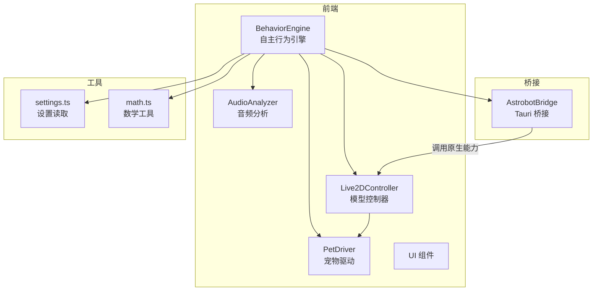
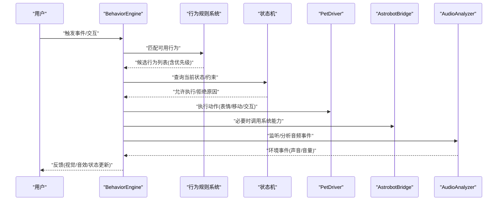
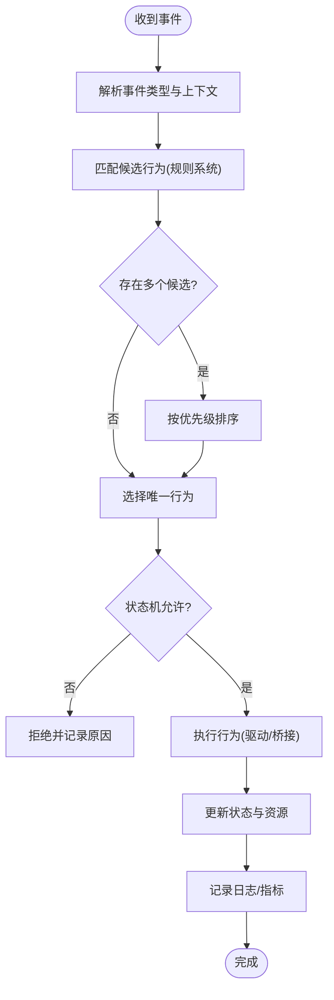
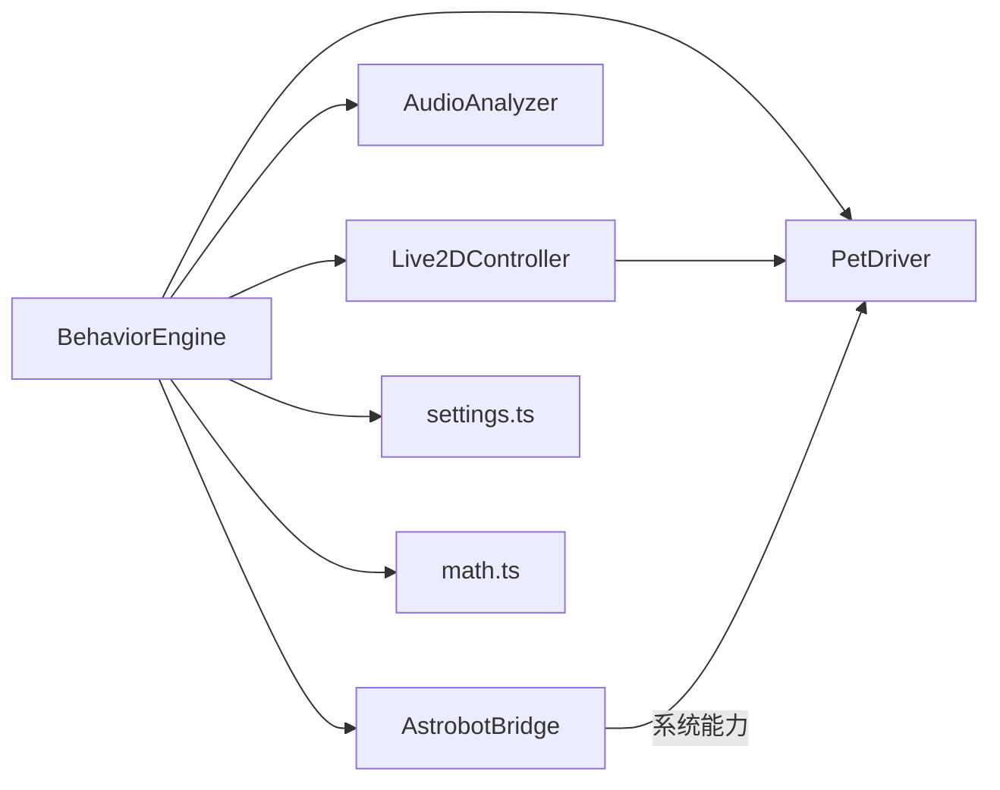

# 自主行为引擎

<cite>
**本文引用的文件**
- [BehaviorEngine.ts](file://src/autonomous/BehaviorEngine.ts)
- [main.ts](file://src/main.ts)
- [Live2DController.ts](file://src/live2d/Live2DController.ts)
- [PetDriver.ts](file://src/live2d/PetDriver.ts)
- [AudioAnalyzer.ts](file://src/audio/AudioAnalyzer.ts)
- [AstrobotBridge.ts](file://src/bridges/astrobot.ts)
- [TrashHandler.ts](file://src/features/trash/TrashHandler.ts)
- [settings.ts](file://src/utils/settings.ts)
- [math.ts](file://src/utils/math.ts)
</cite>

## 目录
1. [简介](#简介)
2. [项目结构](#项目结构)
3. [核心组件](#核心组件)
4. [架构总览](#架构总览)
5. [详细组件分析](#详细组件分析)
6. [依赖关系分析](#依赖关系分析)
7. [性能考虑](#性能考虑)
8. [故障排查指南](#故障排查指南)
9. [结论](#结论)
10. [附录](#附录)

## 简介
本文件面向“自主行为引擎”的完整技术文档，聚焦于 BehaviorEngine 如何实现宠物的自主行为与智能响应。内容涵盖：
- 行为规则系统、定时任务调度与事件驱动的行为触发机制
- 行为状态机、优先级管理与冲突解决策略
- 行为脚本编写指南（内置行为扩展与自定义行为实现模式）
- 日常活动、用户交互响应与环境感知行为的示例说明
- 性能监控与行为日志记录

## 项目结构
本项目采用分层组织方式：
- 前端逻辑层：包含自主行为引擎、UI、音频分析、Live2D 控制等
- 桥接层：与桌面端能力（如屏幕、剪贴板、垃圾桶等）交互
- 工具层：通用数学与设置读取
- Tauri 后端：提供原生能力（音频、屏幕、垃圾桶等）

图表来源
- [BehaviorEngine.ts:1-200](file://src/autonomous/BehaviorEngine.ts#L1-L200)
- [Live2DController.ts:1-200](file://src/live2d/Live2DController.ts#L1-L200)
- [PetDriver.ts:1-200](file://src/live2d/PetDriver.ts#L1-L200)
- [AudioAnalyzer.ts:1-200](file://src/audio/AudioAnalyzer.ts#L1-L200)
- [AstrobotBridge.ts:1-200](file://src/bridges/astrobot.ts#L1-L200)
- [settings.ts:1-200](file://src/utils/settings.ts#L1-L200)
- [math.ts:1-200](file://src/utils/math.ts#L1-L200)

章节来源
- [main.ts:1-200](file://src/main.ts#L1-L200)
- [BehaviorEngine.ts:1-200](file://src/autonomous/BehaviorEngine.ts#L1-L200)

## 核心组件
- 行为引擎（BehaviorEngine）
  - 负责行为规则解析、调度、执行与结果回写
  - 维护行为状态机、优先级队列与冲突消解
  - 暴露事件总线，订阅/发布环境变化与用户交互事件
- Live2D 控制器（Live2DController）
  - 管理模型加载、表情/动作切换、动画播放
- 宠物驱动（PetDriver）
  - 将高层行为映射为具体渲染指令（位置、表情、动作）
- 音频分析器（AudioAnalyzer）
  - 采集并分析音频流，用于环境感知（如声音事件）
- 桥接层（AstrobotBridge）
  - 封装 Tauri 命令，访问屏幕、剪贴板、垃圾桶等系统能力
- 工具模块
  - settings.ts：读取配置项（如行为开关、频率、阈值）
  - math.ts：常用数学计算（随机、插值、范围判断）

章节来源
- [BehaviorEngine.ts:1-200](file://src/autonomous/BehaviorEngine.ts#L1-L200)
- [Live2DController.ts:1-200](file://src/live2d/Live2DController.ts#L1-L200)
- [PetDriver.ts:1-200](file://src/live2d/PetDriver.ts#L1-L200)
- [AudioAnalyzer.ts:1-200](file://src/audio/AudioAnalyzer.ts#L1-L200)
- [AstrobotBridge.ts:1-200](file://src/bridges/astrobot.ts#L1-L200)
- [settings.ts:1-200](file://src/utils/settings.ts#L1-L200)
- [math.ts:1-200](file://src/utils/math.ts#L1-L200)

## 架构总览
行为引擎作为中枢，协调输入（事件、定时器）、处理（规则匹配、状态机）、输出（渲染、系统调用）。

图表来源
- [BehaviorEngine.ts:1-200](file://src/autonomous/BehaviorEngine.ts#L1-L200)
- [PetDriver.ts:1-200](file://src/live2d/PetDriver.ts#L1-L200)
- [AstrobotBridge.ts:1-200](file://src/bridges/astrobot.ts#L1-L200)
- [AudioAnalyzer.ts:1-200](file://src/audio/AudioAnalyzer.ts#L1-L200)

## 详细组件分析

### 行为引擎（BehaviorEngine）
职责
- 行为注册与发现：集中管理内置与自定义行为
- 规则系统：基于条件（时间、状态、环境、用户交互）匹配可执行行为
- 调度器：定时器与事件驱动的混合调度
- 状态机：维护宠物当前行为状态与转换约束
- 优先级与冲突解决：按优先级选择唯一行为，处理互斥与抢占
- 日志与监控：记录关键行为生命周期与性能指标

关键流程（事件驱动）

图表来源
- [BehaviorEngine.ts:1-200](file://src/autonomous/BehaviorEngine.ts#L1-L200)

章节来源
- [BehaviorEngine.ts:1-200](file://src/autonomous/BehaviorEngine.ts#L1-L200)

### 行为规则系统
设计要点
- 规则由条件表达式与动作组成；条件包括时间窗口、状态、环境、用户输入等
- 支持权重与优先级，便于动态调整行为倾向
- 规则可热更新（通过设置或外部注入），无需重启

匹配过程
- 遍历规则集合，评估条件是否满足
- 收集满足条件的行为，按优先级排序
- 结合状态机约束进行最终筛选

章节来源
- [BehaviorEngine.ts:1-200](file://src/autonomous/BehaviorEngine.ts#L1-L200)
- [settings.ts:1-200](file://src/utils/settings.ts#L1-L200)

### 定时任务调度
功能
- 周期性任务：如每小时喝水、每半小时伸展
- 延迟任务：如交互后延迟执行安抚动作
- 任务去重与合并：避免重复触发导致抖动

调度策略
- 使用最小堆或时间轮实现高效调度
- 支持任务优先级与取消
- 失败重试与退避策略

章节来源
- [BehaviorEngine.ts:1-200](file://src/autonomous/BehaviorEngine.ts#L1-L200)

### 事件驱动的行为触发
事件源
- 用户交互：点击、拖拽、语音指令
- 环境感知：音频事件、屏幕状态、系统通知
- 内部状态：饥饿度、心情、疲劳等

事件总线
- 统一事件格式与路由
- 支持订阅/发布、过滤与节流
- 错误隔离与降级

章节来源
- [BehaviorEngine.ts:1-200](file://src/autonomous/BehaviorEngine.ts#L1-L200)
- [AudioAnalyzer.ts:1-200](file://src/audio/AudioAnalyzer.ts#L1-L200)

### 行为状态机
状态定义
- 空闲、玩耍、进食、休息、互动中、专注等
- 每个状态具有进入/退出钩子与超时处理

转换规则
- 基于事件与条件进行状态迁移
- 互斥状态确保同一时刻仅一个主行为生效

冲突解决
- 高优先级事件可中断低优先级行为（如用户呼唤打断玩耍）
- 平滑过渡：动画/表情渐变，避免突兀切换

章节来源
- [BehaviorEngine.ts:1-200](file://src/autonomous/BehaviorEngine.ts#L1-L200)

### 优先级管理与冲突解决
原则
- 用户意图优先（最高）
- 健康与安全相关（次高）
- 日常活动（基础）
- 娱乐与探索（最低）

策略
- 抢占式：高优先级立即中断低优先级
- 排队式：等待当前行为结束再执行
- 协商式：组合多个低冲突行为并行

章节来源
- [BehaviorEngine.ts:1-200](file://src/autonomous/BehaviorEngine.ts#L1-L200)

### 行为脚本编写指南
内置行为扩展
- 在行为注册表中声明新行为
- 定义条件、优先级、动作序列与资源依赖
- 可选：添加参数化配置（时长、强度、目标）

自定义行为实现模式
- 模板方法：继承基类，重写关键步骤（准备、执行、收尾）
- 策略模式：根据上下文选择不同执行策略
- 观察者模式：订阅事件并在回调中触发行为

示例场景
- 日常活动：定时喝水、伸懒腰、打盹
- 用户交互响应：被点击时开心、被忽视时提醒
- 环境感知：听到特定声音时警觉、屏幕变暗时困倦

章节来源
- [BehaviorEngine.ts:1-200](file://src/autonomous/BehaviorEngine.ts#L1-L200)
- [settings.ts:1-200](file://src/utils/settings.ts#L1-L200)

### 渲染与驱动联动
- PetDriver 将行为转换为具体渲染指令（表情、动作、位置）
- Live2DController 负责模型加载与动画播放
- 引擎通过驱动层保证行为到可视化的稳定映射

章节来源
- [PetDriver.ts:1-200](file://src/live2d/PetDriver.ts#L1-L200)
- [Live2DController.ts:1-200](file://src/live2d/Live2DController.ts#L1-L200)

### 环境感知与系统能力
- AudioAnalyzer 提供音频事件与音量分析，用于触发警觉、安静等行为
- AstrobotBridge 封装 Tauri 命令，访问屏幕、剪贴板、垃圾桶等系统能力
- 行为引擎根据环境变化动态调整行为策略

章节来源
- [AudioAnalyzer.ts:1-200](file://src/audio/AudioAnalyzer.ts#L1-L200)
- [AstrobotBridge.ts:1-200](file://src/bridges/astrobot.ts#L1-L200)
- [TrashHandler.ts:1-200](file://src/features/trash/TrashHandler.ts#L1-L200)

## 依赖关系分析

图表来源
- [BehaviorEngine.ts:1-200](file://src/autonomous/BehaviorEngine.ts#L1-L200)
- [Live2DController.ts:1-200](file://src/live2d/Live2DController.ts#L1-L200)
- [PetDriver.ts:1-200](file://src/live2d/PetDriver.ts#L1-L200)
- [AudioAnalyzer.ts:1-200](file://src/audio/AudioAnalyzer.ts#L1-L200)
- [AstrobotBridge.ts:1-200](file://src/bridges/astrobot.ts#L1-L200)
- [settings.ts:1-200](file://src/utils/settings.ts#L1-L200)
- [math.ts:1-200](file://src/utils/math.ts#L1-L200)

章节来源
- [BehaviorEngine.ts:1-200](file://src/autonomous/BehaviorEngine.ts#L1-L200)

## 性能考虑
- 事件节流与合并：减少高频事件导致的抖动与重复计算
- 批量渲染：将多次动作合并为一次渲染批次
- 异步与并发：非阻塞执行长耗时任务，避免卡顿
- 缓存与复用：重用动画片段与资源对象
- 监控与采样：对关键路径进行耗时统计与采样上报

[本节为通用指导，不直接分析具体文件]

## 故障排查指南
常见问题
- 行为未触发：检查规则条件、状态机约束与事件订阅
- 行为冲突：查看优先级与抢占策略，确认互斥状态
- 渲染异常：核对驱动层指令与模型状态
- 系统能力失败：检查桥接层权限与返回值

定位步骤
- 启用详细日志，观察事件流与行为生命周期
- 逐步缩小范围：禁用部分规则或行为，验证问题复现
- 使用设置开关快速切换行为模块，隔离问题

章节来源
- [BehaviorEngine.ts:1-200](file://src/autonomous/BehaviorEngine.ts#L1-L200)
- [AstrobotBridge.ts:1-200](file://src/bridges/astrobot.ts#L1-L200)

## 结论
BehaviorEngine 通过规则系统、状态机、调度器与事件总线，实现了宠物的自主行为与智能响应。其模块化设计与清晰的依赖关系使得扩展与维护更加便捷。配合性能监控与日志记录，可在复杂场景中保持稳定与可观测性。

[本节为总结，不直接分析具体文件]

## 附录
- 行为脚本模板与最佳实践
- 常见行为用例清单（日常活动、交互响应、环境感知）
- 性能调优建议与监控指标定义

[本节为补充信息，不直接分析具体文件]