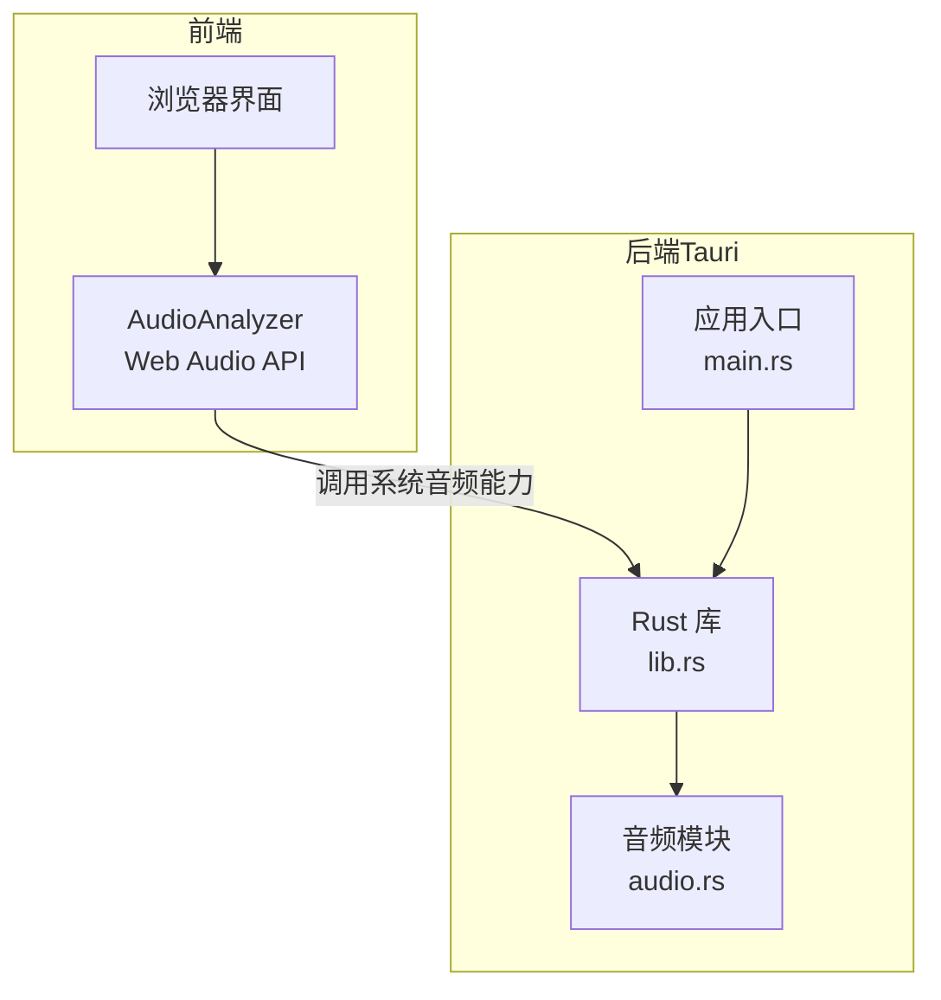
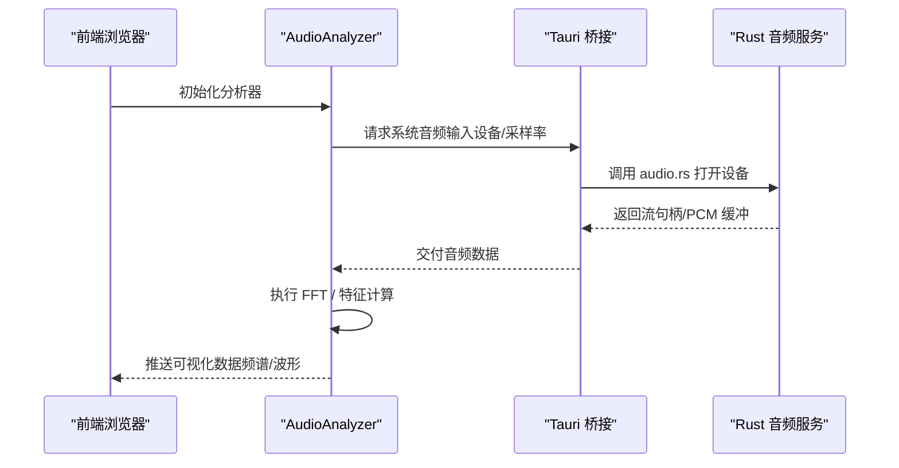
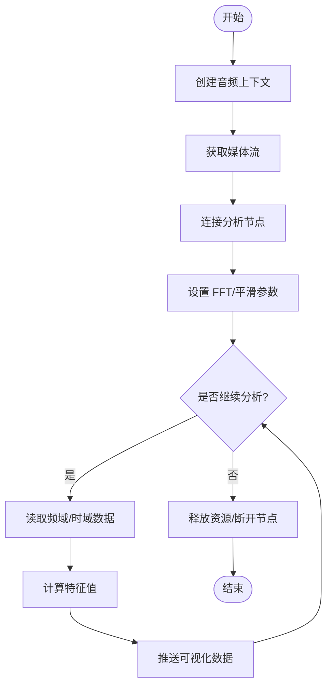
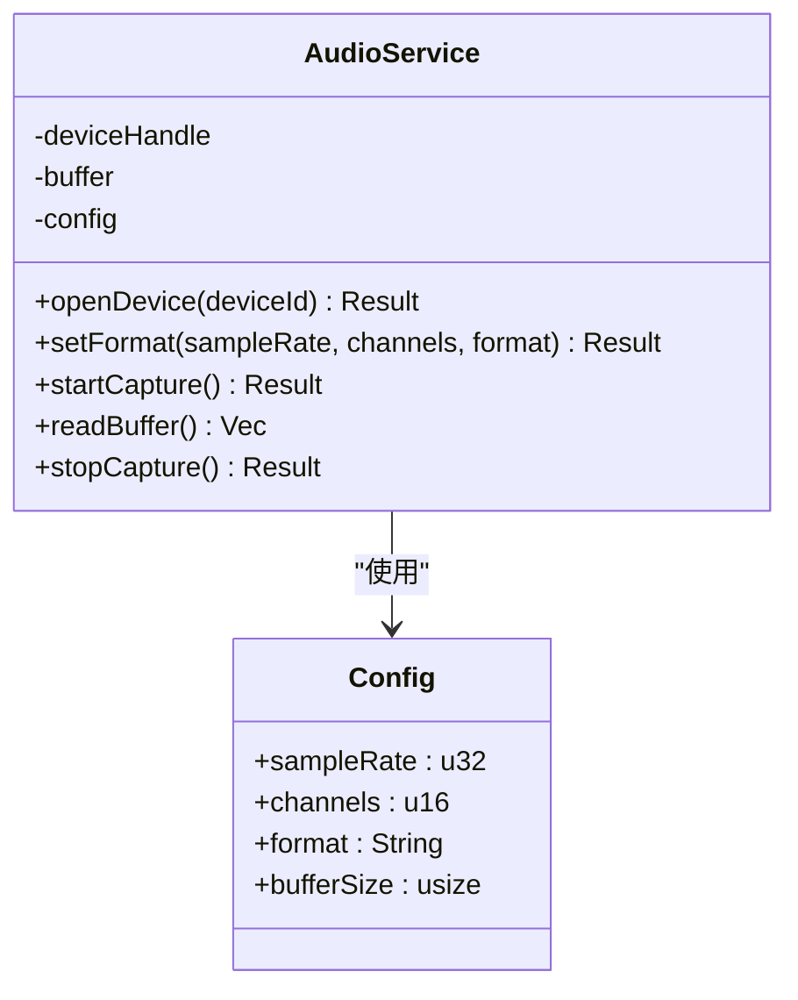
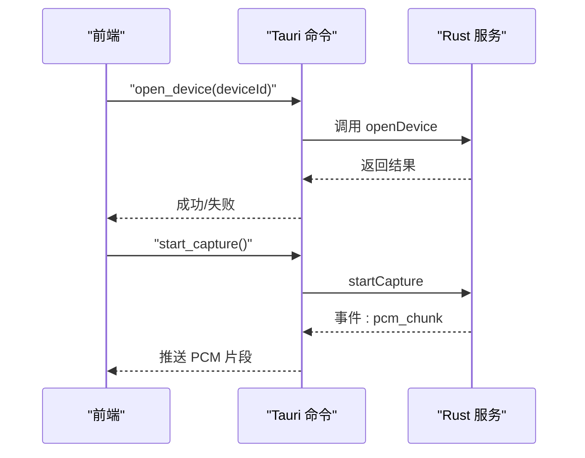

# 音频处理系统

<cite>
**本文引用的文件**
- [AudioAnalyzer.ts](file://src/audio/AudioAnalyzer.ts)
- [lib.rs](file://src-tauri/src/lib.rs)
- [audio.rs](file://src-tauri/src/audio.rs)
- [main.rs](file://src-tauri/src/main.rs)
- [capabilities/default.json](file://src-tauri/capabilities/default.json)
- [tauri.conf.json](file://src-tauri/tauri.conf.json)
- [package.json](file://package.json)
- [vite.config.ts](file://vite.config.ts)
- [index.html](file://index.html)
</cite>

## 目录
1. [简介](#简介)
2. [项目结构](#项目结构)
3. [核心组件](#核心组件)
4. [架构总览](#架构总览)
5. [详细组件分析](#详细组件分析)
6. [依赖关系分析](#依赖关系分析)
7. [性能考虑](#性能考虑)
8. [故障排查指南](#故障排查指南)
9. [结论](#结论)
10. [附录](#附录)

## 简介
本文件系统围绕实时音频分析与可视化构建，采用前后端协作模式：前端负责音频采集、频谱分析与可视化渲染；后端通过系统级能力完成跨平台音频输入与设备管理。系统支持多种常见音频格式与采样率配置，提供缓冲区管理与内存优化策略，并预留噪声抑制与语音识别集成接口。

## 项目结构
- 前端（Web）
  - src/audio/AudioAnalyzer.ts：封装 Web Audio API，实现音频输入捕获、FFT 频谱分析、特征提取与可视化数据输出。
  - index.html、vite.config.ts、package.json：构建与运行入口、开发服务器与依赖声明。
- 后端（Tauri/Rust）
  - src-tauri/src/audio.rs：系统级音频输入、设备枚举、采样率与通道配置、缓冲控制。
  - src-tauri/src/lib.rs：Rust 侧能力注册与对外暴露的音频命令。
  - src-tauri/src/main.rs：应用启动与 Tauri 初始化。
  - src-tauri/capabilities/default.json、src-tauri/tauri.conf.json：权限与运行时配置。

图表来源
- [AudioAnalyzer.ts](file://src/audio/AudioAnalyzer.ts)
- [lib.rs](file://src-tauri/src/lib.rs)
- [audio.rs](file://src-tauri/src/audio.rs)
- [main.rs](file://src-tauri/src/main.rs)

章节来源
- [AudioAnalyzer.ts](file://src/audio/AudioAnalyzer.ts)
- [lib.rs](file://src-tauri/src/lib.rs)
- [audio.rs](file://src-tauri/src/audio.rs)
- [main.rs](file://src-tauri/src/main.rs)
- [capabilities/default.json](file://src-tauri/capabilities/default.json)
- [tauri.conf.json](file://src-tauri/tauri.conf.json)
- [package.json](file://package.json)
- [vite.config.ts](file://vite.config.ts)
- [index.html](file://index.html)

## 核心组件
- 前端音频分析器（AudioAnalyzer）
  - 职责：创建 MediaStream，连接 AnalyserNode，执行 FFT，计算分贝、峰值、过零率等特征，输出可视化数据。
  - 关键流程：初始化上下文 → 获取麦克风或系统音频流 → 设置 FFT 大小与平滑参数 → 定时读取频域/时域数据 → 回调/事件驱动更新 UI。
- 后端音频服务（Rust）
  - 职责：枚举音频设备、选择输入源、配置采样率与通道数、管理缓冲大小与延迟、将原始 PCM 帧转发给前端或通过 IPC 暴露。
  - 关键流程：启动音频会话 → 打开设备 → 配置格式 → 循环读取缓冲 → 错误重试与资源释放。

章节来源
- [AudioAnalyzer.ts](file://src/audio/AudioAnalyzer.ts)
- [audio.rs](file://src-tauri/src/audio.rs)
- [lib.rs](file://src-tauri/src/lib.rs)

## 架构总览
系统采用“前端可视化 + 后端系统能力”的分层设计：
- 前端使用 Web Audio API 进行低延迟音频处理与可视化。
- 后端通过 Tauri 暴露 Rust 实现的音频能力，解决跨平台差异与系统级访问需求。
- 前后端通过 Tauri 命令/事件通信，确保数据在安全边界内传递。

图表来源
- [AudioAnalyzer.ts](file://src/audio/AudioAnalyzer.ts)
- [lib.rs](file://src-tauri/src/lib.rs)
- [audio.rs](file://src-tauri/src/audio.rs)

## 详细组件分析

### 前端音频分析器（AudioAnalyzer）
- 音频输入捕获
  - 使用媒体流 API 获取麦克风或系统音频流，建立音频上下文与节点链。
  - 支持动态切换输入源与权限校验。
- 频谱分析与特征提取
  - 通过分析节点执行 FFT，得到频域数据；同时可读取时域波形。
  - 计算常用特征：能量、峰值、基频估计、过零率、频谱质心等。
- 可视化数据输出
  - 以固定频率推送频域/时域数组至 UI，驱动 Canvas/WebGL 渲染。
- 缓冲区与内存管理
  - 合理设置 FFT 大小与平滑系数，平衡分辨率与延迟。
  - 复用 TypedArray，避免频繁分配；及时断开不用的节点与监听器。

图表来源
- [AudioAnalyzer.ts](file://src/audio/AudioAnalyzer.ts)

章节来源
- [AudioAnalyzer.ts](file://src/audio/AudioAnalyzer.ts)

### 后端音频服务（Rust）
- 设备枚举与选择
  - 列出可用输入设备，按名称/ID 选择目标设备。
- 格式与采样率配置
  - 配置采样率、通道数、位深与缓冲大小，适配不同平台。
- 缓冲管理与延迟控制
  - 维护环形缓冲，控制读/写指针，避免溢出与欠载。
- 错误处理与恢复
  - 捕获设备不可用、权限拒绝、格式不支持等异常，提供重试与降级策略。

图表来源
- [audio.rs](file://src-tauri/src/audio.rs)
- [lib.rs](file://src-tauri/src/lib.rs)

章节来源
- [audio.rs](file://src-tauri/src/audio.rs)
- [lib.rs](file://src-tauri/src/lib.rs)

### 前后端协作机制
- 命令与事件
  - 前端通过 Tauri 命令调用后端音频能力；后端通过事件向前端推送 PCM 片段或状态变更。
- 数据契约
  - 定义统一的音频帧格式（采样率、通道、位深），确保前后端解析一致。
- 生命周期管理
  - 前端负责 UI 生命周期；后端负责系统资源的生命周期，确保关闭时释放设备与缓冲。

图表来源
- [lib.rs](file://src-tauri/src/lib.rs)
- [audio.rs](file://src-tauri/src/audio.rs)

章节来源
- [lib.rs](file://src-tauri/src/lib.rs)
- [audio.rs](file://src-tauri/src/audio.rs)

## 依赖关系分析
- 前端依赖
  - Web Audio API：用于音频上下文、媒体流与分析节点。
  - 构建工具：Vite 提供开发与打包能力。
- 后端依赖
  - Tauri：桥接前端与 Rust 能力。
  - 音频库：跨平台音频 I/O（如 rodio/portaudio 等，具体取决于实现）。
- 权限与配置
  - capabilities/default.json：声明所需权限。
  - tauri.conf.json：应用元数据与安全策略。

图表来源
- [capabilities/default.json](file://src-tauri/capabilities/default.json)
- [tauri.conf.json](file://src-tauri/tauri.conf.json)
- [lib.rs](file://src-tauri/src/lib.rs)
- [audio.rs](file://src-tauri/src/audio.rs)

章节来源
- [capabilities/default.json](file://src-tauri/capabilities/default.json)
- [tauri.conf.json](file://src-tauri/tauri.conf.json)
- [lib.rs](file://src-tauri/src/lib.rs)
- [audio.rs](file://src-tauri/src/audio.rs)

## 性能考虑
- 前端优化
  - 选择合适的 FFT 大小与平滑系数，平衡分辨率与延迟。
  - 使用 TypedArray 缓存频域/时域数据，减少 GC 压力。
  - 按需启用/禁用分析，避免空闲时持续计算。
  - 使用 requestAnimationFrame 同步渲染，降低掉帧风险。
- 后端优化
  - 调整缓冲大小以降低延迟与卡顿的权衡。
  - 批量传输 PCM 片段，减少 IPC 开销。
  - 对设备枚举与格式协商做缓存，避免重复初始化。
- 内存管理
  - 及时释放媒体流、断开节点、移除事件监听。
  - 在后端使用 RAII 管理音频设备与缓冲，确保异常路径也能释放资源。

[本节为通用性能建议，无需特定文件引用]

## 故障排查指南
- 常见问题
  - 无法获取麦克风或系统音频：检查权限与默认输入设备。
  - 音频断续或爆音：增大缓冲大小、降低采样率或减少 FFT 复杂度。
  - 前后端格式不一致：核对采样率、通道数与位深配置。
- 调试方法
  - 前端：使用浏览器开发者工具的 Performance 面板观察帧率与 CPU 占用；打印频谱/时域数据范围。
  - 后端：查看 Tauri 日志与 Rust 侧错误码；增加设备枚举与格式协商的日志。
  - 联调：逐步缩小问题范围，先验证设备枚举，再验证 PCM 传输，最后验证前端解析与渲染。

章节来源
- [AudioAnalyzer.ts](file://src/audio/AudioAnalyzer.ts)
- [audio.rs](file://src-tauri/src/audio.rs)
- [lib.rs](file://src-tauri/src/lib.rs)

## 结论
本系统以前端 Web Audio API 为核心实现低延迟音频分析与可视化，结合后端 Tauri/Rust 的系统级音频能力，形成稳定可靠的跨平台解决方案。通过合理的缓冲区管理、格式配置与性能优化策略，可在保证实时性的同时提升用户体验。后续可扩展噪声抑制与语音识别模块，进一步增强系统能力。

[本节为总结性内容，无需特定文件引用]

## 附录
- 音频格式与采样率
  - 常见格式：PCM、WAV 容器；采样率建议 44.1kHz/48kHz；单声道/立体声根据场景选择。
- 缓冲区管理
  - 前端：FFT 大小与平滑系数影响分辨率与延迟；建议使用幂次大小（如 256/512/1024）。
  - 后端：缓冲大小需兼顾延迟与稳定性，过大导致延迟，过小易卡顿。
- 示例代码指引（仅路径）
  - 音频效果处理：参考前端分析节点链路与增益/滤波节点组合。
  - 噪声抑制：在前端加入噪声抑制处理器或在后端预处理降噪。
  - 语音识别集成：将前端提取的特征或后端 PCM 片段发送至识别服务。

[本节为概念性说明，无需特定文件引用]