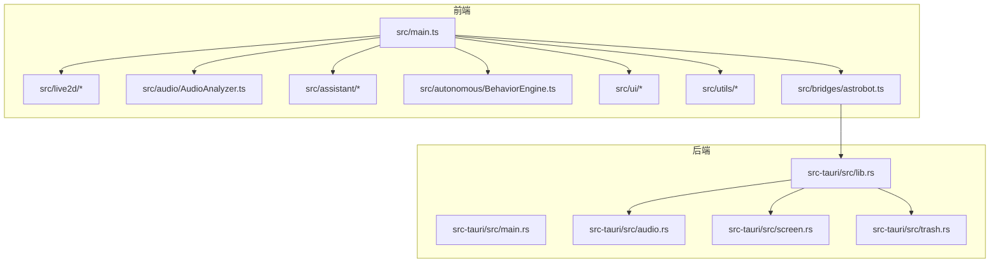
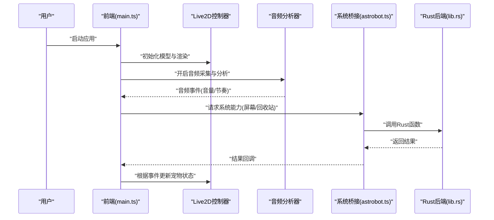
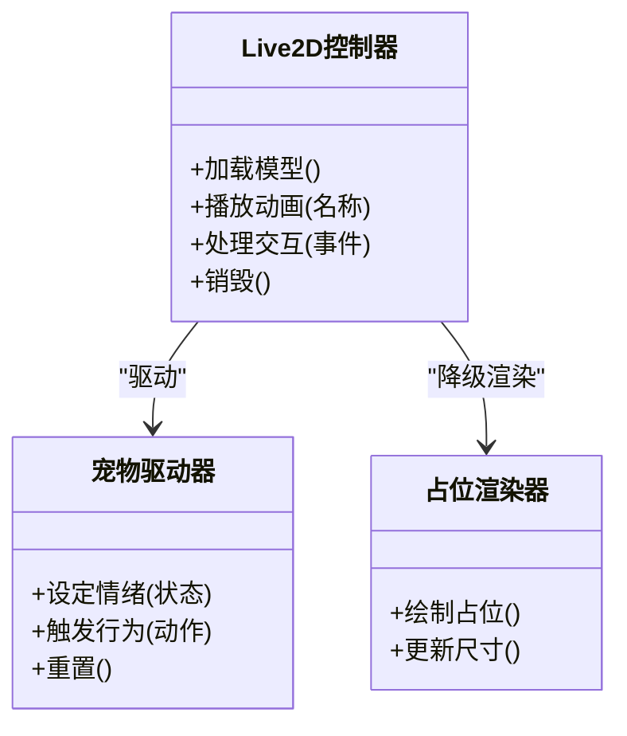
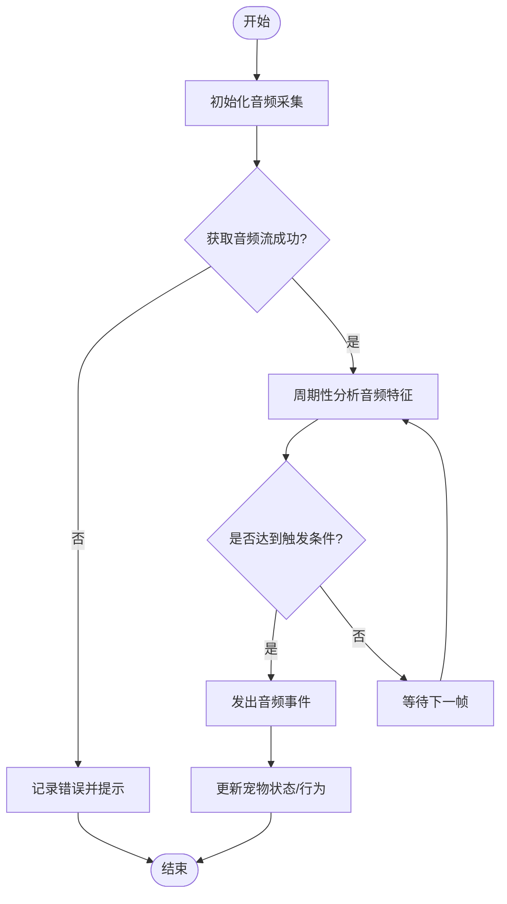
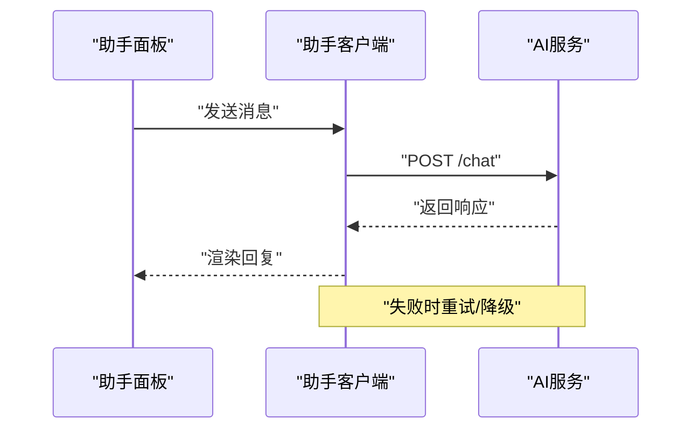
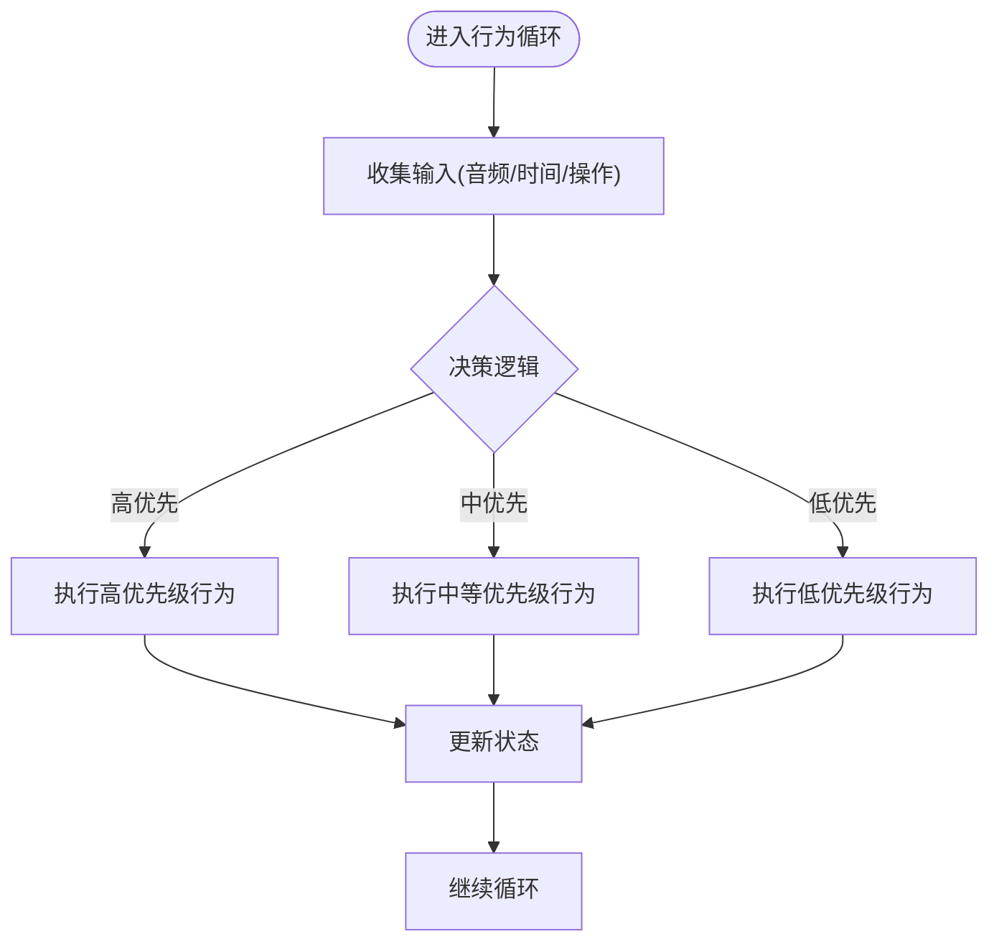
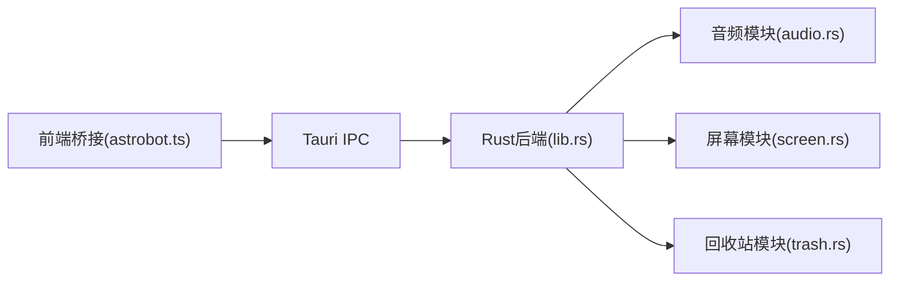
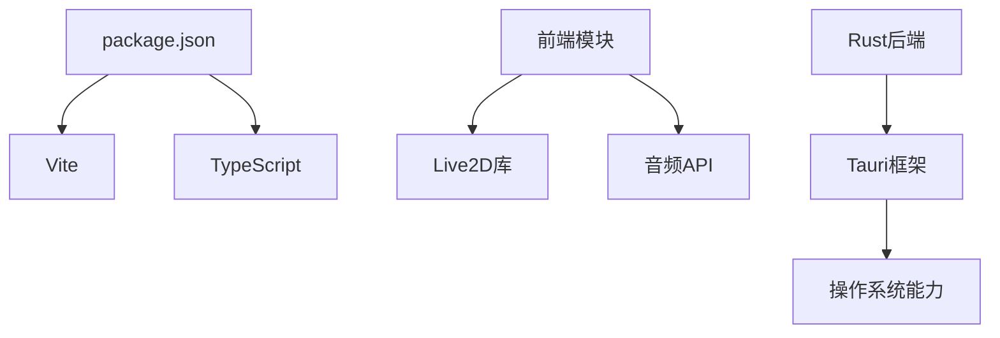

# 项目概述

<cite>
**本文引用的文件**
- [README.md](file://README.md)
- [package.json](file://package.json)
- [vite.config.ts](file://vite.config.ts)
- [tsconfig.json](file://tsconfig.json)
- [index.html](file://index.html)
- [src/main.ts](file://src/main.ts)
- [src/live2d/Live2DController.ts](file://src/live2d/Live2DController.ts)
- [src/live2d/PetDriver.ts](file://src/live2d/PetDriver.ts)
- [src/live2d/PlaceholderRenderer.ts](file://src/live2d/PlaceholderRenderer.ts)
- [src/live2d/l2d-stub.ts](file://src/live2d/l2d-stub.ts)
- [src/audio/AudioAnalyzer.ts](file://src/audio/AudioAnalyzer.ts)
- [src/assistant/AssistantClient.ts](file://src/assistant/AssistantClient.ts)
- [src/assistant/AssistantPanel.ts](file://src/assistant/AssistantPanel.ts)
- [src/autonomous/BehaviorEngine.ts](file://src/autonomous/BehaviorEngine.ts)
- [src/ui/ContextMenu.ts](file://src/ui/ContextMenu.ts)
- [src/ui/Toast.ts](file://src/ui/Toast.ts)
- [src/utils/math.ts](file://src/utils/math.ts)
- [src/utils/settings.ts](file://src/utils/settings.ts)
- [src/bridges/astrobot.ts](file://src/bridges/astrobot.ts)
- [src-tauri/src/lib.rs](file://src-tauri/src/lib.rs)
- [src-tauri/src/main.rs](file://src-tauri/src/main.rs)
- [src-tauri/src/audio.rs](file://src-tauri/src/audio.rs)
- [src-tauri/src/screen.rs](file://src-tauri/src/screen.rs)
- [src-tauri/src/trash.rs](file://src-tauri/src/trash.rs)
- [src-tauri/Cargo.toml](file://src-tauri/Cargo.toml)
- [src-tauri/tauri.conf.json](file://src-tauri/tauri.conf.json)
</cite>

## 目录
1. [简介](#简介)
2. [项目结构](#项目结构)
3. [核心组件](#核心组件)
4. [架构总览](#架构总览)
5. [详细组件分析](#详细组件分析)
6. [依赖关系分析](#依赖关系分析)
7. [性能考虑](#性能考虑)
8. [故障排查指南](#故障排查指南)
9. [结论](#结论)
10. [附录：快速开始](#附录快速开始)

## 简介
本项目是一个基于 Tauri 框架构建的跨平台桌面宠物应用。前端采用 TypeScript + Vite，后端使用 Rust；通过 Live2D 渲染引擎驱动虚拟宠物，结合 AI 助手与音频分析能力，提供沉浸式桌面交互体验。整体设计强调模块化、可扩展性与跨平台一致性，适合初学者上手，同时为有经验的开发者提供清晰的扩展点与集成接口。

## 项目结构
项目采用前后端分离的目录组织方式：
- 前端（TypeScript）：位于 src 目录，包含 UI、Live2D 控制、音频分析、AI 助手、行为引擎等模块。
- 后端（Rust）：位于 src-tauri 目录，提供系统级能力（如音频、屏幕、回收站等）并通过 Tauri 暴露给前端。
- 构建与配置：Vite 构建脚本、TypeScript 配置、Tauri 配置与能力声明。
- 资源：public/models 存放模型清单等资源。

图表来源
- [src/main.ts:1-200](file://src/main.ts#L1-L200)
- [src-tauri/src/lib.rs:1-200](file://src-tauri/src/lib.rs#L1-L200)

章节来源
- [package.json:1-200](file://package.json#L1-L200)
- [vite.config.ts:1-200](file://vite.config.ts#L1-L200)
- [tsconfig.json:1-200](file://tsconfig.json#L1-L200)
- [index.html:1-200](file://index.html#L1-L200)
- [src-tauri/tauri.conf.json:1-200](file://src-tauri/tauri.conf.json#L1-L200)

## 核心组件
- Live2D 控制器：负责加载模型、驱动动画、处理交互事件，并提供占位渲染以兼容无模型场景。
- 音频分析器：采集并分析音频流，用于触发宠物的反应或状态切换。
- AI 助手客户端与面板：封装与 AI 服务的通信，提供对话界面与消息管理。
- 自主行为引擎：根据环境输入（如时间、音频、用户操作）驱动宠物行为。
- 系统桥接：通过 Tauri 调用 Rust 后端能力（音频、屏幕、回收站等）。
- UI 组件：上下文菜单、提示通知等通用交互元素。
- 工具库：数学计算、设置管理等基础能力。

章节来源
- [src/live2d/Live2DController.ts:1-200](file://src/live2d/Live2DController.ts#L1-L200)
- [src/live2d/PetDriver.ts:1-200](file://src/live2d/PetDriver.ts#L1-L200)
- [src/live2d/PlaceholderRenderer.ts:1-200](file://src/live2d/PlaceholderRenderer.ts#L1-L200)
- [src/audio/AudioAnalyzer.ts:1-200](file://src/audio/AudioAnalyzer.ts#L1-L200)
- [src/assistant/AssistantClient.ts:1-200](file://src/assistant/AssistantClient.ts#L1-L200)
- [src/assistant/AssistantPanel.ts:1-200](file://src/assistant/AssistantPanel.ts#L1-L200)
- [src/autonomous/BehaviorEngine.ts:1-200](file://src/autonomous/BehaviorEngine.ts#L1-L200)
- [src/ui/ContextMenu.ts:1-200](file://src/ui/ContextMenu.ts#L1-L200)
- [src/ui/Toast.ts:1-200](file://src/ui/Toast.ts#L1-L200)
- [src/utils/math.ts:1-200](file://src/utils/math.ts#L1-L200)
- [src/utils/settings.ts:1-200](file://src/utils/settings.ts#L1-L200)
- [src/bridges/astrobot.ts:1-200](file://src/bridges/astrobot.ts#L1-L200)
- [src-tauri/src/audio.rs:1-200](file://src-tauri/src/audio.rs#L1-L200)
- [src-tauri/src/screen.rs:1-200](file://src-tauri/src/screen.rs#L1-L200)
- [src-tauri/src/trash.rs:1-200](file://src-tauri/src/trash.rs#L1-L200)

## 架构总览
应用采用“前端渲染 + 后端能力”的分层架构：
- 前端负责 UI 渲染、Live2D 模型驱动、音频分析与 AI 交互。
- 后端通过 Tauri 暴露系统级 API，供前端桥接调用。
- 构建流程由 Vite 管理，TypeScript 编译输出到静态资源，Tauri 打包为桌面可执行文件。

图表来源
- [src/main.ts:1-200](file://src/main.ts#L1-L200)
- [src/live2d/Live2DController.ts:1-200](file://src/live2d/Live2DController.ts#L1-L200)
- [src/audio/AudioAnalyzer.ts:1-200](file://src/audio/AudioAnalyzer.ts#L1-L200)
- [src/bridges/astrobot.ts:1-200](file://src/bridges/astrobot.ts#L1-L200)
- [src-tauri/src/lib.rs:1-200](file://src-tauri/src/lib.rs#L1-L200)

## 详细组件分析

### Live2D 渲染与控制
- 职责：加载模型、驱动表情与动作、处理点击/拖拽等交互，提供占位渲染以确保无模型时的可用性。
- 关键类/模块：
  - Live2D 控制器：统一入口，协调模型生命周期与事件分发。
  - 宠物驱动器：将高层意图（如“开心”、“思考”）映射为具体动画序列。
  - 占位渲染器：在模型不可用时显示占位图形，保证 UI 稳定。
  - 兼容桩：在缺少 Live2D 运行时环境下提供空实现，便于开发与测试。

图表来源
- [src/live2d/Live2DController.ts:1-200](file://src/live2d/Live2DController.ts#L1-L200)
- [src/live2d/PetDriver.ts:1-200](file://src/live2d/PetDriver.ts#L1-L200)
- [src/live2d/PlaceholderRenderer.ts:1-200](file://src/live2d/PlaceholderRenderer.ts#L1-L200)
- [src/live2d/l2d-stub.ts:1-200](file://src/live2d/l2d-stub.ts#L1-L200)

章节来源
- [src/live2d/Live2DController.ts:1-200](file://src/live2d/Live2DController.ts#L1-L200)
- [src/live2d/PetDriver.ts:1-200](file://src/live2d/PetDriver.ts#L1-L200)
- [src/live2d/PlaceholderRenderer.ts:1-200](file://src/live2d/PlaceholderRenderer.ts#L1-L200)
- [src/live2d/l2d-stub.ts:1-200](file://src/live2d/l2d-stub.ts#L1-L200)

### 音频分析
- 职责：采集系统或麦克风音频流，提取音量、节奏等特征，向行为引擎与 Live2D 控制器发送事件。
- 关键点：
  - 采样频率与缓冲大小影响实时性与 CPU 占用。
  - 阈值与平滑算法避免抖动导致的误触发。
  - 错误处理需覆盖权限拒绝、设备不可用等情况。

图表来源
- [src/audio/AudioAnalyzer.ts:1-200](file://src/audio/AudioAnalyzer.ts#L1-L200)

章节来源
- [src/audio/AudioAnalyzer.ts:1-200](file://src/audio/AudioAnalyzer.ts#L1-L200)
- [src-tauri/src/audio.rs:1-200](file://src-tauri/src/audio.rs#L1-L200)

### AI 助手
- 职责：封装与 AI 服务通信，管理会话与消息，提供聊天面板与快捷操作。
- 关键点：
  - 连接策略：重连、超时与错误恢复。
  - 消息格式：结构化消息体，支持文本、富媒体与指令。
  - 安全：敏感信息脱敏与传输加密。

图表来源
- [src/assistant/AssistantPanel.ts:1-200](file://src/assistant/AssistantPanel.ts#L1-L200)
- [src/assistant/AssistantClient.ts:1-200](file://src/assistant/AssistantClient.ts#L1-L200)

章节来源
- [src/assistant/AssistantClient.ts:1-200](file://src/assistant/AssistantClient.ts#L1-L200)
- [src/assistant/AssistantPanel.ts:1-200](file://src/assistant/AssistantPanel.ts#L1-L200)

### 自主行为引擎
- 职责：综合音频、时间、用户操作等输入，决定宠物的行为序列与状态机转换。
- 关键点：
  - 状态机：清晰定义状态与转移条件。
  - 优先级：高优先级事件（如用户点击）打断低优先级行为。
  - 可配置：通过设置调整行为权重与灵敏度。

图表来源
- [src/autonomous/BehaviorEngine.ts:1-200](file://src/autonomous/BehaviorEngine.ts#L1-L200)

章节来源
- [src/autonomous/BehaviorEngine.ts:1-200](file://src/autonomous/BehaviorEngine.ts#L1-L200)

### 系统桥接与后端能力
- 职责：通过 Tauri 将前端调用转发至 Rust 后端，访问系统能力（音频、屏幕、回收站等）。
- 关键点：
  - 能力声明：在 Tauri 配置中声明可用能力与权限。
  - 错误传播：将后端错误转换为前端可处理的异常。
  - 性能：避免频繁跨进程调用，批量处理与缓存策略。

图表来源
- [src/bridges/astrobot.ts:1-200](file://src/bridges/astrobot.ts#L1-L200)
- [src-tauri/src/lib.rs:1-200](file://src-tauri/src/lib.rs#L1-L200)
- [src-tauri/src/audio.rs:1-200](file://src-tauri/src/audio.rs#L1-L200)
- [src-tauri/src/screen.rs:1-200](file://src-tauri/src/screen.rs#L1-L200)
- [src-tauri/src/trash.rs:1-200](file://src-tauri/src/trash.rs#L1-L200)

章节来源
- [src/bridges/astrobot.ts:1-200](file://src/bridges/astrobot.ts#L1-L200)
- [src-tauri/src/lib.rs:1-200](file://src-tauri/src/lib.rs#L1-L200)
- [src-tauri/src/audio.rs:1-200](file://src-tauri/src/audio.rs#L1-L200)
- [src-tauri/src/screen.rs:1-200](file://src-tauri/src/screen.rs#L1-L200)
- [src-tauri/src/trash.rs:1-200](file://src-tauri/src/trash.rs#L1-L200)
- [src-tauri/tauri.conf.json:1-200](file://src-tauri/tauri.conf.json#L1-L200)

## 依赖关系分析
- 前端依赖：
  - Vite：构建与开发服务器。
  - TypeScript：类型系统与编译。
  - Live2D 相关库：模型加载与渲染（含兼容桩）。
  - 音频 API：浏览器或系统音频采集。
- 后端依赖：
  - Tauri：跨平台桌面框架与 IPC。
  - Rust 生态：音频、屏幕、文件系统等操作。
- 构建产物：
  - 静态资源（HTML/CSS/JS）由 Vite 生成。
  - Tauri 打包为各平台可执行文件。

图表来源
- [package.json:1-200](file://package.json#L1-L200)
- [vite.config.ts:1-200](file://vite.config.ts#L1-L200)
- [tsconfig.json:1-200](file://tsconfig.json#L1-L200)
- [src-tauri/Cargo.toml:1-200](file://src-tauri/Cargo.toml#L1-L200)

章节来源
- [package.json:1-200](file://package.json#L1-L200)
- [vite.config.ts:1-200](file://vite.config.ts#L1-L200)
- [tsconfig.json:1-200](file://tsconfig.json#L1-L200)
- [src-tauri/Cargo.toml:1-200](file://src-tauri/Cargo.toml#L1-L200)

## 性能考虑
- 渲染优化：
  - 按需加载 Live2D 模型，避免首屏过大。
  - 使用占位渲染降低初始开销。
- 音频处理：
  - 合理设置采样率与缓冲区，平衡实时性与 CPU 占用。
  - 对音频特征进行平滑与阈值过滤，减少抖动。
- IPC 通信：
  - 合并多次系统调用，减少前后端往返。
  - 使用事件驱动而非轮询，降低主线程压力。
- 内存管理：
  - 及时释放不再使用的模型与音频资源。
  - 避免长生命周期闭包导致引用泄漏。

[本节为通用指导，不直接分析具体文件]

## 故障排查指南
- 常见问题：
  - 音频权限被拒：检查系统设置与浏览器授权，确认默认设备可用。
  - Live2D 模型加载失败：校验模型路径与格式，启用占位渲染确保 UI 正常。
  - AI 助手连接失败：检查网络与服务端状态，实现重试与降级策略。
  - 系统能力调用报错：查看 Tauri 能力声明与权限配置，核对后端实现。
- 调试建议：
  - 在前端控制台打印关键事件与状态变化。
  - 在后端日志中记录错误堆栈与参数。
  - 使用 Tauri 开发模式逐步定位问题。

章节来源
- [src/audio/AudioAnalyzer.ts:1-200](file://src/audio/AudioAnalyzer.ts#L1-L200)
- [src/live2d/Live2DController.ts:1-200](file://src/live2d/Live2DController.ts#L1-L200)
- [src/assistant/AssistantClient.ts:1-200](file://src/assistant/AssistantClient.ts#L1-L200)
- [src-tauri/src/lib.rs:1-200](file://src-tauri/src/lib.rs#L1-L200)

## 结论
本项目以 Tauri 为核心，整合 Live2D、AI 助手与音频分析，构建了功能丰富且易于扩展的桌面宠物应用。通过清晰的前后端分层与模块化设计，既满足初学者的学习曲线，也为高级用户提供稳定的扩展点。建议在后续迭代中持续优化性能与用户体验，完善错误处理与监控机制。

[本节为总结性内容，不直接分析具体文件]

## 附录：快速开始
- 环境要求：
  - Node.js 与 npm/yarn（用于前端构建）。
  - Rust 工具链（用于 Tauri 后端构建）。
  - 支持的操作系统（Windows/macOS/Linux）。
- 安装依赖：
  - 在项目根目录执行包管理器安装命令。
  - 安装 Tauri CLI 与目标平台依赖。
- 运行与构建：
  - 开发模式：启动前端开发服务器与 Tauri 窗口。
  - 生产构建：打包为各平台可执行文件。
- 基本使用示例：
  - 启动后加载默认模型，观察宠物行为。
  - 允许音频权限，体验声音驱动的互动。
  - 打开 AI 助手面板进行对话。

章节来源
- [README.md:1-200](file://README.md#L1-L200)
- [package.json:1-200](file://package.json#L1-L200)
- [vite.config.ts:1-200](file://vite.config.ts#L1-L200)
- [src-tauri/tauri.conf.json:1-200](file://src-tauri/tauri.conf.json#L1-L200)
- [src-tauri/Cargo.toml:1-200](file://src-tauri/Cargo.toml#L1-L200)