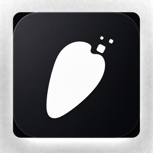

<p align="center">
  
</p>

<h1 align="center">🥕 Live2D Pet</h1>

<p align="center">一个可高度自定义的 AI 桌面桌宠</p>

> 把你喜欢的角色、AI 模型、人格与桌面能力组合成**属于自己的桌面伙伴**。

<p align="center">
  
  
</p>

<p align="center">
  
</p>

---

## ✨ 项目简介

Live2D Pet 是一个运行在 Windows 桌面上的 AI 桌宠框架：一个会漫游、会躲鼠标、会跟着你视线转头的动态角色，内置一个可以聊天、调用系统能力、记住你偏好的 AI 小助手。

它和普通桌宠最大的区别是——**高度自定义是核心设计目标之一**：

- 角色可以是**你自己的**：拖入一张分层 PSD，立刻生成一个 2.5D 动态角色；标准 Live2D 模型同样支持。
- AI 可以是**你自己的**：不绑定任何一家 AI 服务，内置 DeepSeek，也支持任何 OpenAI Compatible API。
- 人格可以是**你自己的**：在设置里写一段人设，桌宠就拥有了性格、说话方式与背景故事。
- 行为可以是**你自己的**：漫游、待机、鼠标追踪、活动频率，全部可调，开发者可以直接扩展行为系统。
- 工具可以是**你自己的**：AI 可以打开应用、执行受控命令、记住你的偏好，开发者可以继续添加新 Tool。

它不是"一个做好的桌宠"，而是一个**可以变成"你的桌宠"的框架**。

---

## 🌟 核心特色

- 🎭 **动态角色**：PSD 一键生成 2.5D 角色（自动眨眼 / 发丝物理 / 表情），或使用标准 Live2D 模型
- 👀 **鼠标视线追踪**：模型会看向你的鼠标位置，带死区与平滑，不会疯狂甩头
- 🐾 **自主行为**：漫游、躲避鼠标、逗猫棒模式、三档活动频率——桌宠不是一张固定 GIF
- 🧠 **AI 对话**：流式输出，支持自定义人格，主动问候（识别你在做什么）
- 🧰 **Tool Calling**：打开软件、打开网页、执行受控 Shell 命令、长期记忆
- 💾 **长期记忆**：AI 自动归档你的偏好，下次聊天还记得
- 🎵 **跟随音乐**：WASAPI 回环捕获系统声音，驱动身体律动（当前标注为未完善）
- 🖥 **桌面能力**：拖拽、文件扔进回收站、待机沉入屏幕边缘、托盘、开机自启、检查更新、内置反馈
- 🎨 **高度自定义**：角色 / AI / 人格 / 行为 / 工具 / UI 均可自定义（见下章）

---

## 🎨 高度可自定义

> 这个项目最重要的设计目标：**不是只能使用默认桌宠，而是可以把它变成你自己的桌宠。**

### 🎭 自定义角色

当前支持通过**替换资源 / 导入**进行自定义，无需改代码：

- **拖入 PSD 即换角色**：把分层 PSD 文件直接拖到桌宠身上，自动装配并即时换皮（持久化存储）
- **模型设置面板**：右键 → 模型设置，可导入 PSD、在内置模型与已导入模型之间切换
- **打包默认模型**：把 PSD 放入 `public/models/` 并编辑 `public/models/manifest.json`，重新构建即可让默认角色变成你的角色
- **标准 Live2D**：支持 `model3.json` 模型（需放入 Cubism Core runtime）
- **PSD 图层命名规范**：`face` / `eyewhite` / `irides` / `eyelash` / `eye_close` / `eyebrow` / `mouth_open` / `mouth_close` / `front hair` / `back hair` 等图层名自动识别为五官、表情与发丝物理；不符合规范的图层也会按位置自动归类
  > **注意**：PSD 需使用**平铺（扁平）图层结构**，当前不支持图层组 / 文件夹，放在文件夹内的图层会被忽略。

从默认角色到自己的 OC、动漫角色、游戏角色，都可以通过资源替换实现。

### 🧠 自定义 AI 模型

项目**不绑定某一家 AI 服务**：

- 内置 **DeepSeek**（`api.deepseek.com`，默认模型 `deepseek-chat`）
- 支持 **Custom / OpenAI Compatible API**：在小助手设置中切换到"自定义"，填入 API 端点、API Key 与模型名即可

```
只要服务提供 OpenAI Compatible API，即可尝试接入（具体兼容性取决于接口实现）。
```

- API Key 经 Windows DPAPI 加密存储于应用数据目录，不明文落盘

### 💬 自定义 AI 人格

换模型只是"换大脑"，修改人格 Prompt 才是"换角色"。

右键 → 小助手设置 →「人格设定」，可以定义角色的：

- 名字、性格、说话方式
- 与你的关系、回复习惯
- 背景故事、主动问候的风格

系统 Prompt 由前端 `src/assistant/AssistantClient.ts` 维护，开发者可以进一步调整工具使用规则与人格注入逻辑。

### 💾 自定义长期记忆

- AI 在对话中发现你的重要信息（名字、作息、喜好）时，会自动调用 `remember` 工具归档；你也可以直接说「记住 xx」
- 记忆保存在本地（浏览器 localStorage，上限 50 条），后续对话会重新注入给 AI
- 你可以按自己的角色设定设计不同的记忆用法——它是可编程的上下文，而不是"无限记忆"

### 🕹 自定义桌宠行为

桌宠由 `src/autonomous/BehaviorEngine.ts` 行为系统驱动，不是固定动画：

- **活动频率三档**：低（几乎静止）/ 中（适度活动）/ 高（明显活跃），右键菜单一键切换
- **待机模式**：沉到就近屏幕边缘（上半倒挂 180°，下半贴底），只露头顶和眼睛，完全静止；待机中拖动沿边缘滑动
- **逗猫棒模式**：开启后模型追着鼠标跑
- **鼠标视线追踪**：参数（跟踪范围、死区、平滑系数）集中在 BehaviorEngine，可直接调
- **主动问候频率**：默认每 20 分钟一次，可改 `main.ts` 中的定时器

开发者可以直接修改行为引擎：移动概率、触发条件、状态机、特定状态下的动作。

### 🧰 自定义工具能力

AI 不仅能聊天，还可以通过 Tool Calling 与电脑进行一定程度的交互。当前内置：

| 工具 | 能力 |
|---|---|
| `launch_application` | 按应用名打开本机软件（别名 + 开始菜单快捷方式解析 + ShellExecute） |
| `run_shell` | 执行受控 cmd 命令（危险命令黑名单 + 链式拦截 + 用户确认） |
| `remember` | 归档用户信息到长期记忆 |

开发者可以继续增加自己的 Tool，例如 `open_url`（更新下载已用）、`weather`、`calendar`、`music`、`smart_home` 等——均为**可扩展方向**，当前未内置。

### 🔊 自定义语音

> 说明：项目当前**没有 TTS 语音输出**。音频能力是"跟随音乐"（WASAPI 回环分析系统输出驱动动画）。

语音输出可通过代码 / 配置扩展（在 Assistant 流式回复后接入任意 TTS 服务即可），不属于当前开箱即用功能。

### 🖼 自定义 UI

桌宠本体之外的界面——对话框气泡、小助手输入框、设置面板、右键菜单、托盘菜单、Toast 提示——均由前端 Vite + TypeScript 实现，样式集中在 `src/style.css`（玻璃拟态风格）。

前端不被传统桌面 GUI 框架限制，颜色、字体、布局、图标（`src-tauri/icons/`）都可以直接改。

---

## 🤖 AI 小助手

小助手不是单纯的 ChatBot——它**存在于桌面环境中**，可以与桌宠行为和部分系统能力产生联动：

- **流式对话**：点击桌宠弹出输入框，回复逐字输出
- **Tool Calling**：你说「打开网易云」，它会调用 `launch_application` 解析并启动应用；你说「记住我每周三健身」，它会调用 `remember` 归档
- **软件启动**：按应用名解析并启动（别名 / 开始菜单 / 系统应用），不依赖 AI 猜路径
- **Shell 能力**：仅在必要时调用 `run_shell`，执行前弹出确认气泡（可勾选「免确认 shell」），危险命令与链式命令一律拦截
- **长期记忆**：自动归档与重新注入
- **主动问候**：每 20 分钟识别当前前台窗口，结合你的日程自然打招呼（可关闭；注意该功能会把窗口标题发送给 AI，隐私敏感可关闭小助手模式）
- **人格设定**：见上文「自定义 AI 人格」

---

## 🐾 桌宠行为系统

桌宠不会一直站着不动。`BehaviorEngine` 驱动它：

- 自主漫游（活动频率三档控制）
- 鼠标靠近会躲开 / 逗猫棒模式下追着鼠标跑
- 视线始终跟随鼠标（以模型自身位置为基准，带死区与平滑）
- 待机模式下沉到屏幕边缘
- 拖拽后原地休息片刻再继续活动

普通用户通过右键菜单即可调节；开发者可以直接扩展行为状态机，让它拥有更复杂的性格化行为。

---

## 🛠 技术栈

| 模块 | 技术 |
|---|---|
| 桌面框架 | Tauri 2 |
| 后端 | Rust（Windows API / WASAPI / DPAPI / COM） |
| 前端 | Vite + TypeScript |
| 渲染 | Pixi.js |
| 角色 | Live2D / PSD 动态角色（Anime2.5DRig） |
| AI | OpenAI Compatible API（内置 DeepSeek，支持自定义端点） |
| 系统能力 | Windows API（窗口 / 托盘 / 自启 / 回收站 / SMTP 反馈） |

---

## 📦 下载与使用

### 普通用户（不写代码）

推荐直接前往 **[Releases 页面](https://github.com/Wumiu/pet/releases)** 下载最新的 `Live2D-Pet_*_x64.zip`：

1. 解压并运行安装包
2. 右键桌宠 → 小助手设置 → 填入你的 AI API Key（可选，不用 AI 也可以当普通桌宠）
3. 使用

无需安装任何开发环境。

### 开发者（想改代码 / 二次开发）

```bash
git clone https://github.com/Wumiu/pet.git
cd pet
npm install
npm run tauri dev
```

---

## 🚀 快速开始（开发环境）

**环境要求**：

- Windows 10/11
- Node.js 18+
- Rust（stable）
- WebView2 Runtime（Windows 11 自带，Win10 通常已内置）

**命令**：

```bash
npm install          # 安装前端依赖
npm run tauri dev    # 开发模式（热更新）
npm run tauri build  # 打包安装程序
```

> 首次启动会加载 `public/models/manifest.json` 配置的默认模型；`node_modules` 缺失时先执行 `npm install`。

---

## ⚙️ AI 配置

右键桌宠 → **小助手设置**：

| 项 | 说明 |
|---|---|
| 提供商 | DeepSeek（内置） / 自定义（OpenAI Compatible） |
| API Key | 填写你的 Key，DPAPI 加密存储，不明文落盘 |
| API 端点 | 自定义模式：填写 Base URL，如 `https://your-api.example.com/v1` |
| 模型名 | 自定义模式：填写模型名；可点「自动获取模型」拉取端点支持的模型列表 |
| 人格设定 | 定义角色性格与说话方式 |

**接入自定义 API 示例**：

```
提供商：自定义
API 端点：https://your-api.example.com/v1
API Key：YOUR_API_KEY
模型名：your-model-name
```

兼容性取决于你的端点对 OpenAI Chat Completions 接口的实现程度。

---

## 🧩 想做成自己的桌宠？

你可以从下面几个方向开始：

1. **替换角色资源** — 准备一张分层 PSD，拖到桌宠身上；或放入 `public/models/` 作为默认角色
2. **修改 AI 人格 Prompt** — 小助手设置里写人设，或改 `src/assistant/AssistantClient.ts` 的系统 Prompt
3. **接入自己的模型 API** — 任意 OpenAI Compatible 端点，无需改代码
4. **调整行为参数** — 改 `src/autonomous/BehaviorEngine.ts`（追踪范围 / 死区 / 活动频率 / 问候间隔）
5. **添加新的 Tool** — 在 `src-tauri/src/launch.rs` 或 `lib.rs` 注册新命令，并在 `AssistantClient.ts` 的 TOOLS 里声明
6. **修改 UI** — `src/style.css` 与各面板组件
7. **接入自己的 TTS** — 在流式回复完成后调用任意 TTS 服务（当前未内置）

---

## 📁 项目结构

```
src/                        # 前端（Vite + TypeScript + Pixi.js）
├─ live2d/                  # 渲染层：PSD 运行时 / 标准 Live2D 后端 / 驱动映射
│  └─ psd/                  # Anime2.5DRig 运行时（GL 网格 / 变形 / 物理 / 裁剪）
├─ autonomous/              # 行为系统（漫游 / 追踪 / 待机 / 活动频率）
├─ assistant/               # AI 小助手（流式对话 / 工具调用 / 记忆 / 主动问候）
├─ audio/                   # 音频分析（音乐驱动动画）
├─ features/trash/          # 拖拽进回收站
├─ bridges/                 # Astrobot 外部指令桥接
└─ ui/ utils/               # 菜单 / 提示 / 工具函数

src-tauri/                  # 后端（Tauri 2 + Rust）
├─ src/
│  ├─ lib.rs                # 命令注册 / Shell 安全校验 / SMTP 反馈 / DPAPI
│  ├─ launch.rs             # 应用名解析与启动（别名 / 开始菜单 / ShellExecute）
│  ├─ screen.rs             # 窗口 / 光标 / 工作区（物理像素权威）
│  ├─ audio.rs              # WASAPI 回环捕获
│  └─ trash.rs              # 回收站操作
├─ icons/                   # 应用与托盘图标
└─ tauri.conf.json          # 窗口 / 打包配置

scripts/                    # 辅助脚本（CDP 诊断 / 四角测试 / 图标生成）
public/models/              # 默认角色资源 + manifest.json
```

---

## 🔧 Tool Calling / 桌面能力

当前小助手已具备的桌面能力：

- **launch_application**：按应用名启动（例：「打开网易云」「打开记事本」「打开 VS Code」）——应用名别名 + 开始菜单快捷方式解析 + ShellExecuteW，失败返回结构化原因，AI 会如实告知
- **run_shell**：受控 cmd 命令——危险命令黑名单（format / diskpart / del / shutdown / powershell -enc 等）+ 链式 / 重定向拦截（`& | > <`）+ 15s 超时终止 + 默认用户确认
- **remember**：长期记忆归档
- **open_url**：更新下载页跳转（仅放行 http/https）

**开发者扩展 Tool 的方式**：

1. 后端：在 `src-tauri/src/` 实现 `#[tauri::command]` 并注册到 `lib.rs` 的 `invoke_handler`
2. 前端：在 `AssistantClient.ts` 的 `TOOLS` 数组声明 schema，在 `AssistantPanel.ts` 的 `handleToolCalls` 添加执行分支

---

## 🗺 Roadmap

尚未实现、但值得发展的方向：

- [ ] 更多角色格式（VTube Studio 模型、glb 等）
- [ ] 角色管理器（多角色一键切换）
- [ ] TTS 语音输出
- [ ] 更多内置 Tools（天气 / 日历 / 音乐控制等）
- [ ] 插件系统
- [ ] 可视化行为编辑器 / 人格编辑器
- [ ] 反馈服务端中转（替代客户端内置 SMTP 凭据）

---

## 🧑‍💻 开发 / 贡献

欢迎一切形式的参与：

- 提交 [Issue](https://github.com/Wumiu/pet/issues) 反馈 Bug 与建议
- 提交 Pull Request（新 Tool、行为改进、UI 优化）
- 分享你自定义的角色与人格配置

没有严格的贡献规范，保持改动聚焦、说明清楚即可。

---

## 🐛 反馈与问题

- **软件内反馈**：右键桌宠 →「反馈」，填写问题描述，会自动附上本次启动日志与环境信息发送给开发者；邮件发送失败时自动导出到桌面
- **GitHub Issues**：通过 [Issues](https://github.com/Wumiu/pet/issues) 提交

## 📜 License

> ⚠️ 仓库当前**未声明开源 License**（无 LICENSE 文件），如需商用或二次分发请先联系作者。
>
> 内置的 Anime2.5DRig 运行时（`src/vendor/anime2dr/`）为上游 [Anime2.5DRig](https://github.com/852wa/Anime2.5DRig) 的 MIT 代码，遵循其原始许可。

---

## 隐私说明

- 主动问候会读取**当前前台窗口标题 + 进程名**并发送给 AI 判断，标题可能包含文件名、聊天内容等敏感信息；介意可关闭小助手模式
- API Key 经 Windows DPAPI 加密存储，不明文落盘
- 反馈邮件会附上本次启动的运行日志（含最近执行的 Shell 命令记录），发送前请知悉

## 诊断

- 前端报错与启动阶段埋点汇集到 `%APPDATA%\com.live2d.pet\logs\pet.log`
- dev 构建自带 WebView2 远程调试端口 9222：`node scripts/cdp-diag.mjs` 可抓取页面异常详情
- 排查启动问题先看 `pet.log`：`boot:start → boot:view=<类型> → boot:loop=start → boot:audio=on`

## Astrobot 预留接口

外部进程可通过 `src/bridges/astrobot.ts` 向桌宠派发指令：

```js
window.__ASTROBOT__.emit({ type: "speak" | "emote" | "gesture" | "move" | "react", payload: {} })
```

指令会触发对应反馈动画（speak→吞咽、emote/gesture→点击反应、move→随机传送）。


## 开源许可与致谢

本项目内置并借鉴了以下开源项目，特此致谢：

- **Anime2.5DRig**（自动 PSD 装配 / 2.5D 运行时，内置 `src/vendor/anime2dr/`）：MIT License，作者 [852wa (hakoniwa)](https://github.com/852wa)，源码 <https://github.com/852wa/Anime2.5DRig>。许可证全文见 `src/vendor/anime2dr/LICENSE`。
- **See-through**（单图拆分层层 PSD 的技术方案与在线 Demo）：学术项目 [shitagaki-lab/see-through](https://github.com/shitagaki-lab/see-through)，在线 Demo <https://huggingface.co/spaces/24yearsold/see-through-demo>（大陆用户也可用魔搭 ModelScope 版本）。
- **ag-psd**（PSD 解析）：MIT License。

### 免责声明

- 本软件与 Live2D 株式会社**无任何关联、授权或背书**；「Live2D」为 Live2D 株式会社的注册商标，此处仅用于说明本软件兼容其模型文件格式。
- 使用 See-through / Photopea 等工具处理图片时，请仅使用**您拥有版权或已获得授权**的图片；因图片版权产生的纠纷与作者无关。
- 第三方链接仅为便利提供，作者不对第三方服务的内容与可用性负责。
